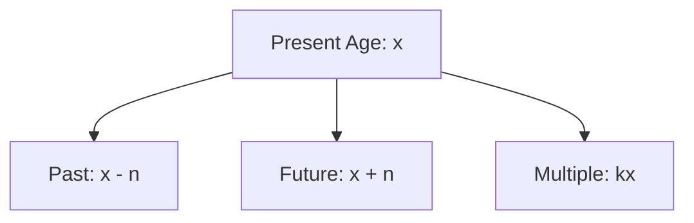
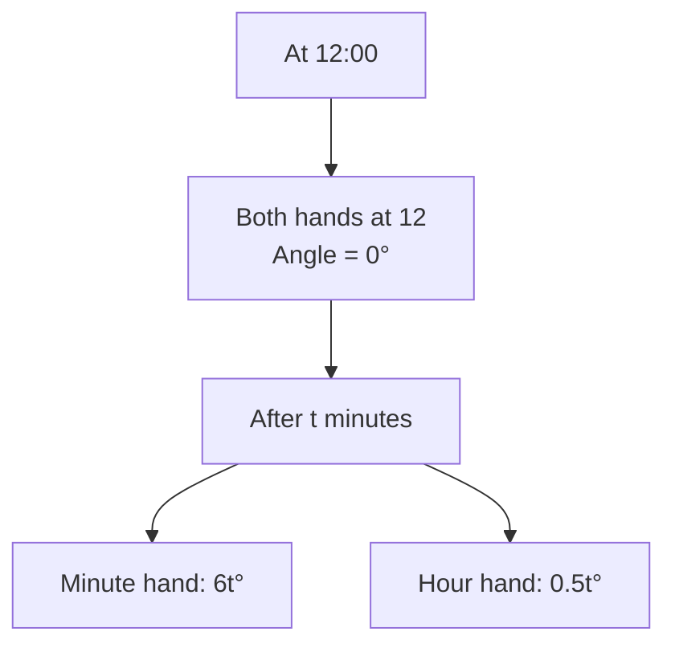
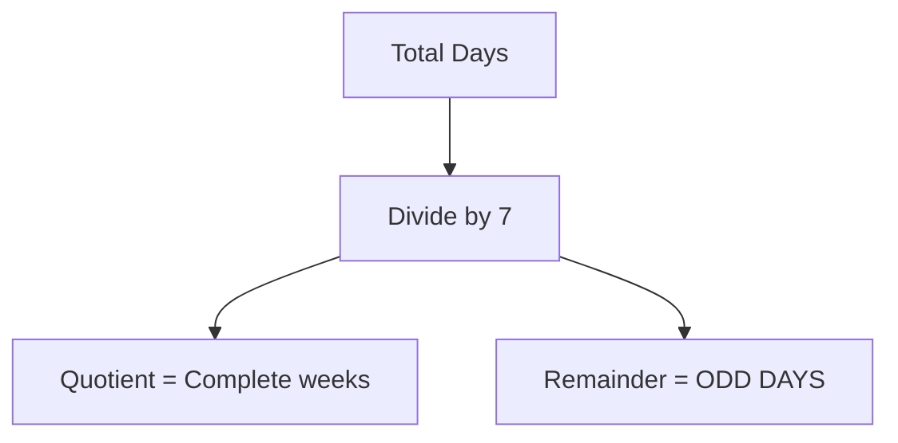

# Session 17: Problems on Ages, Clock & Calendar

Master age-based problems, clock angles, and calendar calculations.

---

## 👶 Problems on Ages

### Basic Representations

| Statement | Mathematical Form |
|:----------|:------------------|
| Present age is x | x |
| Age n years ago | x - n |
| Age n years later | x + n |
| x times the age | nx |
| Ages in ratio a:b | ax, bx |

### Age Relationship Diagram



### Key Concepts

| Concept | Formula |
|:--------|:--------|
| **Age difference** | Constant over time |
| **Sum of ages** | Changes by 2n for n years |
| **Product of ages** | Changes based on individual ages |

### Common Question Types

| Type | Approach |
|:-----|:---------|
| Two people, age relation | Set up equations |
| Past/Future conditions | Use (x-n) or (x+n) |
| Ratio problems | Use ax, bx notation |
| Family ages | Use multiple variables |

### Shortcut: Ratio Method
If present ratio A:B is $x:y$, and after $T$ years it becomes $p:q$:
> **Common Factor (1 unit) = $\frac{T \times |p-q|}{|xq - yp|}$**

*Then multiply this factor with $x$ and $y$ to get present ages.*

---

## 🕐 Clock Problems

### Clock Basics

| Fact | Value |
|:-----|:------|
| Total angle | 360° |
| Minute spaces | 60 |
| Each minute space | 6° |
| Hour hand per hour | 30° |
| Minute hand per minute | 6° |
| Hour hand per minute | 0.5° |
| Relative speed | 5.5° per minute |

### Hand Positions



### Angle Formula

**Angle between hands at H:M**

**θ = |30H - 5.5M|** (or 360 - this if > 180°)

### Special Positions

| Position | Angle | Times per 12 hrs |
|:---------|:-----:|:----------------:|
| **Coincide** | 0° | 11 |
| **Opposite** | 180° | 11 |
| **Right angle** | 90° | 22 |

### Time for Hands to Meet

Formula: Next coincidence = (12/11) × 60 min ≈ 65.45 min apart

| Between | Hands coincide at |
|:--------|:------------------|
| 12-1 | 12:00, ~1:05:27 |
| 1-2 | ~1:05:27 |
| 2-3 | ~2:10:54 |

### Clock Gaining/Losing

If a clock gains x minutes per hour:
- Correct time after t hours = t hours by wrong clock - (xt/60) hours

### Mirror Image Time
To find the time shown in a mirror:
> **Subtract given time from 11:60 (12:00)**
> *If time > 12:00, subtract from 23:60 (24:00)*

*Example: Mirror time of 4:10 = 11:60 - 4:10 = 7:50*

---

## 📅 Calendar Problems

### Odd Days Concept

**Odd days** = Extra days beyond complete weeks



### Odd Days Table

| Period | Odd Days |
|:-------|:--------:|
| Normal year (365 days) | 1 |
| Leap year (366 days) | 2 |
| 100 years | 5 |
| 200 years | 3 |
| 300 years | 1 |
| 400 years | 0 |

### Leap Year Rules

| Rule | Example |
|:-----|:--------|
| Divisible by 4 | 2024 ✓ |
| Century divisible by 400 | 2000 ✓, 1900 ✗ |
| Non-century div by 4 | 2024 ✓ |

### Day Code

| Odd Days | Day |
|:--------:|:---:|
| 0 | Sunday |
| 1 | Monday |
| 2 | Tuesday |
| 3 | Wednesday |
| 4 | Thursday |
| 5 | Friday |
| 6 | Saturday |

### Month Codes (Normal Year)

| Month | Days | Odd Days |
|:------|:----:|:--------:|
| Jan | 31 | 3 |
| Feb | 28 | 0 |
| Mar | 31 | 3 |
| Apr | 30 | 2 |
| May | 31 | 3 |
| Jun | 30 | 2 |
| Jul | 31 | 3 |
| Aug | 31 | 3 |
| Sep | 30 | 2 |
| Oct | 31 | 3 |
| Nov | 30 | 2 |
| Dec | 31 | 3 |

### Calendar Repetition Rules
When does a calendar repeat?
- **Leap Year**: Repeats after **28 years**
- **Leap Year + 1**: Repeats after **6 years**
- **Leap Year + 2 or 3**: Repeats after **11 years**

*Example: 2024 (Leap) repeats in 2052. 2025 (Leap+1) repeats in 2031.*

---

## 🧮 Solved Examples

### Example 1: Ages
**Q:** Father is 3 times as old as son. 10 years hence, father will be twice as old. Find present ages.

**Solution:**
```
Let son's age = x, father's = 3x
After 10 years: 3x + 10 = 2(x + 10)
3x + 10 = 2x + 20
x = 10

Son = 10, Father = 30
```

### Example 2: Clock Angle
**Q:** Find angle between hands at 3:20.

**Solution:**
```
θ = |30H - 5.5M|
= |30(3) - 5.5(20)|
= |90 - 110|
= |-20| = 20°
```

### Example 3: Calendar
**Q:** What day was Jan 1, 2000?

**Solution:**
```
Calculate odd days from reference:
Jan 1, 1 AD was Monday

Up to 1999:
1600 years = 400×4 = 0 odd days
300 years = 1 odd day
99 years = 24 leap + 75 normal = 48 + 75 = 123 = 17 weeks + 4 odd days

Total = 0 + 1 + 4 = 5 odd days
5 → Saturday

Answer: Jan 1, 2000 was Saturday
```

### Example 4: Clock Meeting
**Q:** At what time between 4 and 5 will hands coincide?

**Solution:**
```
At 4:00, minute hand is at 12, hour hand at 4
Gap = 20 minute spaces = 120°

Relative speed = 5.5° per minute
Time = 120/5.5 = 21.82 minutes

Hands coincide at 4:21:49 approximately
```

---

## 📊 Quick Reference

### Age Problem Formulas

| Scenario | Formula |
|:---------|:--------|
| Sum of ages after n years | Current sum + 2n (for 2 people) |
| Ratio a:b with sum S | Ages = Sa/(a+b), Sb/(a+b) |
| n years ago ratio | (x-n)/(y-n) = given ratio |

### Clock Quick Facts

| Fact | Value |
|:-----|:------|
| Angle at 3:00 | 90° |
| Angle at 6:00 | 180° |
| Angle at 9:00 | 90° |
| One minute = angle difference | 5.5° |

---

## 🎯 Quick Revision Points

> [!TIP]
> **Age difference remains constant** through time

> [!TIP]
> **Clock angle formula**: θ = |30H - 5.5M|

> [!TIP]
> **400 years = 0 odd days** (perfect cycle)

> [!NOTE]
> Leap year: divisible by 4 (exception: centuries need div by 400)

---

## ✍️ Practice Problems

1. A is twice as old as B. 5 years ago, A was 3 times as old as B. Find their ages.
2. Find angle at 7:35.
3. What day was August 15, 1947?
4. At what time between 3 and 4 will hands be at right angle (first time)?
5. After how many years will ages 8 and 12 be in ratio 3:4?
