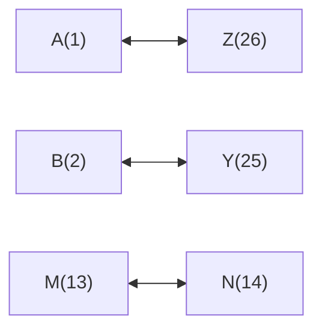
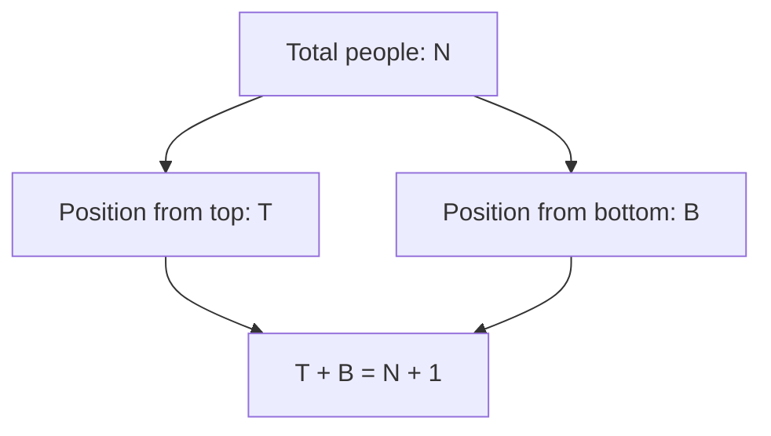
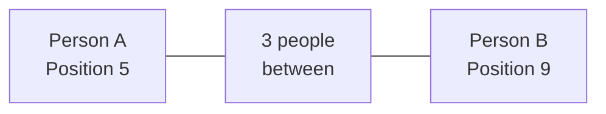

# Session 18: Alphabetical Reasoning & Ranking

Master alphabet-based problems and ranking/ordering questions.

---

## 🔤 Alphabetical Reasoning

### Position Values

| A | B | C | D | E | F | G | H | I | J | K | L | M |
|:-:|:-:|:-:|:-:|:-:|:-:|:-:|:-:|:-:|:-:|:-:|:-:|:-:|
| 1 | 2 | 3 | 4 | 5 | 6 | 7 | 8 | 9 | 10 | 11 | 12 | 13 |

| N | O | P | Q | R | S | T | U | V | W | X | Y | Z |
|:-:|:-:|:-:|:-:|:-:|:-:|:-:|:-:|:-:|:-:|:-:|:-:|:-:|
| 14 | 15 | 16 | 17 | 18 | 19 | 20 | 21 | 22 | 23 | 24 | 25 | 26 |

### EJOTY Formula

Quick reference for positions:

| E | J | O | T | Y |
|:-:|:-:|:-:|:-:|:-:|
| 5 | 10 | 15 | 20 | 25 |

### Opposite Letters (Sum = 27)



| Letter | Opposite | Sum |
|:------:|:--------:|:---:|
| A | Z | 27 |
| B | Y | 27 |
| C | X | 27 |
| L | O | 27 |
| M | N | 27 |

### Position from Right

**Position from Right = 27 - Position from Left**

| Letter | From Left | From Right |
|:------:|:---------:|:----------:|
| A | 1 | 26 |
| E | 5 | 22 |
| M | 13 | 14 |
| Z | 26 | 1 |

---

## 🔡 Alphabetical Series Problems

### Common Patterns

| Pattern | Example | Rule |
|:--------|:--------|:-----|
| Skip 1 | A, C, E, G | +2 |
| Skip 2 | A, D, G, J | +3 |
| Skip pattern | A, B, D, G, K | +1, +2, +3, +4 |
| Reverse | Z, Y, X, W | -1 |

### Middle Letter

For sequence of letters, **middle letter** = (First + Last) / 2

Example: In ABC, middle is B = (1+3)/2 = 2

### Pair Formation Concept
**"How many pairs of letters are there in the word which have as many letters between them as in the alphabet?"**
- **Method**: Check each letter forward and backward.
- *Example: TEAM*
  - Forward: T(20) no match > E(5). E(5)->F(6)->G(7). A(1)->B(2). M(13).
  - Backward: M(13)->N(14)->O(15)->P(16). A(1)->B(2)->C(3). E(5)...
- Count matches.

### Dictionary Order
Arrange words as per dictionary:
1. Compare first letters.
2. If same, compare second letters, and so on.
3. Shorter word comes first (e.g., "Apple" before "Apples").

---

## 📊 Ranking & Ordering

### Position Calculation



**Key Formula:**
**Position from Top + Position from Bottom = Total + 1**

### Finding Positions

| Given | Find | Formula |
|:------|:-----|:--------|
| Top position (T), Total (N) | Bottom position (B) | B = N - T + 1 |
| Bottom position (B), Total (N) | Top position (T) | T = N - B + 1 |
| Top (T), Bottom (B) | Total (N) | N = T + B - 1 |

---

## 👥 People Between Two Positions

### Counting People Between

**People between A and B = |Position_A - Position_B| - 1**

### Maximum and Minimum Persons (Overlap Case)
When positions of two persons from opposite ends are given (L and R) and 'm' persons between them:
- **Maximum Total** = L + R + m  (Simple case)
- **Minimum Total** = L + R - m - 2 (Overlap case)
  - *Valid only if (L + R) > Total and (Minimum < Total)*

---


### Interchange Positions

After A and B **interchange** positions:
- New position of A = Old position of B
- New position of B = Old position of A

---

## 📝 Types of Ranking Questions

### Type 1: Single Row

**Q:** A is 15th from left, B is 10th from right. If they interchange, A becomes 20th from left. Total people?

**Solution:**
```
After interchange, A is at B's old position
A's new position from left = 20
B's old position from left = 20

B from right = 10, so from left = Total - 10 + 1 = 20
Total = 29
```

### Type 2: Class Ranking

**Q:** Ram ranks 7th from top and 28th from bottom. Total students?

**Solution:**
```
Total = 7 + 28 - 1 = 34
```

### Type 3: Row Arrangement

**Q:** In a row of boys, A is 18th from left, B is 10th from right. 5 people between them. Total?

**Solution:**
```
If they're on same side or different sides affects the answer.

Case 1: A's position + 5 + 1 + (N - B position + 1) > N means overlap
Total = 18 + 5 + 10 = 33 OR
Total = 18 + 5 + 10 + 1 = 34 (if no overlap)
```

---

## 🧮 Solved Examples

### Example 1: Letter Position
**Q:** Which letter is 8th to the right of the 12th letter from left?

**Solution:**
```
12th from left = L
8th to the right of L = L + 8 = 12 + 8 = 20 = T
Answer: T
```

### Example 2: Ranking
**Q:** In a class, Ram is 12th from top. Shyam is 26th from bottom. If Ram is 15th from bottom, find Shyam's position from top.

**Solution:**
```
Ram: 12th from top, 15th from bottom
Total = 12 + 15 - 1 = 26 students

Shyam: 26th from bottom (but only 26 total!)
Shyam is last = 1st from bottom = 26th from top
```

### Example 3: Middle of Word
**Q:** Find the middle letter of the word DISTURBED.

**Solution:**
```
DISTURBED has 9 letters
Middle = (9 + 1) / 2 = 5th letter
D-I-S-T-U-R-B-E-D
5th letter = U
```

### Example 4: Alphabetical Order
**Q:** If letters of CAUTION are arranged alphabetically, which letter is 4th?

**Solution:**
```
CAUTION → A, C, I, N, O, T, U (alphabetically)
4th letter = N
```

---

## 📊 Quick Reference

### Position Equations

| Scenario | Formula |
|:---------|:--------|
| From top, from bottom | T + B = N + 1 |
| Between two positions | |Pos1 - Pos2| - 1 |
| After interchange | New pos = Other's old pos |

### Alphabet Tricks

| Need | Method |
|:-----|:-------|
| Letter n positions right | Add n to position |
| Letter n positions left | Subtract n from position |
| Opposite letter | 27 - position |
| From right | 27 - from left |

---

## 🎯 Quick Revision Points

> [!TIP]
> **EJOTY**: E=5, J=10, O=15, T=20, Y=25

> [!TIP]
> **Position from Top + Position from Bottom = Total + 1**

> [!TIP]
> **Opposite letters sum = 27** (A+Z, B+Y, etc.)

> [!NOTE]
> Count carefully whether endpoints are included in "between"

---

## ✍️ Practice Problems

1. Which letter is 6th to the left of 19th letter from right?
2. In a row, A is 14th from left, B is 17th from right. Total = 35. How many between them?
3. If COMPUTER is written in reverse alphabetical order, what is the 4th letter?
4. Find the letter opposite to M in alphabetical position.
5. A is 15th from left end. If A shifts 5 positions right and becomes 6th from right, total people?
