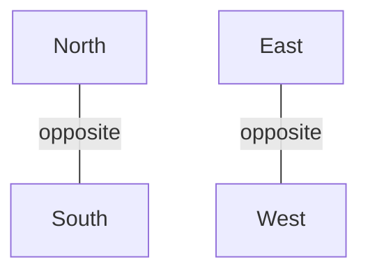
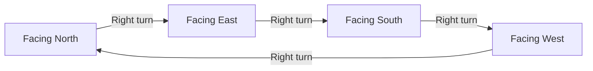
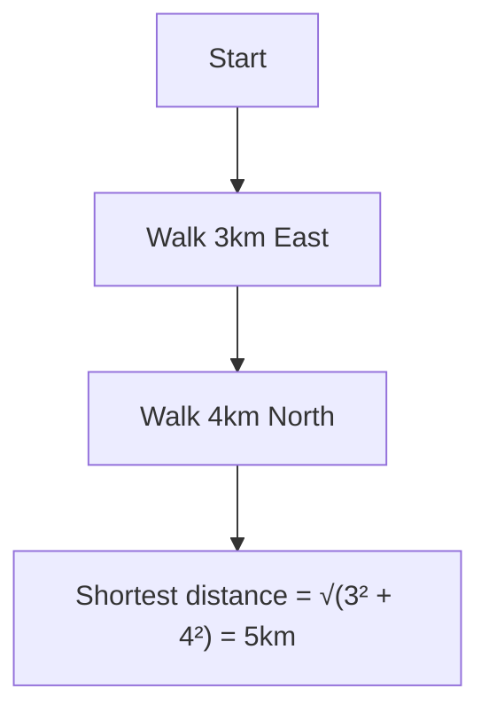
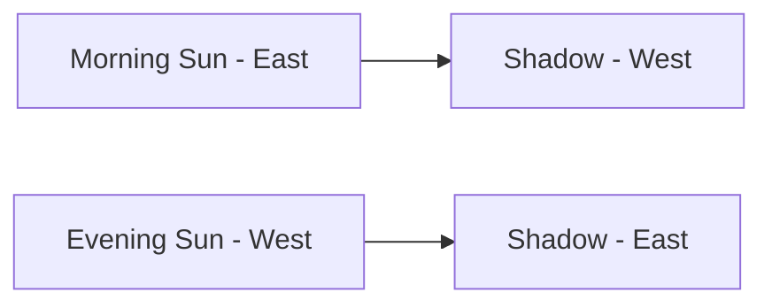
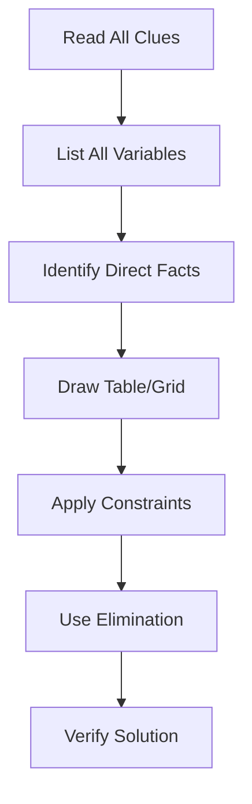

# Session 19: Direction Sense & Puzzles

Master direction-based problems and logical puzzle solving.

---

## 🧭 Direction Basics

### Cardinal Directions



### Direction Diagram

```
            North (N)
              ↑
              |
West (W) ←---●---→ East (E)
              |
              ↓
            South (S)
```

### Sub-directions (Ordinal)

```
        NW    N    NE
          ╲   |   ╱
           ╲  |  ╱
      W ----●---- E
           ╱  |  ╲
          ╱   |   ╲
        SW    S    SE
```

| Direction | Angle from North |
|:----------|:----------------:|
| N | 0° |
| NE | 45° |
| E | 90° |
| SE | 135° |
| S | 180° |
| SW | 225° |
| W | 270° |
| NW | 315° |

---

## 🔄 Turns and Rotations

### Turn Angles

| Turn | Degrees |
|:-----|:-------:|
| Right turn | 90° clockwise |
| Left turn | 90° anti-clockwise |
| About turn (U-turn) | 180° |
| Slight right | 45° clockwise |
| Slight left | 45° anti-clockwise |

### Rotation Rules



| If facing | Turn Right | Turn Left |
|:----------|:-----------|:----------|
| North | East | West |
| East | South | North |
| South | West | East |
| West | North | South |

### Net Rotation Strategy
When multiple turns are given:
1. **Sum all Clockwise (CW) angles**.
2. **Sum all Anti-clockwise (ACW) angles**.
3. **Difference = |CW - ACW|**.
4. Turn in the direction of the larger sum by the difference.

*Example: 45° CW, 90° ACW, 135° CW.*
*Total CW = 45+135=180. Total ACW = 90. Diff = 90 CW.*

---

## 📐 Distance Calculations

### Shortest Distance (Pythagorean Theorem)

**Shortest Distance = √(x² + y²)**

Where x = East-West displacement, y = North-South displacement



### Displacement Direction

| Final Position | Direction from Start |
|:---------------|:--------------------|
| North-East of start | NE quadrant |
| If x=y | Exactly NE (45°) |
| If x>y | More towards E |
| If y>x | More towards N |

---

## ☀️ Shadow-Based Problems

### Sun Position

| Time | Sun Position | Shadow Falls |
|:-----|:-------------|:-------------|
| Morning (6 AM) | East | West |
| Noon (12 PM) | Overhead | No shadow / Very short |
| Evening (6 PM) | West | East |

### Shadow Rules



**If your shadow is to your right in morning → You face South**
**If your shadow is behind you at noon → You face North (in Northern Hemisphere)**

### Upside Down (Yoga) Concept
If a person is doing yoga (Head down, Feet up):
- **Face direction remains same** (conceptually).
- **Left and Right are swapped** compared to standing.
- *Trick: Visualize standing in the facing direction, then swap Left/Right.*
- *Example: Facing West (Head down). Standing facing West -> Left is South. So head down Left is North.*
  **(Correction: Actually, if you stand facing West, Left is South. In Head stand, Left becomes North? Let's verify. Stand West, Left hand holds South. Invert. Left hand still holds South side but body is inverted. Wait. Standard rule: If facing West head down, it's equivalent to standing facing West and swapping L/R? No.
  Better Rule: If Head Down facing North, Left hand is East (Normal Left is West).*
  *Simple Rule: If head down facing Direction D, Left Hand is same as Right Hand if standing in Direction D.*

### Coded Direction
- **P # Q** (P is North of Q)
- **P $ Q** (P is East of Q)
- Draw diagrams relative to the *second* person (Q).

---

## 🧩 Puzzle Types

### Distribution Puzzles

| Type | Approach |
|:-----|:---------|
| Age-based | Use timeline approach |
| Position-based | Draw grid/table |
| Conditional | Create if-then chains |

### Puzzle Solving Strategy



---

## 🧮 Solved Examples

### Example 1: Simple Direction
**Q:** A man walks 5km North, turns right, walks 3km, turns right, walks 5km. Where is he relative to start?

**Solution:**
```
Start → 5km N → Turn Right (faces E) → 3km E → Turn Right (faces S) → 5km S

North-South: +5 - 5 = 0
East-West: +3

He is 3km East of starting point
```

### Example 2: With Turns
**Q:** A man facing North turns 45° clockwise, then 90° anti-clockwise. Which direction is he facing?

**Solution:**
```
Start: North
After 45° clockwise: North-East
After 90° anti-clockwise: North-East - 90° = North-West

Answer: North-West
```

### Example 3: Shadow Problem
**Q:** In morning, a man's shadow falls to his left. Which direction is he facing?

**Solution:**
```
Morning → Sun in East → Shadow in West
Shadow to his left → West is to his left
Therefore: He is facing North

(When facing North: East is right, West is left)
```

### Example 4: Distance Calculation
**Q:** A person walks 6km East, 8km North. Find shortest distance from start.

**Solution:**
```
Distance = √(6² + 8²)
= √(36 + 64)
= √100 = 10km
```

---

## 📊 Direction Cheat Sheet

### Quick Turn Reference

| Current | Right | Left | Opposite |
|:--------|:------|:-----|:---------|
| N | E | W | S |
| E | S | N | W |
| S | W | E | N |
| W | N | S | E |

### Common Distance Triangles

| Sides | Hypotenuse |
|:------|:-----------|
| 3, 4 | 5 |
| 5, 12 | 13 |
| 8, 15 | 17 |
| 6, 8 | 10 |
| 9, 12 | 15 |

---

## 🎯 Quick Revision Points

> [!TIP]
> **Always draw diagrams** for direction problems

> [!TIP]
> **Right turn from North = East**

> [!TIP]
> **Morning shadow falls West**, Evening shadow falls East

> [!TIP]
> Use **Pythagorean triplets** (3-4-5, 5-12-13) for quick calculation

> [!NOTE]
> Track both distance AND direction for each movement

---

## ✍️ Practice Problems

1. A man facing South turns 135° clockwise. Which direction does he face now?

2. Starting from point A, B walks 4km North, then 3km East, then 4km South. Where is B relative to A?

3. At sunset, a pole's shadow falls towards East. Which direction does the pole's base point from the tip?

4. A man walks 10m South, turns right walks 10m, turns left walks 5m, turns left walks 10m. How far from start?

5. If North-East becomes South, what does East become?
