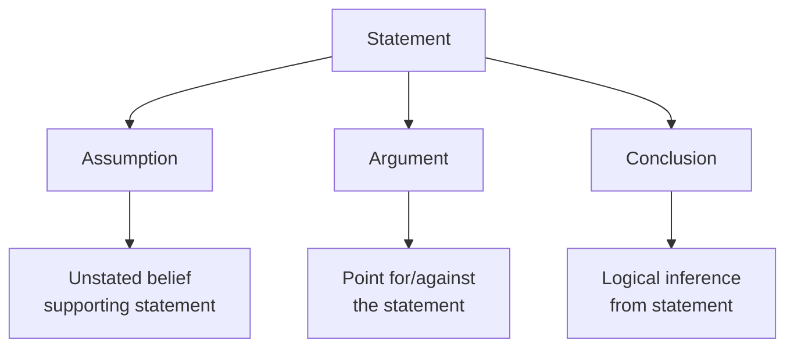
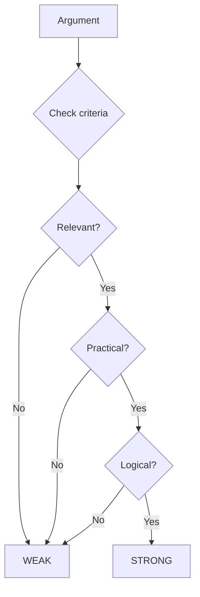
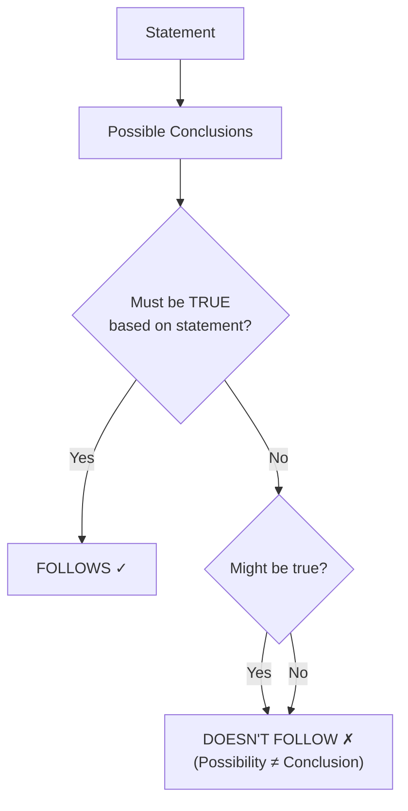
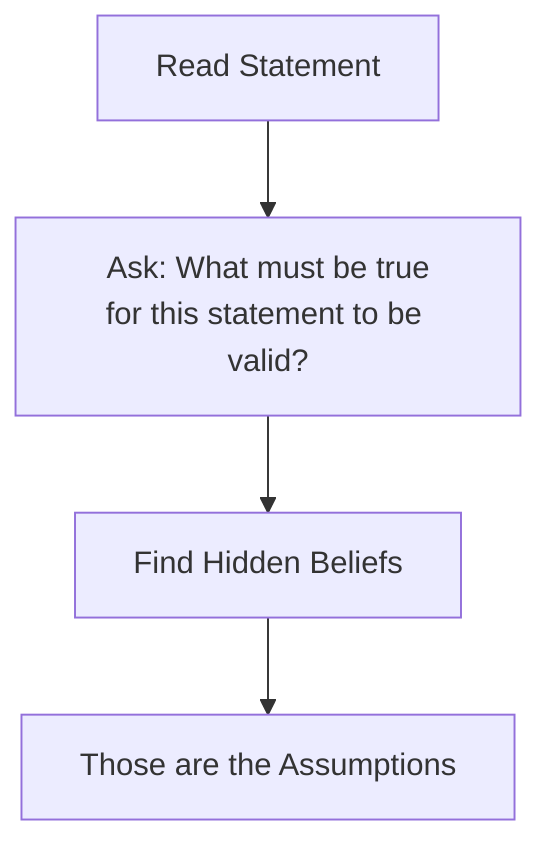

# Session 20: Statements & Arguments, Conclusions, Assumptions

Master critical reasoning through statement-based logical analysis.

---

## 📝 Key Concepts

### Definitions

| Term | Definition |
|:-----|:-----------|
| **Statement** | A sentence that is either true or false |
| **Argument** | A point supporting or opposing a statement |
| **Conclusion** | A decision/inference drawn from statement |
| **Assumption** | An unstated fact taken for granted |



---

## 💬 Statements & Arguments

### What is an Argument?

Arguments are reasons given **for or against** a proposal or statement.

### Strong vs Weak Arguments



### Criteria for Strong Arguments

| Criteria | Description |
|:---------|:------------|
| **Relevant** | Directly related to the statement |
| **Practical** | Based on reality, not wishful thinking |
| **Logical** | Follows reasoning, not emotional |
| **Not Extreme** | Avoids words like "all," "never," "always" |

### Weak Argument Indicators

| Indicator | Example |
|:----------|:--------|
| Emotional appeal | "It would be sad if..." |
| Irrelevant facts | Unrelated information |
| Extreme words | "All people will..." |
| Vague statements | "It might help somehow" |

---

## 🎯 Statements & Conclusions

### What is a Conclusion?

A conclusion is a **logical inference** that can be drawn from the given statement.

### Valid Conclusion Rules



### Conclusion Testing

| Test | Question to Ask |
|:-----|:----------------|
| **Necessity** | Must this be true if statement is true? |
| **Sufficiency** | Does statement provide enough info? |
| **Scope** | Does conclusion go beyond statement? |

### Common Traps

| Trap | Issue |
|:-----|:------|
| Over-generalization | Statement about some → Conclusion about all |
| External knowledge | Using facts not in statement |
| Assumptions | Treating assumptions as conclusions |

---

## 💭 Statements & Assumptions

### What is an Assumption?

An assumption is an **implicit (unstated) belief** that must be true for the statement to make sense.

### Finding Assumptions



### Assumption Testing (Negation Test)

1. Negate the assumption
2. If statement becomes **meaningless/weak** → It IS an assumption
3. If statement still makes sense → It is NOT an assumption

### Types of Assumptions

| Type | Example |
|:-----|:--------|
| **Existence** | Assumes something exists |
| **Capability** | Assumes someone can do something |
| **Willingness** | Assumes someone will do something |
| **Cause-Effect** | Assumes one thing leads to another |

### 🛤️ Course of Action
A course of action is a step to investigate, solve, or minimize a problem.
**Criteria for Valid Action:**
1. **Solves/Reduces the problem**: Action must be effective.
2. **Practical/Feasible**: Must be possible to implement.
3. **No Negative Side Effects**: Shouldn't create a bigger problem.

### ⚡ Cause and Effect
Identify which statement is the **Cause** and which is the **Effect**.
- **Cause**: The event that happens first logicallly.
- **Effect**: The consequence of the cause.
- *Tip: Use "Because" test. "Event B happened BECAUSE Event A happened". If it fits, A is Cause, B is Effect.*

---

## 🧮 Solved Examples

### Example 1: Argument
**Statement:** Should schools teach coding from Grade 1?

**Arguments:**
- I. Yes, early learning helps develop logical thinking
- II. No, children are too young to understand computers

**Solution:**
```
Argument I: Relevant, logical, practical → STRONG
Argument II: Makes assumption without evidence → WEAK
```

### Example 2: Conclusion
**Statement:** All employees who completed training got promotions. John completed training.

**Conclusions:**
- I. John got a promotion
- II. Only trained employees get promotions

**Solution:**
```
I. John completed training + All who completed got promoted
   → John got promoted ✓ FOLLOWS

II. "Only trained employees get promotions" - statement doesn't say
   non-trained don't get promoted → DOESN'T FOLLOW
```

### Example 3: Assumption
**Statement:** "Buy our product for guaranteed weight loss!"

**Assumptions:**
- I. People want to lose weight
- II. The product actually causes weight loss
- III. Other products don't work

**Solution:**
```
I. Must be true for ad to make sense → IS assumption
II. Implied by "guaranteed" → IS assumption
III. Not necessary for statement → NOT assumption
```

---

## 📊 Quick Reference Tables

### Argument Evaluation

| Indicator | Strong | Weak |
|:----------|:------:|:----:|
| Logical reasoning | ✓ | ✗ |
| Based on facts | ✓ | ✗ |
| Directly relevant | ✓ | ✗ |
| Avoids extremes | ✓ | ✗ |
| Emotional appeal | ✗ | ✓ |
| Uses "all/never/always" | ✗ | ✓ |

### Conclusion Validity

| Statement says | Conclusion says | Valid? |
|:---------------|:----------------|:------:|
| All A are B | Some A are B | ✓ |
| Some A are B | All A are B | ✗ |
| A causes B | Without A, no B | ✗ |
| A causes B | With A, B happens | ✓ |

---

## 🔍 Problem-Solving Strategy

### For Arguments

1. Check if directly related to statement
2. Verify if it's logical and practical
3. Look for emotional or extreme language
4. Strong = Logically supports/opposes

### For Conclusions

1. Read statement carefully
2. Check if conclusion MUST be true
3. Don't add external information
4. Reject if it's only "possible"

### For Assumptions

1. Find what's NOT stated but implied
2. Apply negation test
3. If negation weakens statement → It's an assumption

---

## 🎯 Quick Revision Points

> [!TIP]
> **Strong argument** = Relevant + Logical + Practical

> [!TIP]
> **Conclusion must be 100% true** from statement, not just possible

> [!TIP]
> **Use negation test** for assumptions

> [!WARNING]
> Don't use external knowledge - only use what's given

---

## ✍️ Practice Problems

1. **Statement**: Ban on plastic bags should be implemented nationwide.
   **Arguments**: I. Yes, plastic harms the environment. II. No, plastic bags are convenient.
   
2. **Statement**: The company's profits increased by 50% this year.
   **Conclusions**: I. The company is doing well. II. The company will have 50% more profits next year.

3. **Statement**: Join our gym for a healthier lifestyle!
   **Assumptions**: I. A gym membership leads to a healthier lifestyle. II. The gym has modern equipment.

4. **Statement**: Smoking is injurious to health.
   **Assumptions**: I. People know about this. II. People should avoid smoking.

5. **Statement**: "If you study hard, you will pass the exam."
   **Conclusions**: I. Hard work leads to success. II. Without studying, you will fail.
