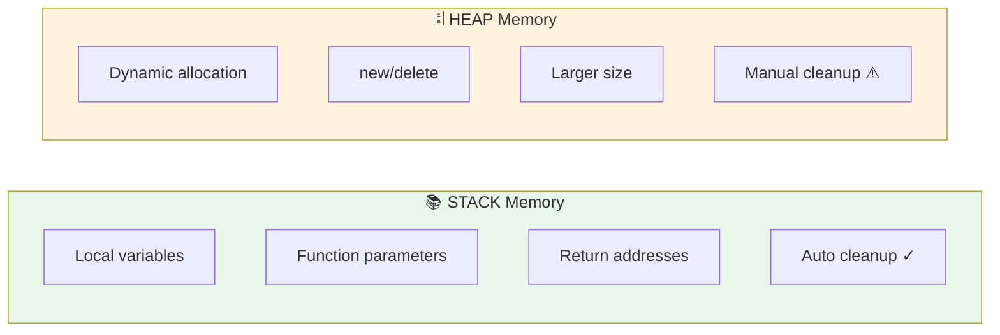

# Sessions 6 & 7: Memory Management and Pointers

## 🎯 Learning Objectives
- Master pointers and pointer arithmetic
- Understand dynamic memory allocation
- Work with `new` and `delete` operators
- Implement string functions using pointers

---

## 1. Introduction to Pointers

A pointer is a variable that stores the **memory address** of another variable.

```cpp
int x = 10;       // Variable
int* ptr = &x;    // Pointer to x

cout << x;        // 10 (value)
cout << &x;       // 0x7fff5... (address)
cout << ptr;      // 0x7fff5... (same address)
cout << *ptr;     // 10 (dereferenced value)
```

### Pointer Declaration
```cpp
int* p1;           // Pointer to int
double* p2;        // Pointer to double
char* p3;          // Pointer to char

// Multiple pointers
int *a, *b, *c;    // All pointers
int* a, b, c;      // Only 'a' is pointer!
```

### Pointer Operations


| Operation | Syntax | Meaning |
|-----------|--------|---------|
| Address-of | `&x` | Get address of x |
| Dereference | `*ptr` | Get value at address |
| Assignment | `ptr = &x` | Store address |
| Comparison | `ptr1 == ptr2` | Compare addresses |

---

## 2. Pointer Arithmetic

```cpp
int arr[] = {10, 20, 30, 40, 50};
int* ptr = arr;  // Points to arr[0]

cout << *ptr;       // 10 (arr[0])
cout << *(ptr + 1); // 20 (arr[1])
cout << *(ptr + 2); // 30 (arr[2])

ptr++;              // Now points to arr[1]
cout << *ptr;       // 20

ptr += 2;           // Now points to arr[3]
cout << *ptr;       // 40
```

### Pointer Difference
```cpp
int arr[] = {10, 20, 30, 40, 50};
int* p1 = &arr[0];
int* p2 = &arr[4];

cout << p2 - p1;    // 4 (number of elements between)
```

---

## 3. Pointers and Arrays

Arrays and pointers are closely related.

```cpp
int arr[] = {10, 20, 30};

// arr is essentially a pointer to first element
cout << arr;        // Address of arr[0]
cout << &arr[0];    // Same address

// Equivalent access methods
cout << arr[0];     // 10
cout << *arr;       // 10
cout << *(arr + 0); // 10

cout << arr[2];     // 30
cout << *(arr + 2); // 30
```

### Array Traversal Using Pointers
```cpp
int arr[] = {10, 20, 30, 40, 50};
int n = 5;

// Method 1: Array indexing
for (int i = 0; i < n; i++) {
    cout << arr[i] << " ";
}

// Method 2: Pointer arithmetic
for (int* ptr = arr; ptr < arr + n; ptr++) {
    cout << *ptr << " ";
}
```

---

## 4. Pointers to Pointers

```cpp
int x = 10;
int* ptr = &x;       // Pointer to int
int** pptr = &ptr;   // Pointer to pointer

cout << x;           // 10
cout << *ptr;        // 10
cout << **pptr;      // 10

cout << &x;          // Address of x
cout << ptr;         // Address of x
cout << *pptr;       // Address of x
cout << &ptr;        // Address of ptr
cout << pptr;        // Address of ptr
```

### Visual Representation
```
pptr → ptr → x
 ↓      ↓    ↓
0x200  0x100  10
```

---

## 5. Pointers and Functions

### Passing Pointer to Function
```cpp
void increment(int* ptr) {
    (*ptr)++;  // Increment value at address
}

int main() {
    int x = 10;
    increment(&x);
    cout << x;  // 11
}
```

### Returning Pointer from Function
```cpp
// WRONG: Returning address of local variable
int* getLocal() {
    int x = 10;
    return &x;  // Dangling pointer! x destroyed after return
}

// CORRECT: Return static or dynamic memory
int* getStatic() {
    static int x = 10;
    return &x;  // OK, static persists
}

int* getDynamic() {
    int* ptr = new int(10);
    return ptr;  // OK, heap memory persists
}
```

---

## 6. `this` Pointer

Inside a class, `this` is a pointer to the current object.

```cpp
class Student {
    string name;
    int age;
    
public:
    Student(string name, int age) {
        // 'this' distinguishes member from parameter
        this->name = name;
        this->age = age;
    }
    
    Student& setName(string name) {
        this->name = name;
        return *this;  // Return current object for chaining
    }
    
    Student& setAge(int age) {
        this->age = age;
        return *this;
    }
    
    void display() {
        cout << name << ", " << age << endl;
    }
};

int main() {
    Student s("Alice", 20);
    
    // Method chaining using 'this'
    s.setName("Bob").setAge(25).display();  // Bob, 25
}
```

---

## 7. Dynamic Memory Allocation

### Stack vs Heap



| Stack | Heap |
|-------|------|
| Automatic allocation | Manual allocation |
| Fast access | Slower access |
| Limited size | Large size |
| LIFO order | No order |
| Compiler managed | Programmer managed |


### `new` Operator
```cpp
// Allocate single variable
int* ptr = new int;       // Uninitialized
int* ptr2 = new int(10);  // Initialized to 10
int* ptr3 = new int{10};  // Uniform initialization

// Allocate array
int* arr = new int[5];    // Array of 5 ints
int* arr2 = new int[5]{1, 2, 3, 4, 5};  // Initialized
```

### `delete` Operator
```cpp
// Delete single variable
int* ptr = new int(10);
delete ptr;
ptr = nullptr;  // Good practice

// Delete array
int* arr = new int[5];
delete[] arr;   // Note the []
arr = nullptr;
```

### Memory Leak Example
```cpp
void memoryLeak() {
    int* ptr = new int[1000];
    // Forgot to delete!
    // Memory is never freed
}

// Correct version
void noLeak() {
    int* ptr = new int[1000];
    // Use memory...
    delete[] ptr;  // Clean up
}
```

---

## 8. `new` vs `malloc`

| Feature | `new` | `malloc` |
|---------|-------|----------|
| Type | Operator | Function |
| Returns | Typed pointer | `void*` (needs cast) |
| Initialization | Can initialize | No initialization |
| Constructor | Calls constructor | No |
| Size | Automatic | Manual `sizeof()` |
| Failure | Throws `bad_alloc` | Returns `NULL` |
| Deallocation | `delete` | `free()` |
| Header | None | `<cstdlib>` |

```cpp
// Using new (C++ way)
int* p1 = new int(10);
Student* s1 = new Student("Alice");  // Constructor called!!!

// Using malloc (C way)
int* p2 = (int*)malloc(sizeof(int));
*p2 = 10;
Student* s2 = (Student*)malloc(sizeof(Student));  // Constructor NOT called!
```

---

## 9. Enumeration (enum)

```cpp
// Traditional enum
enum Color { RED, GREEN, BLUE };
Color c = RED;  // c = 0

enum Day { MON = 1, TUE, WED, THU, FRI, SAT, SUN };
Day d = WED;    // d = 3

// Scoped enum (C++11) - Type safe
enum class Status { ACTIVE, INACTIVE, PENDING };
Status s = Status::ACTIVE;

// Compare
if (s == Status::ACTIVE) {
    cout << "Active" << endl;
}
```

---

## 10. Typedef and Using

```cpp
// typedef (old style)
typedef unsigned long ulong;
typedef int* IntPtr;

ulong size = 1000;
IntPtr ptr = new int(10);

// using (C++11 - preferred)
using ulong = unsigned long;
using IntPtr = int*;
using StringVector = vector<string>;

StringVector names = {"Alice", "Bob"};
```

---

## 📝 Lab Exercises

### Exercise 1: String Length Using Pointers
```cpp
#include <iostream>
using namespace std;

int myStrLen(const char* str) {
    int len = 0;
    while (*str != '\0') {
        len++;
        str++;
    }
    return len;
}

int main() {
    char str[] = "Hello World";
    cout << "Length: " << myStrLen(str) << endl;  // 11
    return 0;
}
```

### Exercise 2: String Copy Using Pointers
```cpp
#include <iostream>
using namespace std;

void myStrCpy(char* dest, const char* src) {
    while (*src != '\0') {
        *dest = *src;
        dest++;
        src++;
    }
    *dest = '\0';  // Null terminate
}

int main() {
    char src[] = "Hello";
    char dest[20];
    
    myStrCpy(dest, src);
    cout << "Copied: " << dest << endl;
    
    return 0;
}
```

### Exercise 3: String Concatenate Using Pointers
```cpp
#include <iostream>
using namespace std;

void myStrCat(char* dest, const char* src) {
    // Move to end of dest
    while (*dest != '\0') {
        dest++;
    }
    // Copy src
    while (*src != '\0') {
        *dest = *src;
        dest++;
        src++;
    }
    *dest = '\0';
}

int main() {
    char str1[50] = "Hello ";
    char str2[] = "World";
    
    myStrCat(str1, str2);
    cout << str1 << endl;  // Hello World
    
    return 0;
}
```

### Exercise 4: String Compare Using Pointers
```cpp
#include <iostream>
using namespace std;

int myStrCmp(const char* s1, const char* s2) {
    while (*s1 && *s2 && *s1 == *s2) {
        s1++;
        s2++;
    }
    return *s1 - *s2;  // 0 if equal, +ve if s1 > s2, -ve if s1 < s2
}

int main() {
    cout << myStrCmp("apple", "apple") << endl;   // 0
    cout << myStrCmp("apple", "banana") << endl;  // negative
    cout << myStrCmp("banana", "apple") << endl;  // positive
    
    return 0;
}
```

### Exercise 5: Dynamic 2D Array
```cpp
#include <iostream>
using namespace std;

int main() {
    int rows = 3, cols = 4;
    
    // Allocate
    int** matrix = new int*[rows];
    for (int i = 0; i < rows; i++) {
        matrix[i] = new int[cols];
    }
    
    // Initialize
    for (int i = 0; i < rows; i++) {
        for (int j = 0; j < cols; j++) {
            matrix[i][j] = i * cols + j;
        }
    }
    
    // Print
    for (int i = 0; i < rows; i++) {
        for (int j = 0; j < cols; j++) {
            cout << matrix[i][j] << " ";
        }
        cout << endl;
    }
    
    // Deallocate
    for (int i = 0; i < rows; i++) {
        delete[] matrix[i];
    }
    delete[] matrix;
    
    return 0;
}
```

---

## 🎯 Key Points for CCEE

> **Must Remember**:
> - `&` = address-of operator, `*` = dereference operator
> - Array name is a constant pointer to first element
> - `ptr++` moves to next element (adds `sizeof(type)` bytes)
> - `this` pointer points to current object
> - `new` calls constructor, `malloc` does not
> - `delete` for single, `delete[]` for arrays
> - Always set pointer to `nullptr` after delete
> - `new` throws `bad_alloc` on failure, `malloc` returns `NULL`
> - `enum class` is type-safe (C++11)
> - `using` preferred over `typedef` (C++11)
> - Dangling pointer: points to freed memory
> - Memory leak: allocated memory never freed
