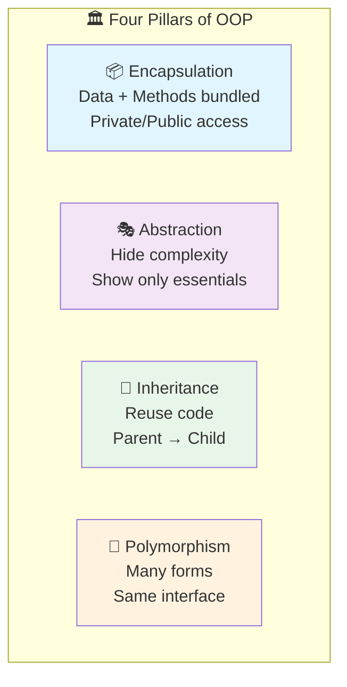

# Session 8: Object-Oriented Programming Concepts

## 🎯 Learning Objectives
- Understand OOP principles
- Create classes and objects
- Use access specifiers
- Work with namespaces

---

## 1. Four Pillars of OOP

| Pillar | Description |
|--------|-------------|
| **Encapsulation** | Bundling data + methods, hiding internal details |
| **Abstraction** | Showing only essential features, hiding complexity |
| **Inheritance** | Deriving new classes from existing ones |
| **Polymorphism** | Same interface, different implementations |



---

## 2. Classes and Objects

### Class Definition
```cpp
class Student {
    // Data members (attributes)
    int rollNo;
    string name;
    double marks;
    
public:
    // Member functions (methods)
    void setData(int r, string n, double m) {
        rollNo = r;
        name = n;
        marks = m;
    }
    
    void display() {
        cout << "Roll: " << rollNo << endl;
        cout << "Name: " << name << endl;
        cout << "Marks: " << marks << endl;
    }
    
    double getMarks() {
        return marks;
    }
};
```

### Creating Objects
```cpp
int main() {
    // Method 1: Stack allocation
    Student s1;
    s1.setData(101, "Alice", 85.5);
    s1.display();
    
    // Method 2: Heap allocation
    Student* s2 = new Student();
    s2->setData(102, "Bob", 90.0);
    s2->display();
    delete s2;
    
    // Method 3: Array of objects
    Student students[5];
    
    return 0;
}
```

---

## 3. Access Specifiers

| Specifier | Within Class | Derived Class | Outside |
|-----------|--------------|---------------|---------|
| `public` | ✅ | ✅ | ✅ |
| `protected` | ✅ | ✅ | ❌ |
| `private` | ✅ | ❌ | ❌ |

```cpp
class Example {
private:
    int privateVar;      // Only this class
    
protected:
    int protectedVar;    // This class + derived classes
    
public:
    int publicVar;       // Everyone
    
    void setPrivate(int val) {
        privateVar = val;  // ✅ OK
    }
};

class Derived : public Example {
    void test() {
        protectedVar = 10;  // ✅ OK (inherited)
        // privateVar = 10; // ❌ ERROR
        publicVar = 10;     // ✅ OK
    }
};

int main() {
    Example e;
    e.publicVar = 10;    // ✅ OK
    // e.protectedVar = 10; // ❌ ERROR
    // e.privateVar = 10;   // ❌ ERROR
}
```

### Default Access
- **class**: `private`
- **struct**: `public`

---

## 4. Encapsulation

Hiding data and providing controlled access through methods.

```cpp
class BankAccount {
private:
    double balance;  // Hidden from outside
    
public:
    // Getter
    double getBalance() {
        return balance;
    }
    
    // Setter with validation
    void deposit(double amount) {
        if (amount > 0) {
            balance += amount;
        }
    }
    
    bool withdraw(double amount) {
        if (amount > 0 && amount <= balance) {
            balance -= amount;
            return true;
        }
        return false;
    }
};
```

### Benefits of Encapsulation
- Data protection
- Input validation
- Flexibility to change implementation
- Controlled access

---

## 5. Member Functions

### Inside Class Definition (Inline by default)
```cpp
class Circle {
    double radius;
public:
    double getArea() {  // Implicitly inline
        return 3.14159 * radius * radius;
    }
};
```

### Outside Class Definition
```cpp
class Circle {
    double radius;
public:
    double getArea();  // Declaration
};

// Definition outside class
double Circle::getArea() {
    return 3.14159 * radius * radius;
}
```

### Static Member Functions
```cpp
class Counter {
    static int count;
public:
    static void increment() {
        count++;
    }
    
    static int getCount() {
        return count;
    }
};

int Counter::count = 0;  // Define static variable

int main() {
    Counter::increment();  // Call without object
    Counter::increment();
    cout << Counter::getCount();  // 2
}
```

---

## 6. Namespaces

Prevent name conflicts by grouping identifiers.

```cpp
namespace Math {
    const double PI = 3.14159;
    
    double square(double x) {
        return x * x;
    }
}

namespace Physics {
    const double PI = 3.14159265;  // More precise
    
    double kinetic(double m, double v) {
        return 0.5 * m * v * v;
    }
}

int main() {
    // Method 1: Scope resolution
    cout << Math::PI << endl;
    cout << Physics::PI << endl;
    
    // Method 2: using directive
    using namespace Math;
    cout << square(5) << endl;
    
    // Method 3: using declaration
    using Physics::kinetic;
    cout << kinetic(2.0, 3.0) << endl;
}
```

### std Namespace
```cpp
// Full qualification
std::cout << "Hello" << std::endl;

// Using directive (common in small programs)
using namespace std;
cout << "Hello" << endl;

// Using declaration (safer)
using std::cout;
using std::endl;
cout << "Hello" << endl;
```

### Nested Namespaces
```cpp
namespace Company {
    namespace Department {
        namespace Team {
            void work() { cout << "Working..." << endl; }
        }
    }
}

// C++17 simplified
namespace Company::Department::Team {
    void play() { cout << "Playing..." << endl; }
}

int main() {
    Company::Department::Team::work();
}
```

---

## 7. Introduction to Overloading

### Function Overloading
```cpp
class Calculator {
public:
    int add(int a, int b) {
        return a + b;
    }
    
    double add(double a, double b) {
        return a + b;
    }
    
    int add(int a, int b, int c) {
        return a + b + c;
    }
};
```

### Operator Overloading (Preview)
```cpp
class Complex {
    double real, imag;
public:
    Complex(double r = 0, double i = 0) : real(r), imag(i) {}
    
    Complex operator+(const Complex& other) {
        return Complex(real + other.real, imag + other.imag);
    }
};
```

---

## 8. Introduction to Inheritance

```cpp
// Base class
class Animal {
protected:
    string name;
public:
    void eat() { cout << name << " is eating." << endl; }
};

// Derived class
class Dog : public Animal {
public:
    Dog(string n) { name = n; }
    void bark() { cout << name << " says Woof!" << endl; }
};

int main() {
    Dog d("Buddy");
    d.eat();   // From Animal
    d.bark();  // From Dog
}
```

---

## 9. Introduction to Polymorphism

```cpp
class Shape {
public:
    virtual void draw() {
        cout << "Drawing shape" << endl;
    }
};

class Circle : public Shape {
public:
    void draw() override {
        cout << "Drawing circle" << endl;
    }
};

class Rectangle : public Shape {
public:
    void draw() override {
        cout << "Drawing rectangle" << endl;
    }
};

int main() {
    Shape* shapes[2];
    shapes[0] = new Circle();
    shapes[1] = new Rectangle();
    
    for (int i = 0; i < 2; i++) {
        shapes[i]->draw();  // Polymorphic call
    }
    // Output:
    // Drawing circle
    // Drawing rectangle
}
```

---

## 📝 Lab Exercise: Student Class

```cpp
#include <iostream>
#include <algorithm>
using namespace std;

class Student {
    int rollNo;
    string name;
    int day, month, year;
    double marks;
    
public:
    void input() {
        cout << "Roll No: "; cin >> rollNo;
        cout << "Name: "; cin >> name;
        cout << "DOB (dd mm yyyy): ";
        cin >> day >> month >> year;
        cout << "Marks: "; cin >> marks;
    }
    
    void display() {
        cout << rollNo << "\t" << name << "\t"
             << day << "/" << month << "/" << year
             << "\t" << marks << endl;
    }
    
    int getRoll() { return rollNo; }
    double getMarks() { return marks; }
    
    // For date comparison
    int getDateValue() {
        return year * 10000 + month * 100 + day;
    }
};

int main() {
    Student students[10];
    
    cout << "Enter data for 10 students:\n";
    for (int i = 0; i < 10; i++) {
        cout << "\n--- Student " << i+1 << " ---\n";
        students[i].input();
    }
    
    // Sort by roll number
    sort(students, students + 10, [](Student& a, Student& b) {
        return a.getRoll() < b.getRoll();
    });
    
    cout << "\n=== Sorted by Roll No ===\n";
    for (int i = 0; i < 10; i++) students[i].display();
    
    // Sort by marks (descending)
    sort(students, students + 10, [](Student& a, Student& b) {
        return a.getMarks() > b.getMarks();
    });
    
    cout << "\n=== Sorted by Marks (Top First) ===\n";
    for (int i = 0; i < 10; i++) students[i].display();
    
    return 0;
}
```

---

## 🎯 Key Points for CCEE

> **Must Remember**:
> - 4 OOP Pillars: Encapsulation, Abstraction, Inheritance, Polymorphism
> - Default access: `private` for class, `public` for struct
> - `public` = everywhere, `protected` = class + derived, `private` = class only
> - `::` is scope resolution operator
> - `ClassName::memberName` for static members and functions outside class
> - `using namespace std;` imports all std names (use carefully)
> - Encapsulation = data hiding + getters/setters
> - Static members belong to class, not objects
> - Namespaces prevent name conflicts
