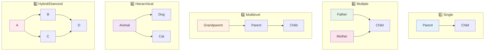
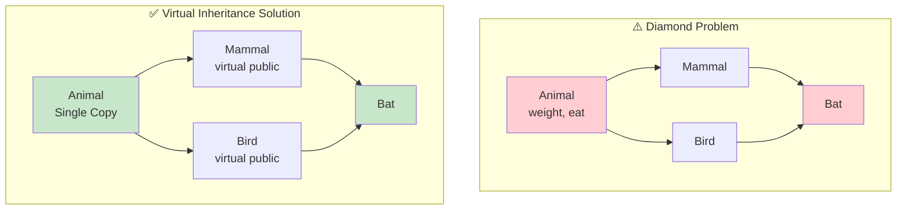

# Session 10: Inheritance – Extending Classes

## 🎯 Learning Objectives
- Master all types of inheritance
- Understand access modes in inheritance
- Work with virtual base classes
- Handle constructors in derived classes

---

## 1. What is Inheritance?

Inheritance allows a class to **acquire properties and behaviors** from another class.

```cpp
// Base class (Parent)
class Animal {
protected:
    string name;
public:
    void eat() { cout << name << " is eating." << endl; }
};

// Derived class (Child)
class Dog : public Animal {
public:
    Dog(string n) { name = n; }
    void bark() { cout << name << " says Woof!" << endl; }
};

int main() {
    Dog d("Buddy");
    d.eat();   // Inherited from Animal
    d.bark();  // Own method
}
```

---

## 2. Types of Inheritance

### Visual Overview: All Inheritance Types



---

### 1. Single Inheritance
One derived class inherits from one base class.

```cpp
class Parent {
public:
    void parentMethod() { cout << "Parent method" << endl; }
};

class Child : public Parent {
public:
    void childMethod() { cout << "Child method" << endl; }
};
```

### 2. Multiple Inheritance
One derived class inherits from multiple base classes.

```cpp
class Father {
public:
    void fatherTrait() { cout << "Father's trait" << endl; }
};

class Mother {
public:
    void motherTrait() { cout << "Mother's trait" << endl; }
};

class Child : public Father, public Mother {
public:
    void childTrait() { cout << "Child's trait" << endl; }
};

int main() {
    Child c;
    c.fatherTrait();  // From Father
    c.motherTrait();  // From Mother
    c.childTrait();   // Own
}
```

### 3. Multilevel Inheritance
Chain of inheritance (grandparent → parent → child).

```cpp
class Grandparent {
public:
    void grandparentMethod() { cout << "Grandparent" << endl; }
};

class Parent : public Grandparent {
public:
    void parentMethod() { cout << "Parent" << endl; }
};

class Child : public Parent {
public:
    void childMethod() { cout << "Child" << endl; }
};

int main() {
    Child c;
    c.grandparentMethod();  // From Grandparent
    c.parentMethod();       // From Parent
    c.childMethod();        // Own
}
```

### 4. Hierarchical Inheritance
Multiple derived classes from single base class.

```cpp
class Animal {
public:
    void eat() { cout << "Eating..." << endl; }
};

class Dog : public Animal {
public:
    void bark() { cout << "Barking..." << endl; }
};

class Cat : public Animal {
public:
    void meow() { cout << "Meowing..." << endl; }
};
```

### 5. Hybrid Inheritance
Combination of multiple inheritance types.

```cpp
class A { public: void a() {} };
class B : public A { public: void b() {} };
class C : public A { public: void c() {} };
class D : public B, public C { public: void d() {} };
```

---

## 3. Access Modes in Inheritance

```cpp
class Base {
public:    int pub;
protected: int prot;
private:   int priv;
};
```

| Base Member | public inheritance | protected inheritance | private inheritance |
|-------------|-------------------|----------------------|---------------------|
| `public` | public | protected | private |
| `protected` | protected | protected | private |
| `private` | Not inherited | Not inherited | Not inherited |

```cpp
class DerivedPublic : public Base {
    // pub → public, prot → protected
};

class DerivedProtected : protected Base {
    // pub → protected, prot → protected
};

class DerivedPrivate : private Base {
    // pub → private, prot → private
};
```

---

## 4. The Diamond Problem

Occurs in hybrid/multiple inheritance when two parent classes share a common ancestor.



```cpp
class Animal {
public:
    int weight;
    void eat() { cout << "Animal eating" << endl; }
};

class Mammal : public Animal {
public:
    void walk() { cout << "Mammal walking" << endl; }
};

class Bird : public Animal {
public:
    void fly() { cout << "Bird flying" << endl; }
};

class Bat : public Mammal, public Bird {
public:
    void hang() { cout << "Bat hanging" << endl; }
};

int main() {
    Bat b;
    // b.weight = 10;  // ERROR! Ambiguous - which Animal?
    // b.eat();        // ERROR! Ambiguous
    
    b.Mammal::weight = 10;  // Specify path
    b.Bird::eat();          // Specify path
}
```

---

## 5. Virtual Base Class (Solution to Diamond)

```cpp
class Animal {
public:
    int weight;
    Animal() { cout << "Animal constructor" << endl; }
    void eat() { cout << "Animal eating" << endl; }
};

// Virtual inheritance - only ONE copy of Animal
class Mammal : virtual public Animal {
public:
    void walk() { cout << "Mammal walking" << endl; }
};

class Bird : virtual public Animal {
public:
    void fly() { cout << "Bird flying" << endl; }
};

class Bat : public Mammal, public Bird {
public:
    void hang() { cout << "Bat hanging" << endl; }
};

int main() {
    Bat b;          // Animal constructor called ONCE
    b.weight = 10;  // OK! No ambiguity
    b.eat();        // OK!
}
```

---

## 6. Constructors in Derived Classes

Base class constructor is called **before** derived class constructor.

```cpp
class Base {
public:
    Base() { cout << "Base default" << endl; }
    Base(int x) { cout << "Base(" << x << ")" << endl; }
};

class Derived : public Base {
public:
    // Calls Base default constructor implicitly
    Derived() { cout << "Derived default" << endl; }
    
    // Explicitly call Base parameterized constructor
    Derived(int x) : Base(x) {
        cout << "Derived(" << x << ")" << endl;
    }
    
    // Call Base and initialize own members
    Derived(int x, int y) : Base(x), value(y) {
        cout << "Derived(" << x << ", " << y << ")" << endl;
    }
    
private:
    int value;
};

int main() {
    Derived d1;       // Base default, Derived default
    Derived d2(10);   // Base(10), Derived(10)
    Derived d3(5, 7); // Base(5), Derived(5, 7)
}
```

### Constructor/Destructor Order
```cpp
class A {
public:
    A() { cout << "A ctor" << endl; }
    ~A() { cout << "A dtor" << endl; }
};

class B : public A {
public:
    B() { cout << "B ctor" << endl; }
    ~B() { cout << "B dtor" << endl; }
};

class C : public B {
public:
    C() { cout << "C ctor" << endl; }
    ~C() { cout << "C dtor" << endl; }
};

int main() {
    C obj;
}
// Output:
// A ctor (base first)
// B ctor
// C ctor
// C dtor (derived first for destructors)
// B dtor
// A dtor
```

---

## 7. Friend Functions and Classes

Friends can access private and protected members.

### Friend Function
```cpp
class Box {
    double width;
public:
    Box(double w) : width(w) {}
    
    friend void printWidth(Box& b);  // Declare friend
};

void printWidth(Box& b) {
    cout << b.width << endl;  // Can access private!
}

int main() {
    Box b(10.5);
    printWidth(b);  // 10.5
}
```

### Friend Class
```cpp
class Engine {
    int horsepower;
public:
    Engine(int hp) : horsepower(hp) {}
    
    friend class Car;  // Car can access Engine's privates
};

class Car {
public:
    void showEngine(Engine& e) {
        cout << "HP: " << e.horsepower << endl;
    }
};
```

---

## 📝 Lab Exercise: Printer Hierarchy

```cpp
#include <iostream>
using namespace std;

class Printer {
protected:
    string brand;
    int ppm;  // pages per minute
    
public:
    Printer(string b, int p) : brand(b), ppm(p) {}
    
    virtual void print() {
        cout << brand << " printer: " << ppm << " ppm" << endl;
    }
    
    friend void compare(Printer& p1, Printer& p2);
};

void compare(Printer& p1, Printer& p2) {
    cout << "Comparing: " << p1.brand << " (" << p1.ppm << " ppm) vs "
         << p2.brand << " (" << p2.ppm << " ppm)" << endl;
    if (p1.ppm > p2.ppm) cout << p1.brand << " is faster" << endl;
    else if (p2.ppm > p1.ppm) cout << p2.brand << " is faster" << endl;
    else cout << "Same speed" << endl;
}

class InkjetPrinter : virtual public Printer {
public:
    InkjetPrinter(string b, int p) : Printer(b, p) {}
    void print() override {
        cout << brand << " inkjet: " << ppm << " ppm (color)" << endl;
    }
};

class LaserPrinter : virtual public Printer {
public:
    LaserPrinter(string b, int p) : Printer(b, p) {}
    void print() override {
        cout << brand << " laser: " << ppm << " ppm (fast)" << endl;
    }
};

class MultiFunctionPrinter : public InkjetPrinter, public LaserPrinter {
public:
    MultiFunctionPrinter(string b, int p) 
        : Printer(b, p), InkjetPrinter(b, p), LaserPrinter(b, p) {}
    
    void print() override {
        cout << brand << " MFP: " << ppm << " ppm (scan+copy+print)" << endl;
    }
};

int main() {
    InkjetPrinter ink("Canon", 15);
    LaserPrinter laser("HP", 30);
    MultiFunctionPrinter mfp("Epson", 25);
    
    ink.print();
    laser.print();
    mfp.print();
    
    compare(ink, laser);
}
```

---

## 🎯 Key Points for CCEE

> **Must Remember**:
> - **5 types**: Single, Multiple, Multilevel, Hierarchical, Hybrid
> - **Access modes**: public (keeps access), protected (downgrades), private (makes all private)
> - **private members** are NEVER inherited (accessible only in own class)
> - **Diamond problem**: ambiguity from shared ancestor
> - **Virtual base class** solves diamond problem (single copy of base)
> - Base constructor called **BEFORE** derived constructor
> - Destructors called in **REVERSE** order (derived first)
> - **friend** can access private/protected members
> - Use `: public Base` for public inheritance
> - Use `: virtual public Base` for virtual inheritance
