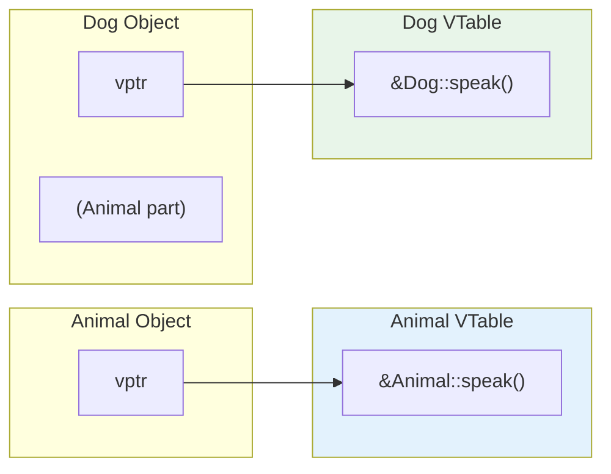

# Session 12: Virtual Functions and Abstract Classes

## 🎯 Learning Objectives
- Understand runtime polymorphism
- Master virtual and pure virtual functions
- Work with abstract classes and interfaces
- Use C++ type casting operators

---

## 1. Runtime Polymorphism

The ability to call derived class methods through base class pointer at runtime.

```cpp
class Animal {
public:
    void speak() {  // Non-virtual
        cout << "Animal speaks" << endl;
    }
};

class Dog : public Animal {
public:
    void speak() {
        cout << "Dog barks" << endl;
    }
};

int main() {
    Animal* ptr = new Dog();
    ptr->speak();  // "Animal speaks" - BASE version called!
    delete ptr;
}
```

Without `virtual`, base class method is called based on **pointer type**.

---

## 2. Virtual Functions

Use `virtual` keyword to enable runtime polymorphism.

```cpp
class Animal {
public:
    virtual void speak() {  // Virtual function
        cout << "Animal speaks" << endl;
    }
};

class Dog : public Animal {
public:
    void speak() override {  // Override keyword (C++11)
        cout << "Dog barks" << endl;
    }
};

class Cat : public Animal {
public:
    void speak() override {
        cout << "Cat meows" << endl;
    }
};

int main() {
    Animal* animals[3];
    animals[0] = new Animal();
    animals[1] = new Dog();
    animals[2] = new Cat();
    
    for (int i = 0; i < 3; i++) {
        animals[i]->speak();  // Calls DERIVED version!
    }
    // Output:
    // Animal speaks
    // Dog barks
    // Cat meows
    
    for (int i = 0; i < 3; i++) delete animals[i];
}
```

---

## 3. How Virtual Functions Work (VTable)



**How it works:**
- Each class with virtual functions has a **VTable** (Virtual Table)
- Each object has a hidden **vptr** (Virtual Pointer) pointing to its class's VTable
- At runtime, when a virtual function is called through a pointer, the vptr is used to find the correct function in the VTable

---

## 4. Virtual Destructor

**Critical**: Always use virtual destructor in base class with virtual functions!

```cpp
class Base {
public:
    Base() { cout << "Base ctor" << endl; }
    ~Base() { cout << "Base dtor" << endl; }  // NOT virtual
};

class Derived : public Base {
    int* data;
public:
    Derived() { 
        data = new int[100];
        cout << "Derived ctor" << endl; 
    }
    ~Derived() { 
        delete[] data;
        cout << "Derived dtor" << endl; 
    }
};

int main() {
    Base* ptr = new Derived();
    delete ptr;  // Only Base destructor called! MEMORY LEAK!
}
// Output:
// Base ctor
// Derived ctor
// Base dtor (Derived dtor NOT called!)
```

### Solution: Virtual Destructor

```cpp
class Base {
public:
    virtual ~Base() { cout << "Base dtor" << endl; }
};

class Derived : public Base {
    int* data;
public:
    Derived() { data = new int[100]; }
    ~Derived() override { 
        delete[] data;
        cout << "Derived dtor" << endl; 
    }
};

int main() {
    Base* ptr = new Derived();
    delete ptr;  // Both destructors called correctly!
}
// Output:
// Derived dtor
// Base dtor
```

---

## 5. Pure Virtual Functions

A virtual function with `= 0` instead of implementation.

```cpp
class Shape {
public:
    // Pure virtual function - NO implementation
    virtual double area() = 0;
    virtual double perimeter() = 0;
    
    // Regular virtual function - has default implementation
    virtual void display() {
        cout << "Shape: Area = " << area() << endl;
    }
    
    virtual ~Shape() {}
};
```

---

## 6. Abstract Classes

A class with **at least one pure virtual function**.

```cpp
class Shape {  // Abstract class
public:
    virtual double area() = 0;      // Pure virtual
    virtual double perimeter() = 0; // Pure virtual
    virtual ~Shape() {}
};

// Shape s;  // ERROR! Cannot instantiate abstract class

class Circle : public Shape {
    double radius;
public:
    Circle(double r) : radius(r) {}
    
    double area() override {
        return 3.14159 * radius * radius;
    }
    
    double perimeter() override {
        return 2 * 3.14159 * radius;
    }
};

class Rectangle : public Shape {
    double length, width;
public:
    Rectangle(double l, double w) : length(l), width(w) {}
    
    double area() override {
        return length * width;
    }
    
    double perimeter() override {
        return 2 * (length + width);
    }
};

int main() {
    Shape* shapes[2];
    shapes[0] = new Circle(5);
    shapes[1] = new Rectangle(4, 6);
    
    for (int i = 0; i < 2; i++) {
        cout << "Area: " << shapes[i]->area() << endl;
        cout << "Perimeter: " << shapes[i]->perimeter() << endl;
    }
    
    for (int i = 0; i < 2; i++) delete shapes[i];
}
```

---

## 7. Interface in C++

Pure interface: class with **only** pure virtual functions.

```cpp
// Interface - all pure virtual
class IDrawable {
public:
    virtual void draw() = 0;
    virtual void setColor(string color) = 0;
    virtual ~IDrawable() {}
};

class IResizable {
public:
    virtual void resize(double factor) = 0;
    virtual ~IResizable() {}
};

// Implementing multiple interfaces
class Square : public IDrawable, public IResizable {
    double side;
    string color;
    
public:
    Square(double s) : side(s), color("black") {}
    
    void draw() override {
        cout << "Drawing " << color << " square, side=" << side << endl;
    }
    
    void setColor(string c) override {
        color = c;
    }
    
    void resize(double factor) override {
        side *= factor;
    }
};
```

---

## 8. Type Casting in C++

### static_cast
Compile-time cast for related types.

```cpp
// Numeric conversions
double d = 3.14;
int i = static_cast<int>(d);  // 3

// Upcasting (safe)
Derived* dptr = new Derived();
Base* bptr = static_cast<Base*>(dptr);  // OK

// Downcasting (unsafe - no runtime check)
Base* bptr2 = new Derived();
Derived* dptr2 = static_cast<Derived*>(bptr2);  // Compiles, may be unsafe
```

### dynamic_cast
Runtime cast with type checking (requires polymorphic class).

```cpp
class Base {
public:
    virtual ~Base() {}  // Must have at least one virtual function
};

class Derived : public Base {
public:
    void derivedMethod() { cout << "Derived!" << endl; }
};

int main() {
    Base* bptr = new Derived();
    
    // Safe downcast with runtime check
    Derived* dptr = dynamic_cast<Derived*>(bptr);
    if (dptr) {
        dptr->derivedMethod();  // Safe to call
    } else {
        cout << "Cast failed!" << endl;
    }
    
    // Cast to unrelated type
    Base* bptr2 = new Base();
    Derived* dptr2 = dynamic_cast<Derived*>(bptr2);
    if (!dptr2) {
        cout << "Cast failed (as expected)" << endl;
    }
    
    delete bptr;
    delete bptr2;
}
```

### const_cast
Remove or add const qualifier.

```cpp
void legacyFunction(char* str) {
    cout << str << endl;
}

int main() {
    const char* constStr = "Hello";
    
    // Remove const (use carefully!)
    legacyFunction(const_cast<char*>(constStr));
    
    // Add const
    int x = 10;
    const int* cptr = const_cast<const int*>(&x);
}
```

### reinterpret_cast
Low-level reinterpretation of bits.

```cpp
int x = 65;
char* cptr = reinterpret_cast<char*>(&x);
cout << *cptr << endl;  // 'A' (ASCII 65)

// Pointer to integer
int* iptr = &x;
uintptr_t addr = reinterpret_cast<uintptr_t>(iptr);
cout << "Address: " << hex << addr << endl;
```

---

## 9. Cast Comparison Table

| Cast | When to Use | Runtime Check |
|------|-------------|---------------|
| `static_cast` | Related types, numeric conversions | No |
| `dynamic_cast` | Safe downcasting in polymorphic hierarchy | Yes |
| `const_cast` | Add/remove const qualifier | No |
| `reinterpret_cast` | Low-level bit reinterpretation | No |

---

## 📝 Lab Exercise: Diamond Problem Solution

```cpp
#include <iostream>
using namespace std;

class Printer {
protected:
    string brand;
public:
    Printer(string b = "Generic") : brand(b) {
        cout << "Printer ctor: " << brand << endl;
    }
    virtual void print() = 0;  // Pure virtual
    virtual ~Printer() {
        cout << "Printer dtor: " << brand << endl;
    }
};

class InkjetPrinter : virtual public Printer {
public:
    InkjetPrinter() : Printer("Inkjet") {
        cout << "InkjetPrinter ctor" << endl;
    }
    void print() override {
        cout << "Inkjet printing..." << endl;
    }
    ~InkjetPrinter() {
        cout << "InkjetPrinter dtor" << endl;
    }
};

class LaserPrinter : virtual public Printer {
public:
    LaserPrinter() : Printer("Laser") {
        cout << "LaserPrinter ctor" << endl;
    }
    void print() override {
        cout << "Laser printing..." << endl;
    }
    ~LaserPrinter() {
        cout << "LaserPrinter dtor" << endl;
    }
};

class AllInOnePrinter : public InkjetPrinter, public LaserPrinter {
public:
    // With virtual inheritance, we MUST call base constructor
    AllInOnePrinter() : Printer("AllInOne"), InkjetPrinter(), LaserPrinter() {
        cout << "AllInOnePrinter ctor" << endl;
    }
    void print() override {
        cout << "All-in-One printing..." << endl;
    }
    ~AllInOnePrinter() {
        cout << "AllInOnePrinter dtor" << endl;
    }
};

int main() {
    cout << "=== Creating AllInOnePrinter ===" << endl;
    AllInOnePrinter* aio = new AllInOnePrinter();
    
    cout << "\n=== Polymorphic call ===" << endl;
    Printer* p = aio;
    p->print();  // All-in-One printing...
    
    cout << "\n=== Deleting ===" << endl;
    delete p;
}
```

---

## 🎯 Key Points for CCEE

> **Must Remember**:
> - `virtual` enables runtime polymorphism
> - Without `virtual`, base class version is called (based on pointer type)
> - **VTable** stores pointers to virtual functions
> - **vptr** is hidden pointer in each object
> - **Pure virtual**: `virtual void func() = 0;`
> - Class with pure virtual = **Abstract class** (cannot instantiate)
> - **Interface**: class with only pure virtual functions
> - Always use **virtual destructor** in polymorphic base class
> - `dynamic_cast` returns `nullptr` if cast fails
> - `static_cast` does no runtime checking
> - `const_cast` only for const/non-const conversion
> - `reinterpret_cast` for low-level bit reinterpretation
