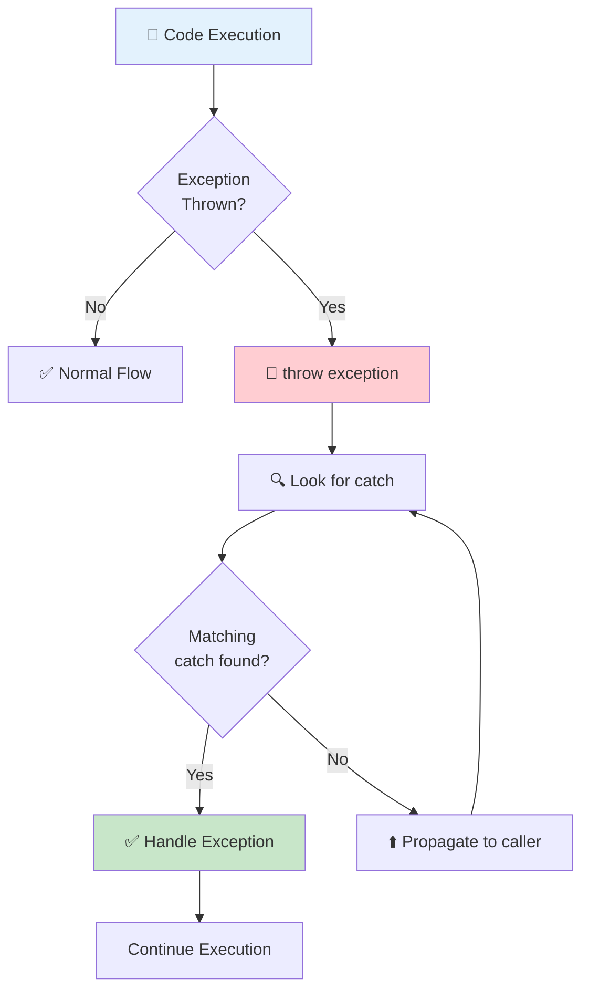
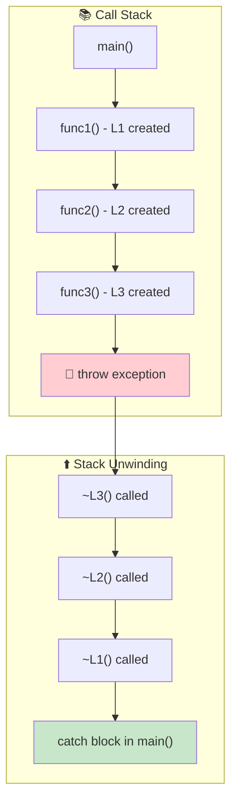

# Session 13: Exception Handling

## 🎯 Learning Objectives
- Understand exception handling mechanism
- Master try-catch-throw
- Create custom exception classes
- Handle multiple exceptions

---

## 1. What is Exception Handling?

A mechanism to handle **runtime errors** gracefully without crashing the program.



```cpp
// Without exception handling
int divide(int a, int b) {
    return a / b;  // CRASH if b == 0!
}

// With exception handling
int safeDivide(int a, int b) {
    if (b == 0) {
        throw "Division by zero!";  // Throw exception
    }
    return a / b;
}
```

---

## 2. Try-Catch-Throw

```cpp
#include <iostream>
using namespace std;

int main() {
    try {
        // Code that might throw
        int a = 10, b = 0;
        
        if (b == 0) {
            throw "Cannot divide by zero!";  // String exception
        }
        
        int result = a / b;
        cout << "Result: " << result << endl;
    }
    catch (const char* msg) {
        // Handle string exceptions
        cout << "Error: " << msg << endl;
    }
    
    cout << "Program continues..." << endl;
}
```

---

## 3. Throwing Different Types

```cpp
void processValue(int value) {
    if (value < 0) {
        throw -1;                    // Throw int
    }
    if (value > 100) {
        throw "Value too large";     // Throw string
    }
    if (value == 42) {
        throw 42.0;                  // Throw double
    }
    cout << "Value processed: " << value << endl;
}

int main() {
    try {
        processValue(50);   // OK
        processValue(-5);   // Throws int
    }
    catch (int e) {
        cout << "Int exception: " << e << endl;
    }
    catch (const char* e) {
        cout << "String exception: " << e << endl;
    }
    catch (double e) {
        cout << "Double exception: " << e << endl;
    }
}
```

---

## 4. Standard Exception Classes

```cpp
#include <exception>
#include <stdexcept>

void test(int n) {
    if (n < 0) {
        throw std::invalid_argument("Negative value not allowed");
    }
    if (n > 100) {
        throw std::out_of_range("Value out of range [0-100]");
    }
    if (n == 0) {
        throw std::runtime_error("Zero is not allowed");
    }
}

int main() {
    try {
        test(-5);
    }
    catch (const std::invalid_argument& e) {
        cout << "Invalid argument: " << e.what() << endl;
    }
    catch (const std::out_of_range& e) {
        cout << "Out of range: " << e.what() << endl;
    }
    catch (const std::exception& e) {
        cout << "Exception: " << e.what() << endl;
    }
}
```

### Standard Exception Hierarchy
```
std::exception
├── std::logic_error
│   ├── std::invalid_argument
│   ├── std::domain_error
│   ├── std::length_error
│   └── std::out_of_range
└── std::runtime_error
    ├── std::overflow_error
    ├── std::underflow_error
    └── std::range_error
```

---

## 5. Custom Exception Classes

```cpp
#include <exception>
#include <string>

class BankException : public std::exception {
    std::string message;
    
public:
    BankException(const std::string& msg) : message(msg) {}
    
    const char* what() const noexcept override {
        return message.c_str();
    }
};

class InsufficientFundsException : public BankException {
    double balance, amount;
    
public:
    InsufficientFundsException(double bal, double amt)
        : BankException("Insufficient funds"), balance(bal), amount(amt) {}
    
    double getBalance() const { return balance; }
    double getAmount() const { return amount; }
    double getShortfall() const { return amount - balance; }
};

class BankAccount {
    double balance;
public:
    BankAccount(double b) : balance(b) {}
    
    void withdraw(double amount) {
        if (amount > balance) {
            throw InsufficientFundsException(balance, amount);
        }
        balance -= amount;
    }
    
    double getBalance() const { return balance; }
};

int main() {
    BankAccount account(100);
    
    try {
        account.withdraw(50);   // OK
        account.withdraw(75);   // Throws exception
    }
    catch (const InsufficientFundsException& e) {
        cout << "Error: " << e.what() << endl;
        cout << "Balance: $" << e.getBalance() << endl;
        cout << "Requested: $" << e.getAmount() << endl;
        cout << "Shortfall: $" << e.getShortfall() << endl;
    }
}
```

---

## 6. Re-throwing Exceptions

```cpp
void innerFunction() {
    throw std::runtime_error("Error in inner function");
}

void middleFunction() {
    try {
        innerFunction();
    }
    catch (...) {
        cout << "Handling in middle, then re-throwing..." << endl;
        throw;  // Re-throw same exception
    }
}

void outerFunction() {
    try {
        middleFunction();
    }
    catch (const std::exception& e) {
        cout << "Finally caught in outer: " << e.what() << endl;
    }
}
```

---

## 7. Catch-All Handler

```cpp
try {
    // Some code
}
catch (const std::exception& e) {
    cout << "Standard exception: " << e.what() << endl;
}
catch (...) {  // Catch anything else
    cout << "Unknown exception caught!" << endl;
}
```

---

## 8. Exception in Constructors/Destructors

### Constructor Exception
```cpp
class Resource {
    int* data;
public:
    Resource(int size) {
        if (size <= 0) {
            throw std::invalid_argument("Size must be positive");
        }
        data = new int[size];
    }
    
    ~Resource() {
        delete[] data;
    }
};

int main() {
    try {
        Resource r(0);  // Throws in constructor
    }
    catch (const std::exception& e) {
        cout << "Failed to create Resource: " << e.what() << endl;
        // Destructor NOT called (object never fully constructed)
    }
}
```

### Destructor Exception (AVOID!)
```cpp
class Bad {
public:
    ~Bad() {
        // throw std::runtime_error("Error in destructor");
        // NEVER throw from destructor!
        // If destructor is called during stack unwinding and throws,
        // program will terminate!
    }
};
```

---

## 9. noexcept Specifier (C++11)

```cpp
// Promises not to throw
void safeFunction() noexcept {
    // If this throws, std::terminate() is called
}

// Conditionally noexcept
template<typename T>
void process(T t) noexcept(noexcept(T())) {
    // noexcept if T's constructor is noexcept
}

// Check if noexcept
cout << noexcept(safeFunction()) << endl;  // true
```

---

## 10. Stack Unwinding

When exception is thrown:
1. Look for matching catch in current scope
2. If not found, destroy local objects (call destructors)
3. Move to calling function
4. Repeat until catch is found or main() exits




```cpp
class Logger {
    string name;
public:
    Logger(string n) : name(n) {
        cout << "Creating " << name << endl;
    }
    ~Logger() {
        cout << "Destroying " << name << endl;
    }
};

void func3() {
    Logger l3("L3");
    throw std::runtime_error("Error!");
}

void func2() {
    Logger l2("L2");
    func3();
}

void func1() {
    Logger l1("L1");
    func2();
}

int main() {
    try {
        func1();
    }
    catch (const std::exception& e) {
        cout << "Caught: " << e.what() << endl;
    }
}
// Output:
// Creating L1
// Creating L2
// Creating L3
// Destroying L3  (stack unwinding)
// Destroying L2
// Destroying L1
// Caught: Error!
```

---

## 📝 Lab Exercise: Custom Exception Hierarchy

```cpp
#include <iostream>
#include <exception>
#include <string>
using namespace std;

class AppException : public exception {
protected:
    string message;
    int errorCode;
public:
    AppException(const string& msg, int code) 
        : message(msg), errorCode(code) {}
    
    const char* what() const noexcept override {
        return message.c_str();
    }
    
    int getCode() const { return errorCode; }
};

class ValidationException : public AppException {
public:
    ValidationException(const string& field)
        : AppException("Validation failed for: " + field, 1001) {}
};

class DatabaseException : public AppException {
public:
    DatabaseException(const string& query)
        : AppException("Database error in query: " + query, 2001) {}
};

class NetworkException : public AppException {
public:
    NetworkException(const string& url)
        : AppException("Network error connecting to: " + url, 3001) {}
};

void validateInput(const string& input) {
    if (input.empty()) {
        throw ValidationException("input");
    }
}

void queryDatabase(const string& query) {
    if (query.find("DROP") != string::npos) {
        throw DatabaseException(query);
    }
}

void fetchUrl(const string& url) {
    if (url.find("https") == string::npos) {
        throw NetworkException(url);
    }
}

int main() {
    try {
        validateInput("");
    }
    catch (const ValidationException& e) {
        cout << "[" << e.getCode() << "] " << e.what() << endl;
    }
    
    try {
        queryDatabase("DROP TABLE users");
    }
    catch (const DatabaseException& e) {
        cout << "[" << e.getCode() << "] " << e.what() << endl;
    }
    
    try {
        fetchUrl("http://example.com");
    }
    catch (const NetworkException& e) {
        cout << "[" << e.getCode() << "] " << e.what() << endl;
    }
}
```

---

## 🎯 Key Points for CCEE

> **Must Remember**:
> - `try` block contains code that might throw
> - `catch` block handles specific exception type
> - `throw` throws an exception (any type)
> - Catch blocks are checked **in order** (put specific before general)
> - `catch(...)` catches any exception
> - `throw;` (no argument) re-throws current exception
> - Custom exceptions should inherit from `std::exception`
> - Override `what()` with `const noexcept`
> - **Never throw from destructor**
> - Stack unwinding calls destructors of local objects
> - `noexcept` promises function won't throw
> - If `noexcept` function throws → `std::terminate()`
