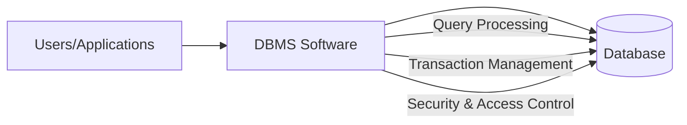
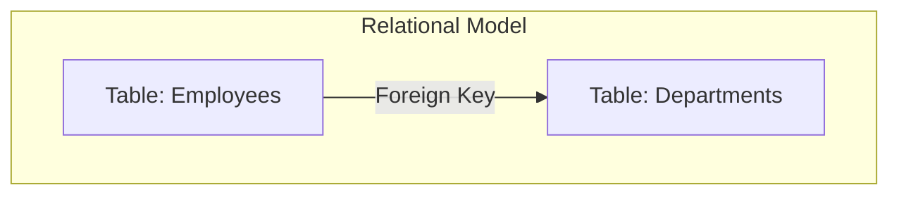
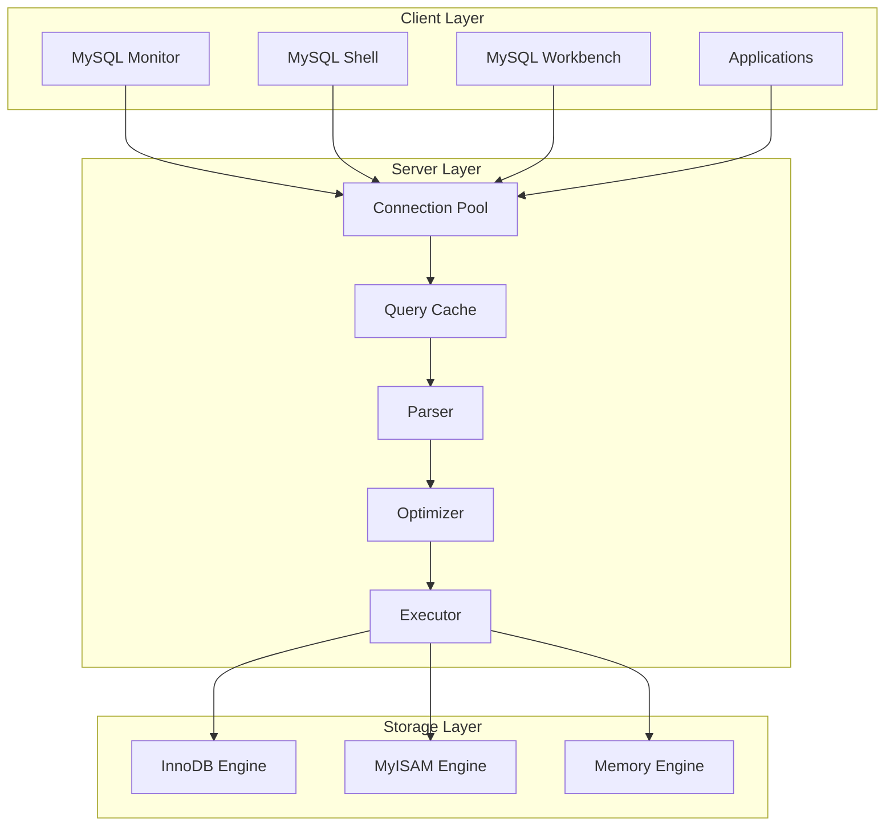
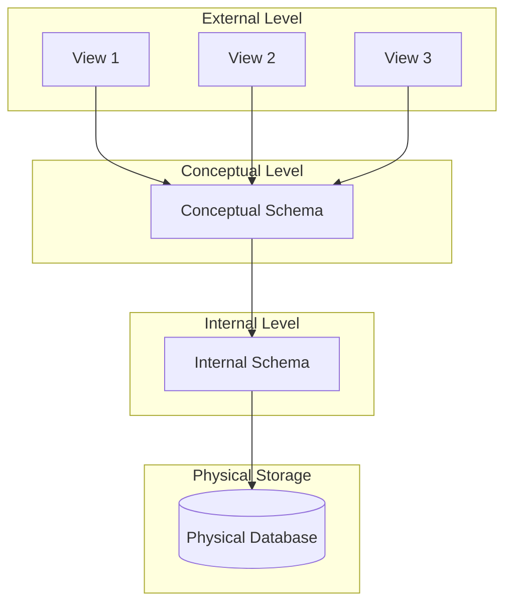

# Session 1: Introduction to DBMS

## What is a Database?

A **Database** is an organized collection of structured data stored electronically in a computer system. It allows efficient storage, retrieval, modification, and management of data.

## What is a DBMS?

A **Database Management System (DBMS)** is software that provides an interface to interact with databases, enabling users to:
- Create and manage databases
- Store, retrieve, and manipulate data
- Ensure data security and integrity
- Handle concurrent access

## Basic Database Terminology

| Term | Definition |
|------|------------|
| **Data** | Raw facts and figures (e.g., "John", 25, "Delhi") |
| **Information** | Processed data that has meaning and context |
| **Database** | Organized collection of related data |
| **DBMS** | Software to manage and interact with databases |
| **Schema** | Structure/design of a database (metadata) |
| **Instance** | The actual data stored at a particular moment |
| **Query** | A request to retrieve or manipulate data |
| **Metadata** | Data about data (table structure, constraints, etc.) |
| **Record/Row/Tuple** | A single entry in a table |
| **Field/Column/Attribute** | A single piece of data in a record |
| **Table/Relation** | Collection of related records |
| **Primary Key** | Unique identifier for each record |
| **Foreign Key** | Reference to primary key of another table |

## DBMS vs File System

| Feature | File System | DBMS |
|---------|------------|------|
| **Data Redundancy** | High - data duplicated across files | Low - data stored centrally |
| **Data Inconsistency** | High - updates may miss some copies | Low - single source of truth |
| **Data Isolation** | Data scattered in different files | Data centralized and organized |
| **Integrity Constraints** | Difficult to enforce | Easy to define and enforce |
| **Atomicity** | Not supported | Full transaction support (ACID) |
| **Concurrent Access** | Problematic | Built-in concurrency control |
| **Security** | OS-level only | Fine-grained access control |
| **Backup & Recovery** | Manual, complex | Automated, reliable |
| **Data Independence** | Not supported | Logical & Physical independence |

## Types of DBMS

### 1. Relational DBMS (RDBMS)
- Stores data in **tables** (rows and columns)
- Uses **SQL** (Structured Query Language)
- Based on **Codd's Relational Model**
- Examples: MySQL, PostgreSQL, Oracle, MS SQL Server

### 2. Object-Relational DBMS (ORDBMS)
- Extends RDBMS with **object-oriented features**
- Supports user-defined types, inheritance, methods
- Examples: PostgreSQL, Oracle

| Feature | RDBMS | ORDBMS |
|---------|-------|--------|
| Data Types | Predefined only | User-defined types |
| Inheritance | Not supported | Supported |
| Complex Objects | Limited | Full support |
| Methods | Not supported | Can define methods |

### 3. NoSQL Databases
- **Non-relational** databases for unstructured/semi-structured data
- Designed for **scalability** and **flexibility**
- No fixed schema required
- Types: Key-Value, Document, Column-Family, Graph

| Type | Description | Examples |
|------|-------------|----------|
| **Key-Value** | Data stored as key-value pairs | Redis, DynamoDB |
| **Document** | JSON/BSON documents | MongoDB, CouchDB |
| **Column-Family** | Column-oriented storage | Cassandra, HBase |
| **Graph** | Nodes and relationships | Neo4j, Amazon Neptune |

### Comparison: RDBMS vs NoSQL

| Aspect | RDBMS | NoSQL |
|--------|-------|-------|
| **Schema** | Fixed, predefined | Dynamic, flexible |
| **Scalability** | Vertical (scale-up) | Horizontal (scale-out) |
| **ACID Compliance** | Strong | Varies (often BASE) |
| **Query Language** | SQL | Varies by database |
| **Relationships** | Excellent (JOINs) | Limited |
| **Data Type** | Structured | Unstructured/Semi-structured |
| **Use Cases** | Banking, ERP, CRM | Social media, Big Data, IoT |

## Introduction to MySQL

**MySQL** is an open-source Relational Database Management System that:
- Uses SQL for data manipulation
- Is widely used for web applications
- Supports multiple storage engines
- Provides ACID compliance (with InnoDB)

### MySQL Architecture

## MySQL Clients

### 1. MySQL Monitor (Command Line Client)
- **Text-based** interface
- Accessed via terminal/command prompt
- Command: `mysql -u username -p`
- Best for: Scripts, automation, quick queries

### 2. MySQL Shell
- **Enhanced command-line** interface
- Supports SQL, JavaScript, and Python
- Interactive and batch modes
- Command: `mysqlsh`
- Best for: Advanced scripting, DevOps

### 3. MySQL Workbench
- **GUI-based** visual tool
- Database design and modeling (ERD)
- Query development and optimization
- Server administration
- Best for: Visual design, complex queries, administration

| Feature | MySQL Monitor | MySQL Shell | MySQL Workbench |
|---------|--------------|-------------|-----------------|
| Interface | CLI | CLI | GUI |
| Languages | SQL | SQL, JS, Python | SQL |
| Visual Modeling | ❌ | ❌ | ✅ |
| Query Profiling | Limited | ✅ | ✅ |
| Server Admin | Limited | ✅ | ✅ |

## Three-Schema Architecture

The **ANSI-SPARC** architecture defines three levels of abstraction:

| Level | Description | Example |
|-------|-------------|---------|
| **External** | User's view of data (different views for different users) | Sales view, HR view |
| **Conceptual** | Community view - logical structure of entire database | Tables, relationships, constraints |
| **Internal** | Physical storage details | File organization, indexes, storage |

## Data Independence

| Type | Definition | Example |
|------|------------|---------|
| **Logical Data Independence** | Ability to change conceptual schema without affecting external views | Add new column without affecting existing applications |
| **Physical Data Independence** | Ability to change internal schema without affecting conceptual schema | Change storage method without query changes |

## Key MCQ Points to Remember

1. **DBMS** stands for Database Management System
2. **Data Redundancy** means storing same data in multiple places
3. **ACID** = Atomicity, Consistency, Isolation, Durability
4. **MySQL** is an open-source RDBMS
5. **InnoDB** is the default storage engine in MySQL (supports ACID)
6. **MyISAM** does NOT support transactions
7. **NoSQL** stands for "Not Only SQL"
8. **Schema** = structure; **Instance** = actual data
9. **Primary Key** uniquely identifies a record
10. **Foreign Key** references another table's primary key
11. **Three-Schema Architecture**: External, Conceptual, Internal
12. **MySQL Workbench** is a GUI tool for MySQL
13. **MongoDB** is a Document-based NoSQL database
14. **RDBMS** uses SQL; NoSQL databases have varied query languages
