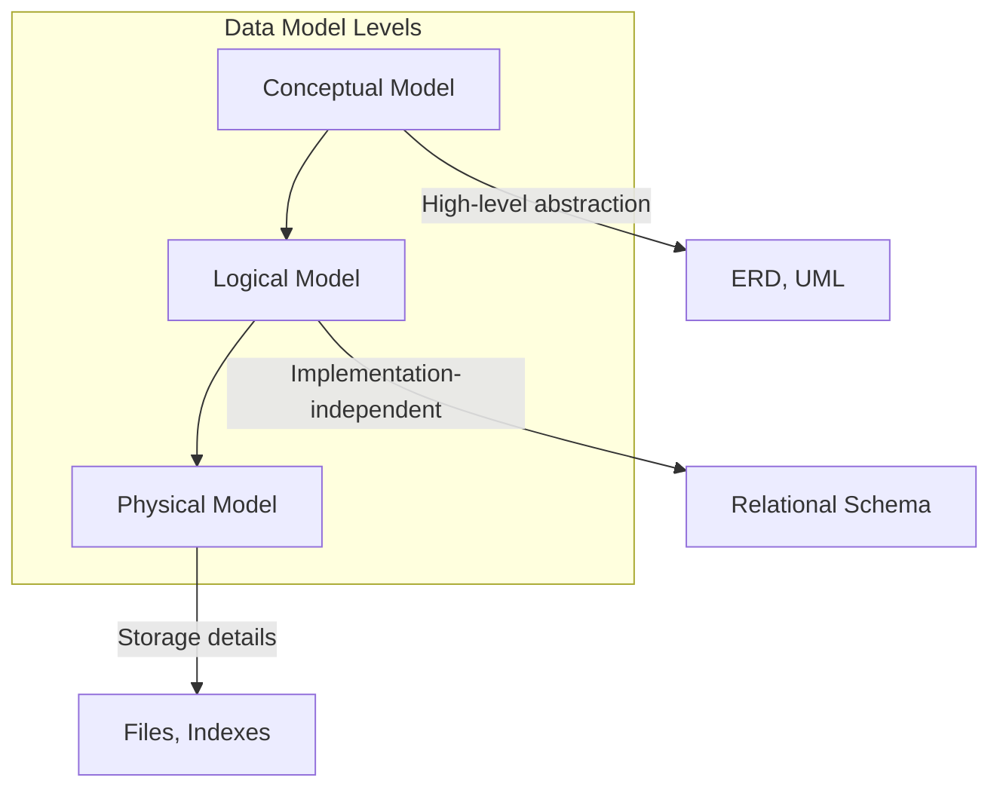
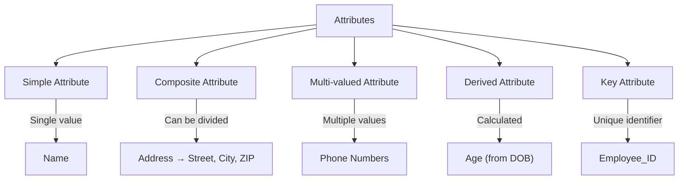
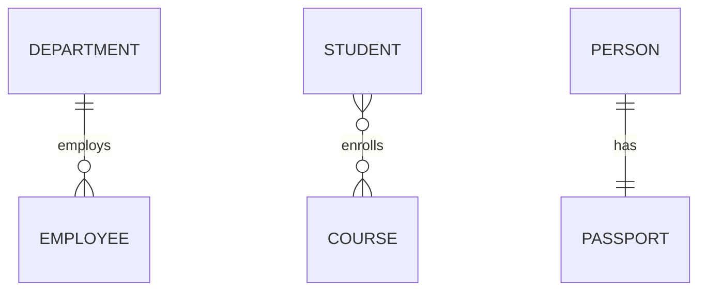
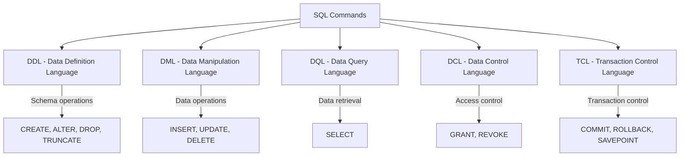

# Session 2: Data Models, ERD, Codd's Rules, SQL Introduction

## Data Models

A **Data Model** is a conceptual representation of data structures, relationships, and constraints that defines how data is organized, stored, and manipulated.

### Types of Data Models



| Model | Description | Focus | Example |
|-------|-------------|-------|---------|
| **Conceptual** | High-level representation of data requirements | Business entities and relationships | ERD with entities like Customer, Order |
| **Logical** | Detailed structure independent of DBMS | Tables, columns, relationships | Relational schema with PKs, FKs |
| **Physical** | Actual implementation in specific DBMS | Storage, partitions, indexes | MySQL table with InnoDB engine |

### Database Design Phases

The process of designing a database involves several distinct phases:

1.  **Requirements Analysis**: Gathering financial and functional requirements.
2.  **Conceptual Design**: Creating a high-level model (ER Diagram) independent of any DBMS.
3.  **Logical Design**: Converting the conceptual model into a DBMS-specific structure (Relational Schema/Tables).
4.  **Physical Design**: Implementing the schema on specific hardware/software (Indexing, Storage Engines).

## Entity-Relationship Diagram (ERD)

### Basic Components

| Component | Symbol | Description |
|-----------|--------|-------------|
| **Entity** | Rectangle | Real-world object or concept (e.g., Student, Course) |
| **Attribute** | Ellipse | Property of an entity (e.g., Name, Age) |
| **Relationship** | Diamond | Association between entities (e.g., "enrolls in") |
| **Primary Key** | Underlined attribute | Unique identifier for entity |

### Attribute Types



| Attribute Type | Description | Notation |
|---------------|-------------|----------|
| **Simple** | Cannot be divided further | Regular ellipse |
| **Composite** | Can be subdivided | Ellipse with sub-ellipses |
| **Multi-valued** | Can have multiple values | Double ellipse |
| **Derived** | Calculated from other attributes | Dashed ellipse |
| **Key** | Uniquely identifies entity | Underlined |

### Relationship Types (Cardinality)

| Cardinality | Description | Example |
|-------------|-------------|---------|
| **1:1** (One-to-One) | One entity relates to exactly one other | Person ↔ Passport |
| **1:N** (One-to-Many) | One entity relates to many others | Department → Employees |
| **M:N** (Many-to-Many) | Many entities relate to many others | Students ↔ Courses |



### Participation Constraints

| Type | Description | Notation |
|------|-------------|----------|
| **Total (Mandatory)** | Every entity must participate | Double line |
| **Partial (Optional)** | Entity may or may not participate | Single line |

## Converting ERD to Relational Schema

### Rules for Conversion

| ER Component | Relational Schema |
|--------------|------------------|
| Entity | Table |
| Attribute | Column |
| Primary Key | Primary Key column |
| 1:1 Relationship | FK in either table |
| 1:N Relationship | FK in "many" side table |
| M:N Relationship | Junction/Bridge table with FKs |
| Composite Attribute | Multiple columns |
| Multi-valued Attribute | Separate table |

### Keys in RDBMS

Keys are fundamental to the relational model for identifying and relating data.

| Key Type | Definition | Example |
|---|---|---|
| **Super Key** | Any set of attributes that uniquely identifies a row. | (ID), (ID, Name), (Phone) |
| **Candidate Key** | A minimal Super Key (no unnecessary attributes). | ID, Phone, Email |
| **Primary Key** | The specific Candidate Key chosen to identify rows. | ID |
| **Alternate Key** | Candidate Keys NOT chosen as Primary Key. | Phone, Email |
| **Foreign Key** | Attribute linking to the Primary Key of another table. | Dept_ID |
| **Composite Key** | A Primary Key consisting of multiple columns. | (Order_ID, Product_ID) |


---

## Codd's 12 Rules for RDBMS

Dr. **E.F. Codd** defined 12 rules (numbered 0-12) to determine if a DBMS is truly relational.

| Rule # | Name | Description |
|--------|------|-------------|
| **0** | Foundation Rule | System must qualify as relational, as a database, and as a management system |
| **1** | Information Rule | All data must be stored in tables (relations) |
| **2** | Guaranteed Access | Every data element accessible via table name + primary key + column name |
| **3** | Systematic Null Treatment | NULL values handled consistently for missing/inapplicable data |
| **4** | Dynamic Catalog | Database description stored in tables, queryable via SQL |
| **5** | Comprehensive Data Sublanguage | Must support at least one language with DDL, DML, DCL, TCL |
| **6** | View Updating Rule | All theoretically updatable views must be updatable by system |
| **7** | High-level Insert/Update/Delete | Set-level operations supported (not just row-by-row) |
| **8** | Physical Data Independence | Changes to physical storage don't require app changes |
| **9** | Logical Data Independence | Changes to logical schema don't require app changes |
| **10** | Integrity Independence | Integrity constraints stored in catalog, not in applications |
| **11** | Distribution Independence | Application unaffected by data distribution |
| **12** | Non-subversion Rule | Low-level access cannot bypass integrity/security constraints |

> **Important for MCQ**: No DBMS fully satisfies all 12 rules. MySQL, Oracle, etc. are "practically relational."

---

## Introduction to SQL

**SQL (Structured Query Language)** is the standard language for interacting with RDBMS.

### SQL Characteristics

| Feature | Description |
|---------|-------------|
| **Non-procedural** | Specify WHAT, not HOW |
| **Declarative** | Focus on result, not steps |
| **Case-insensitive** | SELECT = select = Select (for keywords) |
| **Standardized** | ANSI/ISO standards |

### Categories of SQL Commands



| Category | Full Form | Purpose | Commands | Auto-Commit |
|----------|-----------|---------|----------|-------------|
| **DDL** | Data Definition Language | Define database structure | CREATE, ALTER, DROP, TRUNCATE | ✅ Yes |
| **DML** | Data Manipulation Language | Manipulate data | INSERT, UPDATE, DELETE | ❌ No |
| **DQL** | Data Query Language | Retrieve data | SELECT | N/A |
| **DCL** | Data Control Language | Control access | GRANT, REVOKE | ✅ Yes |
| **TCL** | Transaction Control Language | Manage transactions | COMMIT, ROLLBACK, SAVEPOINT | N/A |

---

## DDL Commands (Data Definition Language)

### CREATE

Creates database objects (databases, tables, indexes, views).

```sql
-- Create Database
CREATE DATABASE company_db;

-- Create Table
CREATE TABLE employees (
    emp_id INT PRIMARY KEY,
    emp_name VARCHAR(50) NOT NULL,
    salary DECIMAL(10,2),
    dept_id INT
);
```

### ALTER

Modifies existing database objects.

```sql
-- Add column
ALTER TABLE employees ADD email VARCHAR(100);

-- Modify column
ALTER TABLE employees MODIFY salary DECIMAL(12,2);

-- Drop column
ALTER TABLE employees DROP COLUMN email;

-- Rename column
ALTER TABLE employees RENAME COLUMN emp_name TO name;

-- Add constraint
ALTER TABLE employees ADD FOREIGN KEY (dept_id) REFERENCES departments(dept_id);
```

### DROP

Permanently removes database objects.

```sql
-- Drop table (structure + data removed)
DROP TABLE employees;

-- Drop database
DROP DATABASE company_db;
```

### TRUNCATE

Removes all data from a table but keeps structure.

```sql
-- Remove all rows (faster than DELETE)
TRUNCATE TABLE employees;
```

### DROP vs TRUNCATE vs DELETE

| Feature | DROP | TRUNCATE | DELETE |
|---------|------|----------|--------|
| **Removes** | Structure + Data | Data only | Data only |
| **WHERE clause** | N/A | ❌ Not allowed | ✅ Allowed |
| **Rollback** | ❌ Not possible | ❌ Not possible | ✅ Possible |
| **Command Type** | DDL | DDL | DML |
| **Triggers** | Drops them | Not fired | Fired |
| **Speed** | Fast | Fastest | Slowest |
| **Auto-commit** | Yes | Yes | No |
| **Space** | Released | Released | Retained |

---

## Key MCQ Points to Remember

1. **Conceptual Model** = High-level, business view (ERD)
2. **Logical Model** = Tables, relationships (schema)
3. **Physical Model** = Storage details (indexes, files)
4. **Design Phases**: Req -> Conceptual (ERD) -> Logical (Tables) -> Physical
5. **ERD Components**: Entity (rectangle), Attribute (ellipse), Relationship (diamond)
5. **Cardinality**: 1:1, 1:N (1:Many), M:N (Many:Many)
6. **Codd's Rules**: 12 rules (0-12) for true RDBMS
7. **Rule 1**: All data stored in tables
8. **DDL** commands: CREATE, ALTER, DROP, TRUNCATE (auto-commit)
9. **DML** commands: INSERT, UPDATE, DELETE (require COMMIT)
10. **DCL** commands: GRANT, REVOKE
11. **TCL** commands: COMMIT, ROLLBACK, SAVEPOINT
12. **TRUNCATE** is DDL; **DELETE** is DML
13. **DROP** removes structure; **TRUNCATE** keeps structure
14. **M:N relationship** requires a junction table
15. Multi-valued attributes need a separate table in relational schema
