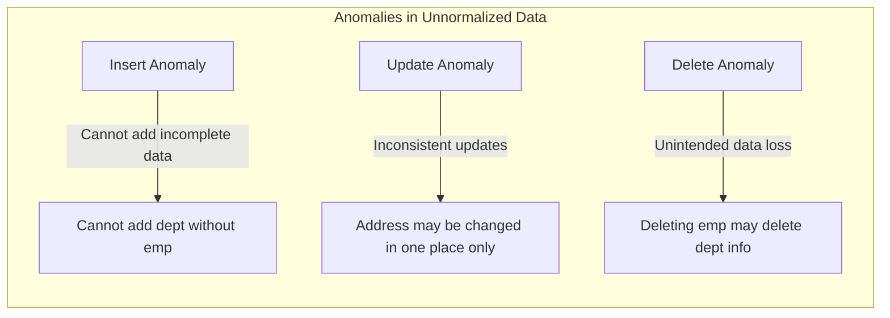
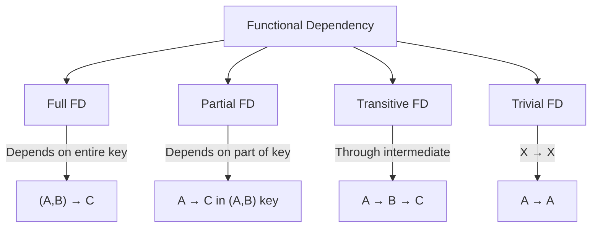

# Sessions 3-4: Normalization

## Data Redundancy

**Data Redundancy** is the unnecessary duplication of data in a database.

| Problem | Description | Example |
|---------|-------------|---------|
| **Storage Waste** | Same data stored multiple times | Address repeated for each order |
| **Update Anomaly** | Updates may miss some copies | Address change needs multiple updates |
| **Insert Anomaly** | Cannot insert without related data | Cannot add department without employee |
| **Delete Anomaly** | Deleting may lose other data | Deleting last employee loses department info |

## Data Anomalies



## Functional Dependency

A **Functional Dependency (FD)** exists when the value of one attribute (or set of attributes) uniquely determines the value of another attribute.

**Notation**: X → Y (X determines Y, or Y is functionally dependent on X)

| Term | Description | Example |
|------|-------------|---------|
| **Determinant** | Attribute(s) on left side | emp_id → emp_name |
| **Dependent** | Attribute(s) on right side | emp_id determines emp_name |
| **Full FD** | Dependent on entire key | (A, B) → C |
| **Partial FD** | Dependent on part of key | (A, B) → C where A → C |
| **Transitive FD** | X → Y and Y → Z implies X → Z | emp → dept, dept → loc ⇒ emp → loc |

### Types of Functional Dependencies



---

## Normalization

**Normalization** is the process of organizing data to minimize redundancy and eliminate anomalies.

### Need for Normalization

1. Eliminate data redundancy
2. Prevent update/insert/delete anomalies
3. Ensure data integrity
4. Simplify queries
5. Better database design

### Normal Forms Overview


---

## First Normal Form (1NF)

### Rules for 1NF
1. **No repeating groups** or arrays
2. Each cell contains **atomic** (indivisible) values
3. Each column has a **unique name**
4. **Order** of rows does not matter
5. Each row is **unique** (has a primary key)

### Example: Before 1NF

| Student_ID | Name | Phone_Numbers |
|------------|------|---------------|
| 1 | John | 123, 456, 789 |
| 2 | Jane | 111, 222 |

### After 1NF (Atomic values)

| Student_ID | Name | Phone_Number |
|------------|------|--------------|
| 1 | John | 123 |
| 1 | John | 456 |
| 1 | John | 789 |
| 2 | Jane | 111 |
| 2 | Jane | 222 |

> **Rule to Remember**: 1NF = Atomic values, no repeating groups

---

## Second Normal Form (2NF)

### Rules for 2NF
1. Must be in **1NF**
2. No **partial dependencies** - all non-key attributes must depend on the **entire** primary key

> **Applies only when**: Composite (multi-column) primary key exists

### Example: Before 2NF

| **Student_ID** | **Course_ID** | Student_Name | Course_Name | Grade |
|----------------|---------------|--------------|-------------|-------|
| 1 | C1 | John | Math | A |
| 1 | C2 | John | Science | B |
| 2 | C1 | Jane | Math | A |

**Problem**: Student_Name depends only on Student_ID (partial dependency)

### After 2NF

**Students Table:**

| **Student_ID** | Student_Name |
|----------------|--------------|
| 1 | John |
| 2 | Jane |

**Courses Table:**

| **Course_ID** | Course_Name |
|---------------|-------------|
| C1 | Math |
| C2 | Science |

**Enrollments Table:**

| **Student_ID** | **Course_ID** | Grade |
|----------------|---------------|-------|
| 1 | C1 | A |
| 1 | C2 | B |
| 2 | C1 | A |

> **Rule to Remember**: 2NF = 1NF + No partial dependencies

---

## Third Normal Form (3NF)

### Rules for 3NF
1. Must be in **2NF**
2. No **transitive dependencies** - non-key attributes must not depend on other non-key attributes

### Example: Before 3NF

| **Emp_ID** | Emp_Name | Dept_ID | Dept_Name | Dept_Location |
|------------|----------|---------|-----------|---------------|
| 1 | John | D1 | Sales | NYC |
| 2 | Jane | D1 | Sales | NYC |
| 3 | Bob | D2 | IT | LA |

**Problem**: Dept_Name and Dept_Location depend on Dept_ID, not on Emp_ID (transitive)

### After 3NF

**Employees Table:**

| **Emp_ID** | Emp_Name | Dept_ID |
|------------|----------|---------|
| 1 | John | D1 |
| 2 | Jane | D1 |
| 3 | Bob | D2 |

**Departments Table:**

| **Dept_ID** | Dept_Name | Dept_Location |
|-------------|-----------|---------------|
| D1 | Sales | NYC |
| D2 | IT | LA |

> **Rule to Remember**: 3NF = 2NF + No transitive dependencies

---

## Boyce-Codd Normal Form (BCNF)

### Rules for BCNF
1. Must be in **3NF**
2. For every functional dependency X → Y, X must be a **superkey**
3. Stricter than 3NF

### When 3NF ≠ BCNF?

When a non-key attribute determines part of the primary key.

| 3NF | BCNF |
|-----|------|
| Every non-key attribute must depend on the key | Every determinant must be a candidate key |
| Allows some anomalies | Eliminates all redundancy based on FDs |

> **Rule to Remember**: BCNF = 3NF + Every determinant is a superkey

---

## Fourth Normal Form (4NF)

### Rules for 4NF
1. Must be in **BCNF**
2. No **multi-valued dependencies** (MVDs)

2. No **multi-valued dependencies** (MVDs)

### Multi-valued Dependency (MVD)

A **Multi-valued Dependency (MVD)** occurs when one attribute uniquely determines a **set** of values for another attribute, independently of other attributes in the table.

**Notation**: `X ↠ Y` (read as "X multidetermines Y")

**Formal Rule**: For a table with attributes (A, B, C), if for a single value of A, there are multiple values of B, and this set of values for B is independent of C, then `A ↠ B`.

> **Key Concept**: 4NF is about removing redundancy caused by two or more independent multi-valued facts about the same entity.

### Example

A student can have multiple hobbies AND multiple phones (independent of each other).

| Student | Hobby | Phone |
|---------|-------|-------|
| John | Music | 123 |
| John | Sports | 456 |

**Solution**: Separate tables for hobbies and phones.

---

## Fifth Normal Form (5NF)

### Rules for 5NF
1. Must be in **4NF**
2. No **join dependencies**
3. Cannot decompose further without losing information

2. No **join dependencies**
3. Cannot decompose further without losing information

### Join Dependency (JD)

A **Join Dependency (JD)** exists if a table can be decomposed into smaller tables, which can then be rejoined (using Natural Join) to reconstruct the original table exactly, without generating spurious (fake) rows.

**Notation**: `* (R1, R2, ... Rn)`

> **Key Concept**: 5NF deals with cases where information can be reconstructed from smaller pieces but isn't strictly an MVD. It ensures that a table is free of redundancy that can be removed by decomposing it into *any* number of smaller tables.

> **5NF** is also called **Project-Join Normal Form (PJNF)**

---

## Summary Table: Normal Forms

| Normal Form | Requirement | Eliminates |
|-------------|-------------|------------|
| **1NF** | Atomic values, no repeating groups | Multi-valued columns |
| **2NF** | 1NF + No partial dependencies | Partial dependencies |
| **3NF** | 2NF + No transitive dependencies | Transitive dependencies |
| **BCNF** | 3NF + Every determinant is superkey | Anomalies from non-key determinants |
| **4NF** | BCNF + No multi-valued dependencies | MVD redundancy |
| **5NF** | 4NF + No join dependencies | Remaining join anomalies |

---

## DML Commands (Data Manipulation Language)

### INSERT

```sql
-- Insert single row
INSERT INTO employees (emp_id, name, salary) 
VALUES (1, 'John', 50000);

-- Insert multiple rows
INSERT INTO employees VALUES 
(2, 'Jane', 60000),
(3, 'Bob', 55000);

-- Insert from another table
INSERT INTO emp_backup SELECT * FROM employees;
```

### UPDATE

```sql
-- Update specific rows
UPDATE employees SET salary = 55000 WHERE emp_id = 1;

-- Update multiple columns
UPDATE employees SET salary = 60000, dept = 'Sales' WHERE emp_id = 2;

-- Update with subquery
UPDATE employees SET salary = (SELECT AVG(salary) FROM employees);
```

### DELETE

```sql
-- Delete specific rows
DELETE FROM employees WHERE emp_id = 1;

-- Delete all rows (DML - can rollback)
DELETE FROM employees;
```

---

## Key MCQ Points to Remember

1. **Data Redundancy** = Storing same data multiple times
2. **Anomalies**: Insert, Update, Delete
3. **Functional Dependency**: X → Y (X determines Y)
4. **Partial Dependency**: Non-key depends on PART of composite key
5. **Transitive Dependency**: A → B → C (A determines C through B)
6. **1NF**: Atomic values, no repeating groups
7. **2NF**: 1NF + No partial dependencies (for composite keys)
8. **3NF**: 2NF + No transitive dependencies
9. **BCNF**: 3NF + Every determinant is a superkey
10. **4NF**: BCNF + No multi-valued dependencies
11. **5NF**: 4NF + No join dependencies (PJNF)
12. **DML commands**: INSERT, UPDATE, DELETE
13. **DML requires COMMIT** to make permanent
14. **DELETE** is DML (can rollback); **TRUNCATE** is DDL (cannot rollback)
15. Most databases are normalized up to **3NF** or **BCNF**
