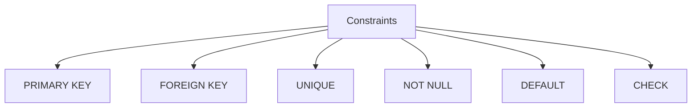

# Session 5: MySQL Data Types, Constraints, and Aggregate Functions

## MySQL Data Types

### Numeric Data Types

| Data Type | Description | Range | Storage |
|-----------|-------------|-------|---------|
| **TINYINT** | Very small integer | -128 to 127 (signed) | 1 byte |
| **SMALLINT** | Small integer | -32,768 to 32,767 | 2 bytes |
| **MEDIUMINT** | Medium integer | -8,388,608 to 8,388,607 | 3 bytes |
| **INT/INTEGER** | Standard integer | -2.1B to 2.1B | 4 bytes |
| **BIGINT** | Large integer | ±9.2 quintillion | 8 bytes |
| **FLOAT** | Single precision | Approximate | 4 bytes |
| **DOUBLE** | Double precision | Approximate | 8 bytes |
| **DECIMAL(p,s)** | Exact numeric | User-defined | Varies |
| **BIT(n)** | Bit values | 1 to 64 bits | Variable |
| **BOOLEAN** | True/False | 0 or 1 | 1 byte |

### String Data Types

| Data Type | Description | Max Length |
|-----------|-------------|------------|
| **CHAR(n)** | Fixed-length string | 255 characters |
| **VARCHAR(n)** | Variable-length string | 65,535 characters |
| **TEXT** | Large text | 65,535 bytes |
| **MEDIUMTEXT** | Medium text | 16 MB |
| **LONGTEXT** | Very large text | 4 GB |
| **BLOB** | Binary large object | 65,535 bytes |
| **ENUM** | One value from list | 65,535 values |
| **SET** | Multiple values from list | 64 values |

### CHAR vs VARCHAR

| Feature | CHAR(n) | VARCHAR(n) |
|---------|---------|------------|
| **Storage** | Always n bytes | Length + 1-2 bytes |
| **Padding** | Right-padded with spaces | No padding |
| **Speed** | Faster (fixed length) | Slightly slower |
| **Use Case** | Fixed-length data (codes) | Variable-length data (names) |

### Date and Time Data Types

| Data Type | Format | Range |
|-----------|--------|-------|
| **DATE** | YYYY-MM-DD | 1000-01-01 to 9999-12-31 |
| **TIME** | HH:MM:SS | -838:59:59 to 838:59:59 |
| **DATETIME** | YYYY-MM-DD HH:MM:SS | 1000-01-01 to 9999-12-31 |
| **TIMESTAMP** | YYYY-MM-DD HH:MM:SS | 1970-01-01 to 2038-01-19 |
| **YEAR** | YYYY | 1901 to 2155 |

---

## Database Constraints

Constraints are **rules** enforced on data columns to ensure accuracy and integrity.



### Constraint Types Summary

| Constraint | Description | Duplicates | NULLs | Auto Index |
|------------|-------------|------------|-------|------------|
| **PRIMARY KEY** | Unique identifier | ❌ No | ❌ No | ✅ Yes |
| **UNIQUE** | Unique values only | ❌ No | ✅ Yes (multiple) | ✅ Yes |
| **NOT NULL** | Cannot be NULL | ✅ Yes | ❌ No | ❌ No |
| **FOREIGN KEY** | References another table | ✅ Yes | ✅ Yes | ❌ No* |
| **DEFAULT** | Default value if not specified | ✅ Yes | ✅ Yes | ❌ No |
| **CHECK** | Validates condition | ✅ Yes | ✅ Yes | ❌ No |

### PRIMARY KEY

- Uniquely identifies each record
- **Cannot be NULL**
- **Only ONE per table**
- Automatically creates a unique index
- Can be composite (multiple columns)

```sql
CREATE TABLE employees (
    emp_id INT PRIMARY KEY,
    name VARCHAR(50)
);

-- Composite Primary Key
CREATE TABLE enrollments (
    student_id INT,
    course_id INT,
    PRIMARY KEY (student_id, course_id)
);
```

### FOREIGN KEY

- References PRIMARY KEY of another table
- Maintains **referential integrity**
- Can have duplicates and NULLs
- Parent must have the referenced value

```sql
CREATE TABLE orders (
    order_id INT PRIMARY KEY,
    customer_id INT,
    FOREIGN KEY (customer_id) REFERENCES customers(id)
);
```

#### ON DELETE / ON UPDATE Actions

| Action | Effect |
|--------|--------|
| **CASCADE** | Delete/Update child rows automatically |
| **SET NULL** | Set FK to NULL |
| **SET DEFAULT** | Set FK to default value |
| **RESTRICT** | Prevent parent delete/update |
| **NO ACTION** | Same as RESTRICT (default) |

### UNIQUE

- Ensures all values in column are unique
- Allows **one NULL** (or multiple in MySQL)
- Multiple UNIQUE constraints per table allowed

```sql
CREATE TABLE users (
    id INT PRIMARY KEY,
    email VARCHAR(100) UNIQUE,
    phone VARCHAR(15) UNIQUE
);
```

### NOT NULL

- Column cannot contain NULL values
- Must always have a value

```sql
CREATE TABLE products (
    product_id INT PRIMARY KEY,
    name VARCHAR(100) NOT NULL,
    price DECIMAL(10,2) NOT NULL
);
```

### DEFAULT

- Provides default value if none specified

```sql
CREATE TABLE orders (
    order_id INT PRIMARY KEY,
    status VARCHAR(20) DEFAULT 'Pending',
    created_at TIMESTAMP DEFAULT CURRENT_TIMESTAMP
);
```

### CHECK

- Validates data against a condition
- Fully supported in MySQL 8.0+

```sql
CREATE TABLE employees (
    emp_id INT PRIMARY KEY,
    age INT CHECK (age >= 18),
    salary DECIMAL(10,2) CHECK (salary > 0)
);
```

---

## Aggregate Functions

Aggregate functions operate on **multiple rows** and return a **single value**.

| Function | Description | NULL Handling |
|----------|-------------|---------------|
| **COUNT()** | Number of rows | Ignores NULL (except COUNT(*)) |
| **SUM()** | Total of values | Ignores NULL |
| **AVG()** | Average of values | Ignores NULL |
| **MAX()** | Maximum value | Ignores NULL |
| **MIN()** | Minimum value | Ignores NULL |

### COUNT Variations

```sql
SELECT COUNT(*) FROM emp;      -- All rows including NULL
SELECT COUNT(salary) FROM emp; -- Non-NULL salary values only
SELECT COUNT(DISTINCT dept) FROM emp; -- Unique dept values
```

---

## GROUP BY Clause

Groups rows with same values for aggregate calculations.

```sql
-- Count employees per department
SELECT dept_id, COUNT(*) AS emp_count
FROM employees
GROUP BY dept_id;

-- Total salary per department
SELECT dept_id, SUM(salary) AS total_salary
FROM employees
GROUP BY dept_id;
```

### Rules for GROUP BY

1. All non-aggregate columns in SELECT must be in GROUP BY
2. GROUP BY can include columns not in SELECT
3. Aggregate functions work on each group

## HAVING Clause

Filters groups (not rows) after GROUP BY.

| Clause | Filters | Timing |
|--------|---------|--------|
| **WHERE** | Rows | Before grouping |
| **HAVING** | Groups | After grouping |

```sql
-- Departments with more than 5 employees
SELECT dept_id, COUNT(*) AS emp_count
FROM employees
GROUP BY dept_id
HAVING COUNT(*) > 5;

-- Departments with average salary > 50000
SELECT dept_id, AVG(salary) 
FROM employees
GROUP BY dept_id
HAVING AVG(salary) > 50000;
```

---

## LIKE Operator

Pattern matching for strings.

| Pattern | Meaning |
|---------|---------|
| `%` | Zero or more characters |
| `_` | Exactly one character |

```sql
SELECT * FROM emp WHERE name LIKE 'J%';    -- Starts with J
SELECT * FROM emp WHERE name LIKE '%son';  -- Ends with son
SELECT * FROM emp WHERE name LIKE '%a%';   -- Contains a
SELECT * FROM emp WHERE name LIKE 'J___';  -- J + 3 characters
```

## DISTINCT

Removes duplicate values from result.

```sql
SELECT DISTINCT dept FROM employees;
SELECT DISTINCT city, state FROM customers;
SELECT COUNT(DISTINCT dept) FROM employees;
```

## ORDER BY

Sorts result set.

```sql
SELECT * FROM emp ORDER BY salary;        -- Ascending (default)
SELECT * FROM emp ORDER BY salary DESC;   -- Descending
SELECT * FROM emp ORDER BY dept ASC, salary DESC;  -- Multiple columns
SELECT * FROM emp ORDER BY 2;             -- By column position
```

## BETWEEN ... AND

Range filter (inclusive).

```sql
SELECT * FROM emp WHERE salary BETWEEN 30000 AND 50000;
SELECT * FROM orders WHERE order_date BETWEEN '2024-01-01' AND '2024-12-31';
```

## IS NULL / IS NOT NULL

Comparing NULL values.

```sql
SELECT * FROM emp WHERE commission IS NULL;
SELECT * FROM emp WHERE manager_id IS NOT NULL;

-- Wrong way (doesn't work):
-- SELECT * FROM emp WHERE commission = NULL;
```

## IN / NOT IN

Match against a list of values.

```sql
SELECT * FROM emp WHERE dept_id IN (1, 2, 3);
SELECT * FROM emp WHERE city IN ('Delhi', 'Mumbai', 'Pune');
SELECT * FROM emp WHERE dept_id NOT IN (1, 2);
```

---

## Key MCQ Points to Remember

1. **INT** = 4 bytes, **BIGINT** = 8 bytes
2. **CHAR** = fixed length, **VARCHAR** = variable length
3. **DECIMAL** = exact numeric (for currency)
4. **TIMESTAMP** max = 2038-01-19 (Y2038 problem)
5. **PRIMARY KEY** = NOT NULL + UNIQUE (only one per table)
6. **UNIQUE** allows NULL; **PRIMARY KEY** does not
7. **FOREIGN KEY** enforces referential integrity
8. **CASCADE** = auto delete/update child rows
9. **COUNT(*)** includes NULLs; **COUNT(column)** excludes NULLs
10. **WHERE** filters rows; **HAVING** filters groups
11. **GROUP BY** required when mixing aggregate and non-aggregate
12. **%** = any characters; **_** = exactly one character
13. **IS NULL** to check NULL (not `= NULL`)
14. **BETWEEN** is inclusive of both endpoints
15. **ORDER BY** default is ASC (ascending)
