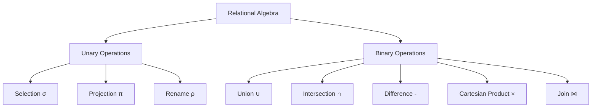
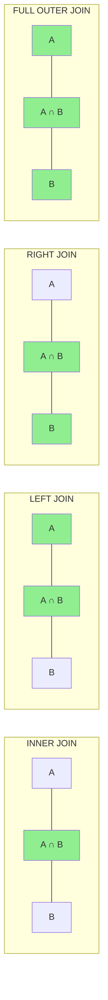

# Session 6: Relational Algebra, Joins, and Sequences

## Relational Algebra Operations

**Relational Algebra** is a procedural query language that works on relations (tables) and returns relations.



### Unary Operations

| Operation | Symbol | Description | SQL Equivalent |
|-----------|--------|-------------|----------------|
| **Selection** | σ | Filter rows | WHERE clause |
| **Projection** | π | Select columns | SELECT columns |
| **Rename** | ρ | Rename relation/attributes | AS alias |

### Binary Operations

| Operation | Symbol | Description | SQL Equivalent |
|-----------|--------|-------------|----------------|
| **Union** | ∪ | Combine tuples from both | UNION |
| **Intersection** | ∩ | Common tuples | INTERSECT |
| **Difference** | - | Tuples in first but not second | EXCEPT/MINUS |
| **Cartesian Product** | × | All combinations | CROSS JOIN |
| **Join** | ⋈ | Match tuples on condition | JOIN |

> **Note**: `INTERSECT` and `EXCEPT` were introduced in **MySQL 8.0.31**. In older versions, you must use `JOIN` or `NOT IN` workarounds.

### Set Operations Requirements

For UNION, INTERSECT, MINUS:
1. Same number of columns
2. Compatible data types
3. Column names from first query

```sql
-- Union (removes duplicates)
SELECT city FROM customers
UNION
SELECT city FROM suppliers;

-- Union All (keeps duplicates)
SELECT city FROM customers
UNION ALL
SELECT city FROM suppliers;

-- Intersect
SELECT city FROM customers
INTERSECT
SELECT city FROM suppliers;

-- Minus/Except
SELECT city FROM customers
EXCEPT
SELECT city FROM suppliers;
```

---

## Types of Joins

Joins combine rows from two or more tables based on related columns.

### Join Types Visual



### Join Types Comparison

| Join Type | Returns | NULL for Missing |
|-----------|---------|------------------|
| **INNER JOIN** | Only matching rows | No NULLs |
| **LEFT (OUTER) JOIN** | All left + matching right | Right columns NULL |
| **RIGHT (OUTER) JOIN** | All right + matching left | Left columns NULL |
| **FULL (OUTER) JOIN** | All rows from both | Both sides may have NULL |
| **CROSS JOIN** | Cartesian product | No NULLs |
| **SELF JOIN** | Table joined with itself | Depends on type |
| **NATURAL JOIN** | Auto-match on common columns | Depends on type |

### Join Syntax

#### INNER JOIN
Returns only matching rows.

```sql
-- Old Style (Comma Join)
SELECT e.name, d.dept_name
FROM employees e, departments d
WHERE e.dept_id = d.dept_id;

-- SQL Standard (ANSI)
SELECT e.name, d.dept_name
FROM employees e
INNER JOIN departments d ON e.dept_id = d.dept_id;
```

#### LEFT OUTER JOIN
Returns all from left table + matching from right.

```sql
SELECT e.name, d.dept_name
FROM employees e
LEFT JOIN departments d ON e.dept_id = d.dept_id;
-- Employees without department will have NULL dept_name
```

#### RIGHT OUTER JOIN
Returns all from right table + matching from left.

```sql
SELECT e.name, d.dept_name
FROM employees e
RIGHT JOIN departments d ON e.dept_id = d.dept_id;
-- Departments without employees will have NULL name
```

#### FULL OUTER JOIN
Returns all rows from both tables.

```sql
-- MySQL doesn't support FULL OUTER JOIN directly
-- Use UNION of LEFT and RIGHT joins:
SELECT e.name, d.dept_name
FROM employees e
LEFT JOIN departments d ON e.dept_id = d.dept_id
UNION
SELECT e.name, d.dept_name
FROM employees e
RIGHT JOIN departments d ON e.dept_id = d.dept_id;
```

#### CROSS JOIN
Cartesian product - every row paired with every other.

```sql
SELECT e.name, d.dept_name
FROM employees e
CROSS JOIN departments d;
-- If emp has 10 rows and dept has 5, result has 50 rows
```

#### NATURAL JOIN
Automatically joins on columns with same name.

```sql
SELECT *
FROM employees
NATURAL JOIN departments;
-- Joins on columns with matching names (like dept_id)
```

#### SELF JOIN
Table joined with itself.

```sql
-- Find employee and their manager
SELECT e.name AS employee, m.name AS manager
FROM employees e
JOIN employees m ON e.manager_id = m.emp_id;
```

### Join Best Practices

1. **Driving Table**: Smaller table should be driving table (left side) for optimization
2. **Use Aliases**: Short table aliases improve readability
3. **Index Join Columns**: Create indexes on columns used in JOIN conditions
4. **Prefer ANSI Syntax**: More readable and portable

---

## Copying Table Structure/Data

### Copy Structure + Data

```sql
CREATE TABLE emp_backup
AS SELECT * FROM employees;
```

### Copy Structure Only

```sql
CREATE TABLE emp_empty
AS SELECT * FROM employees WHERE 1=0;
-- False condition returns no rows
```

### Copy Data to Existing Table

```sql
INSERT INTO emp_backup
SELECT * FROM employees;

-- With conditions
INSERT INTO emp_archive
SELECT * FROM employees WHERE hire_date < '2020-01-01';
```

---

## Sequences (AUTO_INCREMENT)

In MySQL, sequences are implemented using **AUTO_INCREMENT**.

```sql
CREATE TABLE orders (
    order_id INT AUTO_INCREMENT PRIMARY KEY,
    product_name VARCHAR(100),
    order_date DATE
);

-- Insert without specifying order_id
INSERT INTO orders (product_name, order_date) 
VALUES ('Widget', CURDATE());
-- order_id will be 1, 2, 3, etc.
```

### AUTO_INCREMENT Properties

| Property | Description |
|----------|-------------|
| Starts at | 1 (default) |
| Increment by | 1 |
| One per table | Only one AUTO_INCREMENT column |
| Must be indexed | Usually PRIMARY KEY |
| Gap handling | Gaps can occur (after rollback/delete) |

### Changing AUTO_INCREMENT Start

```sql
-- Set starting value
ALTER TABLE orders AUTO_INCREMENT = 1000;

-- Check current value
SELECT AUTO_INCREMENT FROM information_schema.TABLES
WHERE TABLE_NAME = 'orders';
```

---

## Key MCQ Points to Remember

1. **σ (Selection)** = WHERE clause (filter rows)
2. **π (Projection)** = SELECT columns
3. **× (Cartesian Product)** = CROSS JOIN
4. **∪ (Union)** requires same structure
5. **UNION** removes duplicates; **UNION ALL** keeps them
6. **INNER JOIN** = only matching rows
7. **LEFT JOIN** = all left + matching right (NULLs for missing)
8. **RIGHT JOIN** = all right + matching left
9. **FULL OUTER JOIN** not directly supported in MySQL
10. **CROSS JOIN** = m × n rows (Cartesian product)
11. **NATURAL JOIN** auto-matches on common column names
12. **SELF JOIN** = join table to itself
13. **AUTO_INCREMENT** = MySQL's sequence mechanism
14. **WHERE 1=0** copies structure without data
15. **Driving table** = smaller table for faster joins
