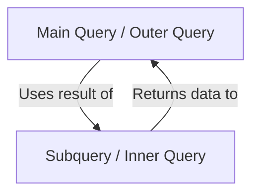
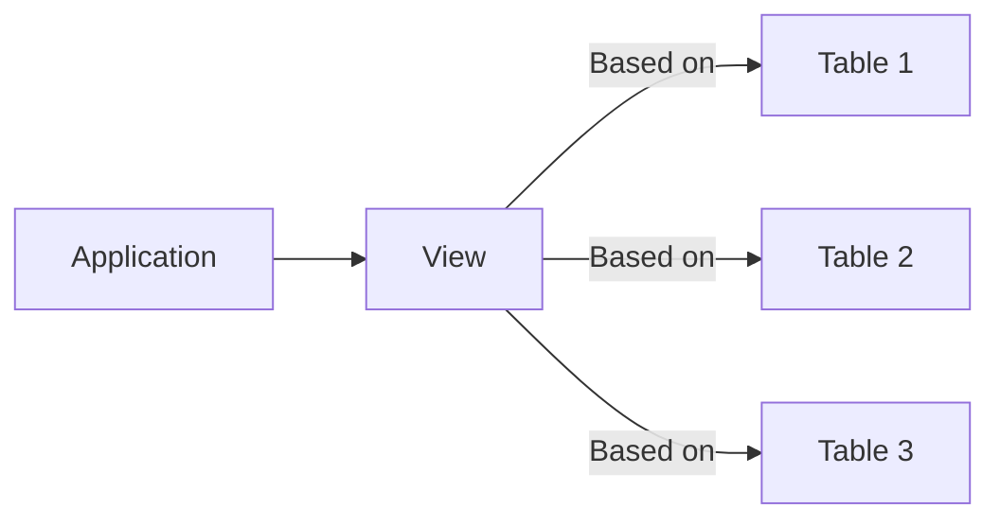

# Session 7: Subqueries, TCL, DCL, and Views

## Subqueries

A **subquery** (nested query) is a query within another query.



### Types of Subqueries

| Type | Description | Returns | Example Use |
|------|-------------|---------|-------------|
| **Single-row** | Returns one row | One value | WHERE salary = (SELECT MAX(salary)...) |
| **Multi-row** | Returns multiple rows | List of values | WHERE dept_id IN (SELECT...) |
| **Correlated** | References outer query | Depends on outer | WHERE EXISTS (SELECT...) |
| **Scalar** | Returns single value | One cell | SELECT (SELECT COUNT(*)...) |
| **Inline View** | In FROM clause | Virtual table | FROM (SELECT...) AS t |

### Subquery Operators

| Operator | Use With | Description |
|----------|----------|-------------|
| **=, <, >, <=, >=, <>** | Single-row | Compare with single value |
| **IN** | Multi-row | Match any value in list |
| **NOT IN** | Multi-row | Not match any value |
| **ANY/SOME** | Multi-row | Compare with any value (OR logic) |
| **ALL** | Multi-row | Compare with all values (AND logic) |
| **EXISTS** | Correlated | True if subquery returns rows |
| **NOT EXISTS** | Correlated | True if subquery returns no rows |

### Correlated Subquery

A subquery that references columns from the outer query.

```sql
-- Find employees earning more than their department average
SELECT e.name, e.salary
FROM employees e
WHERE e.salary > (
    SELECT AVG(salary)
    FROM employees
    WHERE dept_id = e.dept_id  -- References outer query
);
```

### EXISTS / NOT EXISTS

```sql
-- Departments with at least one employee
SELECT dept_name FROM departments d
WHERE EXISTS (
    SELECT 1 FROM employees e
    WHERE e.dept_id = d.dept_id
);

-- Departments with no employees
SELECT dept_name FROM departments d
WHERE NOT EXISTS (
    SELECT 1 FROM employees e
    WHERE e.dept_id = d.dept_id
);
```

---

## TCL Commands (Transaction Control Language)

### What is a Transaction?

A **transaction** is a sequence of operations performed as a single logical unit.

| Property | Description |
|----------|-------------|
| **Atomicity** | All or nothing |
| **Consistency** | Valid state before and after |
| **Isolation** | Transactions don't interfere |
| **Durability** | Committed changes persist |

### TCL Commands

| Command | Description |
|---------|-------------|
| **COMMIT** | Save all changes permanently |
| **ROLLBACK** | Undo all changes since last COMMIT |
| **SAVEPOINT** | Create a checkpoint within transaction |
| **RELEASE SAVEPOINT** | Remove a savepoint |
| **ROLLBACK TO SAVEPOINT** | Undo to a specific savepoint |

```sql
START TRANSACTION;

INSERT INTO accounts VALUES (1, 1000);
SAVEPOINT sp1;

UPDATE accounts SET balance = balance - 100 WHERE id = 1;
SAVEPOINT sp2;

UPDATE accounts SET balance = balance + 100 WHERE id = 2;

-- Something went wrong with last update
ROLLBACK TO sp2;

-- Or commit all successful changes
COMMIT;
```

---

## DCL Commands (Data Control Language)

### GRANT

Gives privileges to users.

```sql
-- Grant specific privileges
GRANT SELECT, INSERT ON database.table TO 'user'@'host';

-- Grant all privileges
GRANT ALL PRIVILEGES ON database.* TO 'user'@'host';

-- Grant with ability to grant others
GRANT SELECT ON database.table TO 'user'@'host' WITH GRANT OPTION;
```

### REVOKE

Removes privileges from users.

```sql
REVOKE SELECT ON database.table FROM 'user'@'host';
REVOKE ALL PRIVILEGES ON database.* FROM 'user'@'host';
```

### Privilege Types

| Privilege | Description |
|-----------|-------------|
| SELECT | Read data |
| INSERT | Add new rows |
| UPDATE | Modify existing rows |
| DELETE | Remove rows |
| CREATE | Create tables/databases |
| DROP | Delete tables/databases |
| INDEX | Create/drop indexes |
| ALTER | Modify table structure |
| ALL PRIVILEGES | All of the above |

---

## Views

A **View** is a virtual table based on a SELECT query.



### View Characteristics

| Feature | Description |
|---------|-------------|
| **Storage** | Only definition stored, not data |
| **Real-time** | Shows current data from base tables |
| **Security** | Restricts access to specific columns/rows |
| **Simplicity** | Hides complex queries |
| **Permanence** | Exists until dropped |

### Creating Views

```sql
-- Simple view
CREATE VIEW emp_view AS
SELECT emp_id, name, dept_id FROM employees;

-- View with condition
CREATE VIEW active_employees AS
SELECT * FROM employees WHERE status = 'Active';

-- View with join
CREATE VIEW emp_dept_view AS
SELECT e.name, d.dept_name
FROM employees e
JOIN departments d ON e.dept_id = d.dept_id;

-- Replace existing view
CREATE OR REPLACE VIEW emp_view AS
SELECT emp_id, name, salary FROM employees;
```

### Types of Views

| Type | Description | DML Allowed |
|------|-------------|-------------|
| **Simple View** | Based on single table, no functions | Yes |
| **Complex View** | Joins, aggregates, GROUP BY | Usually No |
| **Updatable View** | Can INSERT/UPDATE/DELETE | Yes |
| **Read-only View** | Cannot modify | No |

### When Views are NOT Updatable

- Contains aggregate functions (SUM, COUNT, etc.)
- Contains DISTINCT
- Contains GROUP BY or HAVING
- Contains UNION
- Contains subquery in SELECT
- Contains joins (in some cases)

### WITH CHECK OPTION

Ensures INSERTs/UPDATEs through view satisfy view's WHERE clause.

```sql
CREATE VIEW high_salary_emp AS
SELECT * FROM employees WHERE salary > 50000
WITH CHECK OPTION;

-- This will fail:
INSERT INTO high_salary_emp VALUES (1, 'John', 30000);
-- Violates salary > 50000 condition
```

---

## Key MCQ Points to Remember

1. **Subquery** executes first (inner to outer)
2. **IN** = any value in list; **ALL** = every value must match
3. **Correlated subquery** references outer query columns
4. **EXISTS** is faster than IN for large datasets
5. **COMMIT** makes changes permanent; **ROLLBACK** undoes changes
6. **SAVEPOINT** creates checkpoint within transaction
7. **GRANT** gives privileges; **REVOKE** removes them
8. **WITH GRANT OPTION** = can grant privileges to others
9. **View** = stored query, not stored data
10. **Simple views** are updatable; **complex views** usually aren't
11. **WITH CHECK OPTION** validates data through view's WHERE
12. **CREATE OR REPLACE VIEW** modifies existing view
13. **TCL commands**: COMMIT, ROLLBACK, SAVEPOINT
14. **DCL commands**: GRANT, REVOKE
15. Views provide **security** by hiding columns/rows
