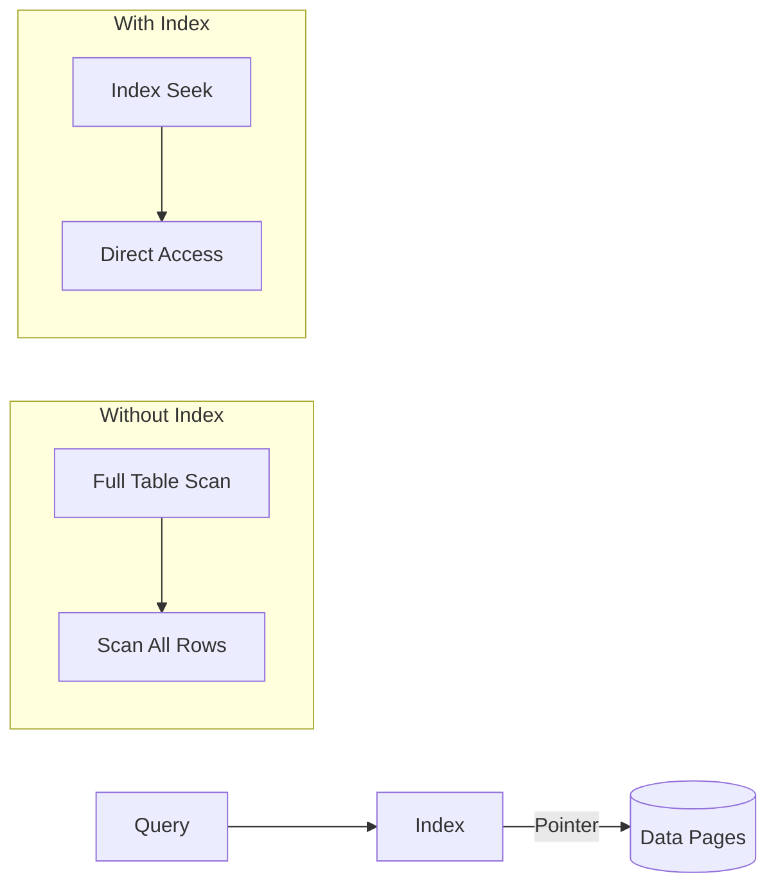
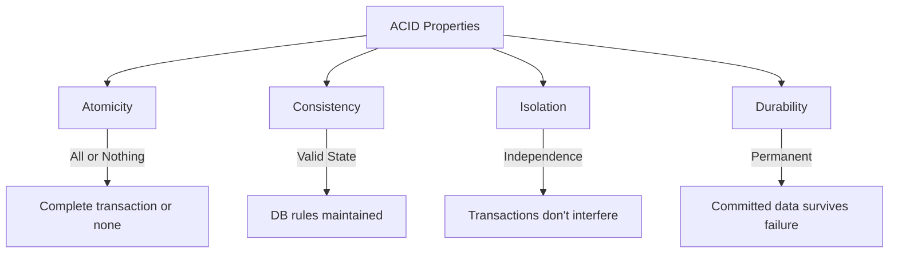
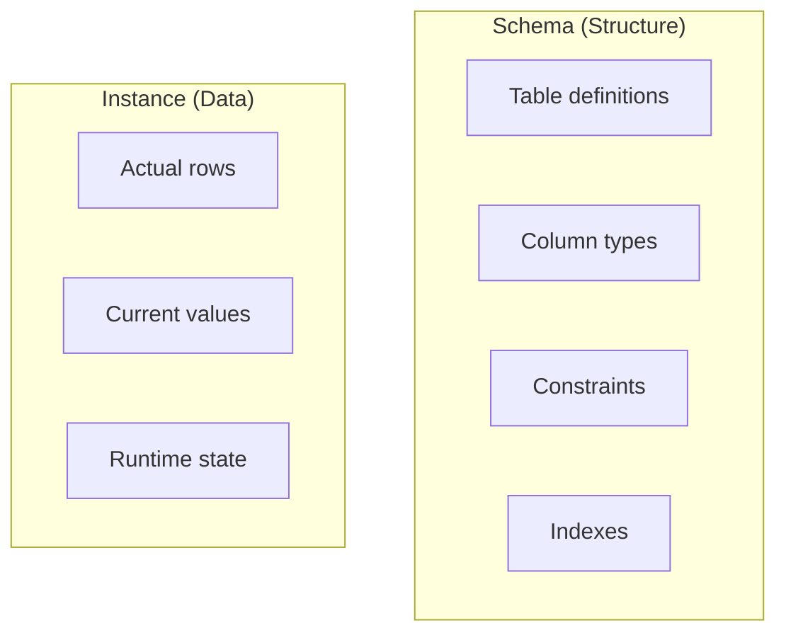

# Session 8: Indexes, ACID Properties, and Storage Engines

## Indexes

**Indexes** are database structures that improve the speed of data retrieval operations.



### Benefits of Indexes

| Benefit | Description |
|---------|-------------|
| **Faster queries** | Reduces disk I/O for SELECT |
| **Quick sorting** | ORDER BY uses index order |
| **Efficient joins** | Join columns benefit from indexes |
| **Unique enforcement** | UNIQUE index prevents duplicates |

### When to Create Indexes

| Create Index When | Avoid Index When |
|-------------------|------------------|
| Column used in WHERE | Small tables |
| Column used in JOIN | Frequently updated columns |
| Column used in ORDER BY | Columns with few unique values |
| Primary/Foreign keys | Tables with heavy INSERT/UPDATE |
| High selectivity columns | Text/BLOB columns |

### Types of Indexes

| Type | Description | Use Case |
|------|-------------|----------|
| **B-Tree** | Balanced tree, default | General purpose |
| **Hash** | Hash table lookup | Equality comparisons only |
| **Full-Text** | Text searching | LIKE '%word%' searches |
| **Spatial** | Geometric data | GIS applications |
| **Clustered** | Data stored in index order | Primary key (InnoDB) |
| **Non-Clustered** | Separate from data | Secondary indexes |

### Index Commands

```sql
-- Create index
CREATE INDEX idx_emp_name ON employees(name);

-- Create unique index
CREATE UNIQUE INDEX idx_emp_email ON employees(email);

-- Create composite index
CREATE INDEX idx_emp_dept_name ON employees(dept_id, name);

-- Drop index
DROP INDEX idx_emp_name ON employees;

-- Show indexes
SHOW INDEX FROM employees;
```

### Clustered vs Non-Clustered

| Feature | Clustered | Non-Clustered |
|---------|-----------|---------------|
| **Data order** | Physically sorted | Logical order via pointers |
| **Per table** | One only | Multiple allowed |
| **Speed** | Faster for range queries | Slightly slower |
| **Storage** | Data in index | Separate structure |
| **MySQL default** | PRIMARY KEY (InnoDB) | Other indexes |

---

## Temporary Tables

Tables that exist only for the session.

```sql
-- Create temporary table
CREATE TEMPORARY TABLE temp_results (
    id INT,
    name VARCHAR(50)
);

-- Automatically dropped when session ends

-- Can also use:
CREATE TEMPORARY TABLE temp_emp AS
SELECT * FROM employees WHERE dept_id = 1;
```

### Temporary Table Characteristics

| Feature | Description |
|---------|-------------|
| **Visibility** | Only to creating session |
| **Lifetime** | Until session ends or explicit DROP |
| **Naming** | Can have same name as permanent table |
| **Storage** | Memory or disk (based on size) |

---

## ACID Properties

The four properties that guarantee reliable database transactions.



### ACID Detailed

| Property | Description | Example |
|----------|-------------|---------|
| **Atomicity** | Transaction is indivisible - all or nothing | Bank transfer: debit AND credit both succeed or fail |
| **Consistency** | Database always in valid state | Constraints always satisfied |
| **Isolation** | Concurrent transactions don't interfere | Two users updating same row |
| **Durability** | Committed changes survive crashes | Data persists after power failure |

### Isolation Levels

| Level | Dirty Read | Non-Repeatable Read | Phantom Read |
|-------|------------|---------------------|--------------|
| **READ UNCOMMITTED** | ✅ Possible | ✅ Possible | ✅ Possible |
| **READ COMMITTED** | ❌ No | ✅ Possible | ✅ Possible |
| **REPEATABLE READ** | ❌ No | ❌ No | ✅ Possible |
| **SERIALIZABLE** | ❌ No | ❌ No | ❌ No |

> **MySQL default**: REPEATABLE READ

---

## Database Instance vs Schema

| Concept | Description |
|---------|-------------|
| **Schema** | Structure/design of database (tables, columns, constraints) |
| **Instance** | The actual data at a particular moment in time |
| **Catalog** | Collection of schemas, metadata about database |



---

## MySQL Storage Engines

Storage engines handle how data is stored, retrieved, and managed.

### Engine Comparison

| Feature | InnoDB | MyISAM | Memory |
|---------|--------|--------|--------|
| **Transactions** | ✅ Yes | ❌ No | ❌ No |
| **ACID Compliant** | ✅ Yes | ❌ No | ❌ No |
| **Row-level Locking** | ✅ Yes | ❌ Table only | ✅ Yes |
| **Foreign Keys** | ✅ Yes | ❌ No | ❌ No |
| **Full-text Search** | ✅ Yes (5.6+) | ✅ Yes | ❌ No |
| **Crash Recovery** | ✅ Yes | ❌ No | N/A (volatile) |
| **Storage** | Disk | Disk | RAM only |
| **Default** | ✅ Yes (5.5+) | Legacy default | No |

### InnoDB

- **Default engine** in MySQL 5.5+
- Supports **ACID** transactions
- **Row-level locking** for better concurrency
- **Foreign key** support
- **Crash recovery** via transaction logs
- Best for: Production, OLTP, banking, e-commerce

### MyISAM

- **Legacy** engine (pre-5.5 default)
- **Table-level locking**
- **No transactions** or foreign keys
- **Faster reads** for simple queries
- Best for: Read-heavy, non-critical data

### Memory (HEAP)

- Data stored in **RAM only**
- **Fastest** access speed
- **Lost on restart** (volatile)
- Best for: Temporary data, caching

### Selecting Engine

```sql
-- Check current engine
SHOW TABLE STATUS LIKE 'employees';

-- Create table with specific engine
CREATE TABLE my_table (
    id INT PRIMARY KEY
) ENGINE = InnoDB;

-- Change engine
ALTER TABLE my_table ENGINE = MyISAM;

-- Set default engine
SET default_storage_engine = InnoDB;
```

---

## Key MCQ Points to Remember

1. **Index** speeds up SELECT but slows INSERT/UPDATE/DELETE
2. **B-Tree** is the default index type in MySQL
3. **Clustered index** = data physically sorted (one per table)
4. **Non-clustered index** = separate from data (multiple allowed)
5. **PRIMARY KEY** in InnoDB is a clustered index
6. **Temporary tables** are session-specific
7. **ACID** = Atomicity, Consistency, Isolation, Durability
8. **Atomicity** = All or nothing
9. **Durability** = Survives crashes
10. **MySQL default isolation** = REPEATABLE READ
11. **Schema** = structure; **Instance** = actual data
12. **InnoDB** = default, ACID, row locking, foreign keys
13. **MyISAM** = no transactions, table locking, faster reads
14. **Memory engine** = RAM only, lost on restart
15. **InnoDB** is default since MySQL 5.5
