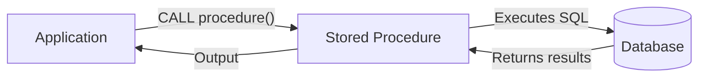
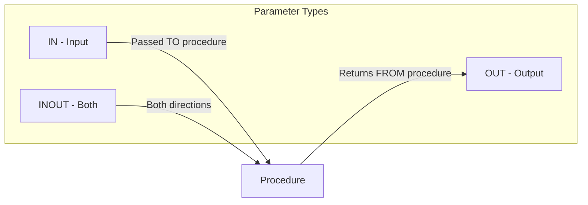

# Session 9: Introduction to Stored Procedures

## MySQL Programming Overview

MySQL supports server-side programming through stored routines.

| Routine Type | Description |
|--------------|-------------|
| **Stored Procedure** | Named set of SQL statements, may or may not return values |
| **Function** | Named routine that returns a single value |
| **Trigger** | Automatic execution on DML events |

## What is a Stored Procedure?

A **Stored Procedure** is a prepared SQL code saved in the database that can be reused.



### Benefits of Stored Procedures

| Benefit | Description |
|---------|-------------|
| **Reduced Network Traffic** | Multiple statements in one call |
| **Reusability** | Code once, use many times |
| **Security** | Users execute procedure, not direct tables |
| **Performance** | Pre-compiled, cached execution plan |
| **Maintainability** | Centralized business logic |
| **Consistency** | Same logic enforced everywhere |

### Basic Syntax

```sql
DELIMITER //

CREATE PROCEDURE procedure_name()
BEGIN
    -- SQL statements
    SELECT * FROM employees;
END //

DELIMITER ;

-- Call the procedure
CALL procedure_name();
```

> **Note**: DELIMITER changes the statement terminator temporarily so semicolons inside the procedure don't end the CREATE statement.

---

## Procedure Parameters

Procedures can accept parameters for flexibility.



### Parameter Types

| Type | Direction | Description |
|------|-----------|-------------|
| **IN** | Input only | Default, value passed to procedure |
| **OUT** | Output only | Returns value to caller |
| **INOUT** | Both | Can receive and return value |

### IN Parameter

```sql
DELIMITER //

CREATE PROCEDURE get_employee(IN emp_id INT)
BEGIN
    SELECT * FROM employees WHERE id = emp_id;
END //

DELIMITER ;

-- Call with IN parameter
CALL get_employee(101);
```

### OUT Parameter

```sql
DELIMITER //

CREATE PROCEDURE get_employee_count(OUT emp_count INT)
BEGIN
    SELECT COUNT(*) INTO emp_count FROM employees;
END //

DELIMITER ;

-- Call with OUT parameter
CALL get_employee_count(@count);
SELECT @count;  -- Access the output value
```

### INOUT Parameter

```sql
DELIMITER //

CREATE PROCEDURE increment_value(INOUT value INT)
BEGIN
    SET value = value + 10;
END //

DELIMITER ;

-- Call with INOUT parameter
SET @num = 5;
CALL increment_value(@num);
SELECT @num;  -- Returns 15
```

### Multiple Parameters

```sql
DELIMITER //

CREATE PROCEDURE add_employee(
    IN p_name VARCHAR(50),
    IN p_salary DECIMAL(10,2),
    OUT p_id INT
)
BEGIN
    INSERT INTO employees (name, salary) VALUES (p_name, p_salary);
    SET p_id = LAST_INSERT_ID();
END //

DELIMITER ;
```

---

## Variables in Procedures

### DECLARE Variable

Local variables within procedure block.

```sql
DELIMITER //

CREATE PROCEDURE calculate_bonus()
BEGIN
    DECLARE emp_salary DECIMAL(10,2);
    DECLARE bonus DECIMAL(10,2);
    
    SELECT salary INTO emp_salary FROM employees WHERE id = 1;
    SET bonus = emp_salary * 0.1;
    
    SELECT bonus AS employee_bonus;
END //

DELIMITER ;
```

### User-Defined Variables

Session-level variables (persist across statements).

```sql
SET @my_var = 100;
SELECT @my_var;

-- Use in procedure
CALL my_procedure(@result);
SELECT @result;
```

### Variable Comparison

| Feature | DECLARE | User-Defined (@) |
|---------|---------|------------------|
| Scope | Procedure block | Session |
| Declaration | Required | Not required |
| Data type | Specified | Dynamic |
| Initialization | Optional | Automatic NULL |

---

## Managing Stored Procedures

```sql
-- View all procedures
SHOW PROCEDURE STATUS;

-- View procedures in specific database
SHOW PROCEDURE STATUS WHERE Db = 'database_name';

-- View procedure code
SHOW CREATE PROCEDURE procedure_name;

-- Drop procedure
DROP PROCEDURE IF EXISTS procedure_name;

-- Grant execute permission
GRANT EXECUTE ON PROCEDURE db.procedure_name TO 'user'@'host';
```

---

## Key MCQ Points to Remember

1. **Stored Procedure** = saved SQL code for reuse
2. **DELIMITER** changes statement terminator
3. **IN** = input (default), **OUT** = output, **INOUT** = both
4. **CALL** statement executes procedures
5. **DECLARE** creates local procedure variables
6. **@variable** = user-defined session variable
7. **INTO** copies query result to variable
8. **SET** assigns value to variable
9. **LAST_INSERT_ID()** gets auto-increment value
10. **DROP PROCEDURE** removes a procedure
11. Procedures improve **security and performance**
12. Procedures are **pre-compiled**
13. **OUT parameters** use @ variables in caller
14. **No overloading** - procedure names must be unique
15. Use **SHOW PROCEDURE STATUS** to list procedures
