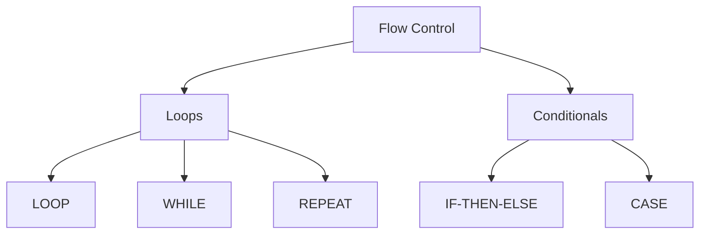

# Session 10: Flow Control and Conditional Statements

## Flow Control Statements

MySQL supports various flow control statements for programming logic.



---

## Loop Statements

### LOOP

Infinite loop, must use LEAVE to exit.

```sql
DELIMITER //

CREATE PROCEDURE loop_demo()
BEGIN
    DECLARE counter INT DEFAULT 0;
    
    my_loop: LOOP
        SET counter = counter + 1;
        
        IF counter >= 5 THEN
            LEAVE my_loop;  -- Exit loop
        END IF;
        
        SELECT counter;
    END LOOP my_loop;
END //

DELIMITER ;
```

### WHILE

Pre-test loop - condition checked before each iteration.

```sql
DELIMITER //

CREATE PROCEDURE while_demo()
BEGIN
    DECLARE counter INT DEFAULT 1;
    
    WHILE counter <= 5 DO
        SELECT counter;
        SET counter = counter + 1;
    END WHILE;
END //

DELIMITER ;
```

### REPEAT

Post-test loop - condition checked after each iteration (executes at least once).

```sql
DELIMITER //

CREATE PROCEDURE repeat_demo()
BEGIN
    DECLARE counter INT DEFAULT 1;
    
    REPEAT
        SELECT counter;
        SET counter = counter + 1;
    UNTIL counter > 5
    END REPEAT;
END //

DELIMITER ;
```

### Loop Comparison

| Feature | LOOP | WHILE | REPEAT |
|---------|------|-------|--------|
| **Condition test** | None (manual) | Before (pre-test) | After (post-test) |
| **Exit mechanism** | LEAVE statement | Condition false | UNTIL true |
| **Minimum executions** | 0 (with LEAVE) | 0 | 1 (always) |
| **Similar to** | Infinite loop | while() in C | do-while() in C |

---

## Loop Control Statements

### LEAVE

Exit the current loop (like `break` in C/Java).

```sql
LEAVE loop_label;
```

### ITERATE

Skip to next iteration (like `continue` in C/Java).

```sql
ITERATE loop_label;
```

### Example with LEAVE and ITERATE

```sql
DELIMITER //

CREATE PROCEDURE control_demo()
BEGIN
    DECLARE i INT DEFAULT 0;
    
    outer_loop: LOOP
        SET i = i + 1;
        
        IF i = 3 THEN
            ITERATE outer_loop;  -- Skip 3, continue loop
        END IF;
        
        IF i >= 6 THEN
            LEAVE outer_loop;    -- Exit when 6
        END IF;
        
        SELECT i AS value;  -- Prints 1,2,4,5
    END LOOP outer_loop;
END //

DELIMITER ;
```

---

## Conditional Statements

### IF-THEN-ELSE

```sql
DELIMITER //

CREATE PROCEDURE grade_calculator(IN marks INT, OUT grade VARCHAR(2))
BEGIN
    IF marks >= 90 THEN
        SET grade = 'A';
    ELSEIF marks >= 80 THEN
        SET grade = 'B';
    ELSEIF marks >= 70 THEN
        SET grade = 'C';
    ELSEIF marks >= 60 THEN
        SET grade = 'D';
    ELSE
        SET grade = 'F';
    END IF;
END //

DELIMITER ;
```

### CASE Statement

Two forms: simple CASE and searched CASE.

#### Simple CASE (equality comparison)

```sql
DELIMITER //

CREATE PROCEDURE day_type(IN day_num INT, OUT day_type VARCHAR(20))
BEGIN
    CASE day_num
        WHEN 1 THEN SET day_type = 'Sunday';
        WHEN 2 THEN SET day_type = 'Monday';
        WHEN 3 THEN SET day_type = 'Tuesday';
        WHEN 4 THEN SET day_type = 'Wednesday';
        WHEN 5 THEN SET day_type = 'Thursday';
        WHEN 6 THEN SET day_type = 'Friday';
        WHEN 7 THEN SET day_type = 'Saturday';
        ELSE SET day_type = 'Invalid';
    END CASE;
END //

DELIMITER ;
```

#### Searched CASE (condition comparison)

```sql
DELIMITER //

CREATE PROCEDURE salary_level(IN salary DECIMAL(10,2), OUT level VARCHAR(20))
BEGIN
    CASE
        WHEN salary >= 100000 THEN SET level = 'Executive';
        WHEN salary >= 75000 THEN SET level = 'Senior';
        WHEN salary >= 50000 THEN SET level = 'Mid-level';
        WHEN salary >= 25000 THEN SET level = 'Junior';
        ELSE SET level = 'Trainee';
    END CASE;
END //

DELIMITER ;
```

### CASE in SELECT (Expression)

```sql
SELECT name, salary,
    CASE
        WHEN salary >= 100000 THEN 'Executive'
        WHEN salary >= 50000 THEN 'Senior'
        ELSE 'Junior'
    END AS level
FROM employees;
```

---

## Flow Control Comparison Summary

| Statement | Purpose | Syntax |
|-----------|---------|--------|
| **IF** | Conditional execution | IF...THEN...ELSEIF...ELSE...END IF |
| **CASE** | Multi-way branching | CASE...WHEN...THEN...ELSE...END CASE |
| **LOOP** | Infinite loop | label: LOOP...END LOOP |
| **WHILE** | Pre-test loop | WHILE...DO...END WHILE |
| **REPEAT** | Post-test loop | REPEAT...UNTIL...END REPEAT |
| **LEAVE** | Exit loop | LEAVE label |
| **ITERATE** | Skip iteration | ITERATE label |

---

## Key MCQ Points to Remember

1. **WHILE** = pre-test loop (may execute 0 times)
2. **REPEAT** = post-test loop (executes at least once)
3. **LOOP** = infinite, needs LEAVE to exit
4. **LEAVE** = exit loop (like break)
5. **ITERATE** = skip to next iteration (like continue)
6. **Loop labels** are required for LEAVE/ITERATE
7. **IF** uses ELSEIF (one word) not ELSE IF
8. **CASE** can be simple (equality) or searched (conditions)
9. **END IF** ends IF statement
10. **END CASE** ends CASE statement
11. **Simple CASE** compares to single value
12. **Searched CASE** uses conditions (WHEN condition)
13. **WHILE** checks condition BEFORE loop body
14. **REPEAT** checks condition AFTER loop body (UNTIL)
15. All control structures end with END [type]
