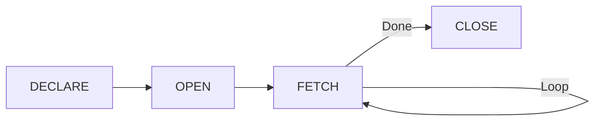

# Session 12: Cursors

## What is a Cursor?

A **Cursor** is a database object that allows row-by-row processing of query results.


### Why Use Cursors?

| Use Case | Description |
|----------|-------------|
| **Row-by-row processing** | When set-based operations won't work |
| **Complex calculations** | Per-row logic needed |
| **Data migration** | Transform each row |
| **Report generation** | Custom formatting per row |

> **Note**: Set-based operations (UPDATE, DELETE with WHERE) are usually faster than cursors.

---

## Cursor Types in MySQL

| Type | Description |
|------|-------------|
| **Asensitive** | Points to actual data (faster, may see changes) |
| **Insensitive** | Works on snapshot copy (slower, no changes visible) |
| **Read-only** | Cannot modify through cursor |
| **Non-scrollable** | Forward-only traversal |

> **MySQL Default**: Asensitive, Read-only, Non-scrollable

---

## Cursor Lifecycle



| Step | Description |
|------|-------------|
| **DECLARE** | Define cursor with SELECT |
| **OPEN** | Execute SELECT, populate cursor |
| **FETCH** | Retrieve one row into variables |
| **CLOSE** | Release cursor resources |

---

## Cursor Syntax

### Basic Cursor Usage

```sql
DELIMITER //

CREATE PROCEDURE process_employees()
BEGIN
    -- Declare variables for fetched data
    DECLARE emp_id INT;
    DECLARE emp_name VARCHAR(50);
    DECLARE emp_salary DECIMAL(10,2);
    DECLARE done INT DEFAULT 0;
    
    -- Declare cursor
    DECLARE emp_cursor CURSOR FOR
        SELECT id, name, salary FROM employees;
    
    -- Declare handler for end of result set
    DECLARE CONTINUE HANDLER FOR NOT FOUND SET done = 1;
    
    -- Open cursor
    OPEN emp_cursor;
    
    -- Fetch loop
    read_loop: LOOP
        FETCH emp_cursor INTO emp_id, emp_name, emp_salary;
        
        IF done THEN
            LEAVE read_loop;
        END IF;
        
        -- Process each row
        INSERT INTO salary_report (id, name, annual_salary)
        VALUES (emp_id, emp_name, emp_salary * 12);
    END LOOP read_loop;
    
    -- Close cursor
    CLOSE emp_cursor;
END //

DELIMITER ;
```

### Declaration Order (Important!)

```sql
-- Correct order in a procedure block:
BEGIN
    -- 1. Variable declarations
    DECLARE var1 INT;
    DECLARE var2 VARCHAR(50);
    
    -- 2. Cursor declarations
    DECLARE my_cursor CURSOR FOR SELECT ...;
    
    -- 3. Handler declarations
    DECLARE CONTINUE HANDLER FOR NOT FOUND SET done = 1;
    
    -- 4. Procedure body
    OPEN my_cursor;
    ...
END
```

> **Rule**: Variables → Cursors → Handlers → Code

---

## Handler for NOT FOUND

The handler detects when no more rows are available.

```sql
-- Continue handler (continues execution after handling)
DECLARE CONTINUE HANDLER FOR NOT FOUND SET done = 1;

-- Exit handler (exits block after handling)
DECLARE EXIT HANDLER FOR NOT FOUND 
BEGIN
    CLOSE my_cursor;
END;
```

---

## Cursor Examples

### Example 1: Calculate Bonuses

```sql
DELIMITER //

CREATE PROCEDURE calculate_bonuses()
BEGIN
    DECLARE v_id INT;
    DECLARE v_salary DECIMAL(10,2);
    DECLARE v_bonus DECIMAL(10,2);
    DECLARE finished INT DEFAULT 0;
    
    DECLARE bonus_cursor CURSOR FOR
        SELECT id, salary FROM employees;
    
    DECLARE CONTINUE HANDLER FOR NOT FOUND SET finished = 1;
    
    CREATE TEMPORARY TABLE IF NOT EXISTS bonus_table (
        emp_id INT,
        bonus_amount DECIMAL(10,2)
    );
    
    OPEN bonus_cursor;
    
    bonus_loop: LOOP
        FETCH bonus_cursor INTO v_id, v_salary;
        
        IF finished THEN
            LEAVE bonus_loop;
        END IF;
        
        -- Calculate bonus (10% of salary)
        SET v_bonus = v_salary * 0.10;
        
        INSERT INTO bonus_table VALUES (v_id, v_bonus);
    END LOOP bonus_loop;
    
    CLOSE bonus_cursor;
    
    SELECT * FROM bonus_table;
END //

DELIMITER ;
```

### Example 2: Update with Conditions

```sql
DELIMITER //

CREATE PROCEDURE update_salaries()
BEGIN
    DECLARE v_id INT;
    DECLARE v_dept VARCHAR(20);
    DECLARE v_increase DECIMAL(5,2);
    DECLARE done INT DEFAULT 0;
    
    DECLARE sal_cursor CURSOR FOR
        SELECT id, department FROM employees;
    
    DECLARE CONTINUE HANDLER FOR NOT FOUND SET done = 1;
    
    OPEN sal_cursor;
    
    fetch_loop: LOOP
        FETCH sal_cursor INTO v_id, v_dept;
        
        IF done THEN
            LEAVE fetch_loop;
        END IF;
        
        -- Different increase per department
        CASE v_dept
            WHEN 'IT' THEN SET v_increase = 15;
            WHEN 'HR' THEN SET v_increase = 10;
            ELSE SET v_increase = 5;
        END CASE;
        
        UPDATE employees 
        SET salary = salary * (1 + v_increase/100)
        WHERE id = v_id;
    END LOOP fetch_loop;
    
    CLOSE sal_cursor;
END //

DELIMITER ;
```

---

## Cursor Best Practices

| Practice | Reason |
|----------|--------|
| **Always close cursors** | Free server resources |
| **Use set operations when possible** | Cursors are slower |
| **Declare before handlers** | Required order |
| **Keep fetch count low** | Performance |
| **Process and discard** | Don't hold rows long |

---

## Key MCQ Points to Remember

1. **Cursor** = row-by-row processing
2. **MySQL cursors** are read-only, non-scrollable
3. **Declaration order**: Variables → Cursors → Handlers
4. **OPEN** executes the SELECT and populates cursor
5. **FETCH** retrieves one row into variables
6. **CLOSE** releases cursor resources
7. **NOT FOUND handler** detects end of result set
8. **CONTINUE handler** continues execution
9. **EXIT handler** exits the block
10. **Asensitive** = may see data changes
11. **Insensitive** = snapshot, no changes visible
12. **Non-scrollable** = forward-only
13. Set operations are **faster** than cursors
14. **Always CLOSE** cursors to free resources
15. **Cursor variable count must match SELECT columns**
