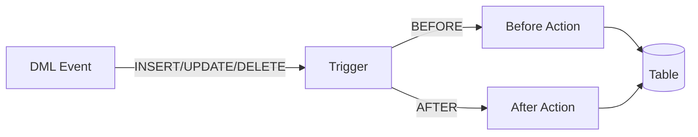

# Session 13: Triggers

## What is a Trigger?

A **Trigger** is a stored procedure that automatically executes when a specific event occurs on a table.



### Trigger Characteristics

| Feature | Description |
|---------|-------------|
| **Automatic** | Executes without explicit call |
| **Event-driven** | Fires on INSERT, UPDATE, DELETE |
| **Table-specific** | Defined on a specific table |
| **Row-level** | Executes for each affected row |

---

## Trigger Types

| Timing | Event | Description |
|--------|-------|-------------|
| **BEFORE INSERT** | Before new row added | Validation, modification |
| **AFTER INSERT** | After new row added | Logging, cascading |
| **BEFORE UPDATE** | Before row modified | Validation, old value check |
| **AFTER UPDATE** | After row modified | Logging, audit |
| **BEFORE DELETE** | Before row removed | Validation, backup |
| **AFTER DELETE** | After row removed | Cleanup, logging |

### BEFORE vs AFTER

| BEFORE | AFTER |
|--------|-------|
| Can modify NEW values | Cannot modify NEW values |
| Can cancel operation (SIGNAL) | Operation complete |
| Used for validation | Used for logging/cascade |
| Access to NEW/OLD | Access to NEW/OLD |

---

## OLD and NEW References

| Reference | Available In | Description |
|-----------|--------------|-------------|
| **NEW** | INSERT, UPDATE | New row values |
| **OLD** | UPDATE, DELETE | Original row values |

| Event | OLD | NEW |
|-------|-----|-----|
| INSERT | ❌ N/A | ✅ Available |
| UPDATE | ✅ Available | ✅ Available |
| DELETE | ✅ Available | ❌ N/A |

---

## Trigger Syntax

### Basic Syntax

```sql
DELIMITER //

CREATE TRIGGER trigger_name
{BEFORE | AFTER} {INSERT | UPDATE | DELETE}
ON table_name
FOR EACH ROW
BEGIN
    -- Trigger body
END //

DELIMITER ;
```

### BEFORE INSERT Trigger

Validate or modify data before insertion.

```sql
DELIMITER //

CREATE TRIGGER before_emp_insert
BEFORE INSERT ON employees
FOR EACH ROW
BEGIN
    -- Ensure salary is positive
    IF NEW.salary < 0 THEN
        SET NEW.salary = 0;
    END IF;
    
    -- Auto-set created date
    SET NEW.created_at = NOW();
END //

DELIMITER ;
```

### AFTER INSERT Trigger

Log or cascade after insertion.

```sql
DELIMITER //

CREATE TRIGGER after_emp_insert
AFTER INSERT ON employees
FOR EACH ROW
BEGIN
    INSERT INTO audit_log (action, table_name, row_id, action_time)
    VALUES ('INSERT', 'employees', NEW.id, NOW());
END //

DELIMITER ;
```

### BEFORE UPDATE Trigger

Validate changes or preserve old values.

```sql
DELIMITER //

CREATE TRIGGER before_emp_update
BEFORE UPDATE ON employees
FOR EACH ROW
BEGIN
    -- Prevent salary decrease
    IF NEW.salary < OLD.salary THEN
        SIGNAL SQLSTATE '45000'
        SET MESSAGE_TEXT = 'Salary cannot be decreased';
    END IF;
    
    -- Track modification time
    SET NEW.modified_at = NOW();
END //

DELIMITER ;
```

### AFTER UPDATE Trigger

Audit changes after update.

```sql
DELIMITER //

CREATE TRIGGER after_emp_update
AFTER UPDATE ON employees
FOR EACH ROW
BEGIN
    INSERT INTO salary_history (emp_id, old_salary, new_salary, change_date)
    VALUES (OLD.id, OLD.salary, NEW.salary, NOW());
END //

DELIMITER ;
```

### BEFORE DELETE Trigger

Validation or backup before deletion.

```sql
DELIMITER //

CREATE TRIGGER before_emp_delete
BEFORE DELETE ON employees
FOR EACH ROW
BEGIN
    -- Prevent deletion of managers
    IF OLD.role = 'MANAGER' THEN
        SIGNAL SQLSTATE '45000'
        SET MESSAGE_TEXT = 'Cannot delete managers';
    END IF;
END //

DELIMITER ;
```

### AFTER DELETE Trigger

Cleanup or logging after deletion.

```sql
DELIMITER //

CREATE TRIGGER after_emp_delete
AFTER DELETE ON employees
FOR EACH ROW
BEGIN
    -- Archive deleted record
    INSERT INTO employees_archive 
    SELECT OLD.*, NOW() AS deleted_at;
END //

DELIMITER ;
```

---

## Managing Triggers

```sql
-- View all triggers
SHOW TRIGGERS;

-- View triggers for specific table
SHOW TRIGGERS FROM database_name LIKE 'employees';

-- View trigger definition
SHOW CREATE TRIGGER trigger_name;

-- Drop trigger
DROP TRIGGER IF EXISTS trigger_name;
```

---

## Trigger Use Cases

| Use Case | Trigger Type |
|----------|--------------|
| **Data validation** | BEFORE INSERT/UPDATE |
| **Auto-fill columns** | BEFORE INSERT |
| **Audit logging** | AFTER INSERT/UPDATE/DELETE |
| **Cascading updates** | AFTER UPDATE |
| **Data archiving** | BEFORE/AFTER DELETE |
| **Enforce business rules** | BEFORE triggers |

---

## Trigger Limitations

| Limitation | Description |
|------------|-------------|
| No CALL | Cannot call stored procedures |
| No transaction control | No COMMIT/ROLLBACK |
| No prepared statements | Cannot use PREPARE |
| One per event | Only one trigger per event per table |

---

## Key MCQ Points to Remember

1. **Trigger** = automatic execution on DML events
2. **BEFORE** = can modify NEW values
3. **AFTER** = cannot modify, used for logging
4. **NEW** = available in INSERT, UPDATE
5. **OLD** = available in UPDATE, DELETE
6. **FOR EACH ROW** = row-level trigger
7. **SIGNAL** can cancel operation in BEFORE trigger
8. Triggers fire **automatically**, not by CALL
9. **One trigger** per event per table (in MySQL)
10. **Cannot use COMMIT/ROLLBACK** in triggers
11. **Cannot call stored procedures** from triggers
12. **NEW.column** accesses new row values
13. **OLD.column** accesses original row values
14. **TRUNCATE** does NOT fire DELETE triggers
15. Use **SHOW TRIGGERS** to list triggers
