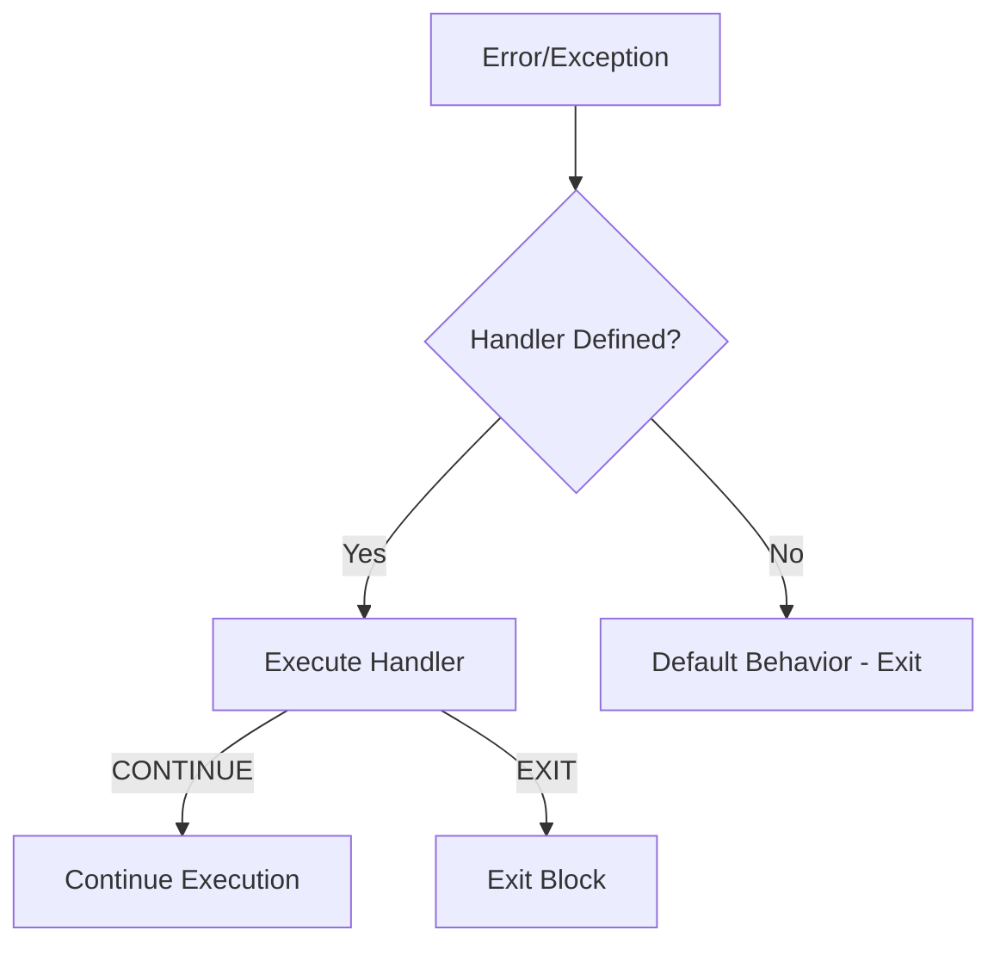

# Session 14: Error Handling and Exceptions

## Error Handling in MySQL

MySQL uses **handlers** to manage errors and exceptions in stored programs.



---

## Condition Handlers

### Handler Types

| Handler Type | Description |
|--------------|-------------|
| **CONTINUE** | Handle error and continue execution |
| **EXIT** | Handle error and exit current block |
| **UNDO** | Handle error and undo (not supported in MySQL) |

### Handler Syntax

```sql
DECLARE handler_type HANDLER
FOR condition_value [, condition_value] ...
handler_statement;
```

### Condition Values

| Condition | Description | Example |
|-----------|-------------|---------|
| **SQLSTATE** | 5-character state code | SQLSTATE '23000' |
| **MySQL error code** | Numeric error code | 1062 |
| **Named condition** | User-defined name | DECLARE my_error CONDITION... |
| **SQLWARNING** | All warnings (01xxx) | SQLWARNING |
| **NOT FOUND** | No rows found (02xxx) | NOT FOUND |
| **SQLEXCEPTION** | All errors (except 01, 02) | SQLEXCEPTION |

---

## Common SQLSTATE Codes

| SQLSTATE | Meaning |
|----------|---------|
| **'00000'** | Success |
| **'01000'** | Warning |
| **'02000'** | No data / NOT FOUND |
| **'23000'** | Integrity constraint violation |
| **'42000'** | Syntax error |
| **'45000'** | User-defined exception |

## Common MySQL Error Codes

| Error Code | SQLSTATE | Description |
|------------|----------|-------------|
| **1062** | 23000 | Duplicate entry for key |
| **1048** | 23000 | Column cannot be null |
| **1452** | 23000 | FK constraint fails |
| **1054** | 42S22 | Unknown column |
| **1146** | 42S02 | Table doesn't exist |

---

## Handler Examples

### CONTINUE Handler

Continues execution after handling.

```sql
DELIMITER //

CREATE PROCEDURE safe_insert()
BEGIN
    DECLARE duplicate_key INT DEFAULT 0;
    
    -- Continue handler for duplicate key error
    DECLARE CONTINUE HANDLER FOR 1062
        SET duplicate_key = 1;
    
    INSERT INTO employees (id, name) VALUES (1, 'John');
    
    IF duplicate_key THEN
        SELECT 'Duplicate key - record already exists';
    ELSE
        SELECT 'Insert successful';
    END IF;
END //

DELIMITER ;
```

### EXIT Handler

Exits block after handling.

```sql
DELIMITER //

CREATE PROCEDURE process_data()
BEGIN
    DECLARE EXIT HANDLER FOR SQLEXCEPTION
    BEGIN
        ROLLBACK;
        SELECT 'Error occurred - transaction rolled back';
    END;
    
    START TRANSACTION;
    
    INSERT INTO table1 VALUES (1, 'data');
    INSERT INTO table2 VALUES (2, 'data2');  -- May fail
    
    COMMIT;
    SELECT 'Transaction completed';
END //

DELIMITER ;
```

### Multiple Conditions

```sql
DECLARE CONTINUE HANDLER FOR 1062, 1048
BEGIN
    SET error_occurred = 1;
END;
```

### SQLEXCEPTION Handler

Catches all SQL exceptions.

```sql
DELIMITER //

CREATE PROCEDURE generic_handler()
BEGIN
    DECLARE error_message VARCHAR(255);
    
    DECLARE EXIT HANDLER FOR SQLEXCEPTION
    BEGIN
        GET DIAGNOSTICS CONDITION 1
            error_message = MESSAGE_TEXT;
        SELECT CONCAT('Error: ', error_message) AS result;
    END;
    
    -- Code that may cause errors
    INSERT INTO nonexistent_table VALUES (1);
END //

DELIMITER ;
```

---

## Named Conditions

Define readable names for error codes.

```sql
DELIMITER //

CREATE PROCEDURE named_condition_example()
BEGIN
    -- Declare named condition
    DECLARE duplicate_key CONDITION FOR 1062;
    
    -- Use named condition in handler
    DECLARE CONTINUE HANDLER FOR duplicate_key
        SELECT 'Duplicate key detected';
    
    INSERT INTO employees VALUES (1, 'John');
END //

DELIMITER ;
```

---

## SIGNAL Statement

Raises a user-defined error or warning.

```sql
DELIMITER //

CREATE PROCEDURE check_age(IN age INT)
BEGIN
    IF age < 0 THEN
        SIGNAL SQLSTATE '45000'
        SET MESSAGE_TEXT = 'Age cannot be negative';
    ELSEIF age < 18 THEN
        SIGNAL SQLSTATE '45000'
        SET MESSAGE_TEXT = 'Must be 18 or older';
    END IF;
    
    SELECT 'Age is valid';
END //

DELIMITER ;
```

### SIGNAL Elements

| Element | Description |
|---------|-------------|
| **SQLSTATE** | 5-character error code |
| **MESSAGE_TEXT** | Error message |
| **MYSQL_ERRNO** | MySQL error number |
| **CLASS_ORIGIN** | Origin of SQLSTATE class |

---

## RESIGNAL Statement

Re-raises the current error, optionally modified.

```sql
DELIMITER //

CREATE PROCEDURE resignal_example()
BEGIN
    DECLARE EXIT HANDLER FOR SQLEXCEPTION
    BEGIN
        -- Add custom message and re-raise
        RESIGNAL SET MESSAGE_TEXT = 'Error in resignal_example procedure';
    END;
    
    -- Code that may cause error
    INSERT INTO employees VALUES (NULL, 'Test');
END //

DELIMITER ;
```

---

## GET DIAGNOSTICS

Retrieve information about the last error.

```sql
DELIMITER //

CREATE PROCEDURE diagnostics_example()
BEGIN
    DECLARE v_sqlstate CHAR(5);
    DECLARE v_message VARCHAR(255);
    DECLARE v_errno INT;
    
    DECLARE EXIT HANDLER FOR SQLEXCEPTION
    BEGIN
        GET DIAGNOSTICS CONDITION 1
            v_sqlstate = RETURNED_SQLSTATE,
            v_message = MESSAGE_TEXT,
            v_errno = MYSQL_ERRNO;
        
        SELECT v_sqlstate AS sqlstate, 
               v_errno AS error_code,
               v_message AS message;
    END;
    
    -- Cause an error
    SELECT * FROM nonexistent_table;
END //

DELIMITER ;
```

---

## Key MCQ Points to Remember

1. **CONTINUE handler** continues after handling
2. **EXIT handler** exits block after handling
3. **UNDO handler** not supported in MySQL
4. **NOT FOUND** = no rows (SQLSTATE 02xxx)
5. **SQLWARNING** = warnings (SQLSTATE 01xxx)
6. **SQLEXCEPTION** = all errors except 01, 02
7. **SQLSTATE 45000** = user-defined exception
8. **1062** = duplicate key error
9. **SIGNAL** raises user-defined error
10. **RESIGNAL** re-raises current error
11. **GET DIAGNOSTICS** retrieves error info
12. Handlers declared AFTER cursors
13. **MESSAGE_TEXT** sets error message
14. Multiple conditions in one handler allowed
15. Named conditions improve readability
