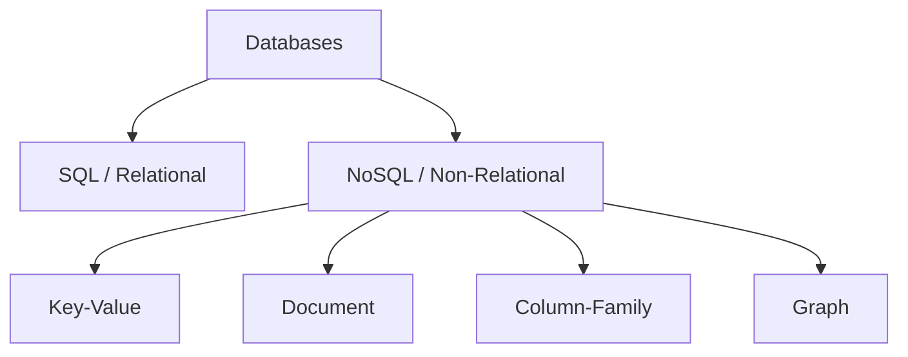
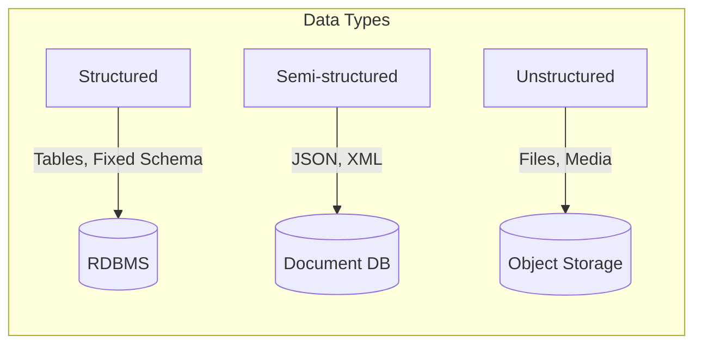
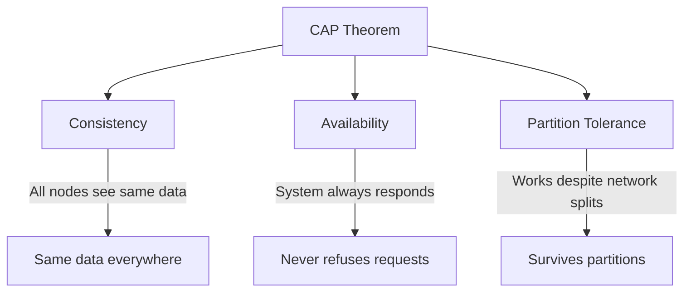
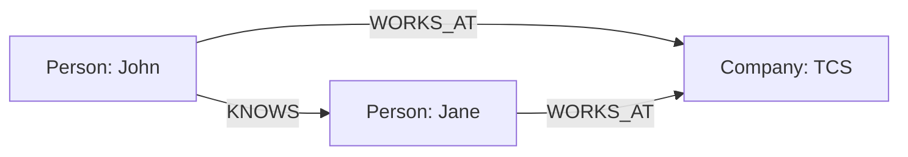

# Session 15: Introduction to NoSQL Databases

## What is NoSQL?

**NoSQL** (Not Only SQL) refers to non-relational databases designed for distributed, scalable storage.



---

## Features of NoSQL Databases

| Feature | Description |
|---------|-------------|
| **Schema-less** | Flexible, dynamic schema |
| **Horizontal Scaling** | Scale out by adding servers |
| **High Availability** | Built-in replication |
| **High Performance** | Optimized for read/write |
| **Distributed** | Data spread across nodes |
| **Flexible Data Models** | JSON, key-value, graphs |

---

## Structured vs Semi-structured vs Unstructured Data

| Type | Description | Examples |
|------|-------------|----------|
| **Structured** | Fixed schema, rows/columns | RDBMS tables, CSV |
| **Semi-structured** | Self-describing, flexible tags | JSON, XML, YAML |
| **Unstructured** | No predefined format | Images, videos, documents |



---

## RDBMS vs NoSQL

| Feature | RDBMS | NoSQL |
|---------|-------|-------|
| **Data Model** | Relational (tables) | Various (doc, key-value, etc.) |
| **Schema** | Fixed, predefined | Dynamic, flexible |
| **Scalability** | Vertical (scale-up) | Horizontal (scale-out) |
| **ACID** | Strong ACID | Varies (often BASE) |
| **Transactions** | Full support | Limited |
| **Joins** | Powerful joins | Limited or none |
| **Query Language** | SQL (standardized) | Varied per database |
| **Best For** | Complex queries, transactions | Big data, flexible schema |

---

## CAP Theorem

The **CAP Theorem** states that a distributed system can only guarantee TWO of three properties:



| Property | Description |
|----------|-------------|
| **Consistency (C)** | All nodes see the same data at the same time |
| **Availability (A)** | Every request receives a response |
| **Partition Tolerance (P)** | System operates despite network partitions |

### CAP Trade-offs

| Choose | Sacrifice | Examples |
|--------|-----------|----------|
| **CA** | Partition Tolerance | Traditional RDBMS (single node) |
| **CP** | Availability | MongoDB, Redis, HBase |
| **AP** | Consistency | Cassandra, CouchDB, DynamoDB |

> **Reality**: In distributed systems, partitions WILL happen, so it's usually CP vs AP.

---

## BASE Model

An alternative to ACID for distributed systems.

| Acronym | Meaning |
|---------|---------|
| **BA** | Basically Available |
| **S** | Soft state |
| **E** | Eventually consistent |

### ACID vs BASE

| ACID | BASE |
|------|------|
| Atomicity | Basically Available |
| Consistency | Soft state |
| Isolation | Eventually consistent |
| Durability | - |

| Feature | ACID | BASE |
|---------|------|------|
| **Consistency** | Immediate | Eventual |
| **Priority** | Correctness | Availability |
| **Data state** | Strict | Relaxed |
| **Use case** | Banking, financial | Social media, caching |

---

## Categories of NoSQL Databases

### 1. Key-Value Store

Simplest NoSQL model - data stored as key-value pairs.

| Feature | Description |
|---------|-------------|
| **Structure** | Key → Value |
| **Queries** | By key only |
| **Performance** | Extremely fast |
| **Use Cases** | Caching, sessions, shopping carts |
| **Examples** | Redis, DynamoDB, Memcached |

```
Key: "user:1001"
Value: "{name: 'John', age: 25}"
```

### 2. Document Store

Data stored as JSON-like documents with nested structures.

| Feature | Description |
|---------|-------------|
| **Structure** | JSON/BSON documents |
| **Queries** | Rich queries on any field |
| **Schema** | Flexible, schema-less |
| **Use Cases** | CMS, user profiles, catalogs |
| **Examples** | MongoDB, CouchDB, Firebase |

```json
{
  "_id": "1001",
  "name": "John",
  "address": {
    "city": "Mumbai",
    "zip": "400001"
  },
  "orders": [101, 102, 103]
}
```

### 3. Column-Family (Wide-Column) Store

Data stored in columns instead of rows.

| Feature | Description |
|---------|-------------|
| **Structure** | Column families, sparse tables |
| **Queries** | Column-oriented |
| **Performance** | Fast reads/aggregations |
| **Use Cases** | Analytics, time-series, logging |
| **Examples** | Cassandra, HBase, ScyllaDB |

### 4. Graph Database

Data stored as nodes and relationships.

| Feature | Description |
|---------|-------------|
| **Structure** | Nodes + Edges (relationships) |
| **Queries** | Traverse relationships |
| **Performance** | Fast relationship queries |
| **Use Cases** | Social networks, recommendations |
| **Examples** | Neo4j, Amazon Neptune, ArangoDB |



---

## NoSQL Category Comparison

| Type | Data Model | Query Pattern | Scaling | Examples |
|------|------------|---------------|---------|----------|
| **Key-Value** | Key→Value | By key | Easy | Redis, DynamoDB |
| **Document** | JSON documents | By any field | Easy | MongoDB, CouchDB |
| **Column** | Column families | By columns | Easy | Cassandra, HBase |
| **Graph** | Nodes + Edges | Traversal | Moderate | Neo4j, Neptune |

---

## Key MCQ Points to Remember

1. **NoSQL** = Not Only SQL (non-relational)
2. **NoSQL** scales **horizontally** (add servers)
3. **RDBMS** scales **vertically** (bigger server)
4. **CAP Theorem**: Only 2 of 3 (Consistency, Availability, Partition Tolerance)
5. **CP** = Consistent + Partition Tolerant (MongoDB)
6. **AP** = Available + Partition Tolerant (Cassandra)
7. **BASE** = Basically Available, Soft state, Eventually consistent
8. **ACID** = immediate consistency; **BASE** = eventual consistency
9. **Key-Value**: Redis, DynamoDB (simplest, fastest)
10. **Document**: MongoDB, CouchDB (JSON documents)
11. **Column-Family**: Cassandra, HBase (analytics)
12. **Graph**: Neo4j (relationships, social networks)
13. **Structured data** → RDBMS
14. **Semi-structured** → Document DB (JSON)
15. **Unstructured** → Object storage, NoSQL
