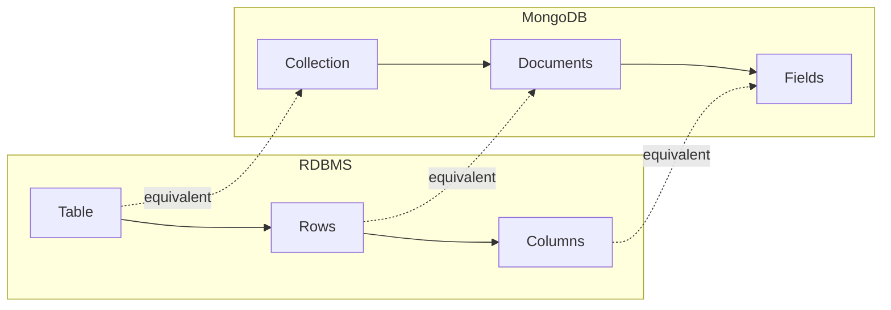

# Sessions 16-18: MongoDB

## Introduction to MongoDB

**MongoDB** is a document-oriented NoSQL database that stores data in flexible, JSON-like documents.

### MongoDB Features

| Feature | Description |
|---------|-------------|
| **Document-Oriented** | Data as JSON/BSON documents |
| **Schema-less** | Flexible, dynamic schema |
| **Scalable** | Horizontal scaling (sharding) |
| **High Performance** | Indexing, in-memory processing |
| **Rich Queries** | Query any field, aggregation |
| **Replication** | Built-in high availability |

---

## RDBMS vs MongoDB Terminology

| RDBMS | MongoDB |
|-------|---------|
| Database | Database |
| Table | Collection |
| Row/Record | Document |
| Column | Field |
| Primary Key | _id field |
| Index | Index |
| Joins | Embedded documents / $lookup |
| Foreign Key | Reference (manual) |



---

## JSON and BSON Documents

### JSON (JavaScript Object Notation)

Human-readable data format.

```json
{
  "name": "John",
  "age": 25,
  "email": "john@example.com",
  "skills": ["Python", "MongoDB", "JavaScript"],
  "address": {
    "city": "Mumbai",
    "zip": "400001"
  }
}
```

### BSON (Binary JSON)

MongoDB's internal storage format.

| Feature | JSON | BSON |
|---------|------|------|
| **Format** | Text | Binary |
| **Readable** | Human-readable | Machine-readable |
| **Data Types** | Limited | Extended (Date, ObjectId, etc.) |
| **Size** | Larger | More compact |
| **Speed** | Slower parsing | Faster parsing |

---

## MongoDB Collections and Documents

### Documents

- Unit of data in MongoDB (like a row)
- Can have different fields (flexible schema)
- Maximum size: 16 MB
- Automatically gets `_id` field

### Collections

- Group of documents (like a table)
- No enforced schema
- Created automatically on first insert

---

## MongoDB Interface Tools

### MongoDB Shell (mongosh)

Command-line interface.

```javascript
// Connect
mongosh "mongodb://localhost:27017"

// Show databases
show dbs

// Use database
use mydb

// Show collections
show collections
```

### MongoDB Compass

GUI tool for visual management.

| Feature | Description |
|---------|-------------|
| Visual exploration | Browse documents |
| Query builder | Build queries visually |
| Schema analysis | Analyze document structure |
| Index management | Create/manage indexes |

---

## CRUD Operations

### CREATE (Insert)

```javascript
// Insert one document
db.users.insertOne({
    name: "John",
    age: 25,
    city: "Mumbai"
});

// Insert multiple documents
db.users.insertMany([
    { name: "Jane", age: 30 },
    { name: "Bob", age: 35 }
]);
```

### READ (Find)

```javascript
// Find all documents
db.users.find();

// Find with condition
db.users.find({ age: 25 });

// Find one document
db.users.findOne({ name: "John" });

// Projection (select specific fields)
db.users.find({}, { name: 1, age: 1, _id: 0 });

// Limit results
db.users.find().limit(5);

// Skip results
db.users.find().skip(10).limit(5);
```

### UPDATE

```javascript
// Update one document
db.users.updateOne(
    { name: "John" },           // filter
    { $set: { age: 26 } }       // update
);

// Update multiple documents
db.users.updateMany(
    { city: "Mumbai" },
    { $set: { country: "India" } }
);

// Replace entire document
db.users.replaceOne(
    { name: "John" },
    { name: "John", age: 26, city: "Delhi" }
);
```

### DELETE

```javascript
// Delete one document
db.users.deleteOne({ name: "John" });

// Delete multiple documents
db.users.deleteMany({ age: { $lt: 18 } });

// Delete all documents
db.users.deleteMany({});
```

### UPSERT (Update or Insert)

```javascript
// Update if exists, insert if not
db.users.updateOne(
    { name: "Alice" },
    { $set: { age: 28 } },
    { upsert: true }
);
```

---

## MongoDB Operators

### Comparison Operators

| Operator | Description | Example |
|----------|-------------|---------|
| **$eq** | Equal to | `{ age: { $eq: 25 } }` |
| **$ne** | Not equal | `{ age: { $ne: 25 } }` |
| **$gt** | Greater than | `{ age: { $gt: 25 } }` |
| **$gte** | Greater or equal | `{ age: { $gte: 25 } }` |
| **$lt** | Less than | `{ age: { $lt: 25 } }` |
| **$lte** | Less or equal | `{ age: { $lte: 25 } }` |
| **$in** | In array | `{ age: { $in: [25, 30] } }` |
| **$nin** | Not in array | `{ age: { $nin: [25, 30] } }` |

### Logical Operators

| Operator | Description | Example |
|----------|-------------|---------|
| **$and** | Logical AND | `{ $and: [{age: 25}, {city: "Mumbai"}] }` |
| **$or** | Logical OR | `{ $or: [{age: 25}, {age: 30}] }` |
| **$not** | Logical NOT | `{ age: { $not: { $gt: 25 } } }` |
| **$nor** | Neither | `{ $nor: [{age: 25}, {age: 30}] }` |

### Update Operators

| Operator | Description | Example |
|----------|-------------|---------|
| **$set** | Set field value | `{ $set: { age: 26 } }` |
| **$unset** | Remove field | `{ $unset: { age: "" } }` |
| **$inc** | Increment | `{ $inc: { age: 1 } }` |
| **$mul** | Multiply | `{ $mul: { price: 1.1 } }` |
| **$rename** | Rename field | `{ $rename: { nm: "name" } }` |
| **$min** | Update if less | `{ $min: { low: 5 } }` |
| **$max** | Update if greater | `{ $max: { high: 10 } }` |
| **$push** | Add to array | `{ $push: { tags: "new" } }` |
| **$pull** | Remove from array | `{ $pull: { tags: "old" } }` |

### Element Operators

| Operator | Description | Example |
|----------|-------------|---------|
| **$exists** | Field exists | `{ email: { $exists: true } }` |
| **$type** | Field type | `{ age: { $type: "int" } }` |

---

## Sorting

```javascript
// Sort ascending (1) or descending (-1)
db.users.find().sort({ age: 1 });      // Ascending
db.users.find().sort({ age: -1 });     // Descending

// Multiple fields
db.users.find().sort({ city: 1, age: -1 });
```

---

## Indexing in MongoDB

### Create Index

```javascript
// Single field index
db.users.createIndex({ email: 1 });

// Compound index
db.users.createIndex({ city: 1, age: -1 });

// Unique index
db.users.createIndex({ email: 1 }, { unique: true });

// Text index (for text search)
db.users.createIndex({ description: "text" });
```

### Manage Indexes

```javascript
// View indexes
db.users.getIndexes();

// Drop index
db.users.dropIndex("email_1");

// Drop all indexes
db.users.dropIndexes();
```

### Index Types

| Type | Description |
|------|-------------|
| **Single Field** | Index on one field |
| **Compound** | Index on multiple fields |
| **Multikey** | Index on array field |
| **Text** | Full-text search |
| **Geospatial** | 2d/2dsphere indexes |
| **Hashed** | Hash-based index (sharding) |

---

## Aggregation

Aggregation processes documents and returns computed results.

```javascript
// Basic aggregation pipeline
db.orders.aggregate([
    { $match: { status: "completed" } },
    { $group: { _id: "$customer", total: { $sum: "$amount" } } },
    { $sort: { total: -1 } },
    { $limit: 10 }
]);
```

### Common Aggregation Stages

| Stage | Description |
|-------|-------------|
| **$match** | Filter documents (like WHERE) |
| **$group** | Group and aggregate (like GROUP BY) |
| **$project** | Select/reshape fields (like SELECT) |
| **$sort** | Sort documents |
| **$limit** | Limit results |
| **$skip** | Skip documents |
| **$lookup** | Join collections |
| **$unwind** | Deconstruct arrays |

---

## Key MCQ Points to Remember

1. **MongoDB** = Document-oriented NoSQL database
2. **Collection** = Table; **Document** = Row
3. **BSON** = Binary JSON (MongoDB storage format)
4. **_id** = Primary key (auto-generated ObjectId)
5. **insertOne()** / **insertMany()** for INSERT
6. **find()** / **findOne()** for SELECT
7. **updateOne()** / **updateMany()** for UPDATE
8. **deleteOne()** / **deleteMany()** for DELETE
9. **$set** updates specific fields
10. **$gt, $lt, $gte, $lte** = comparison operators
11. **$and, $or, $not** = logical operators
12. **$in** = match any in array (like SQL IN)
13. **upsert: true** = insert if not exists
14. **sort({ field: 1 })** = ascending; **-1** = descending
15. **createIndex()** creates index for faster queries
