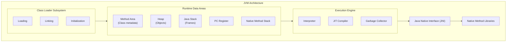
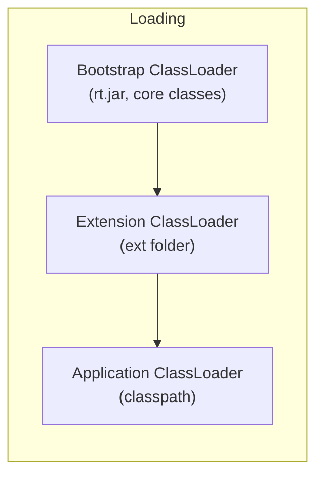
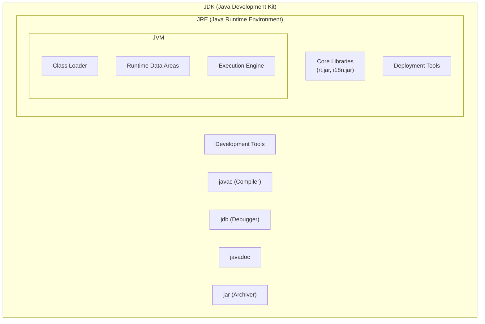
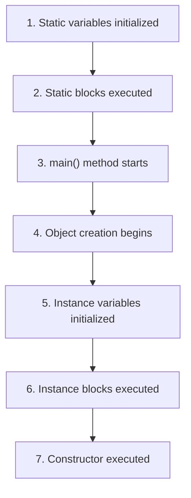
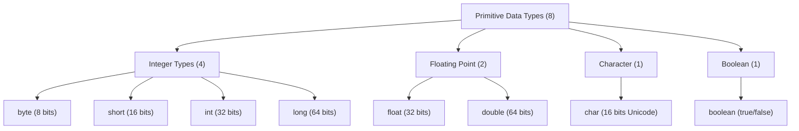

# Session 1: Introduction to Java

## 📚 What is Java?

Java is a **high-level, class-based, object-oriented programming language** designed to have as few implementation dependencies as possible. It was developed by **James Gosling** at Sun Microsystems (now owned by Oracle) and released in **1995**.

### Key Philosophy: "Write Once, Run Anywhere" (WORA)

Java code is compiled into **bytecode** that can run on any platform with a Java Virtual Machine (JVM), making it truly platform-independent.

---

## 🌟 Features of Java

| Feature | Description |
|---------|-------------|
| **Platform Independent** | Java code runs on any OS with JVM installed |
| **Object-Oriented** | Everything in Java is an object (except primitives) |
| **Simple** | Easy to learn, no pointers, automatic memory management |
| **Secure** | No explicit pointer, bytecode verifier, sandbox execution |
| **Robust** | Strong type checking, exception handling, garbage collection |
| **Multithreaded** | Built-in support for concurrent programming |
| **Architecture Neutral** | Bytecode is independent of processor architecture |
| **Portable** | Same bytecode runs everywhere |
| **High Performance** | JIT (Just-In-Time) compiler optimizes bytecode |
| **Distributed** | Built-in networking capabilities (RMI, sockets) |
| **Dynamic** | Classes loaded on demand, supports reflection |

### Platform Independence Explained

```
┌─────────────────┐
│  Java Source    │
│   (.java)       │
└────────┬────────┘
         │ javac (compile)
         ▼
┌─────────────────┐
│   Bytecode      │
│   (.class)      │
└────────┬────────┘
         │
    ┌────┴────┬────────────┐
    ▼         ▼            ▼
┌───────┐ ┌───────┐  ┌───────────┐
│Windows│ │ Linux │  │   macOS   │
│  JVM  │ │  JVM  │  │    JVM    │
└───────┘ └───────┘  └───────────┘
```

---

## 🏗️ JVM Architecture

The **Java Virtual Machine (JVM)** is the cornerstone of Java's platform independence. It's an abstract computing machine that enables a computer to run Java programs.



### JVM Components Explained

| Component | Description |
|-----------|-------------|
| **Class Loader** | Loads .class files into memory |
| **Method Area** | Stores class metadata, static variables, method code |
| **Heap** | Stores all objects and instance variables (shared across threads) |
| **Stack** | Stores local variables, method calls, partial results (per thread) |
| **PC Register** | Holds address of current executing instruction (per thread) |
| **Execution Engine** | Executes bytecode using interpreter or JIT compiler |
| **Garbage Collector** | Automatically deallocates unused objects |

### Class Loader Subsystem



| Class Loader | Loads From | Example Classes |
|--------------|------------|-----------------|
| **Bootstrap** | JRE/lib (rt.jar) | `java.lang.*`, `java.util.*` |
| **Extension** | JRE/lib/ext | Security extensions, JDBC drivers |
| **Application** | Classpath | Your application classes |

---

## 🔧 JDK, JRE, and JVM

Understanding the relationship between JDK, JRE, and JVM is crucial.



### Comparison Table

| Component | Purpose | Contains | Used By |
|-----------|---------|----------|---------|
| **JVM** | Execute bytecode | Interpreter, JIT, GC | Both JRE and JDK |
| **JRE** | Run Java programs | JVM + Libraries | End users |
| **JDK** | Develop Java programs | JRE + Dev Tools | Developers |

### Key Points for MCQ

> **Remember:**
> - JDK = JRE + Development Tools (javac, jdb, javadoc)
> - JRE = JVM + Core Libraries
> - JVM = Execution Engine + Memory Areas
> - You need **JDK** to compile, **JRE** to run

---

## 📝 Structure of a Java Class

Every Java program must have at least one class. Here's the anatomy of a Java class:

```java
// Package declaration (optional, but recommended)
package com.example.demo;

// Import statements (optional)
import java.util.Scanner;
import java.util.ArrayList;

/**
 * Class documentation comment
 * @author YourName
 * @version 1.0
 */
public class HelloWorld {
    
    // Instance variables (fields)
    private String name;
    private int age;
    
    // Static variable (class variable)
    private static int count = 0;
    
    // Static block (runs once when class is loaded)
    static {
        System.out.println("Static block executed");
    }
    
    // Instance initializer block (runs before constructor)
    {
        System.out.println("Instance block executed");
    }
    
    // Default constructor
    public HelloWorld() {
        this.name = "Unknown";
        this.age = 0;
        count++;
    }
    
    // Parameterized constructor
    public HelloWorld(String name, int age) {
        this.name = name;
        this.age = age;
        count++;
    }
    
    // Instance method
    public void displayInfo() {
        System.out.println("Name: " + name + ", Age: " + age);
    }
    
    // Static method
    public static int getCount() {
        return count;
    }
    
    // Main method - entry point of the program
    public static void main(String[] args) {
        System.out.println("Hello, World!");
        
        HelloWorld obj1 = new HelloWorld();
        HelloWorld obj2 = new HelloWorld("John", 25);
        
        obj1.displayInfo();
        obj2.displayInfo();
        
        System.out.println("Total objects: " + HelloWorld.getCount());
    }
}
```

### Class Structure Components

| Component | Description | Example |
|-----------|-------------|---------|
| **Package** | Namespace for organizing classes | `package com.example;` |
| **Import** | Brings external classes into scope | `import java.util.*;` |
| **Class Declaration** | Defines the class | `public class MyClass` |
| **Fields** | Variables that hold object state | `private int x;` |
| **Constructors** | Initialize new objects | `public MyClass() {}` |
| **Methods** | Define object behavior | `public void doSomething()` |
| **Static Members** | Belong to class, not objects | `static int count;` |
| **Main Method** | Entry point for execution | `public static void main(String[] args)` |

### Execution Order



---

## 🔢 Primitive Data Types

Java has **8 primitive data types** divided into 4 categories:

### Complete Data Types Table

| Type | Size | Bits | Default | Min Value | Max Value | Wrapper Class |
|------|------|------|---------|-----------|-----------|---------------|
| **byte** | 1 byte | 8 | 0 | -128 | 127 | Byte |
| **short** | 2 bytes | 16 | 0 | -32,768 | 32,767 | Short |
| **int** | 4 bytes | 32 | 0 | -2³¹ | 2³¹ - 1 | Integer |
| **long** | 8 bytes | 64 | 0L | -2⁶³ | 2⁶³ - 1 | Long |
| **float** | 4 bytes | 32 | 0.0f | ±1.4E-45 | ±3.4E+38 | Float |
| **double** | 8 bytes | 64 | 0.0d | ±4.9E-324 | ±1.8E+308 | Double |
| **char** | 2 bytes | 16 | '\u0000' | 0 | 65,535 | Character |
| **boolean** | 1 bit* | N/A | false | false | true | Boolean |

> **Note:** boolean size is JVM dependent, but typically uses 1 byte for single values and 1 bit in arrays.

### Category Classification



### Code Examples

```java
public class DataTypesDemo {
    public static void main(String[] args) {
        // Integer types
        byte b = 127;           // -128 to 127
        short s = 32000;        // Useful for memory optimization
        int i = 100000;         // Most commonly used
        long l = 9876543210L;   // Note: L suffix required for long literals
        
        // Floating point types
        float f = 3.14159f;     // Note: f suffix required
        double d = 3.141592653589793;  // Default for decimals
        
        // Character type (16-bit Unicode)
        char c1 = 'A';          // Character literal
        char c2 = 65;           // ASCII value
        char c3 = '\u0041';     // Unicode representation
        // All three represent 'A'
        
        // Boolean type
        boolean flag = true;
        boolean isValid = 10 > 5;  // true
        
        // Printing sizes
        System.out.println("byte: " + Byte.SIZE + " bits");
        System.out.println("int range: " + Integer.MIN_VALUE + " to " + Integer.MAX_VALUE);
    }
}
```

### Literals

| Type | Example | Notes |
|------|---------|-------|
| Decimal | `100` | Default for integers |
| Binary | `0b1010` | Prefix with 0b (Java 7+) |
| Octal | `0144` | Prefix with 0 |
| Hexadecimal | `0x64` | Prefix with 0x |
| Long | `100L` | Suffix L or l |
| Float | `3.14f` | Suffix F or f |
| Double | `3.14` or `3.14d` | Default, D optional |
| Char | `'A'`, `'\n'`, `'\u0041'` | Single quotes |
| String | `"Hello"` | Double quotes (not primitive!) |

### Type Ranges Memory Trick

```
byte   → 1 byte  → -128 to 127
short  → 2 bytes → -32K to 32K
int    → 4 bytes → -2B to 2B (approx)
long   → 8 bytes → -9 quintillion to 9 quintillion

Formula: Range = -2^(n-1) to 2^(n-1) - 1
where n = number of bits
```

---

## 💡 Key MCQ Points

> **Remember these for CCEE:**

1. **Java is platform independent** - because of JVM and bytecode
2. **JDK = JRE + Development Tools** (javac, jar, javadoc, jdb)
3. **JRE = JVM + Core Libraries**
4. **Bytecode** has `.class` extension
5. **main() signature**: `public static void main(String[] args)`
6. **char in Java is 16 bits** (Unicode), unlike C/C++ (8 bits ASCII)
7. **Default values**: numeric = 0, boolean = false, object = null
8. **Local variables must be initialized** before use
9. **long literals need L suffix**, float literals need **f suffix**
10. **Java doesn't support unsigned data types** (except char which is unsigned)

### Common Compilation Errors

| Error | Cause | Fix |
|-------|-------|-----|
| `possible lossy conversion` | Assigning larger type to smaller | Use explicit cast |
| `variable not initialized` | Using local variable without value | Initialize before use |
| `integer number too large` | Missing L suffix on long | Add L suffix |
| `incompatible types` | Wrong type assignment | Cast or change type |

---

## 📝 Practice Questions

1. What is the output of `System.out.println((char)65);`?
   - **Answer**: A

2. What is the default value of a boolean instance variable?
   - **Answer**: false

3. Which of the following is NOT a primitive type in Java?
   - a) int  b) String  c) boolean  d) char
   - **Answer**: b) String (it's a class)

4. What is the size of char in Java?
   - **Answer**: 16 bits (2 bytes)

5. Which component of JVM is responsible for memory deallocation?
   - **Answer**: Garbage Collector
