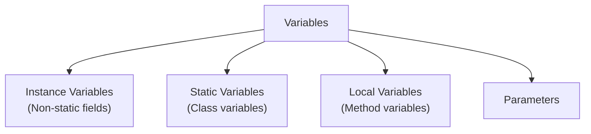

# Sessions 2 & 3: Basic Programming Concepts

## 📚 Java Tokens

A **token** is the smallest individual unit in a Java program. The Java compiler breaks the program into tokens for processing.

### Java Keywords (53 Reserved Words)

| Category | Keywords |
|----------|----------|
| **Data Types** | `byte`, `short`, `int`, `long`, `float`, `double`, `char`, `boolean` |
| **Flow Control** | `if`, `else`, `switch`, `case`, `default`, `for`, `while`, `do`, `break`, `continue`, `return` |
| **Access Modifiers** | `public`, `private`, `protected` |
| **Class/Object** | `class`, `interface`, `extends`, `implements`, `new`, `this`, `super`, `instanceof` |
| **Exception** | `try`, `catch`, `finally`, `throw`, `throws` |
| **Modifiers** | `static`, `final`, `abstract`, `synchronized`, `volatile`, `transient`, `native`, `strictfp` |
| **Package** | `package`, `import` |
| **Others** | `void`, `null`, `true`, `false`, `enum`, `assert` |
| **Reserved (unused)** | `goto`, `const` |

> **Note:** `true`, `false`, and `null` are literals, not keywords, but are reserved words.

---

## 🏷️ Identifiers

Identifiers are names given to classes, methods, variables, etc.

### Rules for Identifiers

| Rule | Valid | Invalid |
|------|-------|---------|
| Start with letter, $, or _ | `name`, `$price`, `_count` | `1name`, `@value` |
| Can contain digits after first char | `value1`, `num2` | `2value` |
| Case sensitive | `Name` ≠ `name` | - |
| No spaces | `firstName` | `first Name` |
| No reserved words | `myClass` | `class`, `int` |

### Naming Conventions

| Entity | Convention | Example |
|--------|------------|---------|
| **Class** | PascalCase | `StudentRecord`, `BankAccount` |
| **Interface** | PascalCase | `Runnable`, `Serializable` |
| **Method** | camelCase | `calculateTotal()`, `getName()` |
| **Variable** | camelCase | `firstName`, `totalAmount` |
| **Constant** | UPPER_SNAKE_CASE | `MAX_VALUE`, `PI` |
| **Package** | lowercase | `com.example.project` |

---

## 📦 Declaring Variables

### Variable Types



### Default Values (for Instance/Static Variables)

| Data Type | Default Value |
|-----------|---------------|
| byte, short, int, long | 0 |
| float, double | 0.0 |
| char | '\u0000' |
| boolean | false |
| Object references | null |

> **Important:** Local variables do NOT have default values. They must be initialized before use.

```java
public class VariableDemo {
    int instanceVar;              // default: 0
    static int count = 0;         // static variable
    
    public void method() {
        int localVar;             // MUST be initialized
        // System.out.println(localVar);  // ERROR!
        localVar = 10;            // Now OK
    }
}
```

---

## 🔄 Data Type Compatibility & Type Casting

### Type Conversion Hierarchy

```
byte → short → int → long → float → double
            ↑
         char
```

### Widening vs Narrowing

| Widening (Automatic) | Narrowing (Manual) |
|---------------------|-------------------|
| Smaller → Larger type | Larger → Smaller type |
| No data loss | Possible data loss |
| No cast required | Cast required |

```java
// WIDENING (Implicit)
int i = 100;
long l = i;      // automatic

// NARROWING (Explicit)
double d = 100.99;
int x = (int) d;  // x = 100 (loses decimal)

// OVERFLOW
int large = 130;
byte small = (byte) large;  // -126 (overflow!)
```

---

## ⚡ Operators

### Operator Precedence (High to Low)

| Precedence | Operator | Description |
|------------|----------|-------------|
| 1 | `()`, `[]`, `.` | Parentheses |
| 2 | `++`, `--`, `!`, `~` | Unary |
| 3 | `*`, `/`, `%` | Multiplicative |
| 4 | `+`, `-` | Additive |
| 5 | `<<`, `>>`, `>>>` | Shift |
| 6 | `<`, `<=`, `>`, `>=` | Relational |
| 7 | `==`, `!=` | Equality |
| 8 | `&`, `^`, `\|` | Bitwise |
| 9 | `&&`, `\|\|` | Logical |
| 10 | `?:` | Ternary |
| 11 | `=`, `+=`, `-=` | Assignment |

### Arithmetic Operators

```java
int a = 17, b = 5;
System.out.println(a / b);   // 3  (integer division)
System.out.println(a % b);   // 2  (modulus)
System.out.println(17.0 / 5); // 3.4 (floating division)
```

### Increment/Decrement

```java
int x = 5;
System.out.println(++x);  // 6 (pre-increment: increment first)
System.out.println(x++);  // 6 (post-increment: use first, then increment)
System.out.println(x);    // 7

// Complex expression
int a = 5;
int result = a++ + ++a;   // 5 + 7 = 12
```

### Logical Operators (Short-Circuit)

```java
// && stops if first is false
if (false && (++a > 5)) { }  // ++a NOT executed

// || stops if first is true
if (true || (++a > 5)) { }   // ++a NOT executed
```

### Bitwise Operators

| Operator | Name | Example (5 & 3) |
|----------|------|-----------------|
| `&` | AND | 0101 & 0011 = 0001 (1) |
| `\|` | OR | 0101 \| 0011 = 0111 (7) |
| `^` | XOR | 0101 ^ 0011 = 0110 (6) |
| `~` | NOT | ~5 = -6 |
| `<<` | Left Shift | 5 << 1 = 10 |
| `>>` | Right Shift | 5 >> 1 = 2 |

---

## 🔀 Control Statements

### if-else

```java
if (marks >= 90) {
    System.out.println("A");
} else if (marks >= 80) {
    System.out.println("B");
} else {
    System.out.println("C");
}
```

### switch

```java
int day = 3;
switch (day) {
    case 1: System.out.println("Monday"); break;
    case 2: System.out.println("Tuesday"); break;
    default: System.out.println("Other");
}

// Switch with String (Java 7+)
String fruit = "Apple";
switch (fruit) {
    case "Apple": System.out.println("Red"); break;
    case "Banana": System.out.println("Yellow"); break;
}
```

| Allowed Types | Not Allowed |
|---------------|-------------|
| byte, short, int, char | long |
| String, enum | float, double, boolean |

### Loops

```java
// for loop
for (int i = 1; i <= 5; i++) {
    System.out.print(i + " ");  // 1 2 3 4 5
}

// while loop
int j = 1;
while (j <= 5) {
    System.out.print(j++ + " ");
}

// do-while (executes at least once)
int k = 10;
do {
    System.out.print(k);  // Prints 10 even if condition is false
} while (k < 5);

// for-each
int[] arr = {1, 2, 3, 4, 5};
for (int num : arr) {
    System.out.print(num + " ");
}
```

### break and continue

```java
// break - exits loop
for (int i = 1; i <= 10; i++) {
    if (i == 5) break;
    System.out.print(i + " ");  // 1 2 3 4
}

// continue - skips current iteration
for (int i = 1; i <= 5; i++) {
    if (i == 3) continue;
    System.out.print(i + " ");  // 1 2 4 5
}

// Labeled break
outer:
for (int i = 1; i <= 3; i++) {
    for (int j = 1; j <= 3; j++) {
        if (i == 2 && j == 2) break outer;
        System.out.print(i + "," + j + " ");
    }
}
```

---

## 📊 Arrays

### 1-D Arrays

```java
// Declaration and initialization
int[] arr1 = new int[5];              // Default: 0s
int[] arr2 = {10, 20, 30, 40, 50};    // Inline
int[] arr3 = new int[]{1, 2, 3};      // Anonymous

// Access and modify
System.out.println(arr2[0]);  // 10
arr2[0] = 100;

// Length
System.out.println(arr2.length);  // 5

// Iteration
for (int val : arr2) {
    System.out.print(val + " ");
}
```

### 2-D Arrays

```java
int[][] matrix = new int[3][4];  // 3 rows, 4 columns

int[][] grid = {
    {1, 2, 3},
    {4, 5, 6},
    {7, 8, 9}
};

// Access
System.out.println(grid[0][0]);  // 1
System.out.println(grid[2][2]);  // 9

// Iterate
for (int i = 0; i < grid.length; i++) {
    for (int j = 0; j < grid[i].length; j++) {
        System.out.print(grid[i][j] + " ");
    }
    System.out.println();
}

// Jagged Array (different row lengths)
int[][] jagged = new int[3][];
jagged[0] = new int[2];
jagged[1] = new int[4];
```

### Array Utility Methods

```java
import java.util.Arrays;

int[] arr = {5, 2, 8, 1, 9};
Arrays.sort(arr);                           // Sort
int idx = Arrays.binarySearch(arr, 5);      // Search
Arrays.fill(arr, 0);                        // Fill with value
int[] copy = Arrays.copyOf(arr, 10);        // Copy
System.out.println(Arrays.toString(arr));   // Print
```

---

## 🌟 Pattern Printing Examples

```java
// Right Triangle
// *
// **
// ***
for (int i = 1; i <= n; i++) {
    for (int j = 1; j <= i; j++) {
        System.out.print("*");
    }
    System.out.println();
}

// Pyramid
//   *
//  ***
// *****
for (int i = 1; i <= n; i++) {
    for (int s = 1; s <= n - i; s++) System.out.print(" ");
    for (int j = 1; j <= 2*i - 1; j++) System.out.print("*");
    System.out.println();
}
```

---

## 📝 Java vs C++ Comparison

| Feature | Java | C++ |
|---------|------|-----|
| Platform | Independent (JVM) | Dependent |
| Memory | Automatic (GC) | Manual (new/delete) |
| Pointers | No | Yes |
| Multiple Inheritance | Interfaces only | Classes |
| Operator Overloading | No | Yes |
| Header Files | No | Yes (.h) |
| Array Bounds Check | Yes (runtime) | No |

---

## 💡 Key MCQ Points

1. **Java has 53 reserved words** (50 keywords + 3 literals)
2. **`goto` and `const`** are reserved but not used
3. **Variable naming**: Can start with letter, $, or _ (not digit)
4. **Local variables** have no default values
5. **Pre-increment (`++x`)**: increment first, then use
6. **`&&` and `||`** are short-circuit operators
7. **switch** works with byte, short, int, char, String, enum (NOT long, float, double)
8. **do-while** executes at least once
9. **Array index** starts at 0, `array.length` is a property
10. **break** exits loop, **continue** skips iteration

| Expression | Output | Why |
|------------|--------|-----|
| `5/2` | 2 | Integer division |
| `5.0/2` | 2.5 | Float division |
| `(byte)130` | -126 | Overflow |
| `++x + x++` (x=5) | 12 | 6 + 6 |
