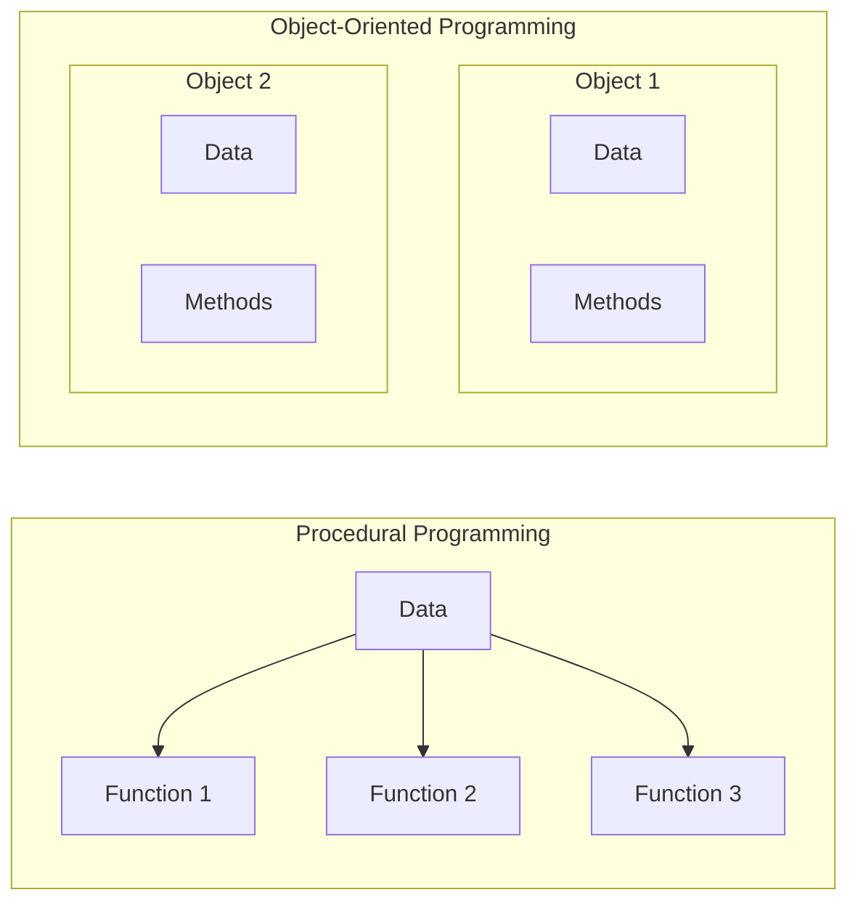
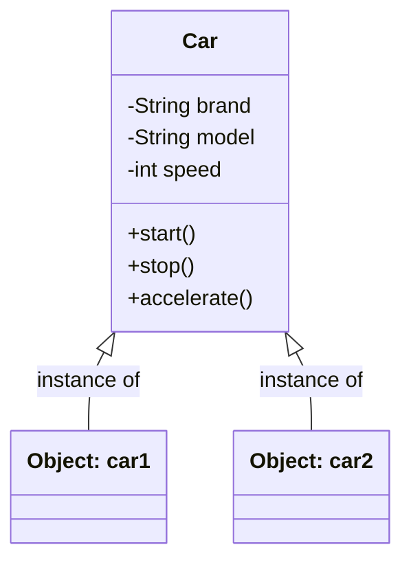
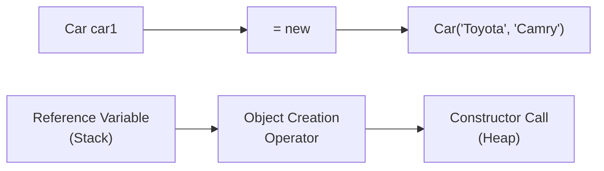
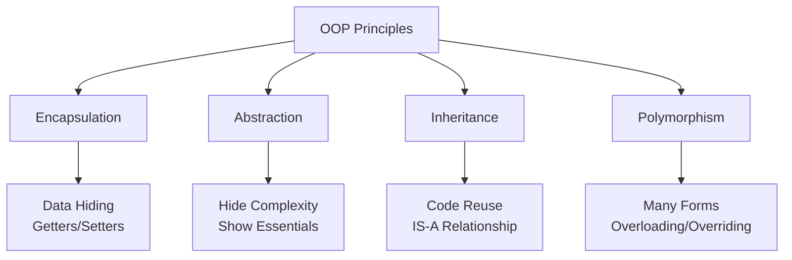
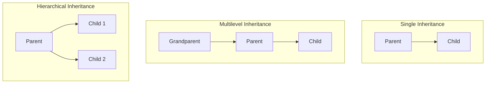

# Session 4: Object Oriented Programming Concepts

## 📚 Introduction to OOP

**Object-Oriented Programming (OOP)** is a programming paradigm based on the concept of "objects" that contain data and code. Data comes in the form of fields (attributes/properties), and code comes in the form of procedures (methods/functions).

### Procedural vs Object-Oriented Programming

| Aspect | Procedural | Object-Oriented |
|--------|------------|-----------------|
| **Focus** | Functions/Procedures | Objects |
| **Data** | Global data | Encapsulated in objects |
| **Approach** | Top-down | Bottom-up |
| **Security** | Less secure (data exposed) | More secure (data hidden) |
| **Reusability** | Limited | High (inheritance) |
| **Examples** | C, Pascal, FORTRAN | Java, C++, Python |



---

## 🏗️ Classes and Objects

### What is a Class?

A **class** is a blueprint or template for creating objects. It defines:
- **Attributes** (what an object has) - variables/fields
- **Behaviors** (what an object does) - methods

### What is an Object?

An **object** is an instance of a class. It is a real-world entity with:
- **State** - represented by attributes
- **Behavior** - represented by methods
- **Identity** - unique identification (memory address)



### Class and Object Example

```java
// Class definition (Blueprint)
public class Car {
    // Attributes (Instance Variables)
    String brand;
    String model;
    int speed;
    
    // Constructor
    public Car(String brand, String model) {
        this.brand = brand;
        this.model = model;
        this.speed = 0;
    }
    
    // Behaviors (Methods)
    public void start() {
        System.out.println(brand + " " + model + " started");
    }
    
    public void accelerate(int increment) {
        speed += increment;
        System.out.println("Speed: " + speed + " km/h");
    }
    
    public void stop() {
        speed = 0;
        System.out.println("Car stopped");
    }
}

// Creating Objects
public class Main {
    public static void main(String[] args) {
        // Object creation using 'new' keyword
        Car car1 = new Car("Toyota", "Camry");
        Car car2 = new Car("Honda", "Civic");
        
        // Each object has its own state
        car1.start();           // Toyota Camry started
        car1.accelerate(60);    // Speed: 60 km/h
        
        car2.start();           // Honda Civic started
        car2.accelerate(80);    // Speed: 80 km/h
        
        // car1 and car2 are independent objects
    }
}
```

### Object Creation Process



---

## 🎯 Four Pillars of OOP



---

## 🔒 Encapsulation

**Encapsulation** is the bundling of data (variables) and methods that operate on the data into a single unit (class), and restricting direct access to some of the object's components.

### Implementation

1. Declare instance variables as `private`
2. Provide `public` getter and setter methods
3. Apply validation logic in setters

```java
public class Employee {
    // Private fields - cannot be accessed directly from outside
    private int id;
    private String name;
    private double salary;
    
    // Constructor
    public Employee(int id, String name, double salary) {
        this.id = id;
        this.name = name;
        setSalary(salary);  // Use setter for validation
    }
    
    // Getter methods (Accessors)
    public int getId() {
        return id;
    }
    
    public String getName() {
        return name;
    }
    
    public double getSalary() {
        return salary;
    }
    
    // Setter methods (Mutators) with validation
    public void setName(String name) {
        if (name != null && !name.isEmpty()) {
            this.name = name;
        }
    }
    
    public void setSalary(double salary) {
        if (salary >= 0) {
            this.salary = salary;
        } else {
            System.out.println("Invalid salary");
        }
    }
}

// Usage
Employee emp = new Employee(1, "John", 50000);
// emp.salary = -1000;  // ERROR: salary is private
emp.setSalary(-1000);   // Validation prevents negative salary
```

### Benefits of Encapsulation

| Benefit | Description |
|---------|-------------|
| **Data Hiding** | Internal state is hidden from outside |
| **Flexibility** | Implementation can change without affecting users |
| **Reusability** | Class can be reused in different contexts |
| **Testability** | Easier to test with controlled access |

---

## 🎭 Abstraction

**Abstraction** is the process of hiding implementation details and showing only the functionality to the user. It focuses on **what** an object does rather than **how** it does it.

### Real-World Example

| Object | What You Know | What's Hidden |
|--------|---------------|---------------|
| Car | Steering, Pedals, Gears | Engine mechanics, Fuel injection |
| ATM | Insert Card, Enter PIN | Transaction encryption, Bank communication |
| TV Remote | Press buttons | Infrared signals, Circuit logic |

### Implementation in Java

Abstraction is achieved using:
1. **Abstract Classes** (0-100% abstraction)
2. **Interfaces** (100% abstraction)

```java
// Abstract class example
abstract class Shape {
    protected String color;
    
    // Abstract method - no implementation
    abstract double calculateArea();
    
    // Concrete method
    public void setColor(String color) {
        this.color = color;
    }
}

class Circle extends Shape {
    private double radius;
    
    public Circle(double radius) {
        this.radius = radius;
    }
    
    @Override
    double calculateArea() {
        return Math.PI * radius * radius;
    }
}

class Rectangle extends Shape {
    private double length, width;
    
    public Rectangle(double length, double width) {
        this.length = length;
        this.width = width;
    }
    
    @Override
    double calculateArea() {
        return length * width;
    }
}
```

### Encapsulation vs Abstraction

| Encapsulation | Abstraction |
|---------------|-------------|
| Hides **data** | Hides **implementation** |
| Implemented via access modifiers | Implemented via abstract classes/interfaces |
| Groups data and methods | Focuses on essential features |
| Solves problem at implementation level | Solves problem at design level |

---

## 👨‍👧 Inheritance

**Inheritance** is a mechanism where a new class inherits properties and behaviors from an existing class. It provides code reusability and establishes an **IS-A** relationship.

### Terminology

| Term | Description |
|------|-------------|
| **Superclass/Parent/Base** | Class being inherited from |
| **Subclass/Child/Derived** | Class that inherits |
| **extends** | Keyword for class inheritance |
| **implements** | Keyword for interface inheritance |

```java
// Parent class
class Animal {
    protected String name;
    
    public Animal(String name) {
        this.name = name;
    }
    
    public void eat() {
        System.out.println(name + " is eating");
    }
    
    public void sleep() {
        System.out.println(name + " is sleeping");
    }
}

// Child class
class Dog extends Animal {
    private String breed;
    
    public Dog(String name, String breed) {
        super(name);  // Call parent constructor
        this.breed = breed;
    }
    
    public void bark() {
        System.out.println(name + " is barking");
    }
    
    // Method overriding
    @Override
    public void eat() {
        System.out.println(name + " (a " + breed + ") is eating dog food");
    }
}

// Usage
Dog dog = new Dog("Buddy", "Labrador");
dog.eat();    // Overridden method
dog.sleep();  // Inherited method
dog.bark();   // Dog's own method
```

### Types of Inheritance



> **Note:** Java does NOT support multiple inheritance with classes (to avoid Diamond Problem). Use interfaces instead.

---

## 🔄 Polymorphism

**Polymorphism** means "many forms". It allows objects to be treated as instances of their parent class while behavior is determined by the actual object type.

### Types of Polymorphism

| Type | Also Known As | When Resolved | How |
|------|---------------|---------------|-----|
| **Compile-time** | Static, Early Binding | Compilation | Method Overloading |
| **Runtime** | Dynamic, Late Binding | Execution | Method Overriding |

### Method Overloading (Compile-time)

Same method name, different parameters in the same class.

```java
class Calculator {
    // Same method name, different parameters
    int add(int a, int b) {
        return a + b;
    }
    
    int add(int a, int b, int c) {
        return a + b + c;
    }
    
    double add(double a, double b) {
        return a + b;
    }
}

Calculator calc = new Calculator();
calc.add(5, 10);        // Calls first method
calc.add(5, 10, 15);    // Calls second method
calc.add(5.5, 10.5);    // Calls third method
```

### Method Overriding (Runtime)

Same method signature in parent and child classes.

```java
class Shape {
    void draw() {
        System.out.println("Drawing Shape");
    }
}

class Circle extends Shape {
    @Override
    void draw() {
        System.out.println("Drawing Circle");
    }
}

class Rectangle extends Shape {
    @Override
    void draw() {
        System.out.println("Drawing Rectangle");
    }
}

// Runtime polymorphism
Shape s;
s = new Circle();
s.draw();  // Output: Drawing Circle

s = new Rectangle();
s.draw();  // Output: Drawing Rectangle
```

### Overloading vs Overriding

| Overloading | Overriding |
|-------------|------------|
| Same class | Parent-Child classes |
| Different parameters | Same signature |
| Compile-time | Runtime |
| Increases readability | Achieves polymorphism |
| Return type can differ | Return type must be same or covariant |

---

## 💡 Key MCQ Points

1. **Class** is a blueprint, **Object** is an instance
2. **Four OOP pillars**: Encapsulation, Abstraction, Inheritance, Polymorphism
3. **Encapsulation** = private variables + public getters/setters
4. **Abstraction** = hiding implementation, showing functionality
5. **Inheritance** = IS-A relationship, code reuse
6. **Polymorphism** = many forms (overloading + overriding)
7. **Java doesn't support multiple inheritance** with classes
8. **Overloading** = same name, different parameters (compile-time)
9. **Overriding** = same signature in parent-child (runtime)
10. **Abstract class** can have both abstract and concrete methods

### Common Questions

| Question | Answer |
|----------|--------|
| Can we create object of abstract class? | No |
| Can we have constructor in abstract class? | Yes |
| Can a class extend multiple classes? | No |
| Can a class implement multiple interfaces? | Yes |
