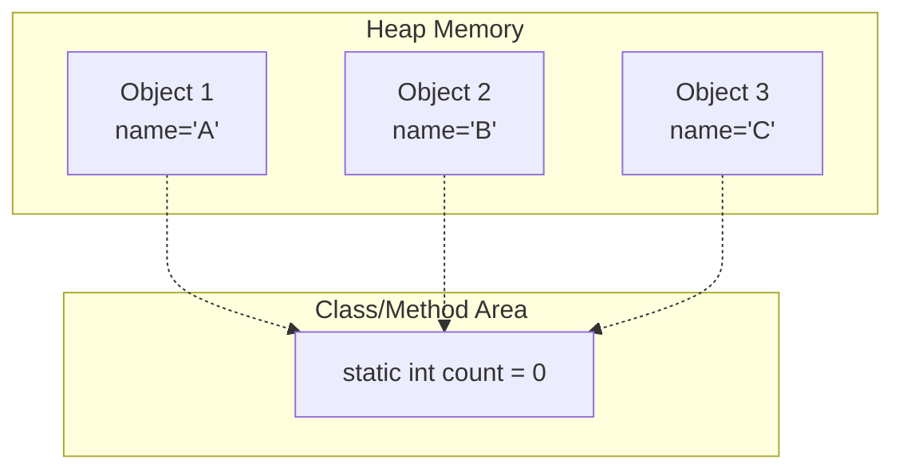
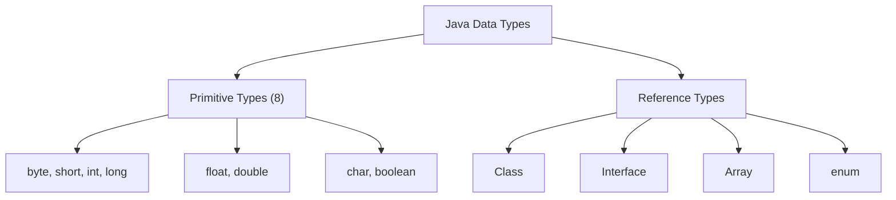
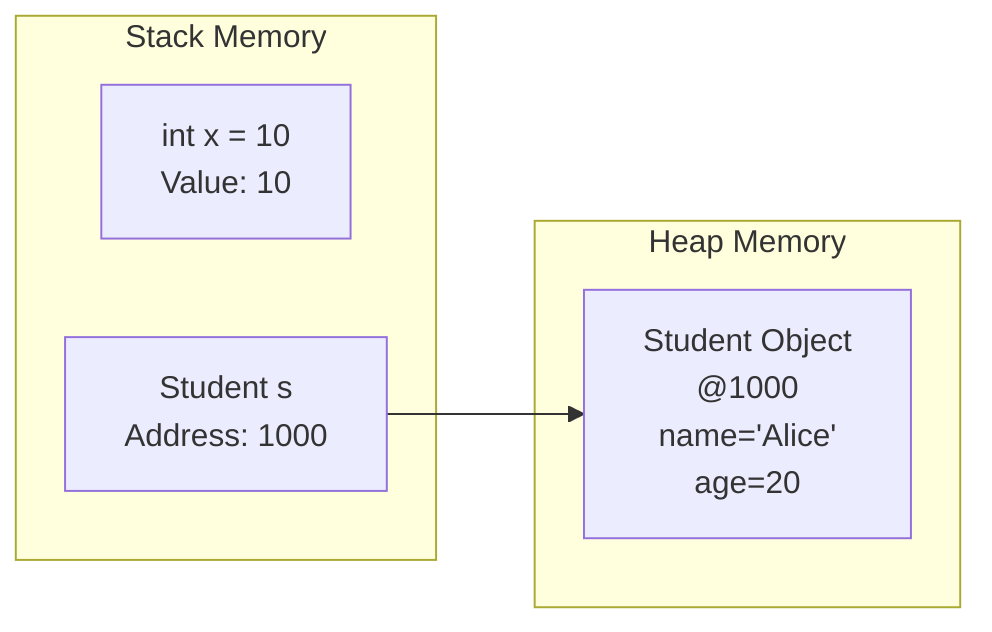
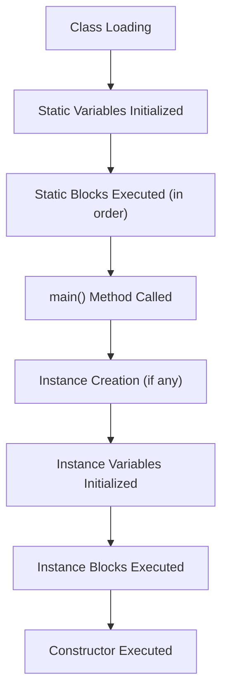

# Session 5: Static and Reference Variables

## 📚 Static Variables and Methods

**Static members** belong to the class rather than to any specific object. They are shared among all instances of the class.

### Static Variable Characteristics

| Characteristic | Description |
|----------------|-------------|
| Memory Allocation | Once, when class is loaded |
| Shared | Same value for all objects |
| Access | Via class name or object reference |
| Initialization | When class is loaded into memory |
| Default Values | Same as instance variables (0, null, false) |



### Static Variable Example

```java
public class Student {
    // Instance variable - each object has its own copy
    String name;
    int rollNo;
    
    // Static variable - shared among all objects
    static String collegeName = "CDAC";
    static int totalStudents = 0;
    
    public Student(String name, int rollNo) {
        this.name = name;
        this.rollNo = rollNo;
        totalStudents++;  // Increments for every new student
    }
    
    public void display() {
        System.out.println(name + " | " + rollNo + " | " + collegeName);
    }
    
    public static void main(String[] args) {
        Student s1 = new Student("Alice", 1);
        Student s2 = new Student("Bob", 2);
        Student s3 = new Student("Charlie", 3);
        
        System.out.println("Total Students: " + Student.totalStudents);  // 3
        
        // Changing static variable affects all objects
        Student.collegeName = "CDAC Mumbai";
        
        s1.display();  // Alice | 1 | CDAC Mumbai
        s2.display();  // Bob | 2 | CDAC Mumbai
        s3.display();  // Charlie | 3 | CDAC Mumbai
    }
}
```

### Static Methods

Static methods can:
- Be called without creating an object
- Access only static members directly
- NOT use `this` or `super` keywords

```java
public class MathUtils {
    public static int add(int a, int b) {
        return a + b;
    }
    
    public static int multiply(int a, int b) {
        return a * b;
    }
    
    public static void main(String[] args) {
        // Called using class name (preferred)
        int sum = MathUtils.add(5, 10);
        int product = MathUtils.multiply(5, 10);
        
        System.out.println("Sum: " + sum);        // 15
        System.out.println("Product: " + product); // 50
    }
}
```

### Static Method Restrictions

```java
public class StaticDemo {
    int instanceVar = 10;
    static int staticVar = 20;
    
    public static void staticMethod() {
        System.out.println(staticVar);     // OK - static accessing static
        // System.out.println(instanceVar); // ERROR - can't access non-static
        // System.out.println(this.x);      // ERROR - no 'this' in static
        
        // To access instance members, need an object
        StaticDemo obj = new StaticDemo();
        System.out.println(obj.instanceVar);  // OK
    }
    
    public void instanceMethod() {
        System.out.println(instanceVar);   // OK
        System.out.println(staticVar);     // OK - instance can access static
    }
}
```

### Accessing Static Members from Different Class

```java
// File: Counter.java
public class Counter {
    public static int count = 0;
    
    public static void increment() {
        count++;
    }
    
    public static int getCount() {
        return count;
    }
}

// File: Main.java
public class Main {
    public static void main(String[] args) {
        // Access via class name (preferred)
        Counter.increment();
        Counter.increment();
        System.out.println(Counter.count);     // 2
        System.out.println(Counter.getCount()); // 2
        
        // Access via object (works but not recommended)
        Counter obj = new Counter();
        obj.increment();
        System.out.println(obj.count);  // 3 (same as Counter.count)
    }
}
```

---

## 🔗 Reference Data Types

### Primitive vs Reference Types



### Key Differences

| Aspect | Primitive | Reference |
|--------|-----------|-----------|
| **Storage** | Actual value | Memory address |
| **Location** | Stack | Stack (reference) + Heap (object) |
| **Default** | 0, 0.0, false, '\u0000' | null |
| **Size** | Fixed (1-8 bytes) | Varies |
| **Null** | Cannot be null | Can be null |
| **Methods** | No methods | Has methods |
| **Examples** | int, char, boolean | String, Arrays, Classes |

### Memory Representation



### Reference Variables

```java
public class ReferenceDemo {
    public static void main(String[] args) {
        // Primitive variable - stores actual value
        int x = 10;
        
        // Reference variable - stores address of object
        String name = "Hello";  // Reference to String object
        Student s1 = new Student();  // Reference to Student object
        
        // Null reference
        Student s2 = null;  // Points to nothing
        // s2.getName();    // NullPointerException!
        
        // Reference assignment
        Student s3 = s1;  // Both point to same object
        s3.setName("Bob");
        System.out.println(s1.getName());  // "Bob" - same object!
    }
}
```

---

## 📊 Primitive vs Reference: Detailed Comparison

### Assignment Behavior

```java
public class AssignmentDemo {
    public static void main(String[] args) {
        // Primitive assignment - copies value
        int a = 10;
        int b = a;  // b gets copy of value
        b = 20;
        System.out.println(a);  // 10 (unchanged)
        System.out.println(b);  // 20
        
        // Reference assignment - copies address
        int[] arr1 = {1, 2, 3};
        int[] arr2 = arr1;  // arr2 points to same array
        arr2[0] = 100;
        System.out.println(arr1[0]);  // 100 (changed!)
    }
}
```

### Comparison Behavior

```java
public class ComparisonDemo {
    public static void main(String[] args) {
        // Primitive comparison - compares values
        int x = 10, y = 10;
        System.out.println(x == y);  // true
        
        // Reference comparison - compares addresses
        String s1 = new String("Hello");
        String s2 = new String("Hello");
        System.out.println(s1 == s2);      // false (different objects)
        System.out.println(s1.equals(s2)); // true (same content)
        
        // Special case: String pool
        String s3 = "Hello";
        String s4 = "Hello";
        System.out.println(s3 == s4);  // true (same pool object)
    }
}
```

---

## 🔄 Reference Variable vs Static Variable

| Aspect | Reference Variable | Static Variable |
|--------|-------------------|-----------------|
| **What it stores** | Address of an object | Actual value (primitive) or address (reference) |
| **Belongs to** | Individual object reference | Class itself |
| **Memory** | Stack (reference) | Method/Class Area |
| **Scope** | Can be local or instance | Class-level only |
| **Access** | Through variable name | Through class name |
| **Example** | `Student s = new Student()` | `static int count = 0` |

```java
public class Comparison {
    // Static variable
    static int staticCounter = 0;
    
    // Instance variable (reference type)
    String instanceName;
    
    public static void main(String[] args) {
        // Reference variable (local)
        Comparison obj1 = new Comparison();
        Comparison obj2 = new Comparison();
        
        obj1.instanceName = "Object 1";
        obj2.instanceName = "Object 2";
        
        // Static is shared
        Comparison.staticCounter = 10;
        System.out.println(obj1.staticCounter);  // 10
        System.out.println(obj2.staticCounter);  // 10
        
        // Instance is separate
        System.out.println(obj1.instanceName);   // Object 1
        System.out.println(obj2.instanceName);   // Object 2
    }
}
```

---

## 🧪 Static Block

A **static block** is used for static initialization. It runs once when the class is loaded.

```java
public class StaticBlockDemo {
    static int x;
    static int y;
    
    // Static block - runs when class loads
    static {
        System.out.println("Static block 1 executed");
        x = 10;
    }
    
    // Multiple static blocks - run in order
    static {
        System.out.println("Static block 2 executed");
        y = 20;
    }
    
    public static void main(String[] args) {
        System.out.println("Main method started");
        System.out.println("x = " + x + ", y = " + y);
    }
}

// Output:
// Static block 1 executed
// Static block 2 executed
// Main method started
// x = 10, y = 20
```

### Execution Order



---

## 💡 Key MCQ Points

1. **Static members** belong to class, not objects
2. **Static variables** are shared among all instances
3. **Static methods** can only access static members directly
4. **Cannot use `this`** or **`super`** in static context
5. **Reference types** store memory addresses
6. **Primitive types** store actual values
7. **`==`** compares addresses for references, values for primitives
8. **`.equals()`** compares content for objects
9. **Static block** runs once when class is loaded
10. **Default value** for reference types is `null`

### Quick Reference Table

| Feature | Static Variable | Instance Variable | Local Variable |
|---------|----------------|-------------------|----------------|
| Keyword | `static` | None | None |
| Memory | Method Area | Heap | Stack |
| Default Value | Yes | Yes | No (must initialize) |
| Access | ClassName.var | object.var | Directly |
| Lifetime | Class loading to unloading | Object creation to GC | Method start to end |

### Common Errors

| Error | Cause |
|-------|-------|
| `Non-static variable cannot be referenced from static context` | Accessing instance member in static method |
| `NullPointerException` | Using null reference |
| `Variable not initialized` | Using local variable without value |
