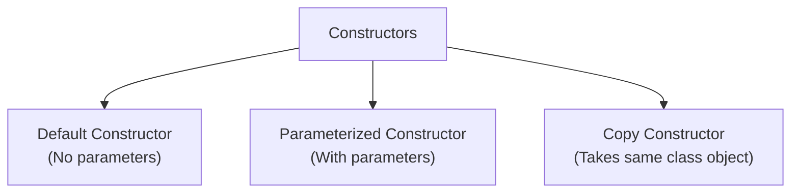
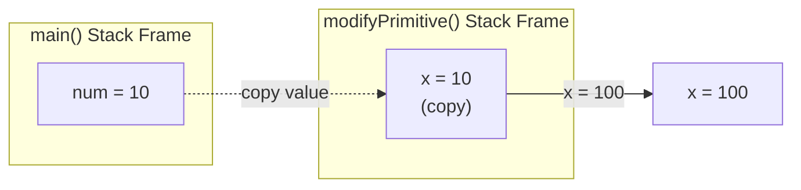
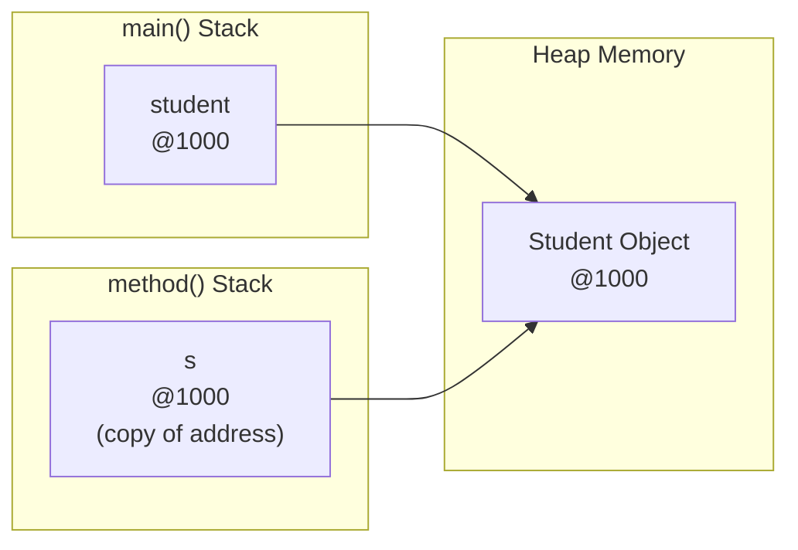
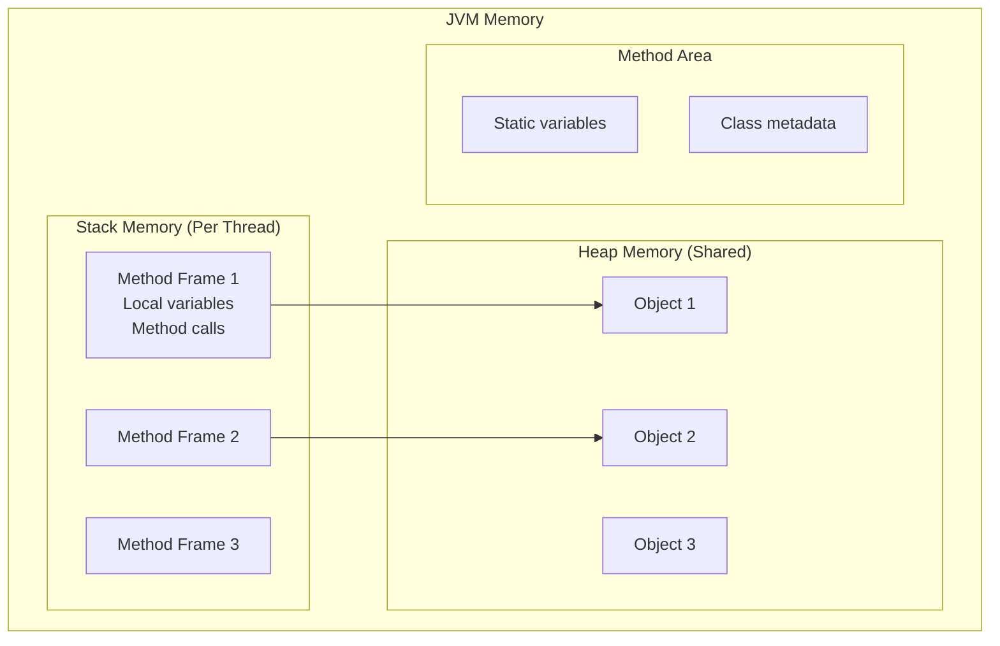
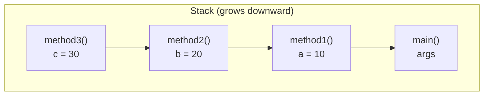

# Session 6: Constructors and Memory Management

## 📚 Constructors

A **constructor** is a special method that is called when an object is created. It initializes the object's state.

### Constructor Characteristics

| Property | Description |
|----------|-------------|
| **Name** | Same as class name |
| **Return Type** | No return type (not even void) |
| **Called When** | Object is created with `new` |
| **Cannot Be** | static, final, abstract, synchronized |
| **Can Be** | public, private, protected, default |

### Types of Constructors



### Constructor Examples

```java
public class Student {
    int rollNo;
    String name;
    int age;
    
    // 1. Default Constructor (No-arg)
    public Student() {
        rollNo = 0;
        name = "Unknown";
        age = 0;
        System.out.println("Default constructor called");
    }
    
    // 2. Parameterized Constructor
    public Student(int rollNo, String name, int age) {
        this.rollNo = rollNo;
        this.name = name;
        this.age = age;
        System.out.println("Parameterized constructor called");
    }
    
    // 3. Partial Parameterized Constructor
    public Student(String name) {
        this.rollNo = 0;
        this.name = name;
        this.age = 0;
    }
    
    // 4. Copy Constructor
    public Student(Student other) {
        this.rollNo = other.rollNo;
        this.name = other.name;
        this.age = other.age;
        System.out.println("Copy constructor called");
    }
    
    public void display() {
        System.out.println(rollNo + " | " + name + " | " + age);
    }
    
    public static void main(String[] args) {
        Student s1 = new Student();                    // Default
        Student s2 = new Student(1, "Alice", 20);      // Parameterized
        Student s3 = new Student("Bob");               // Partial
        Student s4 = new Student(s2);                  // Copy
        
        s1.display();  // 0 | Unknown | 0
        s2.display();  // 1 | Alice | 20
        s4.display();  // 1 | Alice | 20 (copy of s2)
    }
}
```

### Default Constructor Rules

```java
// Compiler provides default constructor ONLY if no constructor is defined
class Example1 {
    int x;
    // Compiler adds: public Example1() { }
}

class Example2 {
    int x;
    
    // If we define any constructor, compiler doesn't add default
    public Example2(int x) {
        this.x = x;
    }
    
    public static void main(String[] args) {
        // Example2 e = new Example2();  // ERROR: no default constructor!
        Example2 e = new Example2(10);   // OK
    }
}
```

---

## 🔗 Initializing Reference Variables Using Constructors

```java
class Address {
    String city;
    String state;
    int pincode;
    
    public Address(String city, String state, int pincode) {
        this.city = city;
        this.state = state;
        this.pincode = pincode;
    }
    
    @Override
    public String toString() {
        return city + ", " + state + " - " + pincode;
    }
}

class Employee {
    int empId;
    String name;
    Address address;  // Reference variable
    
    // Constructor initializing reference variable
    public Employee(int empId, String name, Address address) {
        this.empId = empId;
        this.name = name;
        this.address = address;  // Reference assignment
    }
    
    // Alternative: Create Address inside constructor
    public Employee(int empId, String name, String city, String state, int pin) {
        this.empId = empId;
        this.name = name;
        this.address = new Address(city, state, pin);
    }
    
    public void display() {
        System.out.println(empId + " | " + name + " | " + address);
    }
}

public class Main {
    public static void main(String[] args) {
        // Method 1: Create Address first
        Address addr = new Address("Mumbai", "Maharashtra", 400001);
        Employee e1 = new Employee(101, "John", addr);
        
        // Method 2: Create Address in constructor call
        Employee e2 = new Employee(102, "Jane", 
            new Address("Pune", "Maharashtra", 411001));
        
        // Method 3: Use constructor that creates Address
        Employee e3 = new Employee(103, "Bob", "Delhi", "Delhi", 110001);
        
        e1.display();
        e2.display();
        e3.display();
    }
}
```

---

## 📤 Pass by Value vs Pass by Reference

> **Important:** Java is **strictly pass by value**. However, for objects, the value passed is the reference (memory address).

### Passing Primitives (Pass by Value)

```java
public class PassByValueDemo {
    public static void modifyPrimitive(int x) {
        x = 100;  // Modifies local copy
        System.out.println("Inside method: x = " + x);
    }
    
    public static void main(String[] args) {
        int num = 10;
        System.out.println("Before: num = " + num);  // 10
        
        modifyPrimitive(num);  // Pass copy of value
        
        System.out.println("After: num = " + num);   // 10 (unchanged!)
    }
}
```



### Passing Objects (Pass by Reference Value)

```java
class Student {
    String name;
    int age;
    
    Student(String name, int age) {
        this.name = name;
        this.age = age;
    }
}

public class PassObjectDemo {
    public static void modifyObject(Student s) {
        s.name = "Changed";  // Modifies the actual object
        s.age = 99;
    }
    
    public static void reassignObject(Student s) {
        s = new Student("New", 50);  // Creates new object, doesn't affect original
    }
    
    public static void main(String[] args) {
        Student student = new Student("Original", 20);
        
        System.out.println("Before modify: " + student.name);  // Original
        modifyObject(student);
        System.out.println("After modify: " + student.name);   // Changed
        
        System.out.println("Before reassign: " + student.name); // Changed
        reassignObject(student);
        System.out.println("After reassign: " + student.name);  // Changed (not New!)
    }
}
```



### Summary Table

| Scenario | Original Changed? | Why? |
|----------|------------------|------|
| Modify primitive parameter | No | Copy of value passed |
| Modify object's fields | Yes | Both references point to same object |
| Reassign reference parameter | No | Only local copy of reference changes |

---

## 🔄 Re-assigning Reference Variables

```java
public class ReassignDemo {
    public static void main(String[] args) {
        Student s1 = new Student("Alice", 20);  // Object 1 at @1000
        Student s2 = new Student("Bob", 22);    // Object 2 at @2000
        
        System.out.println(s1.name);  // Alice
        System.out.println(s2.name);  // Bob
        
        // Reassign s1 to point to the same object as s2
        s1 = s2;
        
        System.out.println(s1.name);  // Bob (s1 now points to Object 2)
        System.out.println(s1 == s2); // true (same reference)
        
        // Object 1 at @1000 is now eligible for garbage collection
        // (no reference pointing to it)
        
        s1.name = "Charlie";
        System.out.println(s2.name);  // Charlie (both point to same object)
    }
}
```

---

## 📬 Passing Reference Variable to Method

```java
class Account {
    double balance;
    
    Account(double balance) {
        this.balance = balance;
    }
}

public class BankDemo {
    // Method receiving reference variable
    public static void deposit(Account acc, double amount) {
        acc.balance += amount;
    }
    
    public static void transfer(Account from, Account to, double amount) {
        if (from.balance >= amount) {
            from.balance -= amount;
            to.balance += amount;
            System.out.println("Transfer successful");
        } else {
            System.out.println("Insufficient balance");
        }
    }
    
    public static void main(String[] args) {
        Account savings = new Account(10000);
        Account current = new Account(5000);
        
        System.out.println("Savings: " + savings.balance);  // 10000
        
        deposit(savings, 2000);
        System.out.println("After deposit: " + savings.balance);  // 12000
        
        transfer(savings, current, 3000);
        System.out.println("Savings: " + savings.balance);  // 9000
        System.out.println("Current: " + current.balance);  // 8000
    }
}
```

---

## 🏠 Heap Memory and Stack Memory

### Memory Areas in JVM



### Stack vs Heap Comparison

| Aspect | Stack Memory | Heap Memory |
|--------|-------------|-------------|
| **Stores** | Primitives, references, method calls | Objects, instance variables |
| **Access** | LIFO (Last In, First Out) | Random access |
| **Speed** | Faster | Slower |
| **Size** | Smaller, fixed | Larger, dynamic |
| **Thread** | Each thread has own stack | Shared among all threads |
| **Lifetime** | Method execution scope | Until garbage collected |
| **Error** | StackOverflowError | OutOfMemoryError |

### Memory Allocation Example

```java
public class MemoryDemo {
    int instanceVar = 10;           // Stored in Heap (with object)
    static int staticVar = 20;      // Stored in Method Area
    
    public void method() {
        int localVar = 30;          // Stored in Stack
        String str = "Hello";       // str (reference) in Stack, 
                                    // String object in Heap
        
        Student s = new Student();  // s (reference) in Stack,
                                    // Student object in Heap
    }
    
    public static void main(String[] args) {
        MemoryDemo obj = new MemoryDemo();
        obj.method();
    }
}
```

### Visualization

```
┌─────────────────────────────────────────────────────────────┐
│                      JVM MEMORY                             │
├─────────────────────────────────────────────────────────────┤
│                                                             │
│  ┌──────────────┐  ┌───────────────────────────────────┐   │
│  │    STACK     │  │              HEAP                  │   │
│  │              │  │                                    │   │
│  │ ┌──────────┐ │  │  ┌─────────────────────────────┐  │   │
│  │ │  main()  │ │  │  │ MemoryDemo Object @1000     │  │   │
│  │ │ obj=@1000│─┼──┼──┤ instanceVar = 10            │  │   │
│  │ └──────────┘ │  │  └─────────────────────────────┘  │   │
│  │              │  │                                    │   │
│  │ ┌──────────┐ │  │  ┌─────────────────────────────┐  │   │
│  │ │ method() │ │  │  │ Student Object @2000        │  │   │
│  │ │localVar=30│ │  │  │                             │  │   │
│  │ │str=@3000 │─┼──┼──┤─ ─ ─ ─ ─ ─ ─ ─ ─ ─ ─ ─ ─ ─ │  │   │
│  │ │s=@2000   │─┼──┼──┤                             │  │   │
│  │ └──────────┘ │  │  └─────────────────────────────┘  │   │
│  │              │  │                                    │   │
│  └──────────────┘  │  ┌─────────────────────────────┐  │   │
│                    │  │ String Object @3000         │  │   │
│  ┌──────────────┐  │  │ "Hello"                     │  │   │
│  │ METHOD AREA  │  │  └─────────────────────────────┘  │   │
│  │              │  │                                    │   │
│  │staticVar = 20│  └───────────────────────────────────┘   │
│  │ Class Data   │                                          │
│  └──────────────┘                                          │
└─────────────────────────────────────────────────────────────┘
```

### Method Call Stack

```java
public class StackDemo {
    public static void main(String[] args) {
        method1();
    }
    
    static void method1() {
        int a = 10;
        method2();
    }
    
    static void method2() {
        int b = 20;
        method3();
    }
    
    static void method3() {
        int c = 30;
        // Stack: main -> method1 -> method2 -> method3
    }
    // Methods return in reverse order (LIFO)
}
```



---

## 💡 Key MCQ Points

1. **Constructor** has no return type (not even void)
2. **Default constructor** added only if no constructor is defined
3. **Java is pass by value** - for objects, value of reference is passed
4. Modifying object fields **affects original**, reassigning reference **doesn't**
5. **Stack** stores: local variables, method calls, references
6. **Heap** stores: objects, instance variables
7. **Method Area** stores: static variables, class metadata
8. **Each thread** has its own stack, **heap is shared**
9. **StackOverflowError**: too many method calls (infinite recursion)
10. **OutOfMemoryError**: heap is full

### Constructor Chaining

```java
class Demo {
    Demo() {
        this(10);  // Must be first statement
        System.out.println("Default constructor");
    }
    
    Demo(int x) {
        System.out.println("Parameterized: " + x);
    }
}

// Output when new Demo() is called:
// Parameterized: 10
// Default constructor
```

### Quick Memory Quiz

| Code | Stack | Heap |
|------|-------|------|
| `int x = 5;` | x = 5 | - |
| `String s = "Hi";` | s = @addr | "Hi" |
| `int[] a = new int[3];` | a = @addr | {0, 0, 0} |
| `static int y = 10;` | - | - (Method Area) |
