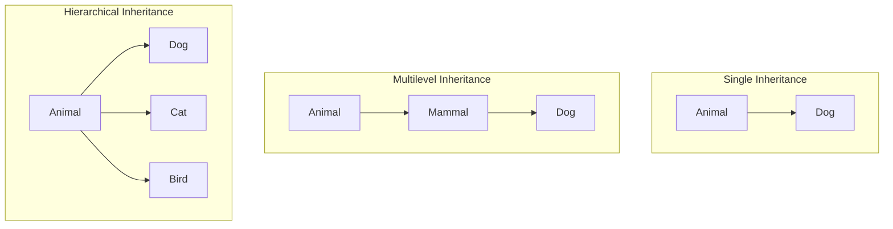
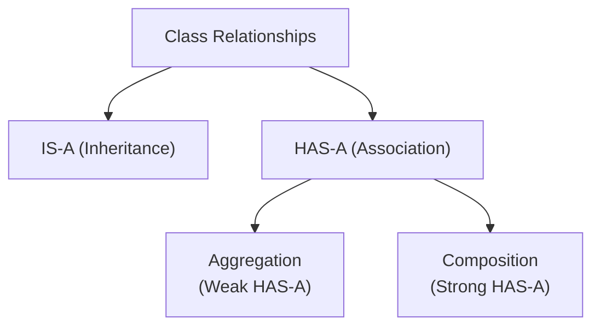

# Session 7: Inheritance and Polymorphism

## 📚 Inheritance Types

Inheritance allows a class to inherit properties and methods from another class, promoting code reuse.

### Types of Inheritance in Java



### Single Inheritance

```java
class Animal {
    String name;
    
    void eat() {
        System.out.println(name + " is eating");
    }
}

class Dog extends Animal {
    void bark() {
        System.out.println(name + " is barking");
    }
}

// Usage
Dog dog = new Dog();
dog.name = "Buddy";
dog.eat();   // Inherited from Animal
dog.bark();  // Dog's own method
```

### Multilevel Inheritance

```java
class Animal {
    void breathe() {
        System.out.println("Breathing");
    }
}

class Mammal extends Animal {
    void walk() {
        System.out.println("Walking");
    }
}

class Dog extends Mammal {
    void bark() {
        System.out.println("Barking");
    }
}

// Dog has access to: breathe(), walk(), bark()
Dog dog = new Dog();
dog.breathe();  // From Animal
dog.walk();     // From Mammal
dog.bark();     // Own method
```

### Hierarchical Inheritance

```java
class Shape {
    void draw() {
        System.out.println("Drawing shape");
    }
}

class Circle extends Shape {
    @Override
    void draw() {
        System.out.println("Drawing circle");
    }
}

class Rectangle extends Shape {
    @Override
    void draw() {
        System.out.println("Drawing rectangle");
    }
}

class Triangle extends Shape {
    @Override
    void draw() {
        System.out.println("Drawing triangle");
    }
}
```

> **Note:** Java does NOT support multiple inheritance with classes to avoid the Diamond Problem. Use interfaces instead.

---

## 🔗 Association, Aggregation, and Composition

These represent relationships between classes.



### Comparison Table

| Aspect | Association | Aggregation | Composition |
|--------|-------------|-------------|-------------|
| **Relationship** | General connection | Weak HAS-A | Strong HAS-A |
| **Dependency** | Independent | Child can exist alone | Child cannot exist without parent |
| **Lifetime** | Independent | Independent | Dependent |
| **Symbol (UML)** | → | ◇─── | ◆─── |
| **Example** | Teacher-Student | Department-Professor | House-Room |

### Association Example

```java
// Loose relationship - objects can exist independently
class Teacher {
    String name;
}

class Student {
    String name;
    Teacher teacher;  // Association
    
    void setTeacher(Teacher t) {
        this.teacher = t;
    }
}

// Both can exist independently
Teacher t = new Teacher();
Student s = new Student();
s.setTeacher(t);
```

### Aggregation Example (Weak HAS-A)

```java
// Department HAS Professors, but Professors can exist without Department
class Professor {
    String name;
    
    Professor(String name) {
        this.name = name;
    }
}

class Department {
    String name;
    List<Professor> professors;  // Aggregation
    
    Department(String name) {
        this.name = name;
        this.professors = new ArrayList<>();
    }
    
    void addProfessor(Professor p) {
        professors.add(p);  // Professor created outside
    }
}

// Usage
Professor p1 = new Professor("Dr. Smith");
Professor p2 = new Professor("Dr. Jones");

Department cs = new Department("Computer Science");
cs.addProfessor(p1);
cs.addProfessor(p2);

// If department is deleted, professors still exist
```

### Composition Example (Strong HAS-A)

```java
// House HAS Rooms, Rooms cannot exist without House
class Room {
    String name;
    int area;
    
    Room(String name, int area) {
        this.name = name;
        this.area = area;
    }
}

class House {
    private List<Room> rooms;  // Composition
    
    House() {
        // Rooms created inside House
        rooms = new ArrayList<>();
        rooms.add(new Room("Living Room", 200));
        rooms.add(new Room("Bedroom", 150));
        rooms.add(new Room("Kitchen", 100));
    }
}

// When House is destroyed, Rooms are also destroyed
```

---

## 🔄 Polymorphism

### Compile-Time Polymorphism (Method Overloading)

Same method name, different parameters in the **same class**.

```java
class Calculator {
    // Overloaded methods
    int add(int a, int b) {
        return a + b;
    }
    
    int add(int a, int b, int c) {
        return a + b + c;
    }
    
    double add(double a, double b) {
        return a + b;
    }
    
    String add(String a, String b) {
        return a + b;
    }
}

Calculator calc = new Calculator();
System.out.println(calc.add(5, 10));        // 15
System.out.println(calc.add(5, 10, 15));    // 30
System.out.println(calc.add(5.5, 10.5));    // 16.0
System.out.println(calc.add("Hello", " World")); // Hello World
```

### Overloading Rules

| Valid Overloading | Invalid Overloading |
|-------------------|---------------------|
| Different number of parameters | Different return type only |
| Different parameter types | Different exception thrown |
| Different parameter order | Different access modifier |

### Runtime Polymorphism (Method Overriding)

Same method signature in **parent and child classes**.

```java
class Vehicle {
    void start() {
        System.out.println("Vehicle starting");
    }
}

class Car extends Vehicle {
    @Override
    void start() {
        System.out.println("Car starting with key");
    }
}

class Bike extends Vehicle {
    @Override
    void start() {
        System.out.println("Bike starting with kick");
    }
}

// Runtime polymorphism
Vehicle v;

v = new Car();
v.start();  // Output: Car starting with key

v = new Bike();
v.start();  // Output: Bike starting with kick
```

### Overriding Rules

| Rule | Description |
|------|-------------|
| **Same signature** | Method name and parameters must match |
| **Return type** | Same or covariant (subtype) |
| **Access modifier** | Same or less restrictive |
| **Exceptions** | Same, subclass, or fewer exceptions |
| **Cannot override** | static, final, private methods |
| **@Override** | Optional but recommended annotation |

```java
class Parent {
    protected Number getValue() throws IOException {
        return 10;
    }
}

class Child extends Parent {
    @Override
    public Integer getValue() throws FileNotFoundException {
        // public (less restrictive than protected) ✓
        // Integer (subtype of Number) ✓
        // FileNotFoundException (subclass of IOException) ✓
        return 20;
    }
}
```

---

## 🔑 super and this Keywords

### this Keyword

Refers to the **current object**.

```java
class Student {
    String name;
    int age;
    
    // 1. Distinguish instance variable from parameter
    Student(String name, int age) {
        this.name = name;  // this.name = instance variable
        this.age = age;
    }
    
    // 2. Call another constructor
    Student(String name) {
        this(name, 0);  // Calls Student(String, int)
    }
    
    // 3. Return current object
    Student setName(String name) {
        this.name = name;
        return this;  // For method chaining
    }
    
    // 4. Pass current object as parameter
    void display() {
        print(this);
    }
    
    static void print(Student s) {
        System.out.println(s.name);
    }
}
```

### super Keyword

Refers to the **parent class**.

```java
class Animal {
    String name = "Animal";
    
    Animal() {
        System.out.println("Animal constructor");
    }
    
    void display() {
        System.out.println("Animal display");
    }
}

class Dog extends Animal {
    String name = "Dog";
    
    Dog() {
        super();  // Call parent constructor (implicit if not specified)
        System.out.println("Dog constructor");
    }
    
    @Override
    void display() {
        System.out.println("Dog display");
        super.display();  // Call parent method
    }
    
    void showNames() {
        System.out.println(name);        // Dog (current class)
        System.out.println(this.name);   // Dog
        System.out.println(super.name);  // Animal (parent class)
    }
}
```

### this() vs super()

| this() | super() |
|--------|---------|
| Calls constructor of same class | Calls constructor of parent class |
| Must be first statement | Must be first statement |
| Cannot use both together | Cannot use both together |
| Used for constructor chaining | Used to initialize parent |

---

## 💡 Key MCQ Points

1. **Single, Multilevel, Hierarchical** inheritance supported in Java
2. **Multiple inheritance** NOT supported with classes (use interfaces)
3. **Aggregation** = weak HAS-A (part can exist independently)
4. **Composition** = strong HAS-A (part cannot exist without whole)
5. **Overloading** = same name, different parameters (compile-time)
6. **Overriding** = same signature in parent-child (runtime)
7. Cannot override **static, final, private** methods
8. **@Override** annotation is optional but recommended
9. **this** = current object, **super** = parent class
10. **this()** and **super()** must be first statement, cannot use together

### Overloading vs Overriding Summary

| Aspect | Overloading | Overriding |
|--------|-------------|------------|
| Class | Same class | Parent-Child |
| Parameters | Must differ | Must be same |
| Return type | Can differ | Same or covariant |
| Polymorphism | Compile-time | Runtime |
| static methods | Yes | No (hiding) |
| private methods | Yes | No |
| final methods | Yes | No |
