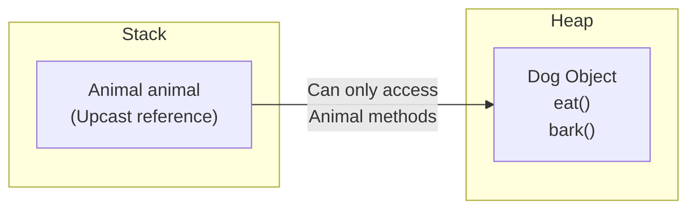
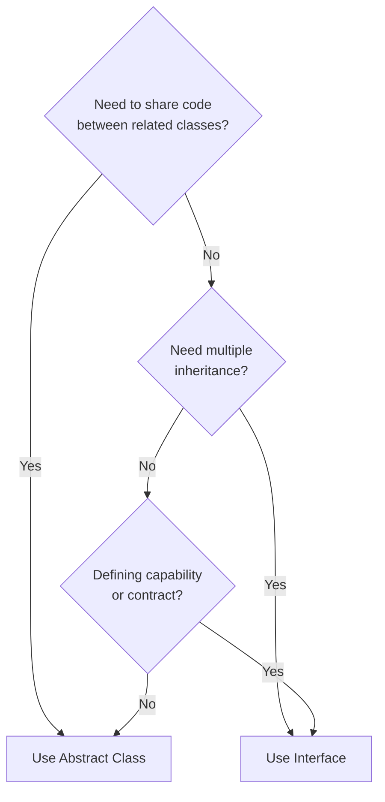

# Session 8: Abstract Classes and Interfaces

## 📚 Upcasting and Downcasting

### Upcasting (Implicit)

Converting a subclass reference to a superclass reference. It's **automatic** and **safe**.

```java
class Animal {
    void eat() {
        System.out.println("Animal eating");
    }
}

class Dog extends Animal {
    void bark() {
        System.out.println("Dog barking");
    }
}

// Upcasting: Dog reference to Animal reference
Animal animal = new Dog();  // Implicit upcasting
animal.eat();    // OK - inherited method
// animal.bark(); // ERROR - Animal doesn't know about bark()
```



### Downcasting (Explicit)

Converting a superclass reference back to a subclass reference. Requires **explicit cast** and can throw **ClassCastException**.

```java
Animal animal = new Dog();  // Upcasting

// Downcasting: Animal reference back to Dog
Dog dog = (Dog) animal;  // Explicit downcasting
dog.eat();   // OK
dog.bark();  // OK - now accessible

// WRONG: Casting to unrelated type
// Cat cat = (Cat) animal;  // ClassCastException!
```

### Safe Downcasting with instanceof

```java
Animal animal = new Dog();

if (animal instanceof Dog) {
    Dog dog = (Dog) animal;
    dog.bark();  // Safe
}

// Java 16+ Pattern Matching
if (animal instanceof Dog dog) {
    dog.bark();  // dog is automatically cast
}
```

### Casting Summary

| Type | Direction | Syntax | Safe? |
|------|-----------|--------|-------|
| **Upcasting** | Child → Parent | Implicit | Always safe |
| **Downcasting** | Parent → Child | Explicit cast | Use instanceof |

---

## 🎭 Abstract Classes

An **abstract class** cannot be instantiated and may contain abstract methods (without implementation).

### Characteristics

| Feature | Description |
|---------|-------------|
| **Keyword** | `abstract` |
| **Instantiation** | Cannot create objects directly |
| **Abstract methods** | Can have (no body) |
| **Concrete methods** | Can have (with body) |
| **Constructors** | Can have |
| **Variables** | Can have instance and static |
| **Inheritance** | Must be extended |

```java
abstract class Shape {
    String color;
    
    // Constructor
    Shape(String color) {
        this.color = color;
    }
    
    // Abstract method - no body
    abstract double calculateArea();
    
    // Concrete method - has body
    void displayColor() {
        System.out.println("Color: " + color);
    }
}

class Circle extends Shape {
    double radius;
    
    Circle(String color, double radius) {
        super(color);
        this.radius = radius;
    }
    
    @Override
    double calculateArea() {
        return Math.PI * radius * radius;
    }
}

class Rectangle extends Shape {
    double length, width;
    
    Rectangle(String color, double length, double width) {
        super(color);
        this.length = length;
        this.width = width;
    }
    
    @Override
    double calculateArea() {
        return length * width;
    }
}

// Usage
// Shape s = new Shape("Red");  // ERROR: Cannot instantiate
Shape circle = new Circle("Red", 5);
Shape rect = new Rectangle("Blue", 4, 6);

System.out.println(circle.calculateArea());  // 78.54
System.out.println(rect.calculateArea());    // 24.0
```

### Abstract Class Rules

1. Cannot be instantiated
2. Can have abstract and non-abstract methods
3. If a class has abstract method, class must be abstract
4. Abstract method cannot be `final`, `static`, or `private`
5. First concrete subclass must implement all abstract methods

---

## 📋 Interfaces

An **interface** is a completely abstract type that defines a contract for what a class can do.

### Interface Characteristics (Pre-Java 8)

| Feature | Description |
|---------|-------------|
| **Methods** | All public abstract (implicit) |
| **Variables** | All public static final (implicit) |
| **Constructors** | Not allowed |
| **Instantiation** | Cannot create objects |
| **Implementation** | Use `implements` keyword |

```java
interface Drawable {
    // Variables are public static final by default
    int MIN_SIZE = 1;  // automatically public static final
    
    // Methods are public abstract by default
    void draw();  // automatically public abstract
    double getArea();
}

interface Colorable {
    void setColor(String color);
    String getColor();
}

// Implementing multiple interfaces
class Circle implements Drawable, Colorable {
    private double radius;
    private String color;
    
    Circle(double radius) {
        this.radius = radius;
    }
    
    @Override
    public void draw() {
        System.out.println("Drawing circle with radius " + radius);
    }
    
    @Override
    public double getArea() {
        return Math.PI * radius * radius;
    }
    
    @Override
    public void setColor(String color) {
        this.color = color;
    }
    
    @Override
    public String getColor() {
        return color;
    }
}
```

### Multiple Interface Implementation

```java
interface Flyable {
    void fly();
}

interface Swimmable {
    void swim();
}

interface Walkable {
    void walk();
}

// A class can implement multiple interfaces
class Duck implements Flyable, Swimmable, Walkable {
    @Override
    public void fly() {
        System.out.println("Duck flying");
    }
    
    @Override
    public void swim() {
        System.out.println("Duck swimming");
    }
    
    @Override
    public void walk() {
        System.out.println("Duck walking");
    }
}
```

### Interface Inheritance

```java
interface A {
    void methodA();
}

interface B {
    void methodB();
}

// Interface extending multiple interfaces
interface C extends A, B {
    void methodC();
}

// Class implementing C must implement all methods
class MyClass implements C {
    @Override
    public void methodA() { }
    
    @Override
    public void methodB() { }
    
    @Override
    public void methodC() { }
}
```

---

## ⚖️ Abstract Class vs Interface

| Feature | Abstract Class | Interface |
|---------|----------------|-----------|
| **Methods** | Abstract + Concrete | All abstract (pre-Java 8) |
| **Variables** | Any type | Only public static final |
| **Constructors** | Yes | No |
| **Inheritance** | extends (single) | implements (multiple) |
| **Access Modifiers** | Any | public only (methods) |
| **When to use** | IS-A relationship, shared code | CAN-DO capability, contract |
| **Multiple** | Single inheritance | Multiple implementation |

### When to Use?



---

## 🆕 Java 8+ Interface Features

### Default Methods (Java 8)

```java
interface Vehicle {
    void start();
    
    // Default method - provides implementation
    default void honk() {
        System.out.println("Beep beep!");
    }
}

class Car implements Vehicle {
    @Override
    public void start() {
        System.out.println("Car starting");
    }
    
    // Can optionally override default method
}

Car car = new Car();
car.start();  // Car starting
car.honk();   // Beep beep! (default implementation)
```

### Static Methods (Java 8)

```java
interface MathOperations {
    static int add(int a, int b) {
        return a + b;
    }
    
    static int multiply(int a, int b) {
        return a * b;
    }
}

// Called using interface name
int sum = MathOperations.add(5, 10);  // 15
```

### Private Methods (Java 9)

```java
interface Logger {
    default void logInfo(String message) {
        log("INFO", message);
    }
    
    default void logError(String message) {
        log("ERROR", message);
    }
    
    // Private method - not accessible outside
    private void log(String level, String message) {
        System.out.println("[" + level + "] " + message);
    }
}
```

### Interface Evolution Summary

| Version | Feature Added |
|---------|---------------|
| Pre-Java 8 | Only abstract methods, constants |
| Java 8 | default methods, static methods |
| Java 9 | private methods |

---

## 💡 Key MCQ Points

1. **Upcasting** (Child→Parent) is implicit and safe
2. **Downcasting** (Parent→Child) requires explicit cast
3. Use **instanceof** before downcasting
4. **Abstract class** can have constructors, interfaces cannot
5. **Interface variables** are public static final by default
6. **Interface methods** are public abstract by default (pre-Java 8)
7. A class can **implement multiple interfaces**
8. An interface can **extend multiple interfaces**
9. **default methods** in interfaces (Java 8+)
10. **private methods** in interfaces (Java 9+)

### Quick Reference

| Cannot Be | Abstract Method | Interface Method |
|-----------|-----------------|------------------|
| final | ✓ | ✓ |
| static | ✓ | ✗ (static methods allowed) |
| private | ✓ | ✗ (private methods Java 9+) |
| native | ✓ | ✓ |
| synchronized | ✓ | ✓ |

### Common Errors

| Error | Cause |
|-------|-------|
| `ClassCastException` | Invalid downcasting |
| `Cannot instantiate abstract class` | Trying to create abstract class object |
| `Must implement abstract method` | Abstract method not implemented in concrete class |
