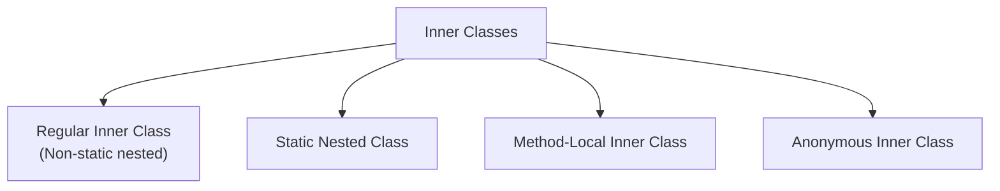

# Sessions 9 & 10: Advanced OOP Features

## 📚 Final Keyword

The `final` keyword restricts modification and can be applied to variables, methods, and classes.

### Final Variables (Constants)

```java
public class FinalDemo {
    // Final instance variable - must be initialized
    final int MAX_SIZE = 100;
    final String NAME;  // Blank final - initialized in constructor
    
    // Final static variable (constant)
    static final double PI = 3.14159;
    
    public FinalDemo(String name) {
        this.NAME = name;  // Blank final initialization
    }
    
    public void method() {
        final int localVar = 10;
        // localVar = 20;  // ERROR: Cannot modify
        
        // Final reference - reference cannot change, but object can
        final StringBuilder sb = new StringBuilder("Hello");
        sb.append(" World");  // OK - modifying object
        // sb = new StringBuilder();  // ERROR - can't reassign
    }
}
```

### Final Methods (Cannot be Overridden)

```java
class Parent {
    final void display() {
        System.out.println("Parent display");
    }
}

class Child extends Parent {
    // @Override
    // void display() { }  // ERROR: Cannot override final method
}
```

### Final Classes (Cannot be Inherited)

```java
final class ImmutableClass {
    private final int value;
    
    public ImmutableClass(int value) {
        this.value = value;
    }
    
    public int getValue() {
        return value;
    }
}

// class SubClass extends ImmutableClass { }  // ERROR: Cannot extend

// Examples of final classes in Java:
// String, Integer, Double, etc. (all wrapper classes)
```

### Final Summary Table

| Applied To | Effect |
|------------|--------|
| **Variable** | Value cannot be changed |
| **Method** | Cannot be overridden |
| **Class** | Cannot be extended |
| **Parameter** | Cannot be reassigned in method |

---

## 🔧 Functional Interfaces

A **functional interface** has exactly **one abstract method** (SAM - Single Abstract Method).

```java
// Functional interface
@FunctionalInterface
interface Calculator {
    int calculate(int a, int b);
    
    // Can have default methods
    default void print(int result) {
        System.out.println("Result: " + result);
    }
    
    // Can have static methods
    static void info() {
        System.out.println("Calculator interface");
    }
}

// Built-in Functional Interfaces (java.util.function)
// Predicate<T>    - boolean test(T t)
// Function<T,R>   - R apply(T t)
// Consumer<T>     - void accept(T t)
// Supplier<T>     - T get()
// BiFunction<T,U,R> - R apply(T t, U u)
```

### Common Functional Interfaces

| Interface | Method | Description |
|-----------|--------|-------------|
| `Predicate<T>` | `boolean test(T t)` | Tests a condition |
| `Function<T,R>` | `R apply(T t)` | Transforms input |
| `Consumer<T>` | `void accept(T t)` | Consumes input |
| `Supplier<T>` | `T get()` | Produces output |
| `Runnable` | `void run()` | Executes action |
| `Comparable<T>` | `int compareTo(T t)` | Compares objects |

---

## ➡️ Lambda Expressions

Lambda expressions provide a concise way to implement functional interfaces.

### Syntax

```
(parameters) -> expression
(parameters) -> { statements; }
```

### Examples

```java
// Traditional anonymous class
Calculator calc1 = new Calculator() {
    @Override
    public int calculate(int a, int b) {
        return a + b;
    }
};

// Lambda expression (equivalent)
Calculator calc2 = (a, b) -> a + b;

// Various lambda forms
Runnable r1 = () -> System.out.println("Hello");
Consumer<String> c1 = s -> System.out.println(s);
Function<Integer, Integer> f1 = x -> x * x;
BiFunction<Integer, Integer, Integer> bf = (a, b) -> a + b;

// Multi-line lambda
Calculator calc3 = (a, b) -> {
    int result = a + b;
    System.out.println("Calculating...");
    return result;
};
```

### Lambda with Collections

```java
List<String> names = Arrays.asList("Alice", "Bob", "Charlie");

// forEach with lambda
names.forEach(name -> System.out.println(name));

// Method reference (shorthand)
names.forEach(System.out::println);

// Sorting with lambda
names.sort((s1, s2) -> s1.compareTo(s2));

// Filtering with streams
names.stream()
     .filter(n -> n.startsWith("A"))
     .forEach(System.out::println);
```

### Method References

| Type | Syntax | Lambda Equivalent |
|------|--------|-------------------|
| Static method | `ClassName::staticMethod` | `x -> ClassName.staticMethod(x)` |
| Instance method | `object::instanceMethod` | `x -> object.instanceMethod(x)` |
| Constructor | `ClassName::new` | `x -> new ClassName(x)` |

```java
// Method reference examples
Function<String, Integer> f1 = Integer::parseInt;  // static
Consumer<String> c1 = System.out::println;         // instance
Supplier<List> s1 = ArrayList::new;                // constructor
```

---

## 🏠 Inner Classes

A class defined inside another class.

### Types of Inner Classes



### Regular Inner Class

```java
class Outer {
    private int outerVar = 10;
    
    class Inner {
        void display() {
            // Can access outer class members
            System.out.println("Outer var: " + outerVar);
        }
    }
    
    void createInner() {
        Inner inner = new Inner();
        inner.display();
    }
}

// Creating from outside
Outer outer = new Outer();
Outer.Inner inner = outer.new Inner();
inner.display();
```

### Static Nested Class

```java
class Outer {
    private static int staticVar = 20;
    private int instanceVar = 30;
    
    static class StaticNested {
        void display() {
            System.out.println("Static var: " + staticVar);
            // Cannot access instanceVar directly
        }
    }
}

// Creating - no need for outer instance
Outer.StaticNested nested = new Outer.StaticNested();
nested.display();
```

### Method-Local Inner Class

```java
class Outer {
    void method() {
        final int localVar = 10;  // effectively final required
        
        class LocalInner {
            void display() {
                System.out.println("Local var: " + localVar);
            }
        }
        
        LocalInner li = new LocalInner();
        li.display();
    }
}
```

### Anonymous Inner Class

```java
interface Greeting {
    void greet();
}

abstract class Message {
    abstract void show();
}

public class AnonymousDemo {
    public static void main(String[] args) {
        // Anonymous class implementing interface
        Greeting g = new Greeting() {
            @Override
            public void greet() {
                System.out.println("Hello!");
            }
        };
        g.greet();
        
        // Anonymous class extending abstract class
        Message m = new Message() {
            @Override
            void show() {
                System.out.println("Message here");
            }
        };
        m.show();
    }
}
```

### Inner Class Comparison

| Type | Access to Outer | Creation | Use Case |
|------|-----------------|----------|----------|
| Regular Inner | All members | Needs outer instance | Helper classes |
| Static Nested | Static members only | No outer instance | Static utilities |
| Method-Local | Outer + final locals | Inside method | One-time use |
| Anonymous | Outer + final locals | Inline | Quick implementation |

---

## 📋 Enum

An **enum** is a special class representing a group of constants.

```java
// Simple enum
enum Day {
    MONDAY, TUESDAY, WEDNESDAY, THURSDAY, FRIDAY, SATURDAY, SUNDAY
}

// Enum with fields and methods
enum Planet {
    MERCURY(3.303e+23, 2.4397e6),
    VENUS(4.869e+24, 6.0518e6),
    EARTH(5.976e+24, 6.37814e6),
    MARS(6.421e+23, 3.3972e6);
    
    private final double mass;    // in kg
    private final double radius;  // in meters
    
    // Constructor must be private
    Planet(double mass, double radius) {
        this.mass = mass;
        this.radius = radius;
    }
    
    public double getMass() {
        return mass;
    }
    
    public double getRadius() {
        return radius;
    }
    
    public double surfaceGravity() {
        final double G = 6.67300E-11;
        return G * mass / (radius * radius);
    }
}

// Usage
Day today = Day.MONDAY;
System.out.println(today);              // MONDAY
System.out.println(today.ordinal());    // 0 (index)
System.out.println(Day.values().length); // 7

for (Day d : Day.values()) {
    System.out.println(d);
}

// Switch with enum
switch (today) {
    case MONDAY:
        System.out.println("Start of week");
        break;
    case FRIDAY:
        System.out.println("Weekend coming!");
        break;
}
```

### Enum Methods

| Method | Description |
|--------|-------------|
| `values()` | Returns array of all constants |
| `ordinal()` | Returns position (0-based) |
| `name()` | Returns string name |
| `valueOf(String)` | Returns enum constant |
| `compareTo()` | Compares ordinal values |

---

## 💡 Key MCQ Points

1. **final variable** = constant, cannot be modified
2. **final method** = cannot be overridden
3. **final class** = cannot be extended
4. **@FunctionalInterface** = exactly one abstract method
5. **Lambda syntax**: `(params) -> expression`
6. **Method reference**: `ClassName::methodName`
7. **Regular inner class** needs outer instance
8. **Static nested class** doesn't need outer instance
9. **Anonymous class** = inline implementation
10. **Enum** values are implicitly `public static final`

### Lambda vs Anonymous Class

| Feature | Lambda | Anonymous Class |
|---------|--------|-----------------|
| Requires | Functional interface | Any interface/class |
| `this` keyword | Refers to enclosing class | Refers to anonymous class |
| Syntax | Concise | Verbose |
| State | Cannot have instance fields | Can have fields |

### Quick Reference

```java
// Functional Interface
@FunctionalInterface
interface MyFunc {
    int apply(int x);
}

// Lambda
MyFunc f = x -> x * 2;

// Anonymous Class
MyFunc f = new MyFunc() {
    public int apply(int x) {
        return x * 2;
    }
};

// Enum
enum Status { ACTIVE, INACTIVE, PENDING }
```
