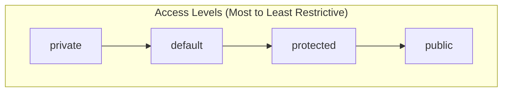

# Session 11: Access Modifiers and Packages

## 📚 Access Modifiers

Access modifiers control the visibility and accessibility of classes, methods, and variables.

### Four Access Levels



### Access Modifier Table

| Modifier | Class | Package | Subclass (same pkg) | Subclass (diff pkg) | World |
|----------|-------|---------|---------------------|---------------------|-------|
| `public` | ✅ | ✅ | ✅ | ✅ | ✅ |
| `protected` | ✅ | ✅ | ✅ | ✅ | ❌ |
| `default` | ✅ | ✅ | ✅ | ❌ | ❌ |
| `private` | ✅ | ❌ | ❌ | ❌ | ❌ |

### Examples

```java
package com.example.demo;

public class AccessDemo {
    public int publicVar = 1;        // Accessible everywhere
    protected int protectedVar = 2;  // Same package + subclasses
    int defaultVar = 3;              // Same package only (default)
    private int privateVar = 4;      // This class only
    
    public void publicMethod() { }
    protected void protectedMethod() { }
    void defaultMethod() { }
    private void privateMethod() { }
}
```

```java
// Same package
package com.example.demo;

class SamePackage {
    void test() {
        AccessDemo obj = new AccessDemo();
        System.out.println(obj.publicVar);     // ✅
        System.out.println(obj.protectedVar);  // ✅
        System.out.println(obj.defaultVar);    // ✅
        // System.out.println(obj.privateVar); // ❌
    }
}
```

```java
// Different package - subclass
package com.example.other;

import com.example.demo.AccessDemo;

class DiffPackageSubclass extends AccessDemo {
    void test() {
        System.out.println(publicVar);     // ✅
        System.out.println(protectedVar);  // ✅ (inherited)
        // System.out.println(defaultVar); // ❌
        // System.out.println(privateVar); // ❌
    }
}
```

---

## 📦 Packages

A **package** is a namespace that organizes classes and interfaces.

### Package Benefits

| Benefit | Description |
|---------|-------------|
| **Organization** | Logical grouping of related classes |
| **Naming** | Avoid class name conflicts |
| **Access Control** | Package-private (default) access |
| **Reusability** | Easy to share and reuse |

### Creating Packages

```java
// Package declaration (must be first statement)
package com.company.project.module;

public class MyClass {
    // Class code
}

// File structure:
// src/
//   com/
//     company/
//       project/
//         module/
//           MyClass.java
```

### Package Naming Conventions

| Convention | Example |
|------------|---------|
| Reverse domain name | `com.oracle.java` |
| All lowercase | `com.example.utilities` |
| Avoid reserved words | Not `com.example.int` |

---

## 📥 Import Statements

### Types of Imports

```java
// 1. Import specific class
import java.util.ArrayList;
import java.util.HashMap;

// 2. Import all classes from package
import java.util.*;

// 3. Static import - import static members
import static java.lang.Math.PI;
import static java.lang.Math.sqrt;
import static java.lang.System.out;

// 4. Static import all
import static java.lang.Math.*;
```

### Import Rules

1. `import` comes after `package` declaration
2. `java.lang` package is imported automatically
3. Classes in same package don't need import
4. Import does NOT include sub-packages

```java
import java.util.*;  // Imports ArrayList, HashMap, etc.
// Does NOT import java.util.concurrent.* classes!

import java.util.concurrent.*;  // Need separate import
```

### Static Imports

```java
import static java.lang.Math.*;
import static java.lang.System.out;

public class StaticImportDemo {
    public static void main(String[] args) {
        // Without static import
        System.out.println(Math.sqrt(16));
        System.out.println(Math.PI);
        
        // With static import
        out.println(sqrt(16));  // 4.0
        out.println(PI);        // 3.14159...
        out.println(abs(-10));  // 10
        out.println(max(5, 10)); // 10
    }
}
```

---

## 🔗 Constructor Chaining

### Within Same Class (using this())

```java
public class Employee {
    int id;
    String name;
    double salary;
    
    // Default constructor
    Employee() {
        this(0, "Unknown", 0.0);  // Calls 3-arg constructor
        System.out.println("Default constructor");
    }
    
    // Parameterized constructor
    Employee(int id) {
        this(id, "Unknown", 0.0);
        System.out.println("1-arg constructor");
    }
    
    Employee(int id, String name) {
        this(id, name, 0.0);
        System.out.println("2-arg constructor");
    }
    
    // Main constructor
    Employee(int id, String name, double salary) {
        this.id = id;
        this.name = name;
        this.salary = salary;
        System.out.println("3-arg constructor");
    }
}

// new Employee() outputs:
// 3-arg constructor
// Default constructor
```

### Across Packages (using super())

```java
// Package: com.company.model
package com.company.model;

public class Person {
    protected String name;
    protected int age;
    
    public Person() {
        this("Unknown", 0);
    }
    
    public Person(String name, int age) {
        this.name = name;
        this.age = age;
        System.out.println("Person constructor");
    }
}

// Package: com.company.employees
package com.company.employees;

import com.company.model.Person;

public class Employee extends Person {
    private int empId;
    private double salary;
    
    public Employee() {
        this(0, 0.0);
    }
    
    public Employee(int empId, double salary) {
        super();  // Calls Person() - implicit if not specified
        this.empId = empId;
        this.salary = salary;
        System.out.println("Employee constructor");
    }
    
    public Employee(String name, int age, int empId, double salary) {
        super(name, age);  // Calls Person(String, int)
        this.empId = empId;
        this.salary = salary;
    }
}
```

---

## 🔓 Accessing Protected Members Outside Package

Protected members are accessible in subclasses outside the package **through inheritance only**.

```java
// Package A
package com.example.a;

public class Parent {
    protected int protectedVar = 10;
    
    protected void protectedMethod() {
        System.out.println("Protected method");
    }
}

// Package B - Subclass
package com.example.b;

import com.example.a.Parent;

public class Child extends Parent {
    void test() {
        // Accessing inherited protected members - OK
        System.out.println(protectedVar);      // ✅
        protectedMethod();                     // ✅
        System.out.println(this.protectedVar); // ✅
        
        // Accessing via parent reference - NOT OK
        Parent p = new Parent();
        // System.out.println(p.protectedVar); // ❌ Compile error!
    }
}

// Package B - Non-subclass
package com.example.b;

import com.example.a.Parent;

public class Other {
    void test() {
        Parent p = new Parent();
        // System.out.println(p.protectedVar); // ❌
        // p.protectedMethod();                // ❌
        
        Child c = new Child();
        // System.out.println(c.protectedVar); // ❌
    }
}
```

### Protected Access Summary

| Scenario | Access Allowed? |
|----------|-----------------|
| Same package, any class | ✅ |
| Different package, subclass, via inheritance | ✅ |
| Different package, subclass, via parent reference | ❌ |
| Different package, non-subclass | ❌ |

---

## 💡 Key MCQ Points

1. **public**: accessible everywhere
2. **protected**: same package + subclasses (even outside package)
3. **default** (no modifier): same package only
4. **private**: same class only
5. **Top-level class** can only be public or default
6. **Package declaration** must be first statement
7. **java.lang** is imported automatically
8. **Static import** for static members: `import static java.lang.Math.*;`
9. **this()** chains to same class constructor
10. **super()** chains to parent class constructor

### Access Modifier Rules

| Entity | Allowed Modifiers |
|--------|-------------------|
| Top-level class | public, default only |
| Inner class | All four |
| Method | All four |
| Variable | All four |
| Constructor | All four |
| Interface | public, default |
| Interface methods | public (implicit) |

### Common Errors

| Error | Cause |
|-------|-------|
| `Cannot access from outside package` | Using default/private in different package |
| `Package does not exist` | Wrong package name or not compiled |
| `Cannot find symbol` | Missing import statement |
