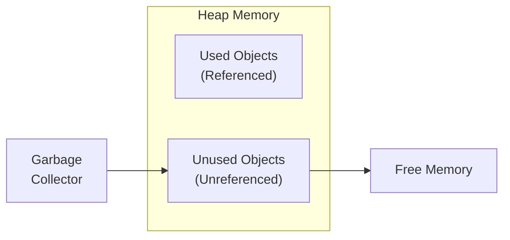
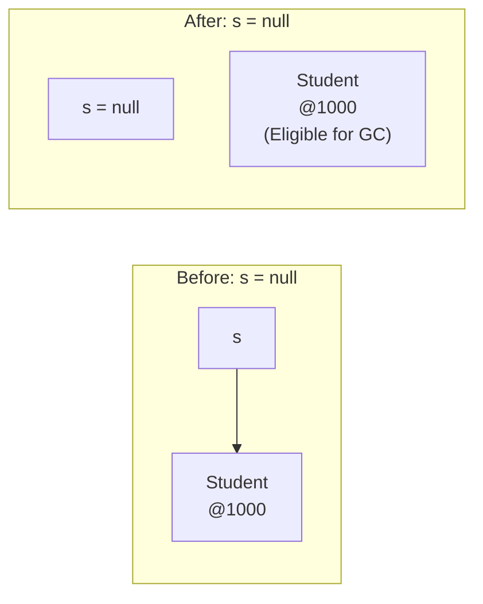
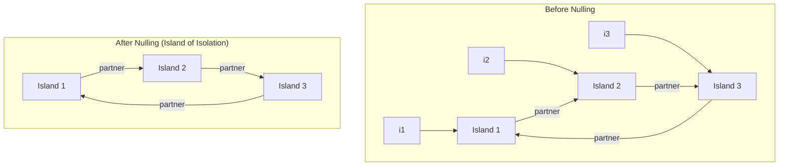
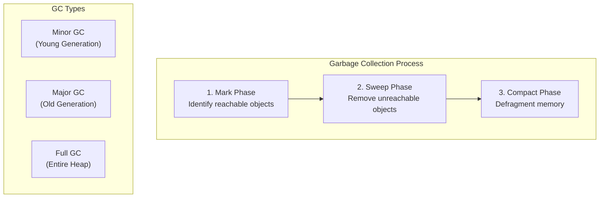

# Session 12: Garbage Collection in Java

## 📚 What is Garbage Collection?

**Garbage Collection (GC)** is the automatic memory management process in Java that identifies and removes objects that are no longer in use, freeing up heap memory.



### GC Benefits

| Benefit | Description |
|---------|-------------|
| **Automatic** | No manual memory deallocation |
| **Safe** | Prevents memory leaks and dangling pointers |
| **Convenient** | Developer focuses on logic, not memory |

---

## 🔧 Requesting JVM to Run Garbage Collection

You can **suggest** GC to run, but cannot force it. JVM decides when to actually run GC.

### Methods to Request GC

```java
public class GCRequestDemo {
    public static void main(String[] args) {
        // Create objects
        Object obj1 = new Object();
        Object obj2 = new Object();
        
        // Make objects eligible for GC
        obj1 = null;
        obj2 = null;
        
        // Method 1: System.gc()
        System.gc();
        
        // Method 2: Runtime.getRuntime().gc()
        Runtime.getRuntime().gc();
        
        // Both are equivalent and only SUGGEST GC
        System.out.println("GC requested");
    }
}
```

> **Important:** `System.gc()` and `Runtime.gc()` are just **requests**. JVM may ignore them.

---

## ♻️ Making Objects Eligible for Garbage Collection

An object becomes eligible for GC when it has **no reachable references**.

### Method 1: Nulling a Reference Variable

```java
public class NullingDemo {
    public static void main(String[] args) {
        Student s = new Student("Alice");
        
        // Object is referenced - NOT eligible for GC
        System.out.println(s.name);
        
        // Nulling the reference
        s = null;
        
        // Now the Student object is eligible for GC
        // (no reference pointing to it)
        
        System.gc();  // Request GC
    }
}
```



### Method 2: Re-assigning a Reference Variable

```java
public class ReassignDemo {
    public static void main(String[] args) {
        Student s1 = new Student("Alice");  // Object 1
        Student s2 = new Student("Bob");    // Object 2
        
        // Reassigning s1 to point to Object 2
        s1 = s2;
        
        // Object 1 ("Alice") is now eligible for GC
        // Both s1 and s2 point to Object 2 ("Bob")
        
        System.gc();
    }
}
```

### Method 3: Island of Isolation

When a group of objects reference each other but have no external references.

```java
class Island {
    Island partner;
    String name;
    
    Island(String name) {
        this.name = name;
    }
}

public class IslandDemo {
    public static void main(String[] args) {
        Island i1 = new Island("Island 1");
        Island i2 = new Island("Island 2");
        Island i3 = new Island("Island 3");
        
        // Create circular references
        i1.partner = i2;
        i2.partner = i3;
        i3.partner = i1;
        
        // Remove external references
        i1 = null;
        i2 = null;
        i3 = null;
        
        // Now all three objects form an "island of isolation"
        // They reference each other but no external reference exists
        // All three are eligible for GC
        
        System.gc();
    }
}
```



---

## 📞 finalize() Method

The `finalize()` method is called by GC before an object is destroyed. It's used for cleanup operations.

```java
public class FinalizeDemo {
    String name;
    
    FinalizeDemo(String name) {
        this.name = name;
        System.out.println(name + " created");
    }
    
    @Override
    protected void finalize() throws Throwable {
        System.out.println(name + " is being garbage collected");
        super.finalize();
    }
    
    public static void main(String[] args) {
        FinalizeDemo obj1 = new FinalizeDemo("Object 1");
        FinalizeDemo obj2 = new FinalizeDemo("Object 2");
        
        obj1 = null;
        obj2 = null;
        
        System.gc();
        
        // Give GC time to run
        try {
            Thread.sleep(1000);
        } catch (InterruptedException e) {
            e.printStackTrace();
        }
        
        System.out.println("Main method ends");
    }
}

// Possible Output:
// Object 1 created
// Object 2 created
// Object 1 is being garbage collected
// Object 2 is being garbage collected
// Main method ends
```

### finalize() Characteristics

| Property | Description |
|----------|-------------|
| **Signature** | `protected void finalize() throws Throwable` |
| **Called by** | Garbage Collector (not programmer) |
| **Called** | Just before object destruction |
| **Guaranteed?** | No - GC may never run |
| **Deprecated** | Since Java 9 (use try-with-resources instead) |

> **Warning:** `finalize()` is deprecated since Java 9. Use `try-with-resources` or `Cleaner` API instead.

---

## 🔄 GC Process Overview



### Memory Generations

| Generation | Contains | GC Frequency |
|------------|----------|--------------|
| **Young (Eden + Survivor)** | Newly created objects | Frequent (Minor GC) |
| **Old (Tenured)** | Long-lived objects | Less frequent (Major GC) |
| **Metaspace** | Class metadata | Rarely collected |

---

## 💡 Key MCQ Points

1. **GC runs automatically** - cannot be forced
2. **System.gc()** and **Runtime.gc()** are only requests
3. **Object eligible for GC** when no reachable reference exists
4. **Three ways** to make object eligible: nulling, reassigning, island of isolation
5. **finalize()** called before object destruction (deprecated since Java 9)
6. **finalize()** is NOT guaranteed to be called
7. **Island of Isolation**: objects referencing each other with no external references
8. **GC target**: objects with no live references from GC roots
9. **GC roots**: local variables, static variables, active threads
10. **JVM decides** when to run GC, not the programmer

### GC Eligibility Quiz

| Code | Eligible Objects |
|------|-----------------|
| `String s = "Hi"; s = null;` | "Hi" (if no pool) |
| `Object a = new Object(); Object b = a; a = null;` | None (b still references) |
| `Object x = new Object(); x = new Object();` | First object |

### Common Interview Questions

| Question | Answer |
|----------|--------|
| Can we force GC? | No, only request |
| When is finalize() called? | Before GC destroys object |
| Is finalize() guaranteed? | No |
| What is island of isolation? | Circular references with no external refs |
| Difference between final, finally, finalize? | Keyword, exception block, GC method |
