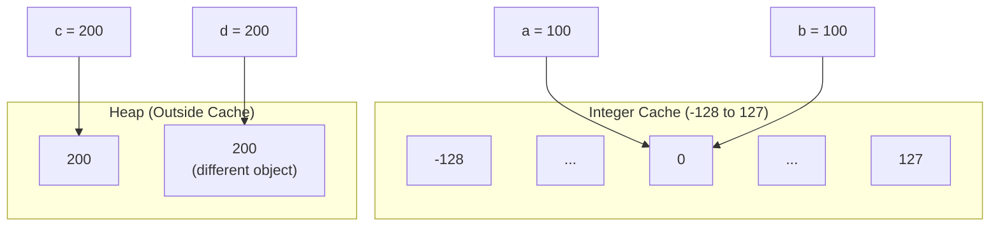
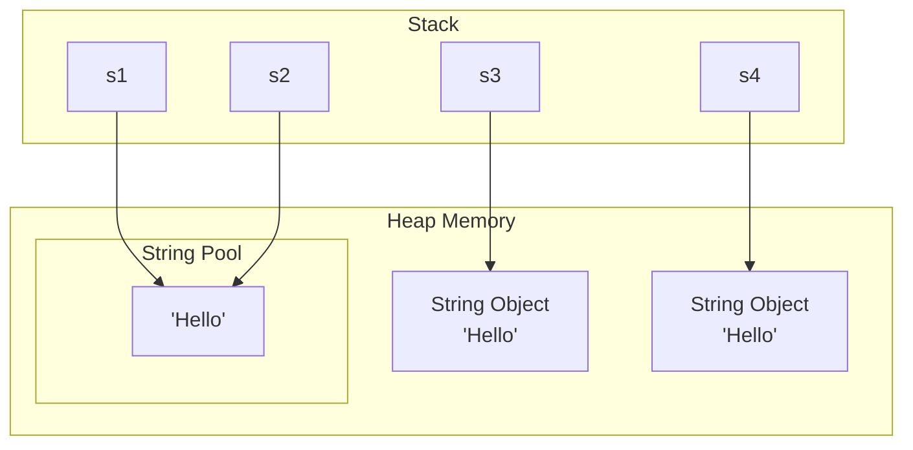
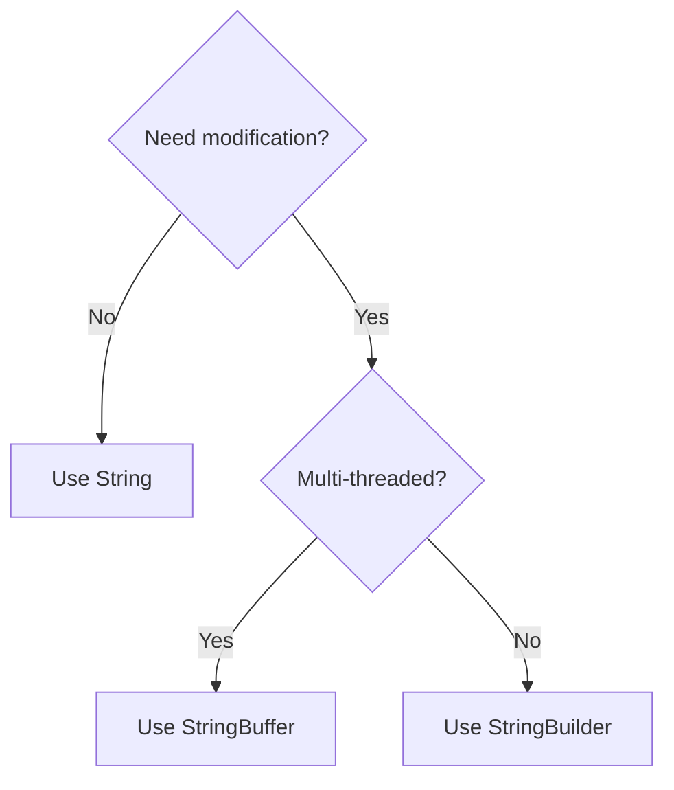

# Sessions 13 & 14: Wrapper Classes and String

## 📚 Wrapper Classes

Wrapper classes provide object representations of primitive types.

### Primitive to Wrapper Mapping

| Primitive | Wrapper | Size |
|-----------|---------|------|
| byte | Byte | 1 byte |
| short | Short | 2 bytes |
| int | Integer | 4 bytes |
| long | Long | 8 bytes |
| float | Float | 4 bytes |
| double | Double | 8 bytes |
| char | Character | 2 bytes |
| boolean | Boolean | - |

### Why Wrapper Classes?

| Reason | Description |
|--------|-------------|
| **Collections** | Collections work only with objects |
| **Null values** | Primitives can't be null, wrappers can |
| **Utility methods** | Parsing, conversion, comparison |
| **Generics** | Type parameters require objects |

---

## 🔄 Autoboxing and Unboxing

### Autoboxing (Primitive → Object)

```java
// Manual boxing (old way)
Integer i1 = new Integer(10);  // Deprecated since Java 9
Integer i2 = Integer.valueOf(10);  // Preferred

// Autoboxing (automatic since Java 5)
Integer i3 = 10;  // int automatically converted to Integer
Double d = 3.14;
Boolean b = true;

// Autoboxing in collections
List<Integer> list = new ArrayList<>();
list.add(10);  // int 10 autoboxed to Integer
list.add(20);
```

### Unboxing (Object → Primitive)

```java
Integer wrapper = 100;

// Unboxing
int primitive = wrapper;  // Automatic conversion
int sum = wrapper + 50;   // Unboxed for arithmetic

// Manual unboxing
int value = wrapper.intValue();  // Using method
```

### Autoboxing Pitfalls

```java
// NullPointerException risk
Integer num = null;
// int x = num;  // NullPointerException!

// Performance in loops
Long sum = 0L;
for (int i = 0; i < 1000000; i++) {
    sum += i;  // Creates new Long object each time!
}
// Use primitive for better performance
long sum2 = 0L;  // Much faster
```

---

## 🏊 Constant Pool (Integer Cache)

Java caches Integer objects for values -128 to 127 for performance.

```java
Integer a = 100;
Integer b = 100;
System.out.println(a == b);  // true (same cached object)

Integer c = 200;
Integer d = 200;
System.out.println(c == d);  // false (different objects)

// Always use equals() for value comparison
System.out.println(c.equals(d));  // true
```



### Cache Ranges

| Wrapper | Cache Range |
|---------|-------------|
| Integer | -128 to 127 |
| Byte | -128 to 127 |
| Short | -128 to 127 |
| Long | -128 to 127 |
| Character | 0 to 127 |
| Boolean | true, false |

---

## 📝 String Class

**String** is immutable - once created, it cannot be changed.

### String Creation

```java
// 1. Literal (uses String pool)
String s1 = "Hello";
String s2 = "Hello";  // Same pool object as s1

// 2. new keyword (creates new object in heap)
String s3 = new String("Hello");
String s4 = new String("Hello");  // Different object

// Comparison
System.out.println(s1 == s2);     // true (same pool object)
System.out.println(s3 == s4);     // false (different heap objects)
System.out.println(s1 == s3);     // false (pool vs heap)
System.out.println(s1.equals(s3)); // true (same content)
```

### String Pool



### String Immutability

```java
String str = "Hello";
str.concat(" World");  // Creates new String, original unchanged
System.out.println(str);  // "Hello" (unchanged!)

str = str.concat(" World");  // Must reassign
System.out.println(str);  // "Hello World"

// Why immutable?
// 1. Thread safety
// 2. String pool possible
// 3. Security (class loading, network connections)
// 4. Hashcode caching
```

### Important String Methods

| Method | Description | Example |
|--------|-------------|---------|
| `length()` | String length | `"Hello".length()` → 5 |
| `charAt(int)` | Char at index | `"Hello".charAt(1)` → 'e' |
| `substring(int, int)` | Extract portion | `"Hello".substring(1,4)` → "ell" |
| `indexOf(String)` | Find position | `"Hello".indexOf("l")` → 2 |
| `toUpperCase()` | Convert case | `"hello".toUpperCase()` → "HELLO" |
| `toLowerCase()` | Convert case | `"HELLO".toLowerCase()` → "hello" |
| `trim()` | Remove spaces | `" Hi ".trim()` → "Hi" |
| `equals(String)` | Compare content | `"Hi".equals("Hi")` → true |
| `equalsIgnoreCase()` | Case-insensitive | `"Hi".equalsIgnoreCase("HI")` → true |
| `contains(String)` | Check substring | `"Hello".contains("ell")` → true |
| `startsWith(String)` | Check prefix | `"Hello".startsWith("He")` → true |
| `endsWith(String)` | Check suffix | `"Hello".endsWith("lo")` → true |
| `replace(old, new)` | Replace chars | `"Hello".replace('l','x')` → "Hexxo" |
| `split(String)` | Split by delimiter | `"a,b,c".split(",")` → ["a","b","c"] |

---

## 🔧 StringBuffer and StringBuilder

Mutable alternatives to String for frequent modifications.

### Comparison

| Feature | String | StringBuffer | StringBuilder |
|---------|--------|--------------|---------------|
| **Mutability** | Immutable | Mutable | Mutable |
| **Thread Safety** | Yes (immutable) | Yes (synchronized) | No |
| **Performance** | Slow for modifications | Medium | Fast |
| **Use Case** | Fixed text | Multi-threaded | Single-threaded |

### StringBuilder/StringBuffer Methods

```java
StringBuilder sb = new StringBuilder("Hello");

// Append
sb.append(" World");      // "Hello World"
sb.append(123);           // "Hello World123"

// Insert
sb.insert(5, "---");      // "Hello--- World123"

// Delete
sb.delete(5, 8);          // "Hello World123"

// Reverse
sb.reverse();             // "321dlroW olleH"

// Replace
sb.replace(0, 3, "XYZ");  // "XYZdlroW olleH"

// Capacity
System.out.println(sb.capacity());  // Default: 16 + initial length

// Convert to String
String result = sb.toString();
```

### Performance Comparison

```java
// String concatenation (slow - creates many objects)
String s = "";
for (int i = 0; i < 10000; i++) {
    s += i;  // Creates new String each time!
}

// StringBuilder (fast - modifies same object)
StringBuilder sb = new StringBuilder();
for (int i = 0; i < 10000; i++) {
    sb.append(i);
}
String result = sb.toString();
```

---

## 💡 Key MCQ Points

1. **Wrapper classes** provide object representation of primitives
2. **Autoboxing**: primitive → wrapper (automatic)
3. **Unboxing**: wrapper → primitive (automatic)
4. **Integer cache**: -128 to 127 cached
5. **Use equals()** for wrapper/String comparison, not ==
6. **String is immutable** - operations return new String
7. **String pool** stores string literals
8. **new String()** creates separate heap object
9. **StringBuffer** is synchronized (thread-safe)
10. **StringBuilder** is faster (not thread-safe)

### Quick Reference

| Expression | Result | Why |
|------------|--------|-----|
| `Integer.valueOf(100) == Integer.valueOf(100)` | true | Cached |
| `Integer.valueOf(200) == Integer.valueOf(200)` | false | Not cached |
| `"Hello" == "Hello"` | true | String pool |
| `new String("Hi") == new String("Hi")` | false | Different objects |
| `"Hi".equals(new String("Hi"))` | true | Same content |

### String Manipulation Decision


