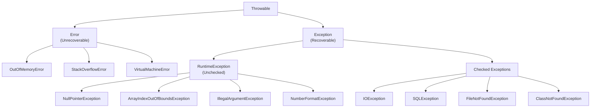
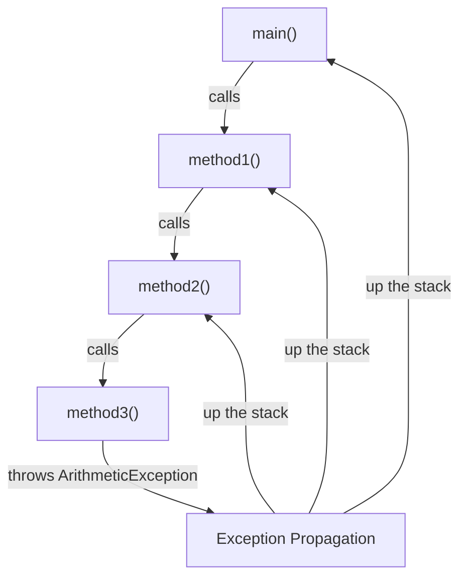

# Sessions 15 & 16: Exception Handling

## 📚 Exception Hierarchy



---

## 🔴 Errors vs Checked vs Unchecked Exceptions

| Type | Description | Handling | Examples |
|------|-------------|----------|----------|
| **Error** | Serious problems, JVM level | Cannot usually handle | `StackOverflowError`, `OutOfMemoryError` |
| **Checked Exception** | Compile-time exceptions | Must handle or declare | `IOException`, `SQLException` |
| **Unchecked Exception** | Runtime exceptions | Optional handling | `NullPointerException`, `ArithmeticException` |

### Checked Exception Example

```java
import java.io.*;

public class CheckedDemo {
    // Must handle or declare
    public void readFile() throws FileNotFoundException {
        FileReader fr = new FileReader("test.txt");  // Checked exception
    }
    
    // Handling with try-catch
    public void readFileSafe() {
        try {
            FileReader fr = new FileReader("test.txt");
        } catch (FileNotFoundException e) {
            System.out.println("File not found: " + e.getMessage());
        }
    }
}
```

### Unchecked Exception Example

```java
public class UncheckedDemo {
    // No need to declare - but can still handle
    public void divide(int a, int b) {
        int result = a / b;  // ArithmeticException if b = 0
    }
    
    public void access(int[] arr, int index) {
        int value = arr[index];  // ArrayIndexOutOfBoundsException
    }
}
```

---

## 🔄 Exception Propagation

When an exception occurs in a method and is not handled, it propagates up the call stack.

```java
public class PropagationDemo {
    public static void main(String[] args) {
        try {
            method1();
        } catch (Exception e) {
            System.out.println("Caught in main: " + e.getMessage());
        }
    }
    
    static void method1() {
        method2();
    }
    
    static void method2() {
        method3();
    }
    
    static void method3() {
        int result = 10 / 0;  // ArithmeticException
        // Exception propagates: method3 → method2 → method1 → main
    }
}
```



---

## 🛡️ try-catch-finally Block

### Basic Syntax

```java
try {
    // Code that might throw exception
    int result = 10 / 0;
} catch (ArithmeticException e) {
    // Handle specific exception
    System.out.println("Cannot divide by zero");
} catch (Exception e) {
    // Handle other exceptions
    System.out.println("Error: " + e.getMessage());
} finally {
    // Always executes (cleanup code)
    System.out.println("Finally block executed");
}
```

### finally Block Rules

| Scenario | finally Executes? |
|----------|-------------------|
| Normal execution | ✅ Yes |
| Exception caught | ✅ Yes |
| Exception not caught | ✅ Yes |
| return in try/catch | ✅ Yes (before return) |
| System.exit() called | ❌ No |
| JVM crash | ❌ No |

```java
public class FinallyDemo {
    public static int getValue() {
        try {
            return 1;
        } finally {
            System.out.println("Finally runs!");
            // return 2;  // Would override return 1 (bad practice)
        }
    }
    
    public static void main(String[] args) {
        System.out.println(getValue());  // Prints: Finally runs! then 1
    }
}
```

---

## 📤 throws Clause and throw Keyword

### throws (Declaration)

Declares that a method might throw an exception.

```java
public class ThrowsDemo {
    // Declaring checked exceptions
    public void method1() throws IOException {
        throw new IOException("IO Error");
    }
    
    // Multiple exceptions
    public void method2() throws IOException, SQLException {
        // ...
    }
    
    // Calling method must handle or propagate
    public void caller() {
        try {
            method1();
        } catch (IOException e) {
            e.printStackTrace();
        }
    }
}
```

### throw (Creating Exception)

Explicitly throws an exception.

```java
public class ThrowDemo {
    public void validateAge(int age) {
        if (age < 0) {
            throw new IllegalArgumentException("Age cannot be negative");
        }
        if (age > 150) {
            throw new IllegalArgumentException("Age too high");
        }
        System.out.println("Valid age: " + age);
    }
    
    public void readFile(String filename) throws FileNotFoundException {
        if (filename == null) {
            throw new FileNotFoundException("Filename is null");
        }
        // Read file logic
    }
}
```

### throw vs throws

| throw | throws |
|-------|--------|
| Used inside method | Used in method signature |
| Throws an exception | Declares potential exceptions |
| Followed by exception object | Followed by exception class(es) |
| Can throw only one at a time | Can declare multiple |

---

## 🔀 Multi-catch Block (Java 7+)

Handle multiple exception types with a single catch block.

```java
public class MultiCatchDemo {
    public void process(String[] args) {
        try {
            int num = Integer.parseInt(args[0]);
            int result = 10 / num;
            String str = null;
            str.length();
        } catch (ArrayIndexOutOfBoundsException | ArithmeticException e) {
            System.out.println("Index or arithmetic error: " + e.getMessage());
        } catch (NullPointerException | NumberFormatException e) {
            System.out.println("Null or format error: " + e.getMessage());
        } catch (Exception e) {
            System.out.println("General error: " + e.getMessage());
        }
    }
}
```

### Multi-catch Rules

1. Exception types must not be related (no parent-child)
2. Exception variable is implicitly final
3. More specific exceptions must come before general

---

## 🆕 Try-with-Resources (Java 7+)

Automatically closes resources (implements `AutoCloseable`).

```java
// Traditional way
BufferedReader br = null;
try {
    br = new BufferedReader(new FileReader("file.txt"));
    String line = br.readLine();
} catch (IOException e) {
    e.printStackTrace();
} finally {
    if (br != null) {
        try {
            br.close();
        } catch (IOException e) {
            e.printStackTrace();
        }
    }
}

// Try-with-resources (cleaner)
try (BufferedReader br = new BufferedReader(new FileReader("file.txt"))) {
    String line = br.readLine();
    System.out.println(line);
} catch (IOException e) {
    e.printStackTrace();
}
// br is automatically closed
```

---

## 👤 User-defined Exceptions

### Checked Exception

```java
// Custom checked exception
public class InsufficientBalanceException extends Exception {
    private double amount;
    
    public InsufficientBalanceException(String message) {
        super(message);
    }
    
    public InsufficientBalanceException(String message, double amount) {
        super(message);
        this.amount = amount;
    }
    
    public double getAmount() {
        return amount;
    }
}

// Usage
public class BankAccount {
    private double balance;
    
    public void withdraw(double amount) throws InsufficientBalanceException {
        if (amount > balance) {
            throw new InsufficientBalanceException(
                "Insufficient balance. Required: " + amount, amount);
        }
        balance -= amount;
    }
}
```

### Unchecked Exception

```java
// Custom unchecked exception
public class InvalidAgeException extends RuntimeException {
    public InvalidAgeException(String message) {
        super(message);
    }
}

// Usage - no throws declaration needed
public class Person {
    private int age;
    
    public void setAge(int age) {
        if (age < 0 || age > 150) {
            throw new InvalidAgeException("Invalid age: " + age);
        }
        this.age = age;
    }
}
```

---

## 💡 Key MCQ Points

1. **Throwable** is parent of both Error and Exception
2. **Checked exceptions** must be handled or declared
3. **Unchecked exceptions** (RuntimeException) - optional handling
4. **Error** - serious, usually unrecoverable (don't catch)
5. **finally** always executes except for System.exit() or JVM crash
6. **throw** creates exception, **throws** declares it
7. **Multi-catch** uses `|` to combine exception types
8. **Try-with-resources** auto-closes AutoCloseable resources
9. **Specific exceptions** catch blocks must come before general
10. Custom checked extends **Exception**, unchecked extends **RuntimeException**

### Exception Handling Order

```java
try {
    // Code
} catch (FileNotFoundException e) {  // Most specific first
    // Handle
} catch (IOException e) {             // Parent class second
    // Handle
} catch (Exception e) {               // Most general last
    // Handle
}
```

### Common Exception Methods

| Method | Description |
|--------|-------------|
| `getMessage()` | Returns error message |
| `printStackTrace()` | Prints stack trace |
| `getCause()` | Returns cause of exception |
| `toString()` | Returns string representation |
