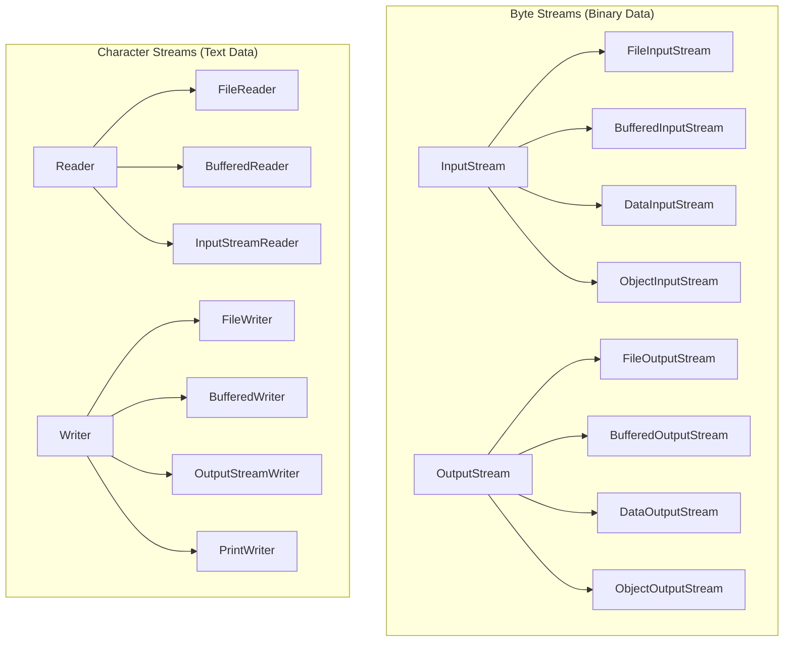
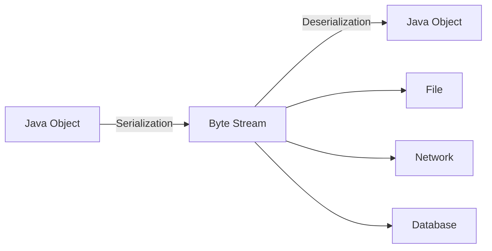

# Session 17: java.io & java.nio Package

## 📚 Stream Hierarchy



### Byte Streams vs Character Streams

| Aspect | Byte Streams | Character Streams |
|--------|--------------|-------------------|
| **Unit** | 1 byte (8 bits) | 2 bytes (16 bits Unicode) |
| **Use** | Binary data (images, audio) | Text data |
| **Base Classes** | InputStream, OutputStream | Reader, Writer |
| **Examples** | FileInputStream | FileReader |

---

## 📖 Reading and Writing Files

### Byte Stream Example

```java
import java.io.*;

public class ByteStreamDemo {
    // Reading binary file
    public static void readFile(String path) {
        try (FileInputStream fis = new FileInputStream(path)) {
            int byteData;
            while ((byteData = fis.read()) != -1) {
                System.out.print((char) byteData);
            }
        } catch (IOException e) {
            e.printStackTrace();
        }
    }
    
    // Writing binary file
    public static void writeFile(String path, String content) {
        try (FileOutputStream fos = new FileOutputStream(path)) {
            fos.write(content.getBytes());
        } catch (IOException e) {
            e.printStackTrace();
        }
    }
    
    // Copying file (buffered for efficiency)
    public static void copyFile(String src, String dest) {
        try (BufferedInputStream bis = new BufferedInputStream(new FileInputStream(src));
             BufferedOutputStream bos = new BufferedOutputStream(new FileOutputStream(dest))) {
            
            byte[] buffer = new byte[1024];
            int bytesRead;
            while ((bytesRead = bis.read(buffer)) != -1) {
                bos.write(buffer, 0, bytesRead);
            }
        } catch (IOException e) {
            e.printStackTrace();
        }
    }
}
```

### Character Stream Example

```java
import java.io.*;

public class CharStreamDemo {
    // Reading text file
    public static void readFile(String path) {
        try (BufferedReader br = new BufferedReader(new FileReader(path))) {
            String line;
            while ((line = br.readLine()) != null) {
                System.out.println(line);
            }
        } catch (IOException e) {
            e.printStackTrace();
        }
    }
    
    // Writing text file
    public static void writeFile(String path, String content) {
        try (BufferedWriter bw = new BufferedWriter(new FileWriter(path))) {
            bw.write(content);
            bw.newLine();  // Platform-independent line separator
        } catch (IOException e) {
            e.printStackTrace();
        }
    }
    
    // Using PrintWriter (convenient for formatted output)
    public static void writeWithPrintWriter(String path) {
        try (PrintWriter pw = new PrintWriter(new FileWriter(path))) {
            pw.println("Hello World");
            pw.printf("Number: %d, Float: %.2f%n", 10, 3.14);
        } catch (IOException e) {
            e.printStackTrace();
        }
    }
}
```

---

## 🆕 NIO Package (java.nio)

**NIO (New I/O)** introduced in Java 1.4, enhanced in Java 7 (NIO.2).

### NIO vs IO

| Feature | IO (java.io) | NIO (java.nio) |
|---------|--------------|----------------|
| **Approach** | Stream-oriented | Buffer-oriented |
| **Blocking** | Blocking I/O | Non-blocking I/O |
| **Channels** | No | Yes |
| **Selectors** | No | Yes (multiple channels) |
| **File Operations** | File class | Path, Files classes |

### NIO.2 Path and Files

```java
import java.nio.file.*;
import java.io.IOException;
import java.util.List;

public class NIODemo {
    public static void main(String[] args) throws IOException {
        // Creating Path
        Path path = Paths.get("C:/test/demo.txt");
        Path path2 = Path.of("C:/test/demo2.txt");  // Java 11+
        
        // File operations
        boolean exists = Files.exists(path);
        boolean isDir = Files.isDirectory(path);
        boolean isFile = Files.isRegularFile(path);
        
        // Reading file
        List<String> lines = Files.readAllLines(path);
        String content = Files.readString(path);  // Java 11+
        
        // Writing file
        Files.write(path, "Hello".getBytes());
        Files.writeString(path, "Hello World");  // Java 11+
        
        // Copy, Move, Delete
        Files.copy(path, Paths.get("copy.txt"), StandardCopyOption.REPLACE_EXISTING);
        Files.move(path, Paths.get("moved.txt"));
        Files.delete(path);
        Files.deleteIfExists(path);
        
        // Create directories
        Files.createDirectory(Paths.get("newDir"));
        Files.createDirectories(Paths.get("a/b/c"));
    }
}
```

---

## 🔄 Serialization and Deserialization

**Serialization**: Converting object to byte stream (for storage/transmission).
**Deserialization**: Converting byte stream back to object.



### Serializable Interface

```java
import java.io.*;

// Class must implement Serializable
public class Employee implements Serializable {
    private static final long serialVersionUID = 1L;  // Version control
    
    private int id;
    private String name;
    private transient String password;  // Not serialized
    
    public Employee(int id, String name, String password) {
        this.id = id;
        this.name = name;
        this.password = password;
    }
    
    @Override
    public String toString() {
        return "Employee{id=" + id + ", name=" + name + ", password=" + password + "}";
    }
}

// Serialization and Deserialization
public class SerializationDemo {
    public static void main(String[] args) {
        Employee emp = new Employee(1, "John", "secret123");
        
        // Serialization (Write to file)
        try (ObjectOutputStream oos = new ObjectOutputStream(
                new FileOutputStream("employee.ser"))) {
            oos.writeObject(emp);
            System.out.println("Object serialized");
        } catch (IOException e) {
            e.printStackTrace();
        }
        
        // Deserialization (Read from file)
        try (ObjectInputStream ois = new ObjectInputStream(
                new FileInputStream("employee.ser"))) {
            Employee loaded = (Employee) ois.readObject();
            System.out.println("Object deserialized: " + loaded);
            // password will be null (transient)
        } catch (IOException | ClassNotFoundException e) {
            e.printStackTrace();
        }
    }
}
```

### Serialization Keywords

| Keyword | Effect |
|---------|--------|
| `transient` | Field not serialized |
| `serialVersionUID` | Version control for compatibility |
| `static` | Static fields not serialized |

---

## 📋 Shallow Copy vs Deep Copy

### Shallow Copy

Copies object references, not the actual objects.

```java
class Address {
    String city;
    
    Address(String city) {
        this.city = city;
    }
}

class Employee implements Cloneable {
    String name;
    Address address;  // Reference type
    
    Employee(String name, Address address) {
        this.name = name;
        this.address = address;
    }
    
    // Shallow copy - address reference is copied
    @Override
    protected Object clone() throws CloneNotSupportedException {
        return super.clone();
    }
}

// Usage
Address addr = new Address("Mumbai");
Employee emp1 = new Employee("John", addr);
Employee emp2 = (Employee) emp1.clone();

emp2.address.city = "Delhi";
System.out.println(emp1.address.city);  // "Delhi" - both affected!
```

### Deep Copy

Creates completely independent copy of all nested objects.

```java
class Address implements Cloneable {
    String city;
    
    Address(String city) {
        this.city = city;
    }
    
    @Override
    protected Object clone() throws CloneNotSupportedException {
        return super.clone();
    }
}

class Employee implements Cloneable {
    String name;
    Address address;
    
    Employee(String name, Address address) {
        this.name = name;
        this.address = address;
    }
    
    // Deep copy - also clone nested objects
    @Override
    protected Object clone() throws CloneNotSupportedException {
        Employee cloned = (Employee) super.clone();
        cloned.address = (Address) address.clone();  // Clone nested object
        return cloned;
    }
}

// Usage
Employee emp2 = (Employee) emp1.clone();
emp2.address.city = "Delhi";
System.out.println(emp1.address.city);  // "Mumbai" - independent!
```

### Copy Comparison

| Aspect | Shallow Copy | Deep Copy |
|--------|--------------|-----------|
| **Nested objects** | Same references | New copies |
| **Independence** | Dependent | Independent |
| **Performance** | Faster | Slower |
| **Memory** | Less | More |

---

## 💡 Key MCQ Points

1. **Byte streams** for binary data, **Character streams** for text
2. **BufferedReader/Writer** improves performance (buffering)
3. **PrintWriter** for formatted text output
4. **NIO** is buffer-oriented, IO is stream-oriented
5. **Path** and **Files** (NIO.2) for modern file operations
6. **Serializable** interface required for serialization
7. **transient** fields are NOT serialized
8. **static** fields are NOT serialized
9. **serialVersionUID** for version control
10. **Shallow copy** copies references, **Deep copy** copies objects

### Stream Selection Guide

| Task | Use |
|------|-----|
| Read text file | BufferedReader |
| Write text file | BufferedWriter or PrintWriter |
| Read binary file | BufferedInputStream |
| Copy files | NIO Files.copy() |
| Modern file ops | java.nio.file.Files |
