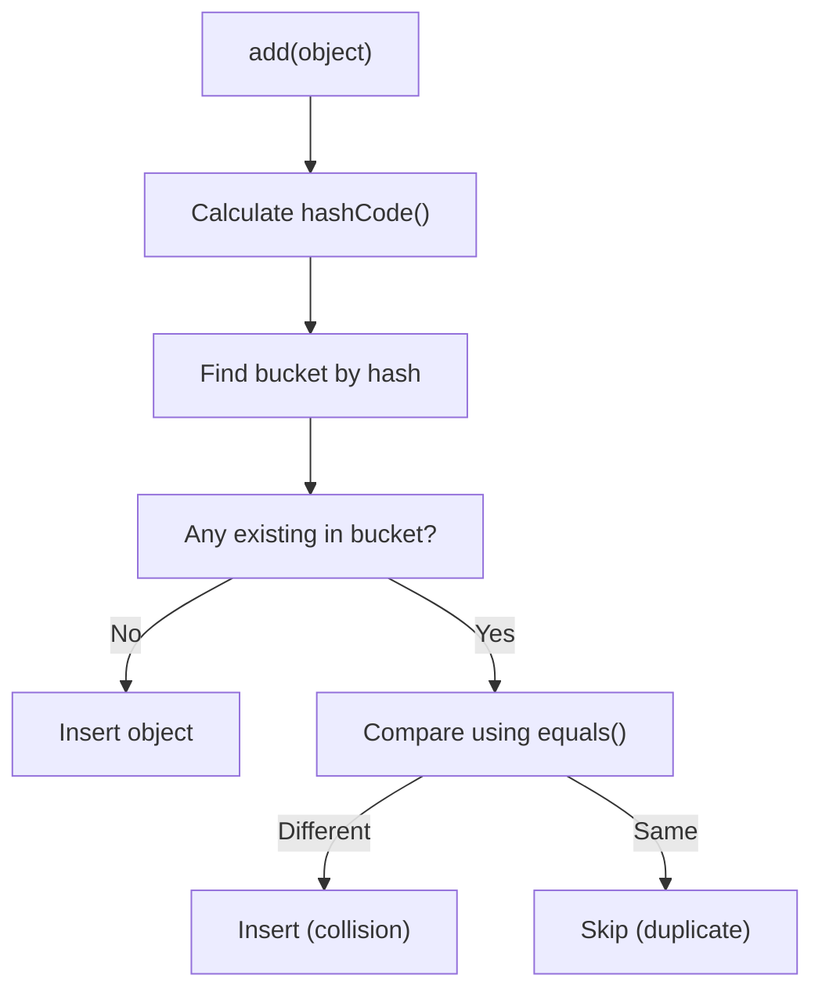

# Session 18: Object Class & java.util Package

## 📚 Date and Time Classes

### Legacy Classes (java.util)

```java
import java.util.Date;
import java.util.Calendar;
import java.text.SimpleDateFormat;

public class DateDemo {
    public static void main(String[] args) throws Exception {
        // Date class (mostly deprecated methods)
        Date now = new Date();
        System.out.println(now);  // Thu Jan 09 19:30:00 IST 2026
        
        // Calendar class
        Calendar cal = Calendar.getInstance();
        System.out.println("Year: " + cal.get(Calendar.YEAR));
        System.out.println("Month: " + (cal.get(Calendar.MONTH) + 1));  // 0-based!
        System.out.println("Day: " + cal.get(Calendar.DAY_OF_MONTH));
        
        // Manipulating dates
        cal.add(Calendar.DAY_OF_MONTH, 7);  // Add 7 days
        cal.set(Calendar.YEAR, 2025);       // Set year
        
        // SimpleDateFormat - formatting and parsing
        SimpleDateFormat sdf = new SimpleDateFormat("dd/MM/yyyy HH:mm:ss");
        
        // Date to String
        String formatted = sdf.format(now);
        System.out.println(formatted);  // 09/01/2026 19:30:00
        
        // String to Date
        Date parsed = sdf.parse("25/12/2025 10:30:00");
        System.out.println(parsed);
    }
}
```

### Common Date Patterns

| Pattern | Description | Example |
|---------|-------------|---------|
| `dd` | Day of month (01-31) | 09 |
| `MM` | Month (01-12) | 01 |
| `MMM` | Month abbreviation | Jan |
| `MMMM` | Full month name | January |
| `yy` | 2-digit year | 26 |
| `yyyy` | 4-digit year | 2026 |
| `HH` | Hour (00-23) | 19 |
| `hh` | Hour (01-12) | 07 |
| `mm` | Minutes | 30 |
| `ss` | Seconds | 45 |
| `a` | AM/PM | PM |
| `E` | Day of week | Thu |
| `EEEE` | Full day name | Thursday |

### Java 8+ Date/Time API (java.time)

```java
import java.time.*;
import java.time.format.DateTimeFormatter;

public class Java8DateDemo {
    public static void main(String[] args) {
        // LocalDate (date only)
        LocalDate today = LocalDate.now();
        LocalDate birthday = LocalDate.of(1990, 5, 15);
        
        // LocalTime (time only)
        LocalTime now = LocalTime.now();
        LocalTime meeting = LocalTime.of(14, 30, 0);
        
        // LocalDateTime (date + time)
        LocalDateTime dateTime = LocalDateTime.now();
        
        // Manipulating
        LocalDate nextWeek = today.plusDays(7);
        LocalDate lastMonth = today.minusMonths(1);
        
        // Formatting
        DateTimeFormatter dtf = DateTimeFormatter.ofPattern("dd/MM/yyyy HH:mm");
        String formatted = dateTime.format(dtf);
        
        // Parsing
        LocalDate parsed = LocalDate.parse("2025-12-25");
        
        // Period (days between dates)
        Period period = Period.between(birthday, today);
        System.out.println("Age: " + period.getYears() + " years");
    }
}
```

---

## 🔷 Object Class

**Object** is the root class of all classes in Java. Every class implicitly extends Object.

### Object Class Methods

| Method | Description |
|--------|-------------|
| `toString()` | String representation |
| `equals(Object)` | Logical equality |
| `hashCode()` | Hash code for hashing |
| `getClass()` | Runtime class info |
| `clone()` | Creates copy (protected) |
| `finalize()` | Called before GC (deprecated) |
| `wait()`, `notify()`, `notifyAll()` | Thread synchronization |

---

## 📝 Overriding toString()

Default `toString()` returns: `ClassName@hexHashCode`

```java
public class Student {
    private int id;
    private String name;
    private double gpa;
    
    public Student(int id, String name, double gpa) {
        this.id = id;
        this.name = name;
        this.gpa = gpa;
    }
    
    // Without override
    // Output: Student@1a2b3c4d
    
    @Override
    public String toString() {
        return "Student{id=" + id + ", name='" + name + "', gpa=" + gpa + "}";
    }
}

// Usage
Student s = new Student(1, "Alice", 3.8);
System.out.println(s);  // Student{id=1, name='Alice', gpa=3.8}
```

---

## ⚖️ Overriding equals()

Default `equals()` compares **references** (same as ==). Override for **logical equality**.

### equals() Contract

1. **Reflexive**: `x.equals(x)` must be true
2. **Symmetric**: `x.equals(y)` == `y.equals(x)`
3. **Transitive**: If `x.equals(y)` and `y.equals(z)`, then `x.equals(z)`
4. **Consistent**: Multiple calls return same result
5. **Null comparison**: `x.equals(null)` must be false

```java
public class Student {
    private int id;
    private String name;
    
    public Student(int id, String name) {
        this.id = id;
        this.name = name;
    }
    
    @Override
    public boolean equals(Object obj) {
        // 1. Check for same reference
        if (this == obj) return true;
        
        // 2. Check for null and class type
        if (obj == null || getClass() != obj.getClass()) return false;
        
        // 3. Cast and compare fields
        Student other = (Student) obj;
        return this.id == other.id && 
               Objects.equals(this.name, other.name);
    }
}

// Usage
Student s1 = new Student(1, "Alice");
Student s2 = new Student(1, "Alice");
Student s3 = new Student(2, "Bob");

System.out.println(s1 == s2);        // false (different objects)
System.out.println(s1.equals(s2));   // true (same content)
System.out.println(s1.equals(s3));   // false (different content)
```

---

## 🔢 Overriding hashCode()

**hashCode()** returns an integer hash value used in hash-based collections.

### hashCode() Contract

1. **Consistency**: Same object returns same hashCode
2. **equals ⟹ hashCode**: If `a.equals(b)`, then `a.hashCode() == b.hashCode()`
3. **hashCode ⟹ equals**: Not required (collision allowed)

> **Rule:** Always override `hashCode()` when you override `equals()`!

```java
import java.util.Objects;

public class Student {
    private int id;
    private String name;
    
    @Override
    public boolean equals(Object obj) {
        if (this == obj) return true;
        if (obj == null || getClass() != obj.getClass()) return false;
        Student other = (Student) obj;
        return id == other.id && Objects.equals(name, other.name);
    }
    
    @Override
    public int hashCode() {
        return Objects.hash(id, name);  // Easy way using Objects.hash()
        
        // Manual calculation
        // int result = 17;
        // result = 31 * result + id;
        // result = 31 * result + (name != null ? name.hashCode() : 0);
        // return result;
    }
}
```

### Why Both Matter for Collections

```java
Set<Student> students = new HashSet<>();
Student s1 = new Student(1, "Alice");
Student s2 = new Student(1, "Alice");

students.add(s1);
students.add(s2);

// Without proper equals/hashCode: Set size = 2 (both added)
// With proper equals/hashCode: Set size = 1 (duplicates detected)
System.out.println(students.size());
```



---

## 📊 equals() and hashCode() Summary

| Scenario | equals() | hashCode() |
|----------|----------|------------|
| Same object | true | Same |
| Equal objects | true | Same (required) |
| Different objects | false | Can be same (collision) |
| null comparison | false | - |

### Best Practices

```java
// Using IDE generation or Objects class
@Override
public boolean equals(Object o) {
    if (this == o) return true;
    if (o == null || getClass() != o.getClass()) return false;
    Student student = (Student) o;
    return id == student.id && Objects.equals(name, student.name);
}

@Override
public int hashCode() {
    return Objects.hash(id, name);
}

@Override
public String toString() {
    return "Student{id=" + id + ", name='" + name + "'}";
}
```

---

## 💡 Key MCQ Points

1. **Calendar.MONTH** is 0-based (January = 0)
2. **SimpleDateFormat** for Date ↔ String conversion
3. **Java 8+** use LocalDate, LocalTime, LocalDateTime
4. **toString()** default returns ClassName@hashCode
5. **equals()** default compares references (like ==)
6. **hashCode()** must be consistent with equals()
7. If **equals() is overridden**, override **hashCode()** too
8. Equal objects **must have** same hashCode
9. Objects with same hashCode **may not be equal**
10. **Objects.hash()** and **Objects.equals()** simplify implementation

### Common Mistakes

| Mistake | Problem |
|---------|---------|
| Override equals() but not hashCode() | HashSet/HashMap won't work correctly |
| Use `==` for object comparison | Compares references, not content |
| Forget null check in equals() | NullPointerException |
| Month off by one | Calendar.MONTH is 0-based |

### Quick Reference

```java
// Date formatting
SimpleDateFormat sdf = new SimpleDateFormat("dd/MM/yyyy");
String str = sdf.format(new Date());
Date date = sdf.parse("01/01/2026");

// Object class methods
obj.toString();       // String representation
obj.equals(other);    // Logical equality
obj.hashCode();       // Hash value
obj.getClass();       // Runtime class
```
