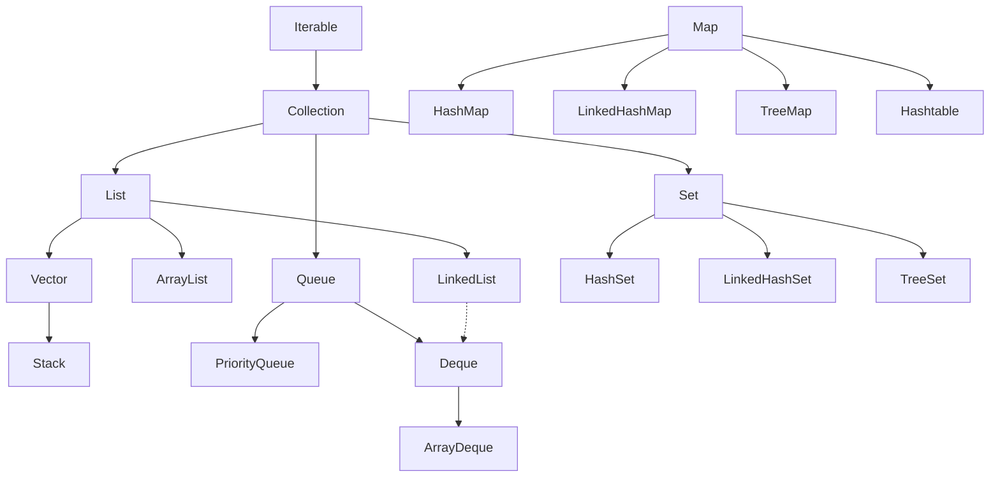

# Sessions 19-22: Collections - List, Queue, Comparable, Comparator

## 📚 Collection Hierarchy



---

## 📋 List Interface

**List** is an ordered collection that allows duplicates and null values.

### List Implementations Comparison

| Feature | ArrayList | LinkedList | Vector |
|---------|-----------|------------|--------|
| **Structure** | Dynamic array | Doubly-linked list | Dynamic array |
| **Access** | O(1) random | O(n) sequential | O(1) random |
| **Insert/Delete** | O(n) middle | O(1) if at node | O(n) middle |
| **Thread-safe** | No | No | Yes (synchronized) |
| **Performance** | Fast read | Fast insert/delete | Slower (sync overhead) |

### ArrayList Operations

```java
import java.util.*;

public class ArrayListDemo {
    public static void main(String[] args) {
        // Creation
        ArrayList<String> list = new ArrayList<>();
        List<String> list2 = new ArrayList<>(20);  // Initial capacity
        
        // Add elements
        list.add("Apple");
        list.add("Banana");
        list.add("Cherry");
        list.add(1, "Mango");  // Insert at index
        
        // Access
        String first = list.get(0);  // "Apple"
        int size = list.size();       // 4
        boolean has = list.contains("Banana");  // true
        int idx = list.indexOf("Cherry");       // 3
        
        // Modify
        list.set(0, "Avocado");  // Replace
        
        // Remove
        list.remove("Banana");     // By object
        list.remove(0);            // By index
        
        // Iterate
        for (String item : list) {
            System.out.println(item);
        }
        
        // Using Iterator
        Iterator<String> it = list.iterator();
        while (it.hasNext()) {
            String item = it.next();
            if (item.equals("Cherry")) {
                it.remove();  // Safe removal during iteration
            }
        }
        
        // Lambda forEach
        list.forEach(System.out::println);
        
        // Convert to array
        String[] arr = list.toArray(new String[0]);
        
        // Clear all
        list.clear();
    }
}
```

### LinkedList Operations

```java
import java.util.*;

public class LinkedListDemo {
    public static void main(String[] args) {
        LinkedList<Integer> list = new LinkedList<>();
        
        // Add at ends
        list.addFirst(1);
        list.addLast(3);
        list.add(2);  // Adds at end
        
        // Get from ends
        int first = list.getFirst();  // 1
        int last = list.getLast();    // 3
        
        // Remove from ends
        list.removeFirst();
        list.removeLast();
        
        // Queue operations
        list.offer(10);    // Add to tail
        int head = list.poll();  // Remove and return head
        int peek = list.peek();  // View head without removing
        
        // Stack operations
        list.push(20);     // Add to head
        int pop = list.pop();  // Remove and return head
    }
}
```

---

## 🔧 Collections Utility Class

```java
import java.util.*;

public class CollectionsDemo {
    public static void main(String[] args) {
        List<Integer> list = new ArrayList<>(Arrays.asList(5, 2, 8, 1, 9));
        
        // Sorting
        Collections.sort(list);           // Natural order
        Collections.sort(list, Collections.reverseOrder());  // Descending
        
        // Searching (list must be sorted)
        int index = Collections.binarySearch(list, 5);
        
        // Min/Max
        int min = Collections.min(list);
        int max = Collections.max(list);
        
        // Shuffle
        Collections.shuffle(list);
        
        // Reverse
        Collections.reverse(list);
        
        // Frequency
        int count = Collections.frequency(list, 5);
        
        // Fill
        Collections.fill(list, 0);  // All elements become 0
        
        // Copy
        List<Integer> dest = new ArrayList<>(Arrays.asList(0, 0, 0, 0, 0));
        Collections.copy(dest, list);  // dest must be >= source size
        
        // Immutable views
        List<Integer> unmodifiable = Collections.unmodifiableList(list);
        List<Integer> synchronized_ = Collections.synchronizedList(list);
        List<Integer> empty = Collections.emptyList();
        List<Integer> single = Collections.singletonList(42);
    }
}
```

---

## ⚖️ Comparable Interface

**Comparable** defines natural ordering. The class itself implements it.

```java
public class Student implements Comparable<Student> {
    private int id;
    private String name;
    private double gpa;
    
    public Student(int id, String name, double gpa) {
        this.id = id;
        this.name = name;
        this.gpa = gpa;
    }
    
    // Natural ordering by id
    @Override
    public int compareTo(Student other) {
        return this.id - other.id;  // Ascending by id
        // return other.id - this.id;  // Descending
        // return this.name.compareTo(other.name);  // By name
        // return Double.compare(this.gpa, other.gpa);  // By gpa
    }
    
    @Override
    public String toString() {
        return "Student{id=" + id + ", name='" + name + "', gpa=" + gpa + "}";
    }
}

// Usage
List<Student> students = new ArrayList<>();
students.add(new Student(3, "Charlie", 3.5));
students.add(new Student(1, "Alice", 3.8));
students.add(new Student(2, "Bob", 3.2));

Collections.sort(students);  // Sorts by natural ordering (id)
students.forEach(System.out::println);
```

---

## 🔄 Comparator Interface

**Comparator** defines custom ordering. It's a separate class/lambda.

```java
import java.util.*;

public class ComparatorDemo {
    public static void main(String[] args) {
        List<Student> students = new ArrayList<>();
        students.add(new Student(3, "Charlie", 3.5));
        students.add(new Student(1, "Alice", 3.8));
        students.add(new Student(2, "Bob", 3.2));
        
        // Anonymous class
        Collections.sort(students, new Comparator<Student>() {
            @Override
            public int compare(Student s1, Student s2) {
                return s1.getName().compareTo(s2.getName());
            }
        });
        
        // Lambda expression
        Collections.sort(students, (s1, s2) -> 
            Double.compare(s2.getGpa(), s1.getGpa()));  // Descending GPA
        
        // Method reference with Comparator methods
        students.sort(Comparator.comparing(Student::getName));
        students.sort(Comparator.comparing(Student::getGpa).reversed());
        
        // Chained comparators
        students.sort(Comparator
            .comparing(Student::getGpa).reversed()
            .thenComparing(Student::getName));
    }
}
```

### Comparable vs Comparator

| Feature | Comparable | Comparator |
|---------|------------|------------|
| **Package** | java.lang | java.util |
| **Method** | compareTo(T o) | compare(T o1, T o2) |
| **Natural Order** | Yes | No (custom) |
| **Modifies Class** | Yes | No |
| **Multiple Orders** | One per class | Many per class |
| **Use** | Default sorting | Custom/multiple sorting |

---

## 📬 Queue Interface

**Queue** follows FIFO (First-In-First-Out) order.

### Queue Methods

| Throws Exception | Returns Special Value | Operation |
|------------------|----------------------|-----------|
| add(e) | offer(e) | Insert |
| remove() | poll() | Remove head |
| element() | peek() | View head |

```java
import java.util.*;

public class QueueDemo {
    public static void main(String[] args) {
        Queue<String> queue = new LinkedList<>();
        
        // Add elements
        queue.offer("First");
        queue.offer("Second");
        queue.offer("Third");
        
        // View head
        System.out.println(queue.peek());  // "First" (doesn't remove)
        
        // Remove and return head
        String head = queue.poll();  // "First"
        System.out.println(queue);   // [Second, Third]
        
        // Process all elements
        while (!queue.isEmpty()) {
            System.out.println(queue.poll());
        }
    }
}
```

### PriorityQueue

Elements ordered by natural ordering or Comparator.

```java
import java.util.*;

public class PriorityQueueDemo {
    public static void main(String[] args) {
        // Min heap (natural ordering)
        PriorityQueue<Integer> minHeap = new PriorityQueue<>();
        minHeap.offer(5);
        minHeap.offer(2);
        minHeap.offer(8);
        minHeap.offer(1);
        
        while (!minHeap.isEmpty()) {
            System.out.print(minHeap.poll() + " ");  // 1 2 5 8
        }
        
        // Max heap
        PriorityQueue<Integer> maxHeap = new PriorityQueue<>(Collections.reverseOrder());
        maxHeap.offer(5);
        maxHeap.offer(2);
        maxHeap.offer(8);
        
        System.out.println(maxHeap.poll());  // 8
        
        // Custom objects
        PriorityQueue<Student> studentQueue = new PriorityQueue<>(
            Comparator.comparing(Student::getGpa).reversed()
        );
    }
}
```

---

## 💡 Key MCQ Points

1. **ArrayList** - fast random access O(1), slow insert/delete O(n)
2. **LinkedList** - slow random access O(n), fast insert/delete O(1)
3. **Vector** - synchronized (thread-safe), slower than ArrayList
4. **Comparable** - compareTo() method, natural ordering
5. **Comparator** - compare() method, custom ordering
6. **Collections.sort()** uses TimSort algorithm
7. **Queue** - FIFO, offer/poll/peek methods
8. **PriorityQueue** - ordered by priority, not FIFO
9. **Iterator.remove()** is safe during iteration
10. **ConcurrentModificationException** - modifying collection during iteration

### Quick Method Reference

| Operation | ArrayList | LinkedList |
|-----------|-----------|------------|
| Add at end | add(e) | add(e) / addLast(e) |
| Add at start | add(0, e) | addFirst(e) |
| Get element | get(i) | get(i) |
| Remove | remove(i) / remove(o) | removeFirst() / removeLast() |
| Size | size() | size() |
