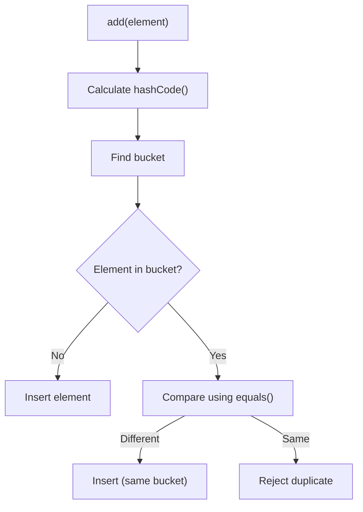
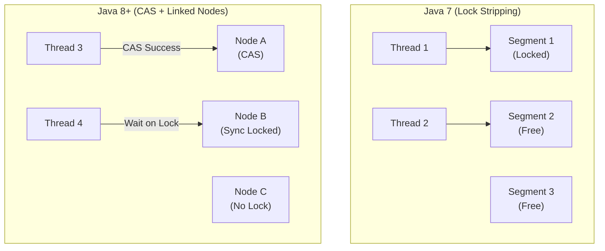
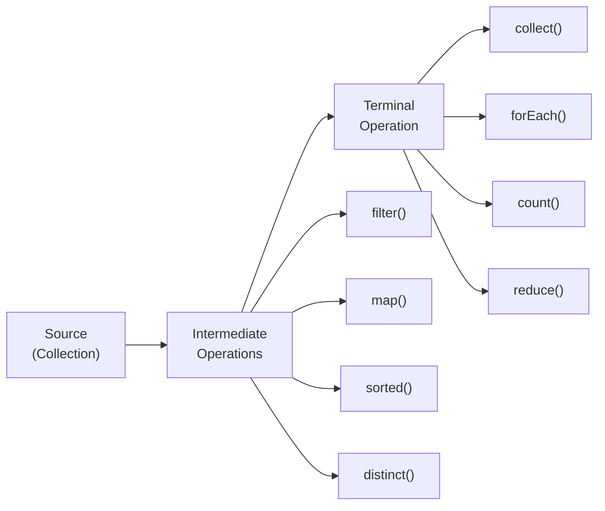

# Sessions 23-26: Set, Map, Concurrent Collections, Stream API

## 📚 Set Interface

**Set** is a collection that contains no duplicate elements.

### Set Implementations Comparison

| Feature | HashSet | LinkedHashSet | TreeSet |
|---------|---------|---------------|---------|
| **Ordering** | No order | Insertion order | Sorted order |
| **Null elements** | One null | One null | No null |
| **Performance** | O(1) | O(1) | O(log n) |
| **Implementation** | HashMap | LinkedHashMap | Red-Black Tree |

### HashSet

```java
import java.util.*;

public class HashSetDemo {
    public static void main(String[] args) {
        Set<String> set = new HashSet<>();
        
        // Add elements
        set.add("Apple");
        set.add("Banana");
        set.add("Cherry");
        set.add("Apple");  // Duplicate - not added
        set.add(null);     // One null allowed
        
        System.out.println(set.size());  // 4
        System.out.println(set);         // No guaranteed order
        
        // Check existence
        boolean has = set.contains("Apple");  // true
        
        // Remove
        set.remove("Banana");
        
        // Iterate
        for (String item : set) {
            System.out.println(item);
        }
    }
}
```

### TreeSet

```java
import java.util.*;

public class TreeSetDemo {
    public static void main(String[] args) {
        TreeSet<Integer> set = new TreeSet<>();
        set.addAll(Arrays.asList(5, 2, 8, 1, 9, 3));
        
        System.out.println(set);  // [1, 2, 3, 5, 8, 9] - sorted
        
        // Navigation methods
        System.out.println(set.first());     // 1 (smallest)
        System.out.println(set.last());      // 9 (largest)
        System.out.println(set.lower(5));    // 3 (< 5)
        System.out.println(set.higher(5));   // 8 (> 5)
        System.out.println(set.floor(5));    // 5 (<= 5)
        System.out.println(set.ceiling(5));  // 5 (>= 5)
        
        // Subsets
        SortedSet<Integer> head = set.headSet(5);    // [1, 2, 3]
        SortedSet<Integer> tail = set.tailSet(5);    // [5, 8, 9]
        SortedSet<Integer> sub = set.subSet(2, 8);   // [2, 3, 5]
        
        // Poll (remove and return)
        int first = set.pollFirst();  // 1 (removes it)
        int last = set.pollLast();    // 9 (removes it)
        
        // With custom comparator
        TreeSet<String> names = new TreeSet<>(String.CASE_INSENSITIVE_ORDER);
    }
}
```

### How Set Maintains Uniqueness



> **Important:** Override both `equals()` and `hashCode()` for custom objects in HashSet!

---

## 🗺️ Map Interface

**Map** stores key-value pairs. Keys are unique.

### Map Implementations Comparison

| Feature | HashMap | LinkedHashMap | TreeMap | Hashtable |
|---------|---------|---------------|---------|-----------|
| **Order** | No | Insertion | Sorted by key | No |
| **Null keys** | One | One | No | No |
| **Null values** | Yes | Yes | Yes | No |
| **Thread-safe** | No | No | No | Yes |
| **Performance** | O(1) | O(1) | O(log n) | O(1) |

### HashMap Operations

```java
import java.util.*;

public class HashMapDemo {
    public static void main(String[] args) {
        Map<String, Integer> map = new HashMap<>();
        
        // Add entries
        map.put("Alice", 90);
        map.put("Bob", 85);
        map.put("Charlie", 92);
        map.put("Alice", 95);  // Replaces old value
        
        // Get
        int score = map.get("Alice");       // 95
        int def = map.getOrDefault("David", 0);  // 0
        
        // Check
        boolean hasKey = map.containsKey("Bob");      // true
        boolean hasVal = map.containsValue(85);       // true
        
        // Remove
        map.remove("Charlie");
        map.remove("Bob", 85);  // Remove only if value matches
        
        // Size
        int size = map.size();
        boolean empty = map.isEmpty();
        
        // Iterate - keySet
        for (String key : map.keySet()) {
            System.out.println(key + ": " + map.get(key));
        }
        
        // Iterate - entrySet (more efficient)
        for (Map.Entry<String, Integer> entry : map.entrySet()) {
            System.out.println(entry.getKey() + ": " + entry.getValue());
        }
        
        // Iterate - values
        for (Integer val : map.values()) {
            System.out.println(val);
        }
        
        // Lambda forEach
        map.forEach((k, v) -> System.out.println(k + ": " + v));
        
        // Compute methods
        map.computeIfAbsent("David", k -> 80);
        map.computeIfPresent("Alice", (k, v) -> v + 5);
        map.compute("Bob", (k, v) -> v == null ? 0 : v + 10);
    }
}
```

### TreeMap

```java
import java.util.*;

public class TreeMapDemo {
    public static void main(String[] args) {
        TreeMap<Integer, String> map = new TreeMap<>();
        map.put(3, "Three");
        map.put(1, "One");
        map.put(4, "Four");
        map.put(2, "Two");
        
        System.out.println(map);  // {1=One, 2=Two, 3=Three, 4=Four}
        
        // Navigation
        System.out.println(map.firstKey());    // 1
        System.out.println(map.lastKey());     // 4
        System.out.println(map.lowerKey(3));   // 2
        System.out.println(map.higherKey(3));  // 4
        
        // Sub-maps
        SortedMap<Integer, String> head = map.headMap(3);  // {1=One, 2=Two}
        SortedMap<Integer, String> tail = map.tailMap(3);  // {3=Three, 4=Four}
    }
}
```

---

## 🔒 Concurrent Collections

Thread-safe alternatives to standard collections.

| Standard | Concurrent Alternative |
|----------|----------------------|
| ArrayList | CopyOnWriteArrayList |
| HashSet | CopyOnWriteArraySet, ConcurrentSkipListSet |
| HashMap | ConcurrentHashMap |
| TreeMap | ConcurrentSkipListMap |

```java
import java.util.concurrent.*;

public class ConcurrentDemo {
    public static void main(String[] args) {
        // Thread-safe map
        ConcurrentHashMap<String, Integer> map = new ConcurrentHashMap<>();
        map.put("key", 1);
        map.putIfAbsent("key2", 2);
        
        // Thread-safe list
        CopyOnWriteArrayList<String> list = new CopyOnWriteArrayList<>();
        list.add("item");
        
        // Blocking queue
        BlockingQueue<String> queue = new LinkedBlockingQueue<>(10);
        queue.offer("item");     // Non-blocking
        // queue.put("item");    // Blocks if full
        // queue.take();         // Blocks if empty
    }
}
```

### 🧠 Deep Dive: ConcurrentHashMap Internals

**Why is it faster than Hashtable?**

1.  **Lock Stripping (Java 7)**:
    *   Instead of locking the entire map (like Hashtable), it divides the map into segments (default 16).
    *   Only the segment containing the key is locked during write.
    *   Allows multiple threads to write concurrently to different segments.

2.  **CAS + Synchronized (Java 8+)**:
    *   Removed Segments. Now uses **CAS (Compare-And-Swap)** for lock-free insertion at empty buckets.
    *   Uses `synchronized` on the **Node (bucket head)** only when collision occurs.
    *   Retrieval (`get`) is non-blocking and lock-free!



### 🚨 Fail-Fast vs. Fail-Safe Iterators

| Feature | Fail-Fast Iterator | Fail-Safe Iterator |
|---------|--------------------|--------------------|
| **Behavior** | Throws exception if collection modified during iteration | Works on a copy or supports concurrent modification |
| **Exception** | `ConcurrentModificationException` | None |
| **Collections** | ArrayList, HashMap, HashSet, Vector | ConcurrentHashMap, CopyOnWriteArrayList |
| **Consistency** | Strict consistency | Weak consistency (may not see latest updates) |

```java
// Fail-Fast Example
List<String> list = new ArrayList<>();
list.add("A");
Iterator<String> it = list.iterator();
list.add("B"); // Modification outside iterator
// it.next(); // Throws ConcurrentModificationException

// Fail-Safe Example
ConcurrentHashMap<String, String> map = new ConcurrentHashMap<>();
map.put("A", "1");
Iterator<String> it2 = map.keySet().iterator();
map.put("B", "2"); // Concurrent modification allowed
it2.next(); // No exception
```

---

## 🌊 Java 8 Stream API

**Streams** provide functional-style operations on collections.



### Stream Operations

```java
import java.util.*;
import java.util.stream.*;

public class StreamDemo {
    public static void main(String[] args) {
        List<Integer> numbers = Arrays.asList(5, 2, 8, 1, 9, 3, 7, 4, 6);
        
        // filter - select elements matching condition
        List<Integer> evens = numbers.stream()
            .filter(n -> n % 2 == 0)
            .collect(Collectors.toList());  // [2, 8, 4, 6]
        
        // map - transform elements
        List<Integer> squares = numbers.stream()
            .map(n -> n * n)
            .collect(Collectors.toList());
        
        // sorted
        List<Integer> sorted = numbers.stream()
            .sorted()
            .collect(Collectors.toList());  // [1, 2, 3, 4, 5, 6, 7, 8, 9]
        
        // distinct - remove duplicates
        List<Integer> unique = numbers.stream()
            .distinct()
            .collect(Collectors.toList());
        
        // limit and skip
        List<Integer> first3 = numbers.stream()
            .limit(3)
            .collect(Collectors.toList());  // [5, 2, 8]
        
        List<Integer> skip3 = numbers.stream()
            .skip(3)
            .collect(Collectors.toList());  // [1, 9, 3, 7, 4, 6]
        
        // count
        long count = numbers.stream()
            .filter(n -> n > 5)
            .count();  // 4
        
        // reduce - combine elements
        int sum = numbers.stream()
            .reduce(0, (a, b) -> a + b);
        
        int max = numbers.stream()
            .reduce(Integer.MIN_VALUE, Integer::max);
        
        // min, max with Optional
        Optional<Integer> minOpt = numbers.stream().min(Integer::compare);
        Optional<Integer> maxOpt = numbers.stream().max(Integer::compare);
        
        // anyMatch, allMatch, noneMatch
        boolean hasEven = numbers.stream().anyMatch(n -> n % 2 == 0);
        boolean allPositive = numbers.stream().allMatch(n -> n > 0);
        boolean noneNegative = numbers.stream().noneMatch(n -> n < 0);
        
        // findFirst, findAny
        Optional<Integer> first = numbers.stream()
            .filter(n -> n > 5)
            .findFirst();
    }
}
```

### Stream with Objects

```java
List<Employee> employees = Arrays.asList(
    new Employee(1, "Alice", 50000),
    new Employee(2, "Bob", 60000),
    new Employee(3, "Charlie", 55000)
);

// Filter and map
List<String> highEarners = employees.stream()
    .filter(e -> e.getSalary() > 55000)
    .map(Employee::getName)
    .collect(Collectors.toList());

// Sum salaries
double totalSalary = employees.stream()
    .mapToDouble(Employee::getSalary)
    .sum();

// Average
OptionalDouble avgSalary = employees.stream()
    .mapToDouble(Employee::getSalary)
    .average();

// Group by
Map<String, List<Employee>> byDept = employees.stream()
    .collect(Collectors.groupingBy(Employee::getDepartment));

// Joining strings
String names = employees.stream()
    .map(Employee::getName)
    .collect(Collectors.joining(", "));  // "Alice, Bob, Charlie"
```

---

## 💡 Key MCQ Points

1. **HashSet** - no order, uses hashCode/equals
2. **LinkedHashSet** - insertion order
3. **TreeSet** - sorted order, no null allowed
4. **HashMap** - allows one null key, multiple null values
5. **Hashtable** - synchronized, no null keys/values
6. **ConcurrentHashMap** - thread-safe, better than Hashtable
7. **Stream** - doesn't modify source collection
8. **Intermediate operations** - lazy, return stream
9. **Terminal operations** - trigger execution, return result
10. **collect()** - most common terminal operation

### Stream Method Types

| Intermediate | Terminal |
|--------------|----------|
| filter() | collect() |
| map() | forEach() |
| sorted() | count() |
| distinct() | reduce() |
| limit() | min()/max() |
| skip() | findFirst()/findAny() |
| peek() | anyMatch()/allMatch() |

### Common Collectors

```java
Collectors.toList()
Collectors.toSet()
Collectors.toMap(keyMapper, valueMapper)
Collectors.joining(", ")
Collectors.groupingBy(classifier)
Collectors.counting()
Collectors.summingInt(mapper)
Collectors.averagingDouble(mapper)
```
