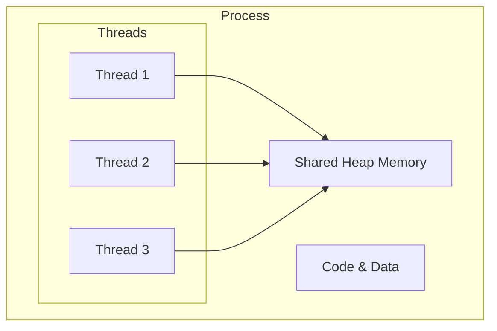
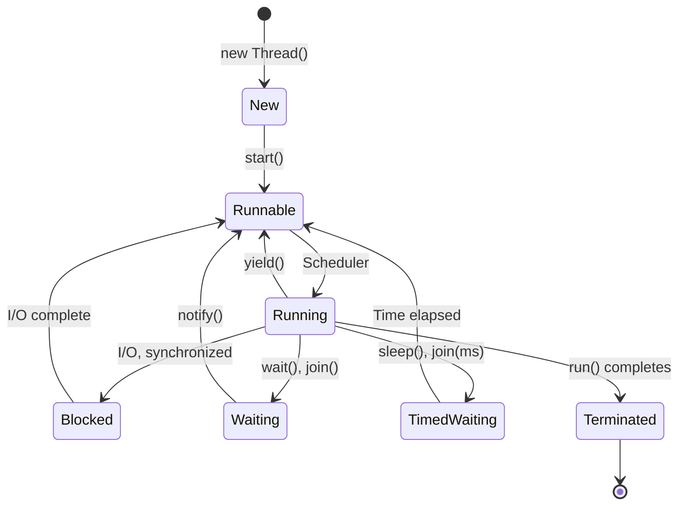

# Session 27: MultiThreading Basics

## 📚 What is Multithreading?

**Multithreading** is the concurrent execution of multiple threads within a single program.

### Process vs Thread

| Aspect | Process | Thread |
|--------|---------|--------|
| **Definition** | Independent program | Lightweight sub-process |
| **Memory** | Separate memory space | Shared memory (within process) |
| **Communication** | Inter-process (slow) | Shared variables (fast) |
| **Overhead** | High | Low |
| **Creation** | Slow | Fast |



---

## 🔄 Creating Threads

### Method 1: Extending Thread Class

```java
class MyThread extends Thread {
    @Override
    public void run() {
        for (int i = 1; i <= 5; i++) {
            System.out.println(getName() + ": " + i);
            try {
                Thread.sleep(500);
            } catch (InterruptedException e) {
                e.printStackTrace();
            }
        }
    }
}

public class ThreadDemo {
    public static void main(String[] args) {
        MyThread t1 = new MyThread();
        MyThread t2 = new MyThread();
        
        t1.setName("Thread-A");
        t2.setName("Thread-B");
        
        t1.start();  // Calls run() in new thread
        t2.start();
        
        // t1.run();  // DON'T do this - runs in main thread!
    }
}
```

### Method 2: Implementing Runnable Interface

```java
class MyRunnable implements Runnable {
    @Override
    public void run() {
        for (int i = 1; i <= 5; i++) {
            System.out.println(Thread.currentThread().getName() + ": " + i);
            try {
                Thread.sleep(500);
            } catch (InterruptedException e) {
                e.printStackTrace();
            }
        }
    }
}

public class RunnableDemo {
    public static void main(String[] args) {
        MyRunnable task = new MyRunnable();
        
        Thread t1 = new Thread(task, "Thread-A");
        Thread t2 = new Thread(task, "Thread-B");
        
        t1.start();
        t2.start();
    }
}
```

### Method 3: Lambda Expression

```java
public class LambdaThreadDemo {
    public static void main(String[] args) {
        // Using lambda
        Thread t1 = new Thread(() -> {
            for (int i = 1; i <= 5; i++) {
                System.out.println("Lambda Thread: " + i);
            }
        });
        t1.start();
        
        // Using method reference
        Thread t2 = new Thread(LambdaThreadDemo::task);
        t2.start();
    }
    
    static void task() {
        System.out.println("Task executed");
    }
}
```

### Thread vs Runnable

| Thread Class | Runnable Interface |
|--------------|-------------------|
| Extends Thread | Implements Runnable |
| Cannot extend other class | Can extend other class |
| Single inheritance | Multiple implementation |
| Less flexible | More flexible (preferred) |

---

## 🔄 Thread Lifecycle



### Thread States

| State | Description |
|-------|-------------|
| **NEW** | Thread created but not started |
| **RUNNABLE** | Ready to run, waiting for CPU |
| **RUNNING** | Currently executing |
| **BLOCKED** | Waiting for monitor lock |
| **WAITING** | Waiting indefinitely |
| **TIMED_WAITING** | Waiting for specified time |
| **TERMINATED** | Execution completed |

---

## ⏱️ Thread Methods

### sleep()

Pauses execution for specified time.

```java
public class SleepDemo {
    public static void main(String[] args) {
        Thread t = new Thread(() -> {
            for (int i = 1; i <= 5; i++) {
                System.out.println("Count: " + i);
                try {
                    Thread.sleep(1000);  // Sleep 1 second
                } catch (InterruptedException e) {
                    System.out.println("Thread interrupted");
                }
            }
        });
        t.start();
    }
}
```

### join()

Current thread waits for another thread to complete.

```java
public class JoinDemo {
    public static void main(String[] args) throws InterruptedException {
        Thread t1 = new Thread(() -> {
            for (int i = 1; i <= 5; i++) {
                System.out.println("Thread 1: " + i);
                try { Thread.sleep(500); } catch (Exception e) {}
            }
        });
        
        Thread t2 = new Thread(() -> {
            for (int i = 1; i <= 5; i++) {
                System.out.println("Thread 2: " + i);
                try { Thread.sleep(500); } catch (Exception e) {}
            }
        });
        
        t1.start();
        t1.join();  // Main waits for t1 to complete
        
        t2.start();
        t2.join();  // Main waits for t2 to complete
        
        System.out.println("Both threads completed");
        
        // With timeout
        // t1.join(1000);  // Wait max 1 second
    }
}
```

### yield()

Suggests giving up CPU to other threads.

```java
public class YieldDemo {
    public static void main(String[] args) {
        Thread t1 = new Thread(() -> {
            for (int i = 1; i <= 5; i++) {
                System.out.println("Thread 1: " + i);
                Thread.yield();  // Hint to scheduler
            }
        });
        
        Thread t2 = new Thread(() -> {
            for (int i = 1; i <= 5; i++) {
                System.out.println("Thread 2: " + i);
            }
        });
        
        t1.start();
        t2.start();
    }
}
```

### Priority Methods

```java
public class PriorityDemo {
    public static void main(String[] args) {
        Thread t1 = new Thread(() -> {
            System.out.println("Low priority thread");
        });
        
        Thread t2 = new Thread(() -> {
            System.out.println("High priority thread");
        });
        
        // Priority range: 1 (MIN) to 10 (MAX), default 5 (NORM)
        t1.setPriority(Thread.MIN_PRIORITY);   // 1
        t2.setPriority(Thread.MAX_PRIORITY);   // 10
        
        System.out.println("t1 priority: " + t1.getPriority());
        System.out.println("t2 priority: " + t2.getPriority());
        
        t1.start();
        t2.start();
    }
}
```

### Thread Priority Constants

| Constant | Value |
|----------|-------|
| Thread.MIN_PRIORITY | 1 |
| Thread.NORM_PRIORITY | 5 |
| Thread.MAX_PRIORITY | 10 |

---

## 👥 ThreadGroup

Groups threads for collective management.

```java
public class ThreadGroupDemo {
    public static void main(String[] args) {
        // Create thread group
        ThreadGroup group = new ThreadGroup("MyGroup");
        
        // Create threads in group
        Thread t1 = new Thread(group, () -> {
            try { Thread.sleep(2000); } catch (Exception e) {}
        }, "Thread-1");
        
        Thread t2 = new Thread(group, () -> {
            try { Thread.sleep(2000); } catch (Exception e) {}
        }, "Thread-2");
        
        t1.start();
        t2.start();
        
        // Group operations
        System.out.println("Group name: " + group.getName());
        System.out.println("Active threads: " + group.activeCount());
        
        // List all threads
        Thread[] threads = new Thread[group.activeCount()];
        group.enumerate(threads);
        for (Thread t : threads) {
            System.out.println(t.getName());
        }
        
        // Interrupt all threads in group
        // group.interrupt();
    }
}
```

---

## 🔧 Other Thread Methods

```java
Thread t = new Thread(() -> {}, "MyThread");

// Status methods
t.isAlive();           // Is thread still running?
t.isDaemon();          // Is it a daemon thread?
t.isInterrupted();     // Has it been interrupted?

// Getters
t.getName();           // Thread name
t.getId();             // Thread ID
t.getState();          // Current state
t.getPriority();       // Priority
t.getThreadGroup();    // Parent group

// Setters
t.setName("NewName");
t.setPriority(7);
t.setDaemon(true);     // Must set before start()

// Static methods
Thread.currentThread(); // Current executing thread
Thread.sleep(1000);     // Sleep current thread
Thread.yield();         // Yield current thread
Thread.interrupted();   // Check and clear interrupt flag
```

### Daemon Threads

Background threads that don't prevent JVM from exiting.

```java
Thread daemon = new Thread(() -> {
    while (true) {
        System.out.println("Daemon running...");
        try { Thread.sleep(1000); } catch (Exception e) {}
    }
});
daemon.setDaemon(true);  // Must set before start()
daemon.start();

// JVM exits when all non-daemon threads complete
// Daemon threads are automatically terminated
```

---

## 💡 Key MCQ Points

1. **start()** creates new thread, **run()** runs in current thread
2. **Runnable** is preferred over extending Thread
3. **sleep()** pauses current thread, throws InterruptedException
4. **join()** waits for another thread to complete
5. **yield()** is just a hint to scheduler
6. **Priority** range: 1-10, default 5
7. **Daemon thread** doesn't prevent JVM exit
8. **setDaemon()** must be called before start()
9. **Thread.currentThread()** returns current thread reference
10. **isAlive()** returns false after thread terminates

### Method Comparison

| Method | What it does | Throws Exception |
|--------|--------------|------------------|
| sleep(ms) | Pauses for time | InterruptedException |
| join() | Wait for thread | InterruptedException |
| yield() | Hint to scheduler | No |
| start() | Begin execution | IllegalThreadStateException |
| interrupt() | Set interrupt flag | No |

### Common Errors

| Error | Cause |
|-------|-------|
| `IllegalThreadStateException` | Calling start() twice on same thread |
| `InterruptedException` | Thread interrupted during sleep/wait |
| Thread not starting | Calling run() instead of start() |
