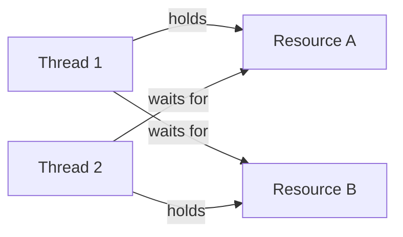

# Sessions 28 & 29: Synchronization

## 📚 Why Synchronization?

When multiple threads access shared resources, **race conditions** can occur, leading to data inconsistency.

### Race Condition Example

```java
class Counter {
    private int count = 0;
    
    public void increment() {
        count++;  // Not atomic: read → increment → write
    }
    
    public int getCount() {
        return count;
    }
}

public class RaceConditionDemo {
    public static void main(String[] args) throws InterruptedException {
        Counter counter = new Counter();
        
        Thread t1 = new Thread(() -> {
            for (int i = 0; i < 10000; i++) counter.increment();
        });
        
        Thread t2 = new Thread(() -> {
            for (int i = 0; i < 10000; i++) counter.increment();
        });
        
        t1.start();
        t2.start();
        t1.join();
        t2.join();
        
        // Expected: 20000, Actual: often less due to race condition
        System.out.println("Count: " + counter.getCount());
    }
}
```

---

## 🔒 Synchronization Methods

### Synchronized Method

```java
class Counter {
    private int count = 0;
    
    // Only one thread can execute at a time
    public synchronized void increment() {
        count++;
    }
    
    public synchronized int getCount() {
        return count;
    }
}
```

### Synchronized Block

```java
class Counter {
    private int count = 0;
    private Object lock = new Object();
    
    public void increment() {
        // Synchronize only critical section
        synchronized (lock) {
            count++;
        }
    }
    
    // Synchronize on 'this'
    public void decrement() {
        synchronized (this) {
            count--;
        }
    }
}
```

### Static Synchronized

```java
class Counter {
    private static int count = 0;
    
    // Locks on Class object, not instance
    public static synchronized void increment() {
        count++;
    }
    
    // Equivalent synchronized block
    public static void decrement() {
        synchronized (Counter.class) {
            count--;
        }
    }
}
```

### Synchronized Comparison

| Type | Lock Object | Scope |
|------|-------------|-------|
| Instance method | `this` | All instance sync methods |
| Static method | `ClassName.class` | All static sync methods |
| Block on `this` | `this` | Same as instance method |
| Block on `object` | Custom object | Only blocks with same lock |

---

## ⚠️ Deadlock

**Deadlock** occurs when two or more threads are blocked forever, each waiting for the other.



### Deadlock Example

```java
public class DeadlockDemo {
    private static Object lock1 = new Object();
    private static Object lock2 = new Object();
    
    public static void main(String[] args) {
        Thread t1 = new Thread(() -> {
            synchronized (lock1) {
                System.out.println("Thread 1: Holding lock1");
                try { Thread.sleep(100); } catch (Exception e) {}
                
                System.out.println("Thread 1: Waiting for lock2");
                synchronized (lock2) {
                    System.out.println("Thread 1: Holding lock1 & lock2");
                }
            }
        });
        
        Thread t2 = new Thread(() -> {
            synchronized (lock2) {
                System.out.println("Thread 2: Holding lock2");
                try { Thread.sleep(100); } catch (Exception e) {}
                
                System.out.println("Thread 2: Waiting for lock1");
                synchronized (lock1) {
                    System.out.println("Thread 2: Holding lock1 & lock2");
                }
            }
        });
        
        t1.start();
        t2.start();
        // Both threads will be stuck - DEADLOCK!
    }
}
```

### Preventing Deadlock

```java
// Solution: Always acquire locks in same order
Thread t1 = new Thread(() -> {
    synchronized (lock1) {
        synchronized (lock2) {
            // Work
        }
    }
});

Thread t2 = new Thread(() -> {
    synchronized (lock1) {  // Same order as t1
        synchronized (lock2) {
            // Work
        }
    }
});
```

### Deadlock Prevention Strategies

| Strategy | Description |
|----------|-------------|
| **Consistent lock ordering** | Always acquire locks in same order |
| **Lock timeout** | Use tryLock() with timeout |
| **Avoid nested locks** | Minimize synchronized blocks |
| **Use single lock** | Reduce multiple lock dependencies |

---

## 🔄 wait(), notify(), notifyAll()

Inter-thread communication methods (called on **object being used as lock**).

### Rules

- Must be called from synchronized context
- Called on the lock object, not Thread
- `wait()` releases the lock, `sleep()` doesn't

```java
class SharedResource {
    private boolean dataAvailable = false;
    private String data;
    
    public synchronized void produce(String data) {
        while (dataAvailable) {
            try {
                wait();  // Release lock and wait
            } catch (InterruptedException e) {}
        }
        
        this.data = data;
        dataAvailable = true;
        System.out.println("Produced: " + data);
        notify();  // Wake up waiting thread
    }
    
    public synchronized String consume() {
        while (!dataAvailable) {
            try {
                wait();
            } catch (InterruptedException e) {}
        }
        
        String result = data;
        dataAvailable = false;
        System.out.println("Consumed: " + result);
        notify();
        return result;
    }
}
```

### wait() vs sleep()

| wait() | sleep() |
|--------|---------|
| Releases lock | Does NOT release lock |
| Called on object | Called on Thread |
| Must be in synchronized block | Can be anywhere |
| Wakes on notify/notifyAll | Wakes after time elapsed |

---

## 🏭 Producer-Consumer Problem

Classic synchronization problem solved with wait/notify.

```java
import java.util.LinkedList;
import java.util.Queue;

class Buffer {
    private Queue<Integer> queue = new LinkedList<>();
    private int capacity;
    
    public Buffer(int capacity) {
        this.capacity = capacity;
    }
    
    public synchronized void produce(int item) throws InterruptedException {
        while (queue.size() == capacity) {
            System.out.println("Buffer full. Producer waiting...");
            wait();
        }
        
        queue.add(item);
        System.out.println("Produced: " + item + " | Buffer size: " + queue.size());
        notifyAll();  // Wake up consumers
    }
    
    public synchronized int consume() throws InterruptedException {
        while (queue.isEmpty()) {
            System.out.println("Buffer empty. Consumer waiting...");
            wait();
        }
        
        int item = queue.poll();
        System.out.println("Consumed: " + item + " | Buffer size: " + queue.size());
        notifyAll();  // Wake up producers
        return item;
    }
}

public class ProducerConsumerDemo {
    public static void main(String[] args) {
        Buffer buffer = new Buffer(5);
        
        // Producer thread
        Thread producer = new Thread(() -> {
            for (int i = 1; i <= 10; i++) {
                try {
                    buffer.produce(i);
                    Thread.sleep(100);
                } catch (InterruptedException e) {}
            }
        });
        
        // Consumer thread
        Thread consumer = new Thread(() -> {
            for (int i = 1; i <= 10; i++) {
                try {
                    buffer.consume();
                    Thread.sleep(200);
                } catch (InterruptedException e) {}
            }
        });
        
        producer.start();
        consumer.start();
    }
}
```

---

## 🧵 Thread-Local

Each thread gets its own copy of a variable.

```java
public class ThreadLocalDemo {
    private static ThreadLocal<Integer> threadLocal = new ThreadLocal<Integer>() {
        @Override
        protected Integer initialValue() {
            return 0;
        }
    };
    
    // Or using lambda
    private static ThreadLocal<Integer> tl = ThreadLocal.withInitial(() -> 0);
    
    public static void main(String[] args) {
        Thread t1 = new Thread(() -> {
            threadLocal.set(100);
            System.out.println("Thread 1: " + threadLocal.get());  // 100
        });
        
        Thread t2 = new Thread(() -> {
            threadLocal.set(200);
            System.out.println("Thread 2: " + threadLocal.get());  // 200
        });
        
        t1.start();
        t2.start();
        
        System.out.println("Main: " + threadLocal.get());  // 0 (initial)
    }
}
```

### Sharing ThreadLocal Data

```java
// InheritableThreadLocal - child threads inherit parent's value
private static InheritableThreadLocal<String> itl = new InheritableThreadLocal<>();

public static void main(String[] args) {
    itl.set("Parent Value");
    
    Thread child = new Thread(() -> {
        System.out.println("Child: " + itl.get());  // Parent Value
    });
    child.start();
}
```

---

## 💡 Key MCQ Points

1. **synchronized** prevents race conditions
2. **Instance sync method** locks on `this`
3. **Static sync method** locks on `Class` object
4. **Deadlock** - circular wait for resources
5. **wait()** releases lock, **sleep()** doesn't
6. **wait/notify** must be called inside synchronized block
7. **notifyAll()** wakes all waiting threads
8. Always call **wait() in a loop** (spurious wakeups)
9. **ThreadLocal** gives each thread its own variable copy
10. **Producer-Consumer** classic sync problem

### Synchronization Summary

| Method | Purpose |
|--------|---------|
| `synchronized` | Exclusive access to code block |
| `wait()` | Release lock and wait for notification |
| `notify()` | Wake one waiting thread |
| `notifyAll()` | Wake all waiting threads |

### Common Errors

| Error | Cause |
|-------|-------|
| `IllegalMonitorStateException` | wait/notify outside synchronized |
| Deadlock | Circular lock dependency |
| Race condition | Missing synchronization |
| Livelock | Threads keep responding to each other |
