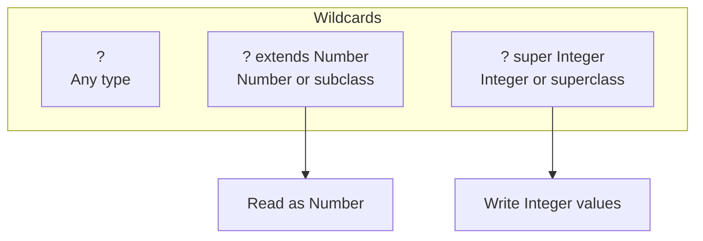

# Session 30: Generics and Reflection API

## 📚 Introduction to Generics

**Generics** enable types (classes and interfaces) to be parameters when defining classes, interfaces, and methods.

### Benefits of Generics

| Benefit | Description |
|---------|-------------|
| **Type Safety** | Compile-time type checking |
| **No Casting** | Eliminates explicit type casting |
| **Code Reuse** | Single implementation for multiple types |
| **Better Readability** | Self-documenting code |

### Without Generics (Before Java 5)

```java
// Problem: No type safety
List list = new ArrayList();
list.add("Hello");
list.add(123);  // No compile error!

String s = (String) list.get(0);  // Casting required
String s2 = (String) list.get(1); // ClassCastException at runtime!
```

### With Generics

```java
// Solution: Type safe
List<String> list = new ArrayList<>();
list.add("Hello");
// list.add(123);  // Compile ERROR!

String s = list.get(0);  // No casting needed
```

---

## 📦 Generic Classes

```java
// Generic class with type parameter T
public class Box<T> {
    private T content;
    
    public void set(T content) {
        this.content = content;
    }
    
    public T get() {
        return content;
    }
}

// Usage
Box<String> stringBox = new Box<>();
stringBox.set("Hello");
String value = stringBox.get();

Box<Integer> intBox = new Box<>();
intBox.set(100);
Integer num = intBox.get();
```

### Multiple Type Parameters

```java
public class Pair<K, V> {
    private K key;
    private V value;
    
    public Pair(K key, V value) {
        this.key = key;
        this.value = value;
    }
    
    public K getKey() { return key; }
    public V getValue() { return value; }
}

// Usage
Pair<String, Integer> pair = new Pair<>("Age", 25);
String key = pair.getKey();      // "Age"
Integer val = pair.getValue();   // 25
```

### Common Type Parameter Naming

| Letter | Convention |
|--------|------------|
| T | Type |
| E | Element (collections) |
| K | Key |
| V | Value |
| N | Number |
| S, U, V | Additional types |

---

## 🔧 Generic Methods

```java
public class GenericMethods {
    
    // Generic method - type parameter before return type
    public static <T> void printArray(T[] array) {
        for (T element : array) {
            System.out.print(element + " ");
        }
        System.out.println();
    }
    
    // Generic method with return type
    public static <T> T getFirst(List<T> list) {
        return list.isEmpty() ? null : list.get(0);
    }
    
    // Multiple type parameters
    public static <K, V> void printPair(K key, V value) {
        System.out.println(key + ": " + value);
    }
    
    public static void main(String[] args) {
        Integer[] intArray = {1, 2, 3, 4, 5};
        String[] strArray = {"A", "B", "C"};
        
        printArray(intArray);  // 1 2 3 4 5
        printArray(strArray);  // A B C
        
        // Type inference
        String first = getFirst(Arrays.asList("Hello", "World"));
        printPair("Name", "John");
    }
}
```

---

## 🎯 Wildcards

Wildcards provide flexibility in generic type parameters.

### Unbounded Wildcard (?)

Represents any type.

```java
public static void printList(List<?> list) {
    for (Object item : list) {
        System.out.println(item);
    }
}

// Can accept any List
printList(Arrays.asList("A", "B", "C"));
printList(Arrays.asList(1, 2, 3));
```

### Upper Bounded Wildcard (? extends Type)

Accepts Type and its subclasses. **Producer** - can read but not add.

```java
// Accepts Number and any subclass (Integer, Double, etc.)
public static double sum(List<? extends Number> list) {
    double total = 0;
    for (Number n : list) {
        total += n.doubleValue();
    }
    return total;
}

sum(Arrays.asList(1, 2, 3));        // List<Integer>
sum(Arrays.asList(1.5, 2.5, 3.5));  // List<Double>

// Cannot add (except null)
// list.add(10);  // ERROR
```

### Lower Bounded Wildcard (? super Type)

Accepts Type and its superclasses. **Consumer** - can add but limited reading.

```java
// Accepts Integer and any superclass (Number, Object)
public static void addNumbers(List<? super Integer> list) {
    list.add(1);
    list.add(2);
    list.add(3);
}

List<Number> numbers = new ArrayList<>();
addNumbers(numbers);

List<Object> objects = new ArrayList<>();
addNumbers(objects);
```

### PECS Principle

**P**roducer **E**xtends, **C**onsumer **S**uper

| If you... | Use |
|-----------|-----|
| Read from collection | `? extends T` (Producer) |
| Write to collection | `? super T` (Consumer) |
| Both read and write | Exact type `T` |



---

## 🔍 Reflection API

**Reflection** allows examining and modifying runtime behavior of classes, methods, and fields.

### Getting Class Information

```java
public class ReflectionDemo {
    public static void main(String[] args) throws Exception {
        // Three ways to get Class object
        Class<?> c1 = String.class;
        Class<?> c2 = "Hello".getClass();
        Class<?> c3 = Class.forName("java.lang.String");
        
        // Class information
        System.out.println("Name: " + c1.getName());
        System.out.println("Simple Name: " + c1.getSimpleName());
        System.out.println("Package: " + c1.getPackage().getName());
        System.out.println("Superclass: " + c1.getSuperclass().getName());
        System.out.println("Is Interface: " + c1.isInterface());
        System.out.println("Modifiers: " + Modifier.toString(c1.getModifiers()));
    }
}
```

### Inspecting Fields

```java
import java.lang.reflect.*;

class Person {
    public String name;
    private int age;
    protected String address;
}

public class FieldReflection {
    public static void main(String[] args) throws Exception {
        Class<?> clazz = Person.class;
        
        // Get all declared fields (including private)
        Field[] fields = clazz.getDeclaredFields();
        for (Field f : fields) {
            System.out.println(f.getName() + " : " + f.getType().getSimpleName() 
                + " | " + Modifier.toString(f.getModifiers()));
        }
        
        // Access private field
        Person person = new Person();
        Field ageField = clazz.getDeclaredField("age");
        ageField.setAccessible(true);  // Bypass private access
        ageField.set(person, 25);      // Set value
        int age = (int) ageField.get(person);  // Get value
        System.out.println("Age: " + age);
    }
}
```

### Inspecting Methods

```java
import java.lang.reflect.*;

class Calculator {
    public int add(int a, int b) { return a + b; }
    private int multiply(int a, int b) { return a * b; }
}

public class MethodReflection {
    public static void main(String[] args) throws Exception {
        Class<?> clazz = Calculator.class;
        
        // Get all methods
        Method[] methods = clazz.getDeclaredMethods();
        for (Method m : methods) {
            System.out.println(m.getName() + " : " + m.getReturnType().getSimpleName());
        }
        
        // Invoke method
        Calculator calc = new Calculator();
        Method addMethod = clazz.getMethod("add", int.class, int.class);
        int result = (int) addMethod.invoke(calc, 5, 10);
        System.out.println("Result: " + result);  // 15
        
        // Invoke private method
        Method multiplyMethod = clazz.getDeclaredMethod("multiply", int.class, int.class);
        multiplyMethod.setAccessible(true);
        int product = (int) multiplyMethod.invoke(calc, 5, 10);
        System.out.println("Product: " + product);  // 50
    }
}
```

### Creating Objects via Reflection

```java
Class<?> clazz = Person.class;

// Using newInstance (deprecated in Java 9+)
// Person p1 = (Person) clazz.newInstance();

// Using Constructor
Constructor<?> constructor = clazz.getConstructor();
Person p2 = (Person) constructor.newInstance();

// With parameters
Constructor<?> paramConstructor = clazz.getConstructor(String.class, int.class);
Person p3 = (Person) paramConstructor.newInstance("John", 25);
```

---

## 🧵 Threads with Anonymous Classes and Lambda

```java
public class ThreadCreationDemo {
    public static void main(String[] args) {
        // Anonymous inner class
        Thread t1 = new Thread(new Runnable() {
            @Override
            public void run() {
                System.out.println("Anonymous class thread");
            }
        });
        t1.start();
        
        // Lambda expression
        Thread t2 = new Thread(() -> {
            System.out.println("Lambda thread");
        });
        t2.start();
        
        // Lambda with multiple statements
        Thread t3 = new Thread(() -> {
            for (int i = 1; i <= 5; i++) {
                System.out.println("Count: " + i);
            }
        });
        t3.start();
    }
}
```

---

## 💡 Key MCQ Points

1. **Generics** provide compile-time type safety
2. **Type erasure** - generic type info removed at runtime
3. **Wildcards**: `?` (any), `? extends T` (producer), `? super T` (consumer)
4. **PECS** - Producer Extends, Consumer Super
5. **Reflection** examines classes at runtime
6. **setAccessible(true)** bypasses access modifiers
7. **Cannot create arrays** of generic types
8. **Primitive types** cannot be used as type parameters
9. **Class.forName()** loads class dynamically
10. **getDeclaredMethods()** includes private methods

### Generics Restrictions

| Cannot Do | Reason |
|-----------|--------|
| `new T()` | Type erasure |
| `new T[]` | Type erasure |
| `instanceof T` | Type erasure |
| `static T field` | Type parameter is instance-level |
| `List<int>` | Primitives not allowed |

### Reflection Methods

| Method | Returns |
|--------|---------|
| `getClass()` | Runtime class |
| `getName()` | Fully qualified name |
| `getFields()` | Public fields (inherited too) |
| `getDeclaredFields()` | All declared fields |
| `getMethods()` | Public methods (inherited too) |
| `getDeclaredMethods()` | All declared methods |
