# Complete Software Development Methodologies Guide

This comprehensive guide covers all 16 sessions of the Software Development Methodologies module.

---

# Part 1: Git & Version Control (Session 1)

## Introduction to Version Control

**Version Control System (VCS)** tracks changes to files over time, allowing you to recall specific versions later.

### Why Version Control?

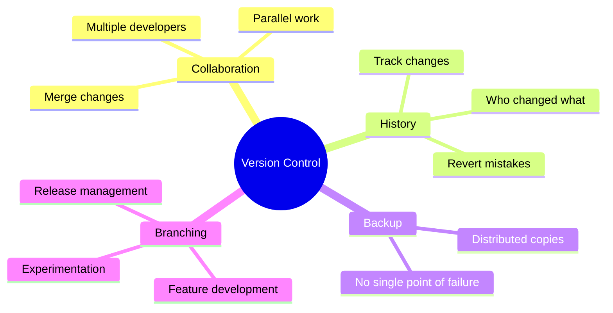

### Types of VCS

| Type | Description | Examples |
|------|-------------|----------|
| **Local** | Version database on local computer | RCS |
| **Centralized** | Single server, multiple clients | SVN, CVS, Perforce |
| **Distributed** | Every client has full repository | Git, Mercurial |

---

## Git Fundamentals

### Git Architecture

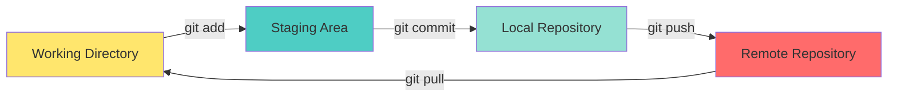

### Three States of Git

1. **Modified**: Changed but not committed
2. **Staged**: Marked for next commit
3. **Committed**: Safely stored in database

### Essential Git Commands

#### Setup and Configuration

```bash
# Configure user
git config --global user.name "Your Name"
git config --global user.email "your.email@example.com"

# View configuration
git config --list

# Initialize repository
git init

# Clone repository
git clone https://github.com/user/repo.git
```

#### Basic Workflow

```bash
# Check status
git status

# Add files to staging
git add filename.txt
git add .                    # Add all files
git add *.java              # Add all Java files

# Commit changes
git commit -m "Commit message"
git commit -am "Add and commit"  # For tracked files

# View commit history
git log
git log --oneline
git log --graph --all

# View changes
git diff                    # Working vs Staging
git diff --staged           # Staging vs Last commit
git diff commit1 commit2    # Between commits
```

#### Branching and Merging

```bash
# List branches
git branch
git branch -a               # Include remote branches

# Create branch
git branch feature-login

# Switch branch
git checkout feature-login
git switch feature-login    # Newer syntax

# Create and switch
git checkout -b feature-signup
git switch -c feature-signup

# Merge branch
git checkout main
git merge feature-login

# Delete branch
git branch -d feature-login
git branch -D feature-login # Force delete
```

#### Remote Operations

```bash
# Add remote
git remote add origin https://github.com/user/repo.git

# View remotes
git remote -v

# Push to remote
git push origin main
git push -u origin main     # Set upstream

# Pull from remote
git pull origin main
git pull                    # From tracked branch

# Fetch changes
git fetch origin

# Clone repository
git clone https://github.com/user/repo.git
```

### Git Workflow

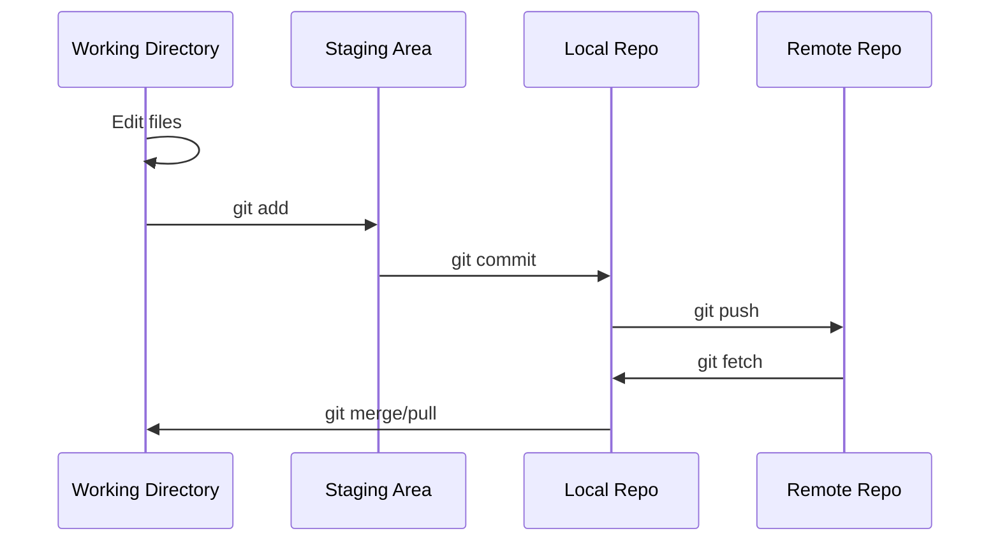

### Branching Strategies

#### Feature Branch Workflow

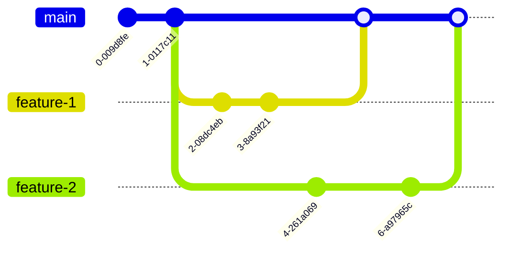

#### Git Flow

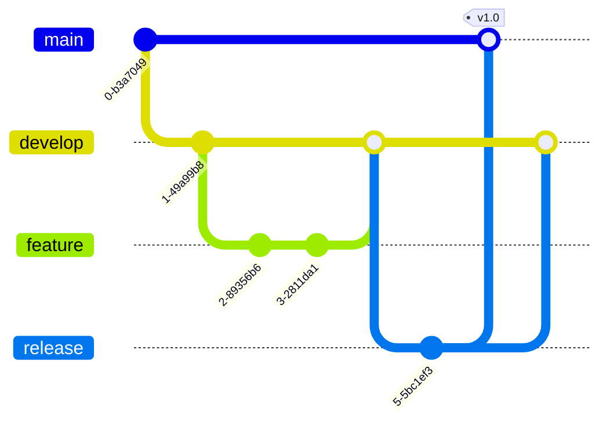

### Handling Conflicts

```bash
# When merge conflict occurs
git status                  # See conflicted files

# Edit conflicted files (remove markers)
<<<<<<< HEAD
Current changes
=======
Incoming changes
>>>>>>> branch-name

# After resolving
git add resolved-file.txt
git commit -m "Resolved merge conflict"
```

### Important Git Concepts

**HEAD**: Pointer to current branch/commit
**.gitignore**: Specify files to ignore
**Tags**: Mark specific points in history

```bash
# Create tag
git tag v1.0.0
git tag -a v1.0.0 -m "Version 1.0.0"

# Push tags
git push origin v1.0.0
git push --tags

# View tags
git tag
```

---

# Part 2: Software Engineering (Sessions 2-5)

## Software Engineering Fundamentals

### What is Software Engineering?

**Software Engineering** is the systematic application of engineering approaches to software development.

### Software Process vs Product

| Software Process | Software Product |
|-----------------|------------------|
| Set of activities | Result of process |
| How to build | What is built |
| Development methodology | Deliverable software |
| Example: Agile, Waterfall | Example: Mobile app, Website |

---

## Software Development Life Cycle (SDLC)

### SDLC Phases

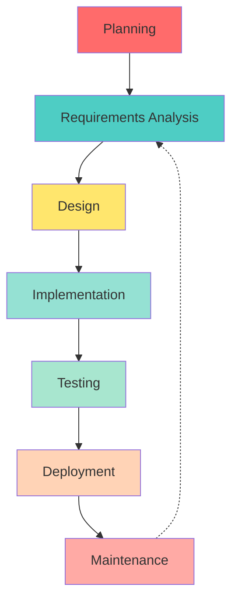

1. **Planning**: Define project scope, objectives, resources
2. **Requirements**: Gather and document what system should do
3. **Design**: Create architecture and detailed design
4. **Implementation**: Write code
5. **Testing**: Verify software works correctly
6. **Deployment**: Release to users
7. **Maintenance**: Fix bugs, add features

---

## SDLC Models

### 1. Waterfall Model

Sequential phases, each completed before next begins.

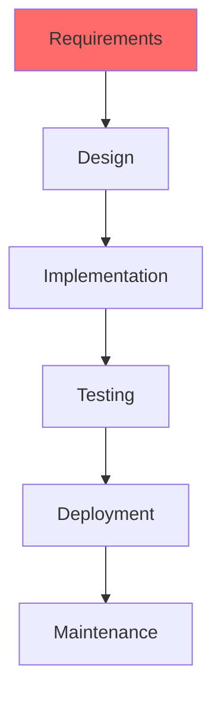

**Advantages:**
- Simple and easy to understand
- Well-documented
- Works well for small projects
- Clear milestones

**Disadvantages:**
- Inflexible to changes
- Late testing
- No working software until late
- High risk

**When to Use:**
- Requirements are clear and fixed
- Technology is well-understood
- Short projects

### 2. Iterative Model

Develop system through repeated cycles.

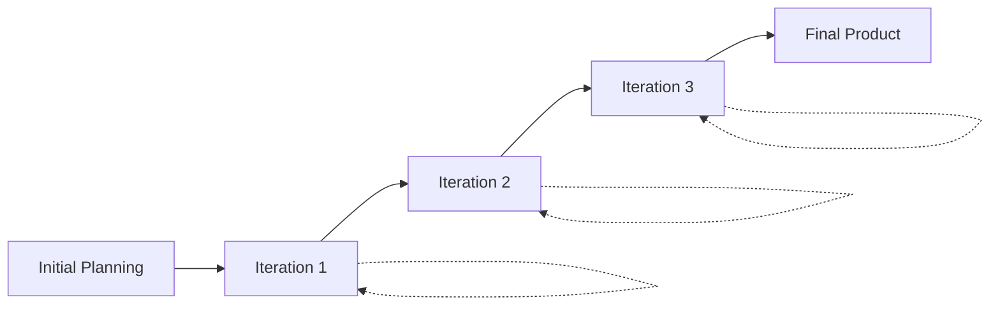

**Advantages:**
- Early working software
- Easier to test and debug
- Flexible to changes
- Risk management

**Disadvantages:**
- Requires good planning
- More resources
- Not suitable for small projects

### 3. Spiral Model

Combines iterative and waterfall, emphasizes risk analysis.

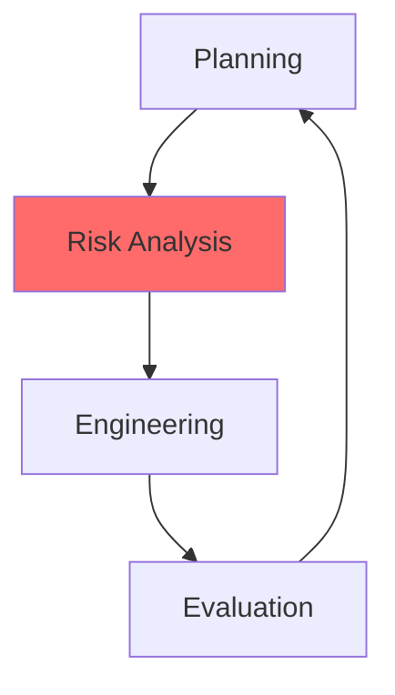

**Phases:**
1. Planning: Objectives, alternatives
2. Risk Analysis: Identify and resolve risks
3. Engineering: Develop and test
4. Evaluation: Customer evaluation

**Advantages:**
- Risk management
- Good for large projects
- Customer involvement
- Flexible

**Disadvantages:**
- Complex
- Expensive
- Requires risk assessment expertise

### 4. V-Model (Verification & Validation)

Extension of waterfall with testing at each stage.

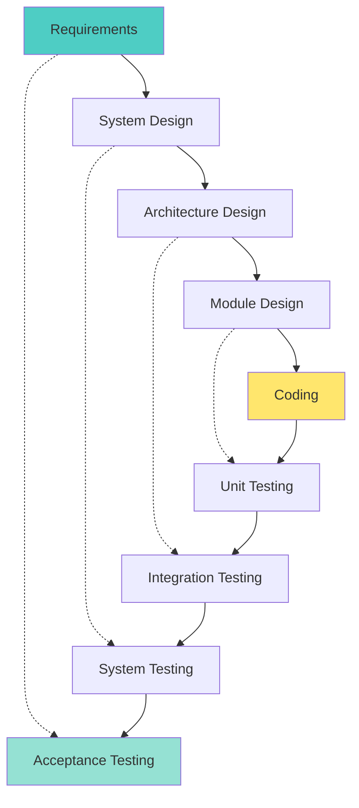

**Advantages:**
- Testing planned early
- Works well for small projects
- Simple and easy

**Disadvantages:**
- Inflexible
- No early prototypes
- High risk

### 5. Agile Model

Iterative approach with continuous feedback.

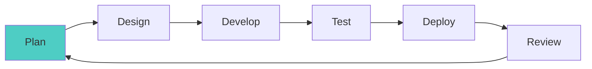

**Principles:**
- Customer collaboration
- Working software
- Respond to change
- Individuals and interactions

**Advantages:**
- Flexible
- Customer satisfaction
- Early delivery
- Continuous improvement

**Disadvantages:**
- Less documentation
- Requires experienced team
- Difficult to estimate time/cost

---

## Requirements Engineering

### Types of Requirements

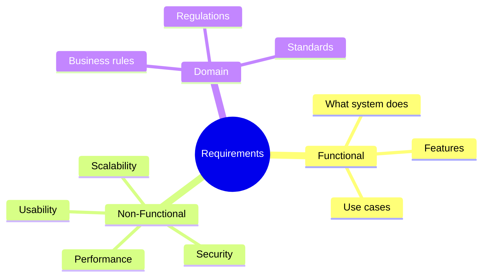

#### Functional Requirements

Define what system should do.

**Examples:**
- User can login with email and password
- System sends confirmation email
- Admin can delete user accounts

#### Non-Functional Requirements

Define how system should be.

**Categories:**
- **Performance**: Response time, throughput
- **Security**: Authentication, encryption
- **Usability**: User-friendly interface
- **Reliability**: Uptime, fault tolerance
- **Scalability**: Handle growth
- **Maintainability**: Easy to modify

### Requirements Engineering Process

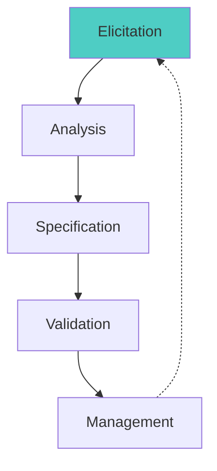

1. **Elicitation**: Gather requirements from stakeholders
2. **Analysis**: Understand and model requirements
3. **Specification**: Document requirements
4. **Validation**: Ensure requirements are correct
5. **Management**: Handle changes

---

## Design Engineering

### Design Principles

#### 1. Modularity

Divide system into modules.

**Benefits:**
- Easier to understand
- Parallel development
- Reusability
- Easier testing

#### 2. Abstraction

Hide complex details, show only essentials.

```
High Level: "Send email"
Low Level: SMTP connection, headers, encoding, etc.
```

#### 3. Encapsulation

Bundle data and methods, hide internal details.

#### 4. Separation of Concerns

Different aspects in different modules.

**Example:**
- Presentation layer
- Business logic layer
- Data access layer

### Cohesion and Coupling

#### Cohesion

How closely related are elements within a module?

**High Cohesion** (Good):
```python
class Calculator:
    def add(self, a, b)
    def subtract(self, a, b)
    def multiply(self, a, b)
```

**Low Cohesion** (Bad):
```python
class MixedClass:
    def calculate_salary(self)
    def send_email(self)
    def draw_circle(self)
```

#### Coupling

How dependent are modules on each other?

**Low Coupling** (Good): Modules independent
**High Coupling** (Bad): Modules tightly connected

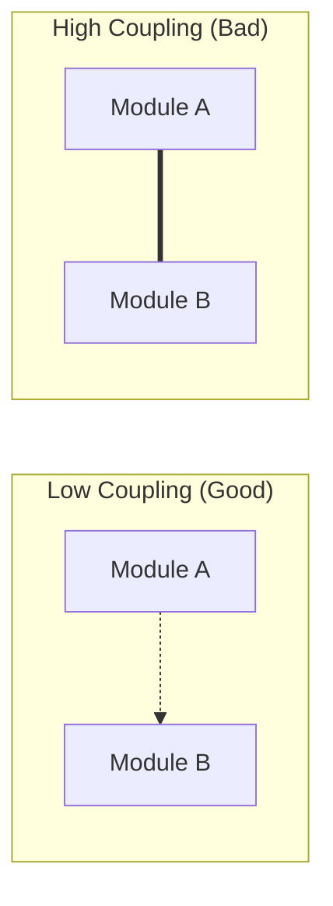

**Goal**: High Cohesion, Low Coupling

### Design Patterns

Common solutions to recurring problems.

**Categories:**
1. **Creational**: Object creation (Singleton, Factory)
2. **Structural**: Object composition (Adapter, Decorator)
3. **Behavioral**: Object interaction (Observer, Strategy)

---

## UML (Unified Modeling Language)

Visual language for modeling software systems.

### Use Case Diagram

Shows system functionality from user perspective.

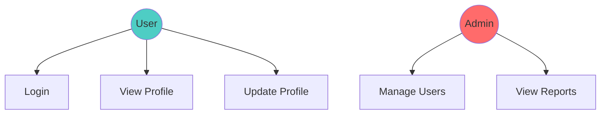

### Class Diagram

Shows classes and relationships.

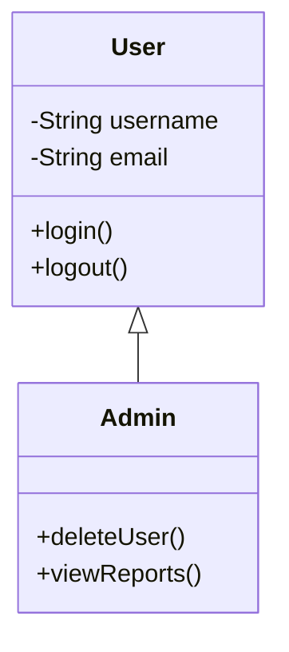

### Sequence Diagram

Shows object interactions over time.

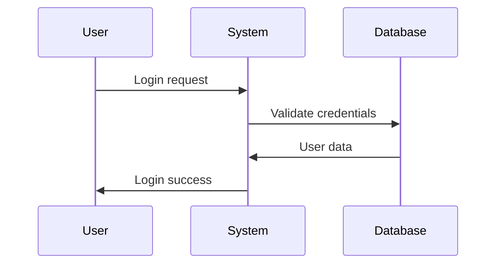

### Activity Diagram

Shows workflow or process flow.

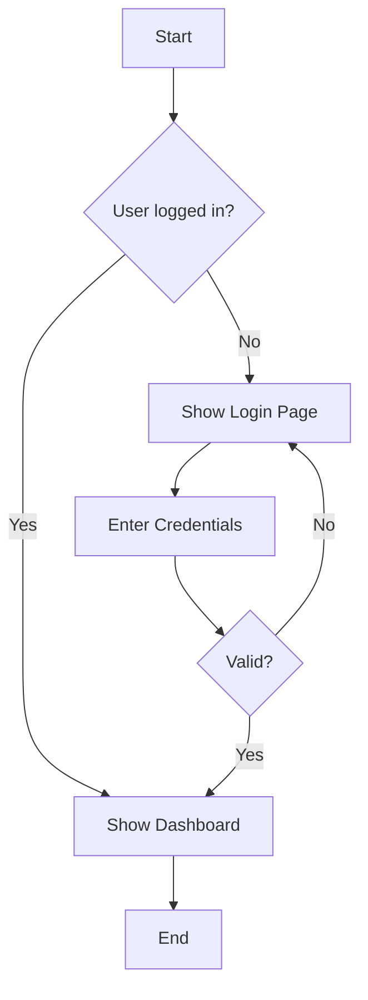

---

## Object-Oriented Analysis and Design

### OOP Principles

#### 1. Encapsulation

Bundle data and methods together.

```java
class BankAccount {
    private double balance;  // Hidden
    
    public void deposit(double amount) {
        balance += amount;
    }
    
    public double getBalance() {
        return balance;
    }
}
```

#### 2. Inheritance

Create new classes from existing ones.

```java
class Animal {
    void eat() { }
}

class Dog extends Animal {
    void bark() { }
}
```

#### 3. Polymorphism

Same interface, different implementations.

```java
class Shape {
    void draw() { }
}

class Circle extends Shape {
    void draw() { /* Draw circle */ }
}

class Square extends Shape {
    void draw() { /* Draw square */ }
}
```

#### 4. Abstraction

Hide complex details.

```java
abstract class Vehicle {
    abstract void start();
}

class Car extends Vehicle {
    void start() {
        // Start engine
    }
}
```

---

# Part 3: Agile Development (Sessions 6-8)

## Agile Manifesto

**Four Values:**
1. **Individuals and interactions** over processes and tools
2. **Working software** over comprehensive documentation
3. **Customer collaboration** over contract negotiation
4. **Responding to change** over following a plan

### 12 Agile Principles

1. Customer satisfaction through early and continuous delivery
2. Welcome changing requirements
3. Deliver working software frequently
4. Business and developers work together daily
5. Build projects around motivated individuals
6. Face-to-face conversation
7. Working software is primary measure of progress
8. Sustainable development pace
9. Continuous attention to technical excellence
10. Simplicity
11. Self-organizing teams
12. Regular reflection and adjustment

---

## Scrum Framework

### Scrum Roles

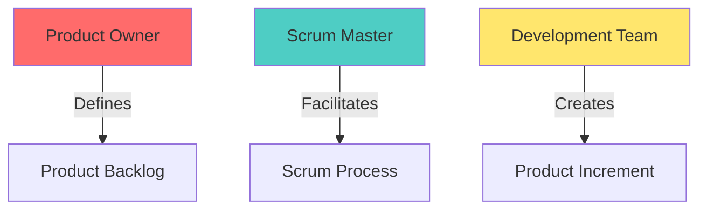

#### 1. Product Owner

- Defines features
- Prioritizes backlog
- Accepts/rejects work
- Represents stakeholders

#### 2. Scrum Master

- Facilitates Scrum process
- Removes impediments
- Coaches team
- Shields team from interruptions

#### 3. Development Team

- Self-organizing
- Cross-functional
- 3-9 members
- Delivers product increment

### Scrum Events

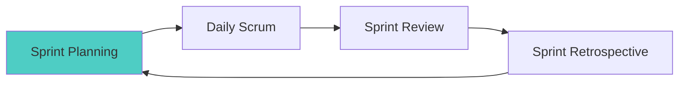

#### 1. Sprint

Time-boxed iteration (1-4 weeks).

#### 2. Sprint Planning

Plan work for sprint.

**Questions:**
- What can be delivered?
- How will work be done?

#### 3. Daily Scrum

15-minute daily standup.

**Three Questions:**
- What did I do yesterday?
- What will I do today?
- Any impediments?

#### 4. Sprint Review

Demo completed work to stakeholders.

#### 5. Sprint Retrospective

Team reflects on process improvement.

**Questions:**
- What went well?
- What could be improved?
- What will we commit to improve?

### Scrum Artifacts

#### 1. Product Backlog

Ordered list of everything needed in product.

**Format:** User Stories
```
As a [user type],
I want [goal],
So that [benefit].
```

**Example:**
```
As a customer,
I want to reset my password,
So that I can regain access if I forget it.
```

#### 2. Sprint Backlog

Items selected for sprint + plan to deliver them.

#### 3. Product Increment

Sum of all completed backlog items.

---

## Extreme Programming (XP)

### XP Practices

```mermaid
mindmap
  root((XP Practices))
    Planning
      User Stories
      Release Planning
      Iteration Planning
    Design
      Simple Design
      Refactoring
      Metaphor
    Coding
      Pair Programming
      Coding Standards
      Collective Ownership
    Testing
      Test-Driven Development
      Continuous Integration
      Acceptance Tests
```

#### Key Practices:

1. **Pair Programming**: Two developers, one computer
2. **Test-Driven Development**: Write tests first
3. **Continuous Integration**: Integrate code frequently
4. **Refactoring**: Improve code without changing behavior
5. **Simple Design**: Simplest solution that works

---

## Jira for Agile Project Management

### Jira Concepts

**Project**: Container for issues
**Issue**: Work item (Story, Task, Bug)
**Epic**: Large user story
**Sprint**: Time-boxed iteration
**Board**: Visualize work (Kanban/Scrum)

### Jira Workflow

```mermaid
stateDiagram-v2
    [*] --> ToDo
    ToDo --> InProgress: Start Work
    InProgress --> InReview: Submit for Review
    InReview --> InProgress: Changes Requested
    InReview --> Done: Approved
    Done --> [*]
```

### Creating Sprint in Jira

1. Create Project
2. Add Epics
3. Create User Stories
4. Estimate Stories (Story Points)
5. Create Sprint
6. Add Stories to Sprint
7. Start Sprint
8. Track Progress
9. Complete Sprint

---

# Part 4: DevOps & Docker (Sessions 9-10)

## DevOps Introduction

**DevOps** = Development + Operations

### DevOps Philosophy

Break down silos between development and operations teams.

```mermaid
graph LR
    A[Plan] --> B[Code]
    B --> C[Build]
    C --> D[Test]
    D --> E[Release]
    E --> F[Deploy]
    F --> G[Operate]
    G --> H[Monitor]
    H --> A
    
    style A fill:#4ecdc4
    style E fill:#ff6b6b
```

### DevOps Benefits

- Faster delivery
- Improved collaboration
- Better quality
- Faster recovery
- Continuous improvement

---

## Containerization

### What is a Container?

Lightweight, standalone package containing everything needed to run software.

```mermaid
graph TD
    A[Container] --> B[Application Code]
    A --> C[Runtime]
    A --> D[Libraries]
    A --> E[Dependencies]
    
    style A fill:#4ecdc4
```

### Containers vs Virtual Machines

```mermaid
graph TD
    subgraph "Virtual Machines"
        A1[App A] --> B1[Guest OS]
        A2[App B] --> B2[Guest OS]
        B1 --> C1[Hypervisor]
        B2 --> C1
        C1 --> D1[Host OS]
        D1 --> E1[Infrastructure]
    end
    
    subgraph "Containers"
        F1[App A] --> G1[Container Runtime]
        F2[App B] --> G1
        G1 --> H1[Host OS]
        H1 --> I1[Infrastructure]
    end
```

| Aspect | Containers | Virtual Machines |
|--------|-----------|------------------|
| **Size** | MB | GB |
| **Startup** | Seconds | Minutes |
| **Performance** | Native | Overhead |
| **Isolation** | Process-level | OS-level |
| **Portability** | High | Medium |

---

## Docker

### Docker Architecture

```mermaid
graph TD
    A[Docker Client] -->|docker commands| B[Docker Daemon]
    B --> C[Images]
    B --> D[Containers]
    B --> E[Volumes]
    B --> F[Networks]
    
    G[Docker Registry] -.->|pull/push| C
    
    style B fill:#4ecdc4
    style G fill:#ffe66d
```

### Docker Components

1. **Docker Image**: Template for containers
2. **Docker Container**: Running instance of image
3. **Docker Registry**: Store for images (Docker Hub)
4. **Dockerfile**: Instructions to build image

### Essential Docker Commands

```bash
# Images
docker images                    # List images
docker pull nginx               # Download image
docker build -t myapp .         # Build image
docker rmi image_id             # Remove image

# Containers
docker ps                       # List running containers
docker ps -a                    # List all containers
docker run nginx                # Run container
docker run -d nginx             # Run in background
docker run -p 8080:80 nginx     # Port mapping
docker run -v /host:/container nginx  # Volume mount
docker stop container_id        # Stop container
docker start container_id       # Start container
docker rm container_id          # Remove container
docker exec -it container_id bash  # Execute command

# System
docker info                     # System information
docker version                  # Docker version
docker system prune             # Clean up
```

### Dockerfile

Instructions to build Docker image.

```dockerfile
# Base image
FROM node:14

# Set working directory
WORKDIR /app

# Copy package files
COPY package*.json ./

# Install dependencies
RUN npm install

# Copy application code
COPY . .

# Expose port
EXPOSE 3000

# Start command
CMD ["node", "server.js"]
```

**Dockerfile Instructions:**

| Instruction | Purpose |
|------------|---------|
| `FROM` | Base image |
| `WORKDIR` | Set working directory |
| `COPY` | Copy files |
| `RUN` | Execute command (build time) |
| `CMD` | Default command (run time) |
| `EXPOSE` | Document port |
| `ENV` | Set environment variable |
| `VOLUME` | Create mount point |

### Building and Running

```bash
# Build image
docker build -t myapp:1.0 .

# Run container
docker run -d -p 8080:3000 --name myapp-container myapp:1.0

# View logs
docker logs myapp-container

# Stop and remove
docker stop myapp-container
docker rm myapp-container
```

### Docker Compose

Define multi-container applications.

```yaml
version: '3'
services:
  web:
    build: .
    ports:
      - "8080:3000"
    depends_on:
      - db
  db:
    image: postgres:13
    environment:
      POSTGRES_PASSWORD: secret
    volumes:
      - db-data:/var/lib/postgresql/data

volumes:
  db-data:
```

```bash
# Start services
docker-compose up -d

# Stop services
docker-compose down

# View logs
docker-compose logs
```

---

# Part 5: Kubernetes (Session 11)

## Kubernetes Introduction

**Kubernetes (K8s)** is a container orchestration platform.

### Why Kubernetes?

- Automated deployment
- Scaling
- Load balancing
- Self-healing
- Rolling updates
- Service discovery

### Kubernetes Architecture

```mermaid
graph TD
    subgraph "Control Plane"
        A[API Server]
        B[Scheduler]
        C[Controller Manager]
        D[etcd]
    end
    
    subgraph "Worker Node 1"
        E[Kubelet]
        F[Container Runtime]
        G[Pods]
    end
    
    subgraph "Worker Node 2"
        H[Kubelet]
        I[Container Runtime]
        J[Pods]
    end
    
    A --> E
    A --> H
    
    style A fill:#ff6b6b
    style G fill:#4ecdc4
    style J fill:#4ecdc4
```

### Kubernetes Components

#### Control Plane

1. **API Server**: Frontend for Kubernetes
2. **Scheduler**: Assigns pods to nodes
3. **Controller Manager**: Runs controllers
4. **etcd**: Key-value store for cluster data

#### Worker Node

1. **Kubelet**: Agent running on each node
2. **Container Runtime**: Docker, containerd
3. **Kube-proxy**: Network proxy

---

## Kubernetes Objects

### Pod

Smallest deployable unit, contains one or more containers.

```yaml
apiVersion: v1
kind: Pod
metadata:
  name: nginx-pod
spec:
  containers:
  - name: nginx
    image: nginx:latest
    ports:
    - containerPort: 80
```

### Deployment

Manages replica sets and pods.

```yaml
apiVersion: apps/v1
kind: Deployment
metadata:
  name: nginx-deployment
spec:
  replicas: 3
  selector:
    matchLabels:
      app: nginx
  template:
    metadata:
      labels:
        app: nginx
    spec:
      containers:
      - name: nginx
        image: nginx:latest
        ports:
        - containerPort: 80
```

### Service

Exposes pods to network.

```yaml
apiVersion: v1
kind: Service
metadata:
  name: nginx-service
spec:
  selector:
    app: nginx
  ports:
  - protocol: TCP
    port: 80
    targetPort: 80
  type: LoadBalancer
```

### Essential kubectl Commands

```bash
# Cluster info
kubectl cluster-info
kubectl get nodes

# Pods
kubectl get pods
kubectl describe pod pod-name
kubectl logs pod-name
kubectl exec -it pod-name -- bash

# Deployments
kubectl get deployments
kubectl create deployment nginx --image=nginx
kubectl scale deployment nginx --replicas=5
kubectl delete deployment nginx

# Services
kubectl get services
kubectl expose deployment nginx --port=80 --type=LoadBalancer

# Apply configuration
kubectl apply -f deployment.yaml
kubectl delete -f deployment.yaml

# Namespaces
kubectl get namespaces
kubectl create namespace dev
kubectl get pods -n dev
```

---

# Part 6: Software Testing (Sessions 12-13)

## Testing Fundamentals

### Why Testing?

- Find bugs early
- Ensure quality
- Reduce costs
- Customer satisfaction
- Risk mitigation

### Verification vs Validation

| Verification | Validation |
|--------------|------------|
| "Are we building the product right?" | "Are we building the right product?" |
| Process-oriented | Product-oriented |
| Reviews, inspections | Testing |
| Before validation | After verification |

### QA vs QC vs Testing

```mermaid
graph TD
    A[Quality Assurance QA] -->|Process-focused| B[Prevent defects]
    C[Quality Control QC] -->|Product-focused| D[Find defects]
    E[Testing] -->|Subset of QC| F[Execute and verify]
    
    style A fill:#4ecdc4
    style C fill:#ffe66d
    style E fill:#95e1d3
```

---

## Testing Principles

1. **Testing shows presence of defects**: Can't prove absence
2. **Exhaustive testing is impossible**: Test smartly
3. **Early testing**: Test as early as possible
4. **Defect clustering**: 80% bugs in 20% modules
5. **Pesticide paradox**: Same tests won't find new bugs
6. **Testing is context-dependent**: Different approaches for different systems
7. **Absence-of-errors fallacy**: Bug-free ≠ Useful

---

## Software Testing Life Cycle (STLC)

```mermaid
graph LR
    A[Requirement Analysis] --> B[Test Planning]
    B --> C[Test Case Development]
    C --> D[Test Environment Setup]
    D --> E[Test Execution]
    E --> F[Test Closure]
    
    style A fill:#4ecdc4
```

### STLC Phases

1. **Requirement Analysis**: Understand requirements
2. **Test Planning**: Define strategy, resources
3. **Test Case Development**: Write test cases
4. **Environment Setup**: Prepare test environment
5. **Test Execution**: Run tests
6. **Test Closure**: Evaluate completion criteria

---

## V-Model

```mermaid
graph TD
    A[Requirements] -.->|Acceptance Testing| H[User Acceptance]
    B[System Design] -.->|System Testing| G[System Test]
    C[High-Level Design] -.->|Integration Testing| F[Integration Test]
    D[Low-Level Design] -.->|Unit Testing| E[Unit Test]
    
    A --> B --> C --> D --> I[Coding]
    I --> E --> F --> G --> H
    
    style I fill:#ffe66d
```

---

## Testing Types

### Based on Technique

#### 1. White-Box Testing

Test internal structure/code.

**Techniques:**
- Statement coverage
- Branch coverage
- Path coverage

```python
def calculate_grade(marks):
    if marks >= 90:        # Branch 1
        return 'A'
    elif marks >= 80:      # Branch 2
        return 'B'
    else:                  # Branch 3
        return 'C'

# Test cases for 100% branch coverage:
# Test 1: marks = 95 (Branch 1)
# Test 2: marks = 85 (Branch 2)
# Test 3: marks = 70 (Branch 3)
```

#### 2. Black-Box Testing

Test functionality without knowing internal code.

**Techniques:**
- Equivalence partitioning
- Boundary value analysis
- Decision table testing

**Example: Login Form**
- Valid username + Valid password = Success
- Invalid username = Error
- Invalid password = Error
- Empty fields = Error

#### 3. Grey-Box Testing

Combination of white-box and black-box.

---

### Based on Level

#### 1. Unit Testing

Test individual components.

```python
def test_add():
    assert add(2, 3) == 5
    assert add(-1, 1) == 0
    assert add(0, 0) == 0
```

#### 2. Integration Testing

Test combined components.

**Approaches:**
- **Big Bang**: Integrate all at once
- **Top-Down**: Start from top module
- **Bottom-Up**: Start from bottom module
- **Sandwich**: Combination of top-down and bottom-up

#### 3. System Testing

Test complete system.

#### 4. Acceptance Testing

Test if system meets requirements.

**Types:**
- **Alpha Testing**: Internal testing
- **Beta Testing**: External testing by users

---

### Functional Testing

Test specific functions.

**Types:**
- Smoke Testing: Basic functionality
- Sanity Testing: Specific functionality
- Regression Testing: After changes
- Exploratory Testing: Unscripted

---

### Non-Functional Testing

Test quality attributes.

```mermaid
mindmap
  root((Non-Functional))
    Performance
      Load Testing
      Stress Testing
      Spike Testing
    Security
      Penetration Testing
      Vulnerability Scanning
    Usability
      User Experience
      Accessibility
    Compatibility
      Browser Testing
      Device Testing
```

#### 1. Performance Testing

- **Load Testing**: Expected load
- **Stress Testing**: Beyond normal load
- **Spike Testing**: Sudden load increase
- **Endurance Testing**: Extended period

#### 2. Security Testing

- Authentication
- Authorization
- Encryption
- Vulnerability assessment

#### 3. Usability Testing

- User-friendliness
- Navigation
- Accessibility

#### 4. Compatibility Testing

- Different browsers
- Different devices
- Different OS

---

# Part 7: Selenium (Sessions 14-15)

## Selenium Introduction

**Selenium** is an open-source framework for automating web browsers.

### Selenium Components

1. **Selenium WebDriver**: Browser automation API
2. **Selenium IDE**: Record and playback tool
3. **Selenium Grid**: Parallel test execution

---

## Selenium WebDriver

### Setup (Java)

```xml
<!-- pom.xml -->
<dependency>
    <groupId>org.seleniumhq.selenium</groupId>
    <artifactId>selenium-java</artifactId>
    <version>4.0.0</version>
</dependency>
```

### Basic Test

```java
import org.openqa.selenium.WebDriver;
import org.openqa.selenium.chrome.ChromeDriver;

public class FirstTest {
    public static void main(String[] args) {
        // Set driver path
        System.setProperty("webdriver.chrome.driver", 
                          "/path/to/chromedriver");
        
        // Create driver instance
        WebDriver driver = new ChromeDriver();
        
        // Navigate to URL
        driver.get("https://www.example.com");
        
        // Get title
        String title = driver.getTitle();
        System.out.println("Title: " + title);
        
        // Close browser
        driver.quit();
    }
}
```

---

## Locators

Ways to find elements on web page.

### Locator Types

```java
// By ID
driver.findElement(By.id("username"));

// By Name
driver.findElement(By.name("email"));

// By Class Name
driver.findElement(By.className("btn-primary"));

// By Tag Name
driver.findElement(By.tagName("input"));

// By Link Text
driver.findElement(By.linkText("Click Here"));

// By Partial Link Text
driver.findElement(By.partialLinkText("Click"));

// By CSS Selector
driver.findElement(By.cssSelector("#username"));
driver.findElement(By.cssSelector(".btn-primary"));
driver.findElement(By.cssSelector("input[name='email']"));

// By XPath
driver.findElement(By.xpath("//input[@id='username']"));
driver.findElement(By.xpath("//button[text()='Submit']"));
```

### XPath Syntax

```
// - Select from anywhere
/ - Select from root
@ - Select attribute
[] - Condition

Examples:
//input[@id='username']
//button[text()='Submit']
//div[@class='container']/p
//a[contains(@href, 'login')]
```

---

## Web Element Interactions

```java
import org.openqa.selenium.By;
import org.openqa.selenium.WebElement;

// Text input
WebElement username = driver.findElement(By.id("username"));
username.sendKeys("testuser");
username.clear();

// Button click
WebElement submitBtn = driver.findElement(By.id("submit"));
submitBtn.click();

// Checkbox
WebElement checkbox = driver.findElement(By.id("agree"));
checkbox.click();
boolean isSelected = checkbox.isSelected();

// Radio button
WebElement radio = driver.findElement(By.id("male"));
radio.click();

// Dropdown
Select dropdown = new Select(driver.findElement(By.id("country")));
dropdown.selectByValue("USA");
dropdown.selectByVisibleText("United States");
dropdown.selectByIndex(0);

// Get text
WebElement message = driver.findElement(By.id("message"));
String text = message.getText();

// Get attribute
String value = username.getAttribute("value");

// Check if displayed/enabled
boolean isDisplayed = submitBtn.isDisplayed();
boolean isEnabled = submitBtn.isEnabled();
```

---

## Waits

Handle dynamic content loading.

### Implicit Wait

```java
driver.manage().timeouts().implicitlyWait(10, TimeUnit.SECONDS);
```

### Explicit Wait

```java
WebDriverWait wait = new WebDriverWait(driver, 10);

// Wait for element to be clickable
WebElement element = wait.until(
    ExpectedConditions.elementToBeClickable(By.id("submit"))
);

// Wait for element to be visible
wait.until(ExpectedConditions.visibilityOfElementLocated(
    By.id("message")
));

// Wait for text to be present
wait.until(ExpectedConditions.textToBePresentInElement(
    driver.findElement(By.id("status")), "Success"
));
```

---

## Complete Test Example

```java
import org.openqa.selenium.By;
import org.openqa.selenium.WebDriver;
import org.openqa.selenium.WebElement;
import org.openqa.selenium.chrome.ChromeDriver;
import org.openqa.selenium.support.ui.WebDriverWait;
import org.openqa.selenium.support.ui.ExpectedConditions;

public class LoginTest {
    public static void main(String[] args) {
        System.setProperty("webdriver.chrome.driver", 
                          "/path/to/chromedriver");
        
        WebDriver driver = new ChromeDriver();
        WebDriverWait wait = new WebDriverWait(driver, 10);
        
        try {
            // Navigate to login page
            driver.get("https://example.com/login");
            
            // Enter username
            WebElement username = driver.findElement(By.id("username"));
            username.sendKeys("testuser");
            
            // Enter password
            WebElement password = driver.findElement(By.id("password"));
            password.sendKeys("password123");
            
            // Click login button
            WebElement loginBtn = driver.findElement(By.id("login-btn"));
            loginBtn.click();
            
            // Wait for dashboard
            wait.until(ExpectedConditions.urlContains("/dashboard"));
            
            // Verify login success
            String currentUrl = driver.getCurrentUrl();
            if (currentUrl.contains("/dashboard")) {
                System.out.println("Login successful!");
            } else {
                System.out.println("Login failed!");
            }
            
        } finally {
            // Close browser
            driver.quit();
        }
    }
}
```

---

# Part 8: Jenkins & CI/CD (Session 16)

## Continuous Integration/Continuous Delivery

### CI/CD Pipeline

```mermaid
graph LR
    A[Code Commit] --> B[Build]
    B --> C[Test]
    C --> D[Deploy to Staging]
    D --> E[Test Staging]
    E --> F[Deploy to Production]
    
    style A fill:#4ecdc4
    style C fill:#ffe66d
    style F fill:#ff6b6b
```

### Benefits

- Early bug detection
- Faster releases
- Automated testing
- Consistent builds
- Reduced manual work

---

## Jenkins

**Jenkins** is an open-source automation server for CI/CD.

### Jenkins Architecture

```mermaid
graph TD
    A[Jenkins Master] --> B[Build Job 1]
    A --> C[Build Job 2]
    A --> D[Agent/Slave 1]
    A --> E[Agent/Slave 2]
    
    D --> F[Execute Job]
    E --> G[Execute Job]
    
    style A fill:#ff6b6b
```

### Jenkins Components

1. **Master**: Schedules jobs, monitors agents
2. **Agent/Slave**: Executes jobs
3. **Job**: Task to be executed
4. **Pipeline**: Series of jobs
5. **Plugin**: Extend functionality

---

## Jenkins Pipeline

### Declarative Pipeline

```groovy
pipeline {
    agent any
    
    stages {
        stage('Checkout') {
            steps {
                git 'https://github.com/user/repo.git'
            }
        }
        
        stage('Build') {
            steps {
                sh 'mvn clean package'
            }
        }
        
        stage('Test') {
            steps {
                sh 'mvn test'
            }
        }
        
        stage('Deploy') {
            steps {
                sh './deploy.sh'
            }
        }
    }
    
    post {
        success {
            echo 'Pipeline succeeded!'
        }
        failure {
            echo 'Pipeline failed!'
        }
    }
}
```

### Scripted Pipeline

```groovy
node {
    stage('Checkout') {
        git 'https://github.com/user/repo.git'
    }
    
    stage('Build') {
        sh 'mvn clean package'
    }
    
    stage('Test') {
        sh 'mvn test'
    }
    
    stage('Deploy') {
        sh './deploy.sh'
    }
}
```

---

## Jenkins with Selenium

### Maven Project Structure

```
project/
├── src/
│   └── test/
│       └── java/
│           └── LoginTest.java
├── pom.xml
└── Jenkinsfile
```

### pom.xml

```xml
<project>
    <dependencies>
        <dependency>
            <groupId>org.seleniumhq.selenium</groupId>
            <artifactId>selenium-java</artifactId>
            <version>4.0.0</version>
        </dependency>
        <dependency>
            <groupId>org.testng</groupId>
            <artifactId>testng</artifactId>
            <version>7.4.0</version>
        </dependency>
    </dependencies>
    
    <build>
        <plugins>
            <plugin>
                <groupId>org.apache.maven.plugins</groupId>
                <artifactId>maven-surefire-plugin</artifactId>
                <version>2.22.2</version>
            </plugin>
        </plugins>
    </build>
</project>
```

### Jenkinsfile

```groovy
pipeline {
    agent any
    
    tools {
        maven 'Maven 3.8'
        jdk 'JDK 11'
    }
    
    stages {
        stage('Checkout') {
            steps {
                git 'https://github.com/user/selenium-tests.git'
            }
        }
        
        stage('Build') {
            steps {
                sh 'mvn clean compile'
            }
        }
        
        stage('Run Tests') {
            steps {
                sh 'mvn test'
            }
        }
    }
    
    post {
        always {
            junit '**/target/surefire-reports/*.xml'
            archiveArtifacts artifacts: '**/target/*.jar', 
                           allowEmptyArchive: true
        }
    }
}
```

---

## Practice Questions

### Multiple Choice Questions

1. **Which Git command creates a new branch?**
   - A) git create branch
   - B) git branch name
   - C) git new branch
   - D) git make branch
   
   **Answer: B**

2. **In Scrum, who is responsible for prioritizing the backlog?**
   - A) Scrum Master
   - B) Development Team
   - C) Product Owner
   - D) Stakeholders
   
   **Answer: C**

3. **What does Docker use to build images?**
   - A) Docker Compose
   - B) Dockerfile
   - C) Docker Hub
   - D) Docker Swarm
   
   **Answer: B**

4. **Which Selenium locator is most reliable?**
   - A) ID
   - B) Class Name
   - C) XPath
   - D) Tag Name
   
   **Answer: A**

5. **What is the purpose of Jenkins Pipeline?**
   - A) Write code
   - B) Automate CI/CD
   - C) Test manually
   - D) Deploy manually
   
   **Answer: B**

---

## Important Points to Remember

> [!IMPORTANT]
> **For CCEE Exam:**
> - Know Git basic commands (add, commit, push, pull, branch, merge)
> - Understand SDLC models (Waterfall, Agile, Spiral, V-Model)
> - Remember Scrum roles, events, and artifacts
> - Know Docker commands and Dockerfile instructions
> - Understand Kubernetes architecture and objects
> - Know testing types (functional, non-functional, levels)
> - Remember Selenium locators and their priority
> - Understand CI/CD pipeline concept

> [!TIP]
> **Study Strategy:**
> - Practice Git commands in terminal
> - Create comparison tables for SDLC models
> - Memorize Scrum framework components
> - Practice writing Dockerfiles
> - Understand kubectl commands
> - Create testing type classification
> - Practice Selenium locator strategies
> - Understand Jenkins pipeline structure

---

*End of Software Development Methodologies Guide*
