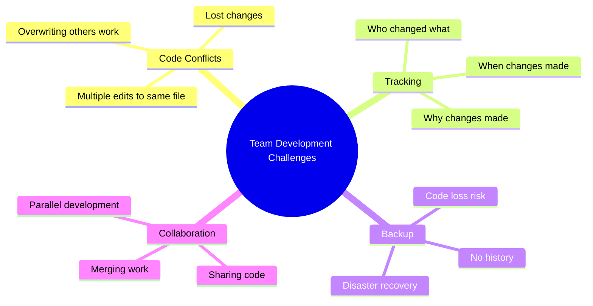
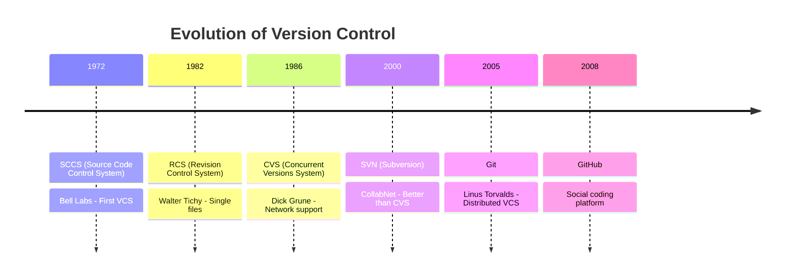
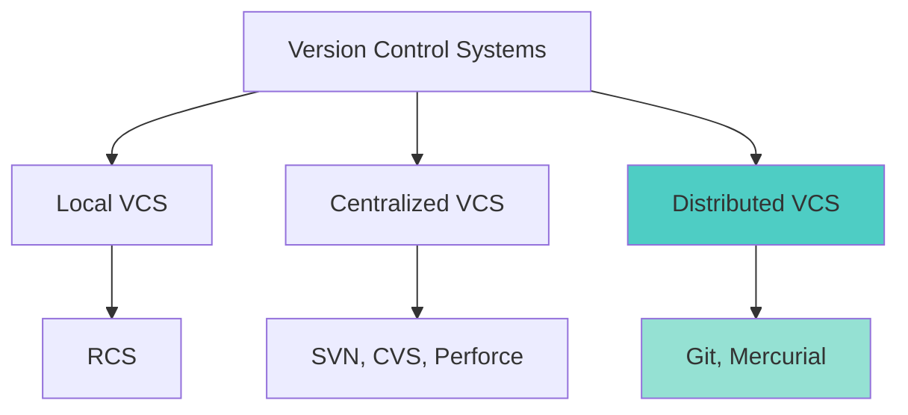
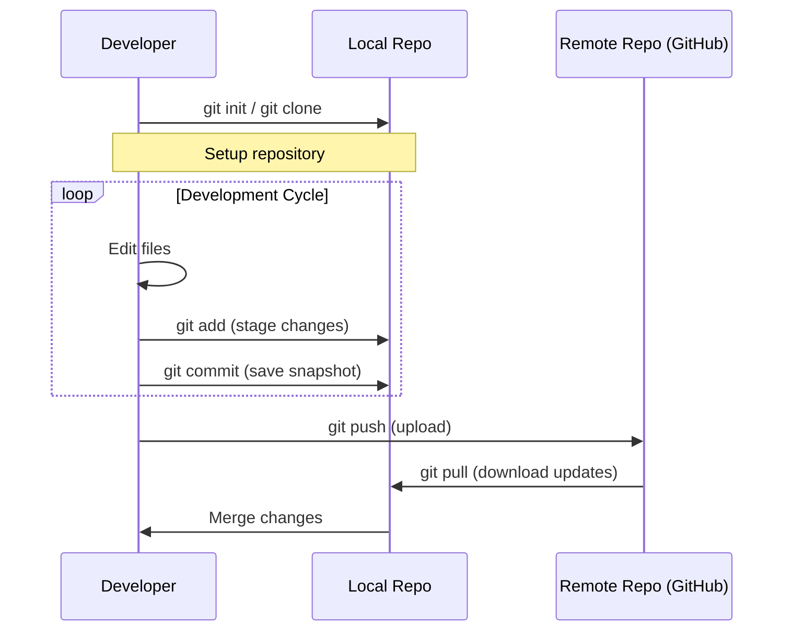
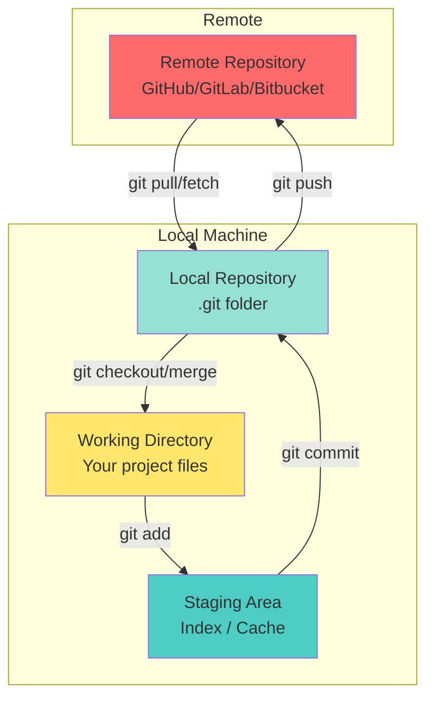
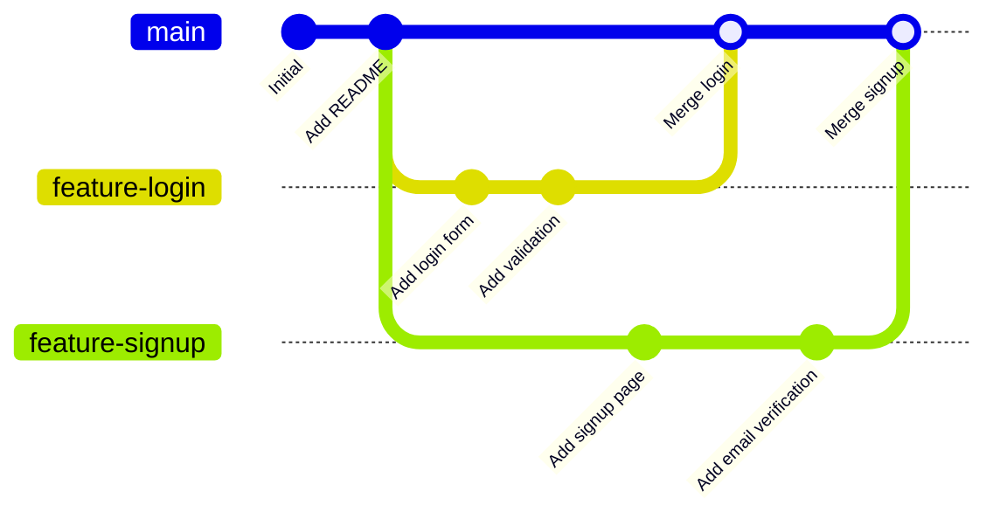
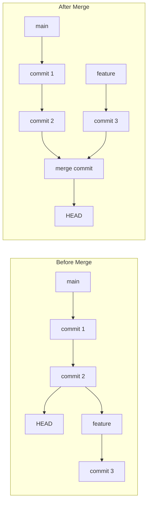
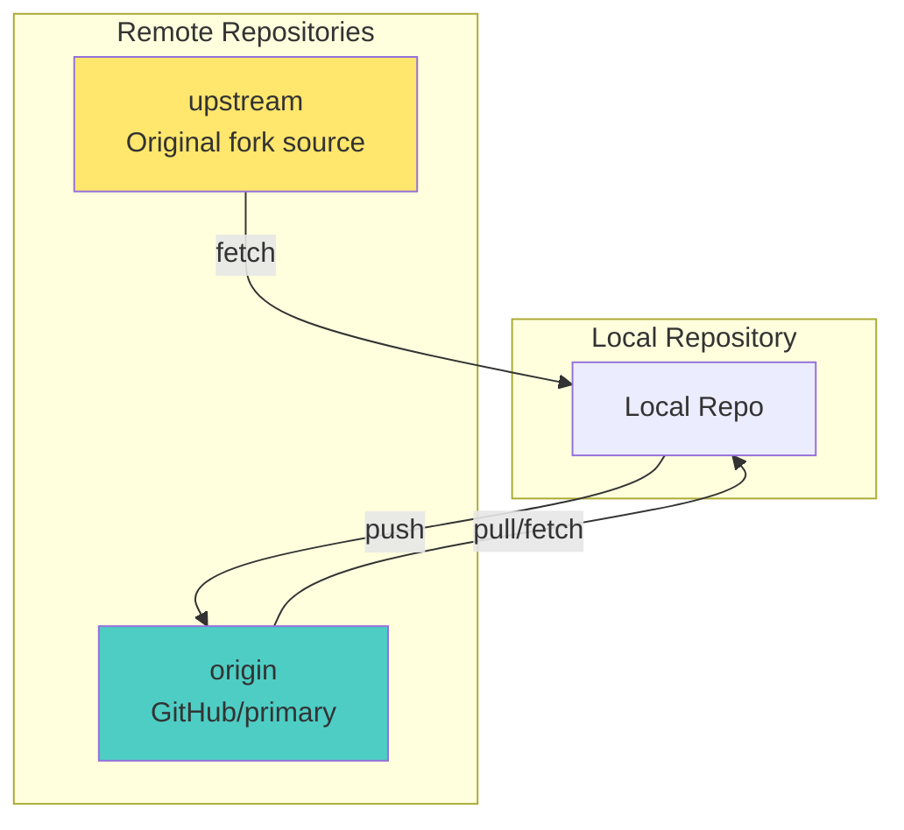
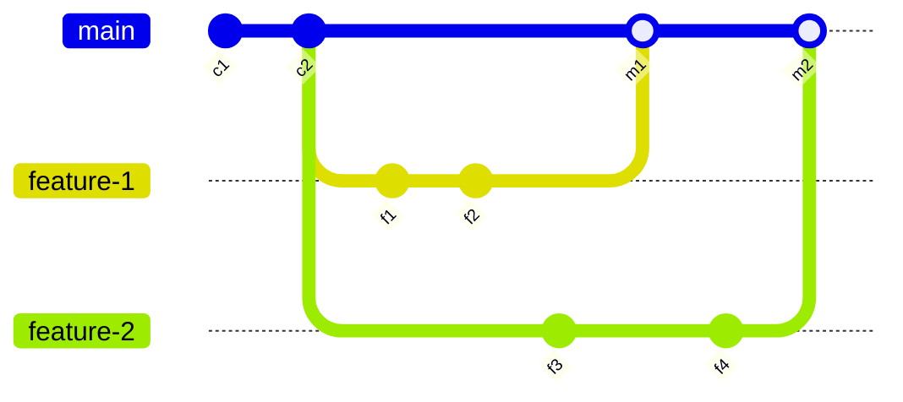
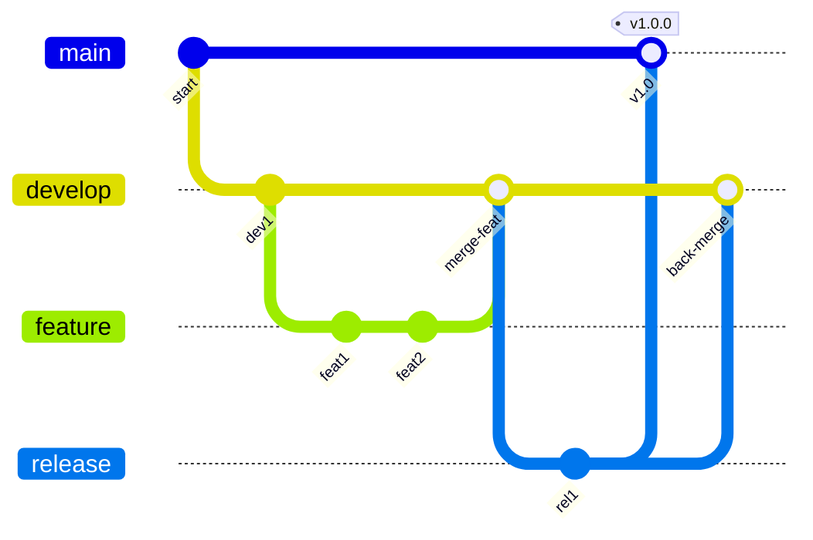

# Session 1: Git & Version Control (4 hours)

## Learning Objectives
- Understand the need for version control in team development
- Learn Git fundamentals and architecture
- Master essential Git commands
- Understand branching strategies and merging

---

## Developing an Application in a Team

### Challenges Without Version Control

When multiple developers work on the same project simultaneously, several issues arise:



| Issue | Description | Impact |
|-------|-------------|--------|
| **Code Overwriting** | Developer A's changes overwritten by Developer B | Lost work, wasted effort |
| **No History** | Cannot track who made changes | Accountability issues |
| **Merge Conflicts** | Same file edited by multiple people | Integration nightmares |
| **No Versioning** | Cannot revert to previous versions | Bug fixes become difficult |
| **Sharing Difficulty** | Manual file sharing via email/USB | Inefficient, error-prone |

---

## Introduction to Code Versioning System

**Version Control System (VCS)** is software that tracks changes to files over time, allowing you to recall specific versions later.

### History of Version Control Systems



### Types of Version Control Systems



| Type | Description | Advantages | Disadvantages | Examples |
|------|-------------|------------|---------------|----------|
| **Local VCS** | Database on local computer tracking file changes | Simple, no network needed | No collaboration, single point of failure | RCS |
| **Centralized VCS** | Single server stores all versions, clients checkout files | Central authority, easier management | Server down = no work, single point of failure | SVN, CVS, Perforce |
| **Distributed VCS** | Every client has full repository copy | No single point of failure, offline work, faster operations | More complex, larger storage | **Git**, Mercurial |

---

## Software Development Workflow

### Typical Git Workflow



---

## Introduction to Git

**Git** is a free and open-source distributed version control system designed to handle everything from small to very large projects with speed and efficiency.

### Git vs Other VCS

| Feature | Git | SVN | CVS |
|---------|-----|-----|-----|
| **Type** | Distributed | Centralized | Centralized |
| **Speed** | Very Fast | Slow | Slow |
| **Branching** | Lightweight | Heavy | Heavy |
| **Offline Work** | Yes | Limited | No |
| **Data Integrity** | SHA-1 checksums | None | None |
| **Space** | Full repo copy | Working copy only | Working copy only |

### Why Git?

1. **Speed**: Operations are local
2. **Data Integrity**: SHA-1 hash for every commit
3. **Branching**: Cheap and easy
4. **Distributed**: Everyone has full backup
5. **Staging Area**: Review before commit
6. **Open Source**: Free and widely supported

---

## Git Repository and Git Structure

### Git Architecture



### Three States of Git Files

| State | Description | Location |
|-------|-------------|----------|
| **Modified** | Changed file, not staged | Working Directory |
| **Staged** | Marked for next commit | Staging Area (Index) |
| **Committed** | Safely stored in database | Local Repository |

### .git Directory Structure

```
project/
├── .git/                    # Git repository data
│   ├── HEAD                 # Pointer to current branch
│   ├── config               # Repository configuration
│   ├── hooks/               # Client/server-side scripts
│   ├── index                # Staging area
│   ├── objects/             # All content (blobs, trees, commits)
│   └── refs/                # Pointers to commits (branches, tags)
├── src/                     # Your source files
├── README.md
└── .gitignore               # Files to ignore
```

---

## Adding Code to Git

### Initial Setup

```bash
# Configure Git (one-time setup)
git config --global user.name "Your Name"
git config --global user.email "your.email@example.com"

# View configuration
git config --list
git config user.name
```

### Creating Repository

```bash
# Initialize new repository
git init

# Clone existing repository
git clone https://github.com/username/repository.git
git clone https://github.com/username/repository.git custom-folder-name
```

### Basic Workflow Commands

```bash
# Check status of files
git status

# Add files to staging area
git add filename.txt          # Single file
git add .                     # All files
git add *.java                # All Java files
git add src/                  # All files in directory

# Commit staged changes
git commit -m "Your descriptive commit message"
git commit -am "Add and commit tracked files"

# View commit history
git log                       # Full history
git log --oneline             # Compact view
git log --oneline -n 5        # Last 5 commits
git log --graph --all         # Visual branch graph
```

### Working with Changes

```bash
# View changes
git diff                      # Working vs Staging
git diff --staged             # Staging vs Last commit
git diff HEAD                 # Working vs Last commit
git diff commit1 commit2      # Between two commits

# Undo changes
git checkout -- filename      # Discard working directory changes
git reset HEAD filename       # Unstage file
git reset --soft HEAD~1       # Undo last commit, keep changes staged
git reset --hard HEAD~1       # Undo last commit, discard changes

# Remove files
git rm filename               # Remove and stage
git rm --cached filename      # Remove from Git, keep file
```

---

## Creating and Merging Git Branches

### Understanding Branches



### Branch Commands

```bash
# List branches
git branch                    # Local branches
git branch -a                 # All branches (including remote)
git branch -v                 # With last commit info

# Create branch
git branch feature-login

# Switch to branch
git checkout feature-login
git switch feature-login      # Modern syntax (Git 2.23+)

# Create and switch
git checkout -b feature-signup
git switch -c feature-signup  # Modern syntax

# Rename branch
git branch -m old-name new-name

# Delete branch
git branch -d feature-login   # Safe delete (merged only)
git branch -D feature-login   # Force delete
```

### Merging Branches



```bash
# Merge branch into current branch
git checkout main
git merge feature-login

# Merge with commit message
git merge feature-login -m "Merge feature-login into main"

# Abort merge
git merge --abort
```

### Handling Merge Conflicts

When Git cannot automatically merge, conflicts occur:

```plaintext
<<<<<<< HEAD
Current branch content (yours)
=======
Incoming branch content (theirs)
>>>>>>> feature-branch
```

**Resolution Steps:**

```bash
# 1. Identify conflicted files
git status

# 2. Open and edit files to resolve conflicts
#    (Remove markers and keep desired content)

# 3. Stage resolved files
git add resolved-file.txt

# 4. Complete merge
git commit -m "Resolved merge conflicts"
```

---

## Remote Operations

### Working with Remote Repositories



```bash
# Add remote
git remote add origin https://github.com/user/repo.git
git remote add upstream https://github.com/original/repo.git

# View remotes
git remote -v

# Push to remote
git push origin main
git push -u origin main       # Set upstream, track branch
git push --all origin         # Push all branches

# Pull from remote
git pull origin main
git pull                      # From tracked branch

# Fetch (download without merge)
git fetch origin
git fetch --all

# Remove remote
git remote remove origin
```

---

## Important Git Concepts

### HEAD

**HEAD** is a pointer to the current branch reference, which is a pointer to the last commit made on that branch.

```bash
# View HEAD
cat .git/HEAD

# Detached HEAD (directly pointing to commit)
git checkout abc1234
```

### .gitignore

File specifying patterns of files to ignore:

```plaintext
# .gitignore examples
*.log                 # Ignore all log files
node_modules/         # Ignore directory
*.class               # Ignore Java class files
.env                  # Ignore environment file
!important.log        # Exception - don't ignore this
build/                # Ignore build output
.DS_Store             # macOS files
Thumbs.db             # Windows files
```

### Tags

Mark specific points in history (usually releases):

```bash
# Create tag
git tag v1.0.0
git tag -a v1.0.0 -m "Version 1.0.0 release"

# List tags
git tag

# Push tags
git push origin v1.0.0
git push --tags

# Checkout tag
git checkout v1.0.0
```

---

## Git Branching Strategies

### Feature Branch Workflow



### Git Flow



| Branch | Purpose | Lifetime |
|--------|---------|----------|
| **main/master** | Production-ready code | Permanent |
| **develop** | Integration branch for features | Permanent |
| **feature/*** | New features | Temporary |
| **release/*** | Prepare for release | Temporary |
| **hotfix/*** | Emergency production fixes | Temporary |

---

## Lab Exercises

### Exercise 1: Create Local Repository

```bash
# Create project directory
mkdir my-project
cd my-project

# Initialize Git
git init

# Create initial files
echo "# My Project" > README.md
echo "console.log('Hello');" > app.js

# Check status
git status

# Add and commit
git add .
git commit -m "Initial commit"
```

### Exercise 2: Work with Branches

```bash
# Create and switch to feature branch
git checkout -b feature-login

# Make changes
echo "function login() { }" >> app.js

# Commit changes
git add app.js
git commit -m "Add login function"

# Switch back and merge
git checkout main
git merge feature-login

# Delete feature branch
git branch -d feature-login
```

### Exercise 3: Remote Operations

```bash
# Add remote origin
git remote add origin https://github.com/username/my-project.git

# Push to remote
git push -u origin main

# Pull updates
git pull origin main
```

---

## Quick Reference Table

| Command | Description |
|---------|-------------|
| `git init` | Initialize repository |
| `git clone <url>` | Clone repository |
| `git status` | Check status |
| `git add <file>` | Stage file |
| `git commit -m "msg"` | Commit changes |
| `git push` | Upload to remote |
| `git pull` | Download from remote |
| `git branch` | List branches |
| `git checkout -b <name>` | Create & switch branch |
| `git merge <branch>` | Merge branch |
| `git log --oneline` | View history |
| `git diff` | View changes |

---

## CCEE Exam Focus Points

> [!IMPORTANT]
> **Key Concepts for MCQs:**
> - Git is a **Distributed Version Control System**
> - Three states: Modified, Staged, Committed
> - `git add` moves files to staging area
> - `git commit` saves to local repository
> - `git push` uploads to remote repository
> - `git pull` = `git fetch` + `git merge`
> - HEAD points to current branch/commit
> - `.gitignore` specifies files to ignore

> [!TIP]
> **Common Exam Questions:**
> - Difference between centralized and distributed VCS
> - Git commands for basic workflow
> - Purpose of staging area
> - Branch creation and merging commands
> - Conflict resolution steps

---

*End of Session 1: Git & Version Control*
