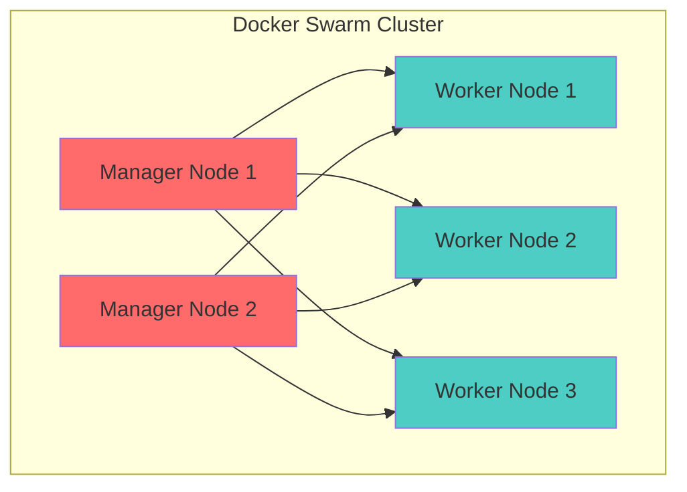
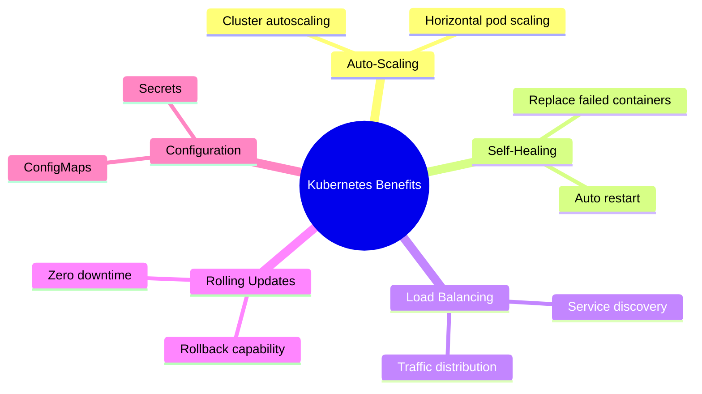
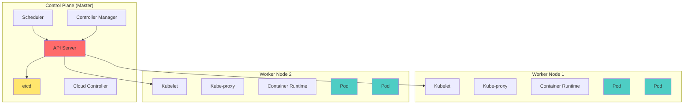
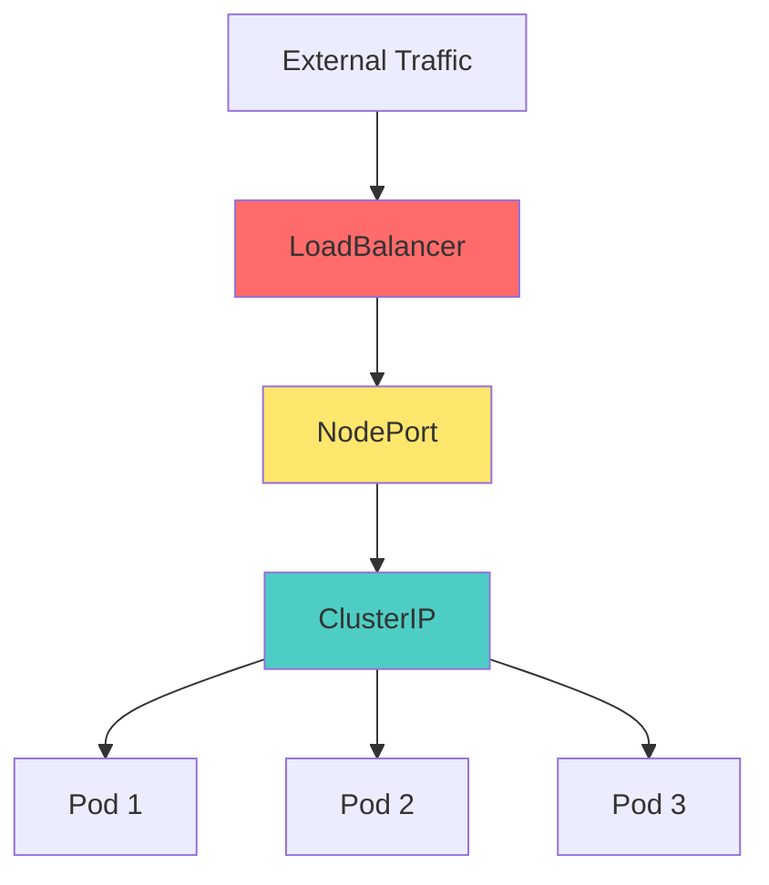

# Session 11: Kubernetes (2 hours lecture + 4 hours lab)

## Learning Objectives
- Understand YAML syntax for configuration
- Learn Docker Swarm and Docker Stack basics
- Master Kubernetes architecture and components
- Create and manage Kubernetes clusters
- Deploy applications using Kubernetes

---

## Introduction to YAML

### What is YAML?

**YAML** (YAML Ain't Markup Language) is a human-readable data serialization format used for configuration files.

### YAML Syntax

```yaml
# This is a comment

# Key-value pairs
name: John Doe
age: 30
active: true

# Nested objects
person:
  firstName: John
  lastName: Doe
  age: 30
  
# Lists (arrays)
fruits:
  - Apple
  - Banana
  - Orange

# Inline list
colors: [red, green, blue]

# Multiline string
description: |
  This is a multiline
  string that preserves
  line breaks.

# Folded string (single line)
summary: >
  This long string will be
  folded into a single line.
```

### YAML Data Types

| Type | Example |
|------|---------|
| **String** | `name: John` or `name: "John"` |
| **Integer** | `age: 30` |
| **Float** | `price: 19.99` |
| **Boolean** | `active: true` or `enabled: false` |
| **Null** | `value: null` or `value: ~` |
| **List** | `items: [1, 2, 3]` |
| **Object** | `person: { name: John, age: 30 }` |

### YAML vs JSON

| YAML | JSON |
|------|------|
| Human-readable | More verbose |
| Uses indentation | Uses braces/brackets |
| Supports comments | No comments |
| Used in config files | Used in APIs |

```yaml
# YAML
person:
  name: John
  age: 30
  hobbies:
    - reading
    - gaming
```

```json
{
  "person": {
    "name": "John",
    "age": 30,
    "hobbies": ["reading", "gaming"]
  }
}
```

---

## Docker Swarm and Docker Stack

### Docker Swarm

**Docker Swarm** is Docker's native clustering and orchestration solution.



### Swarm Components

| Component | Description |
|-----------|-------------|
| **Node** | Docker host in the swarm |
| **Manager** | Manages cluster, schedules tasks |
| **Worker** | Executes tasks |
| **Service** | Definition of tasks to run |
| **Task** | Container running as part of service |

### Swarm Commands

```bash
# Initialize swarm
docker swarm init

# Join as worker
docker swarm join --token <token> <manager-ip>:2377

# List nodes
docker node ls

# Create service
docker service create --name web -p 8080:80 --replicas 3 nginx

# List services
docker service ls

# Scale service
docker service scale web=5

# Remove service
docker service rm web

# Leave swarm
docker swarm leave --force
```

### Docker Stack

**Docker Stack** deploys multi-service applications using compose files.

```yaml
# docker-stack.yml
version: '3.8'

services:
  web:
    image: nginx:latest
    ports:
      - "8080:80"
    deploy:
      replicas: 3
      restart_policy:
        condition: on-failure
    networks:
      - webnet
      
  visualizer:
    image: dockersamples/visualizer
    ports:
      - "8081:8080"
    volumes:
      - /var/run/docker.sock:/var/run/docker.sock
    deploy:
      placement:
        constraints: [node.role == manager]

networks:
  webnet:
```

```bash
# Deploy stack
docker stack deploy -c docker-stack.yml myapp

# List stacks
docker stack ls

# List services in stack
docker stack services myapp

# Remove stack
docker stack rm myapp
```

---

## Introduction to Kubernetes

### What is Kubernetes?

**Kubernetes (K8s)** is an open-source container orchestration platform for automating deployment, scaling, and management of containerized applications.

### Why Kubernetes?



| Feature | Description |
|---------|-------------|
| **Automated Deployment** | Declarative configuration |
| **Auto-Scaling** | Scale based on demand |
| **Self-Healing** | Restart failed containers |
| **Load Balancing** | Distribute traffic |
| **Rolling Updates** | Zero-downtime deployments |
| **Service Discovery** | Automatic DNS |
| **Secret Management** | Secure credential storage |

### Docker Swarm vs Kubernetes

| Aspect | Docker Swarm | Kubernetes |
|--------|--------------|------------|
| **Complexity** | Simple | Complex |
| **Learning Curve** | Easy | Steep |
| **Setup** | Quick | Time-consuming |
| **Scaling** | Good | Excellent |
| **Community** | Smaller | Larger |
| **Features** | Basic | Extensive |
| **Use Case** | Small-medium | Large, complex |

---

## Kubernetes Architecture

### Cluster Architecture



### Control Plane Components

| Component | Description |
|-----------|-------------|
| **API Server** | Frontend for Kubernetes, REST API |
| **etcd** | Key-value store for cluster data |
| **Scheduler** | Assigns pods to nodes |
| **Controller Manager** | Runs controllers (node, replication, endpoint) |
| **Cloud Controller Manager** | Interacts with cloud providers |

### Worker Node Components

| Component | Description |
|-----------|-------------|
| **Kubelet** | Agent running on each node, manages pods |
| **Kube-proxy** | Network proxy, implements services |
| **Container Runtime** | Runs containers (Docker, containerd) |

---

## Kubernetes Objects

### Pod

**Pod** is the smallest deployable unit in Kubernetes, contains one or more containers.

```yaml
apiVersion: v1
kind: Pod
metadata:
  name: nginx-pod
  labels:
    app: nginx
spec:
  containers:
  - name: nginx
    image: nginx:latest
    ports:
    - containerPort: 80
    resources:
      requests:
        memory: "64Mi"
        cpu: "250m"
      limits:
        memory: "128Mi"
        cpu: "500m"
```

### Deployment

**Deployment** manages ReplicaSets and provides declarative updates for Pods.

```yaml
apiVersion: apps/v1
kind: Deployment
metadata:
  name: nginx-deployment
  labels:
    app: nginx
spec:
  replicas: 3
  selector:
    matchLabels:
      app: nginx
  template:
    metadata:
      labels:
        app: nginx
    spec:
      containers:
      - name: nginx
        image: nginx:1.21
        ports:
        - containerPort: 80
```

### Service

**Service** exposes pods to network traffic.

```yaml
apiVersion: v1
kind: Service
metadata:
  name: nginx-service
spec:
  selector:
    app: nginx
  ports:
  - protocol: TCP
    port: 80
    targetPort: 80
  type: LoadBalancer
```

### Service Types

| Type | Description | Use Case |
|------|-------------|----------|
| **ClusterIP** | Internal cluster IP (default) | Internal services |
| **NodePort** | Exposes on each node's IP | Development, testing |
| **LoadBalancer** | External load balancer | Production, cloud |
| **ExternalName** | Maps to external DNS | External services |



### ConfigMap

Store non-confidential configuration data.

```yaml
apiVersion: v1
kind: ConfigMap
metadata:
  name: app-config
data:
  database_url: "mysql://db:3306"
  log_level: "info"
```

### Secret

Store sensitive data (base64 encoded).

```yaml
apiVersion: v1
kind: Secret
metadata:
  name: db-secret
type: Opaque
data:
  username: YWRtaW4=     # base64 encoded "admin"
  password: cGFzc3dvcmQ=  # base64 encoded "password"
```

---

## Creating Kubernetes Cluster

### Cluster Setup Options

| Option | Description | Use Case |
|--------|-------------|----------|
| **Minikube** | Local single-node cluster | Development |
| **Kind** | Kubernetes in Docker | Testing |
| **kubeadm** | Production-ready setup | On-premises |
| **Managed K8s** | Cloud providers (EKS, GKE, AKS) | Production |

### Minikube Setup

```bash
# Install Minikube
# Windows: choco install minikube
# Mac: brew install minikube

# Start cluster
minikube start

# Check status
minikube status

# Open dashboard
minikube dashboard

# Get cluster IP
minikube ip

# Stop cluster
minikube stop

# Delete cluster
minikube delete
```

---

## Creating Service in Kubernetes

### Complete Application Deployment

```yaml
# deployment.yaml
apiVersion: apps/v1
kind: Deployment
metadata:
  name: webapp
spec:
  replicas: 3
  selector:
    matchLabels:
      app: webapp
  template:
    metadata:
      labels:
        app: webapp
    spec:
      containers:
      - name: webapp
        image: nginx:latest
        ports:
        - containerPort: 80
        env:
        - name: ENV
          value: "production"
---
# service.yaml
apiVersion: v1
kind: Service
metadata:
  name: webapp-service
spec:
  type: LoadBalancer
  selector:
    app: webapp
  ports:
  - port: 80
    targetPort: 80
```

---

## Essential kubectl Commands

### Cluster Information

```bash
# Cluster info
kubectl cluster-info
kubectl get nodes
kubectl describe node <node-name>

# Version
kubectl version
```

### Working with Pods

```bash
# List pods
kubectl get pods
kubectl get pods -o wide
kubectl get pods -n <namespace>
kubectl get pods --all-namespaces

# Describe pod
kubectl describe pod <pod-name>

# Pod logs
kubectl logs <pod-name>
kubectl logs -f <pod-name>           # Follow
kubectl logs <pod-name> -c <container>  # Specific container

# Execute in pod
kubectl exec -it <pod-name> -- bash
kubectl exec -it <pod-name> -- /bin/sh

# Delete pod
kubectl delete pod <pod-name>
```

### Working with Deployments

```bash
# List deployments
kubectl get deployments
kubectl get deploy

# Create deployment
kubectl create deployment nginx --image=nginx

# Scale deployment
kubectl scale deployment nginx --replicas=5

# Update image
kubectl set image deployment/nginx nginx=nginx:1.21

# Rollout status
kubectl rollout status deployment/nginx

# Rollback
kubectl rollout undo deployment/nginx

# Delete deployment
kubectl delete deployment nginx
```

### Working with Services

```bash
# List services
kubectl get services
kubectl get svc

# Expose deployment
kubectl expose deployment nginx --port=80 --type=LoadBalancer

# Delete service
kubectl delete service nginx
```

### Apply Configuration Files

```bash
# Apply configuration
kubectl apply -f deployment.yaml
kubectl apply -f .                # All YAML files in directory

# Delete from file
kubectl delete -f deployment.yaml

# Get YAML of running resource
kubectl get deployment nginx -o yaml
```

### Namespaces

```bash
# List namespaces
kubectl get namespaces
kubectl get ns

# Create namespace
kubectl create namespace dev

# Work in namespace
kubectl get pods -n dev
kubectl apply -f deployment.yaml -n dev

# Set default namespace
kubectl config set-context --current --namespace=dev
```

---

## Deploying Application Using Dashboard

### Enable Dashboard

```bash
# Minikube
minikube dashboard

# Or install dashboard
kubectl apply -f https://raw.githubusercontent.com/kubernetes/dashboard/v2.7.0/aio/deploy/recommended.yaml

# Create service account
kubectl create serviceaccount dashboard-admin -n kubernetes-dashboard
kubectl create clusterrolebinding dashboard-admin --clusterrole=cluster-admin --serviceaccount=kubernetes-dashboard:dashboard-admin

# Get token
kubectl -n kubernetes-dashboard create token dashboard-admin

# Access dashboard
kubectl proxy
# Open: http://localhost:8001/api/v1/namespaces/kubernetes-dashboard/services/https:kubernetes-dashboard:/proxy/
```

### Dashboard Features

| Feature | Description |
|---------|-------------|
| **Overview** | Cluster summary |
| **Workloads** | Deployments, Pods, ReplicaSets |
| **Services** | Services, Ingresses |
| **Config** | ConfigMaps, Secrets |
| **Storage** | PersistentVolumes, Claims |
| **Namespace** | Namespace management |

---

## Lab Exercises

### Exercise 1: Configure Kubernetes

```bash
# Start Minikube
minikube start

# Verify cluster
kubectl cluster-info
kubectl get nodes

# Enable dashboard
minikube dashboard
```

### Exercise 2: Setup Kubernetes Cluster

```bash
# Create namespace
kubectl create namespace webapp

# Create deployment
kubectl create deployment nginx --image=nginx -n webapp

# Verify
kubectl get pods -n webapp
```

### Exercise 3: Deploy Website

**Create deployment file:**

```yaml
# website-deployment.yaml
apiVersion: apps/v1
kind: Deployment
metadata:
  name: website
  namespace: webapp
spec:
  replicas: 3
  selector:
    matchLabels:
      app: website
  template:
    metadata:
      labels:
        app: website
    spec:
      containers:
      - name: nginx
        image: nginx:latest
        ports:
        - containerPort: 80
        volumeMounts:
        - name: html
          mountPath: /usr/share/nginx/html
      volumes:
      - name: html
        configMap:
          name: website-content
---
apiVersion: v1
kind: ConfigMap
metadata:
  name: website-content
  namespace: webapp
data:
  index.html: |
    <!DOCTYPE html>
    <html>
    <head><title>Welcome</title></head>
    <body><h1>Hello from Kubernetes!</h1></body>
    </html>
---
apiVersion: v1
kind: Service
metadata:
  name: website-service
  namespace: webapp
spec:
  type: NodePort
  selector:
    app: website
  ports:
  - port: 80
    targetPort: 80
    nodePort: 30080
```

```bash
# Apply configuration
kubectl apply -f website-deployment.yaml

# Access service
minikube service website-service -n webapp
```

---

## Quick Reference

### Kubernetes Object Types

| Object | Description | Short Name |
|--------|-------------|------------|
| Pod | Container group | po |
| Service | Network endpoint | svc |
| Deployment | Manages ReplicaSets | deploy |
| ReplicaSet | Ensures pod replicas | rs |
| ConfigMap | Configuration data | cm |
| Secret | Sensitive data | secret |
| Namespace | Virtual cluster | ns |
| Node | Cluster machine | no |

### kubectl Cheat Sheet

| Command | Description |
|---------|-------------|
| `kubectl get <resource>` | List resources |
| `kubectl describe <resource>` | Show details |
| `kubectl create -f <file>` | Create from file |
| `kubectl apply -f <file>` | Create/update from file |
| `kubectl delete <resource>` | Delete resource |
| `kubectl logs <pod>` | View pod logs |
| `kubectl exec -it <pod> -- bash` | Shell into pod |
| `kubectl scale deploy <name> --replicas=N` | Scale deployment |

---

## CCEE Exam Focus Points

> [!IMPORTANT]
> **Key Concepts for MCQs:**
> - YAML is used for Kubernetes configuration files
> - Pod is the smallest deployable unit
> - Deployment manages ReplicaSets and Pods
> - Service exposes pods to network
> - kubectl is the CLI for Kubernetes
> - Control Plane: API Server, etcd, Scheduler
> - Worker Node: Kubelet, Kube-proxy

> [!TIP]
> **Common Exam Questions:**
> - What is the smallest unit in K8s? (Pod)
> - Where is cluster data stored? (etcd)
> - Command to list pods? (`kubectl get pods`)
> - Which component assigns pods to nodes? (Scheduler)
> - Service type for external traffic? (LoadBalancer)

---

*End of Session 11: Kubernetes*
