# Session 12: Software Testing Fundamentals (2 hours)

## Learning Objectives
- Understand the importance of software testing
- Learn verification vs validation concepts
- Distinguish between QA, QC, and Testing
- Master the seven principles of software testing

---

## Introduction to Software Testing

### What is Software Testing?

**Software Testing** is the process of evaluating and verifying that a software application does what it is supposed to do.

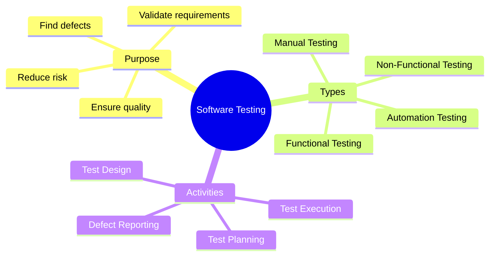

### Testing Definition

> **IEEE Definition:** Testing is the process of executing a program with the intent of finding errors.

| Term | Definition |
|------|------------|
| **Bug/Defect** | Flaw in the software causing incorrect behavior |
| **Error** | Human mistake that produces a defect |
| **Failure** | Deviation from expected behavior |
| **Test Case** | Set of conditions to verify functionality |
| **Test Suite** | Collection of test cases |

---

## Why Testing Code is Important

### Cost of Defects

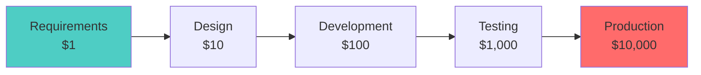

**Rule of 10**: Cost of fixing a defect increases 10x at each stage.

| Stage | Cost to Fix | Example |
|-------|-------------|---------|
| Requirements | 1x | $100 |
| Design | 10x | $1,000 |
| Coding | 100x | $10,000 |
| Testing | 1,000x | $100,000 |
| Production | 10,000x | $1,000,000 |

### Importance of Testing

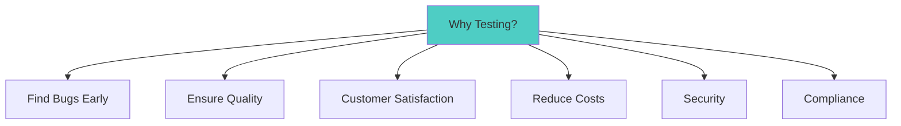

| Reason | Description |
|--------|-------------|
| **Quality Assurance** | Ensures software meets requirements |
| **Early Bug Detection** | Cheaper to fix bugs early |
| **Customer Satisfaction** | Reliable software builds trust |
| **Risk Reduction** | Identifies potential failures |
| **Security** | Finds vulnerabilities before hackers |
| **Compliance** | Meets regulatory standards |
| **Documentation** | Test cases document expected behavior |

### Famous Software Failures

| Incident | Cause | Impact |
|----------|-------|--------|
| **Ariane 5 Rocket (1996)** | Integer overflow | $370 million loss |
| **Therac-25 (1985-87)** | Software bug in medical device | Patient deaths |
| **Knight Capital (2012)** | Trading software bug | $440 million loss in 45 min |
| **Boeing 737 MAX (2019)** | Sensor/software issue | 346 deaths |

---

## Verification and Validation

### V&V Concepts

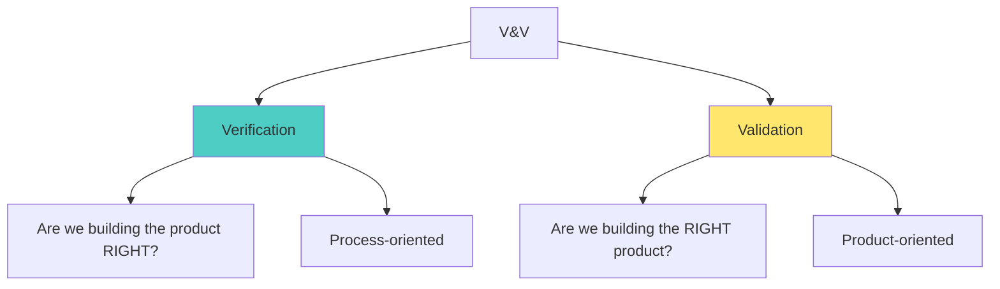

### Verification

**"Are we building the product RIGHT?"**

Ensures the product is being developed correctly according to specifications.

**Activities:**
- Reviews
- Walkthroughs
- Inspections
- Static analysis
- Code reviews

### Validation

**"Are we building the RIGHT product?"**

Ensures the product meets user needs and requirements.

**Activities:**
- Testing
- User acceptance testing
- Beta testing
- Demonstrations

### Comparison Table

| Aspect | Verification | Validation |
|--------|--------------|------------|
| **Question** | Are we building it right? | Are we building the right thing? |
| **Focus** | Process | Product |
| **Methods** | Reviews, inspections | Testing, demos |
| **When** | Before validation | After verification |
| **Objective** | Check compliance to specs | Check user needs |
| **Team** | QA team | Testing team + Users |
| **Type** | Static (no code execution) | Dynamic (code execution) |

### V&V in V-Model

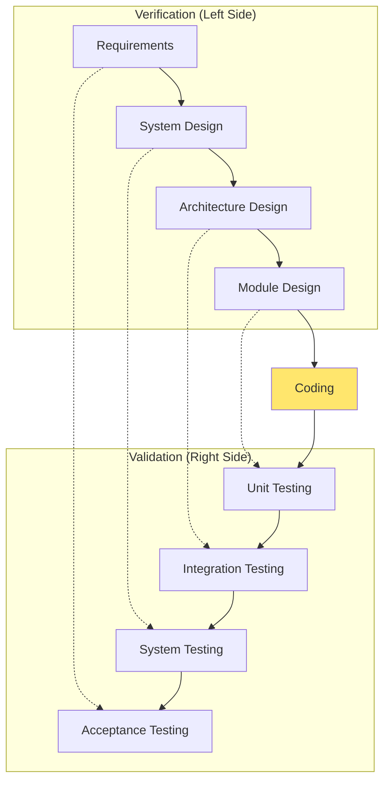

---

## Quality Assurance vs Quality Control vs Testing

### Definitions

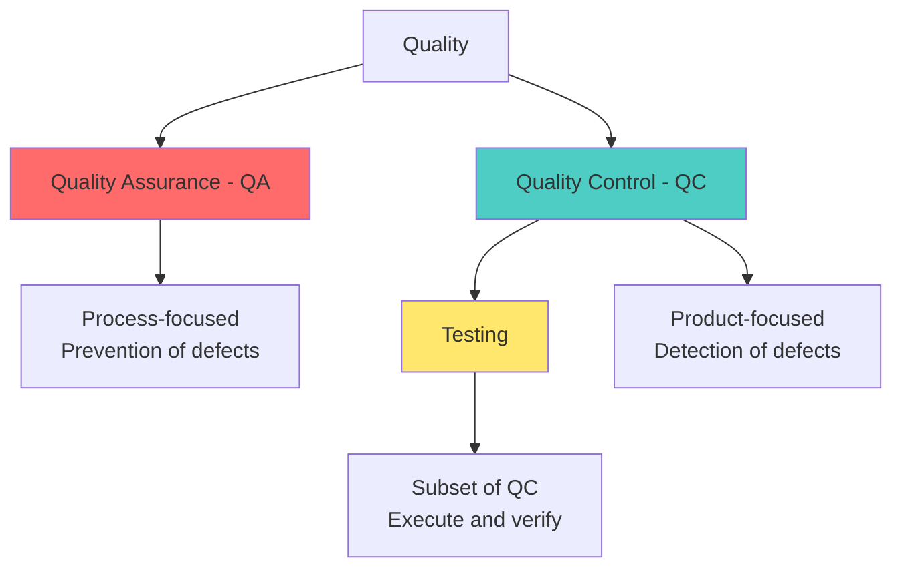

### Quality Assurance (QA)

**Focus:** Process-oriented (Prevention)

**Goal:** Prevent defects by improving the development process.

**Activities:**
- Define processes and standards
- Conduct audits
- Process improvement
- Training
- Documentation

### Quality Control (QC)

**Focus:** Product-oriented (Detection)

**Goal:** Identify defects in the product.

**Activities:**
- Product inspections
- Testing
- Reviews
- Defect tracking

### Testing

**Focus:** Subset of QC

**Goal:** Execute software to find defects.

**Activities:**
- Test execution
- Bug reporting
- Test case creation
- Test automation

### Comparison Table

| Aspect | Quality Assurance (QA) | Quality Control (QC) | Testing |
|--------|------------------------|----------------------|---------|
| **Focus** | Process | Product | Product |
| **Goal** | Prevent defects | Detect defects | Find bugs |
| **Approach** | Proactive | Reactive | Reactive |
| **Activities** | Audits, process improvement | Inspections, reviews | Execute test cases |
| **Scope** | Entire SDLC | Development outputs | Software application |
| **Orientation** | Prevention | Detection | Detection |
| **Team** | QA Engineers | QC Analysts | Testers |

### Relationship Diagram

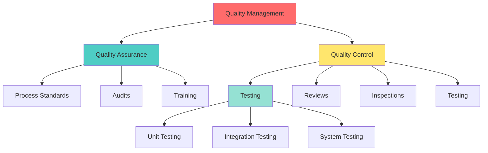

---

## Principles of Software Testing

### Seven Principles

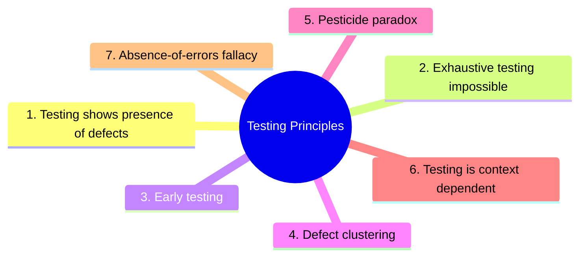

### Principle 1: Testing Shows Presence of Defects

**Statement:** Testing can show that defects are present, but cannot prove that there are no defects.

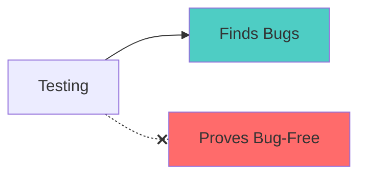

**Explanation:**
- Testing reduces probability of undiscovered defects
- Zero defects can never be guaranteed
- Even after thorough testing, bugs may exist

**Example:** Testing a login form for 100 inputs doesn't guarantee it works for the 101st input.

### Principle 2: Exhaustive Testing is Impossible

**Statement:** Testing everything (all input combinations) is not feasible.

| Scenario | Possible Combinations |
|----------|----------------------|
| 3 input fields, 10 values each | 10³ = 1,000 |
| 10 input fields, 100 values each | 100¹⁰ = 10²⁰ |
| Complete web form | Practically infinite |

**Solution:** Use risk-based testing and prioritization.

### Principle 3: Early Testing

**Statement:** Testing activities should start as early as possible in the SDLC.

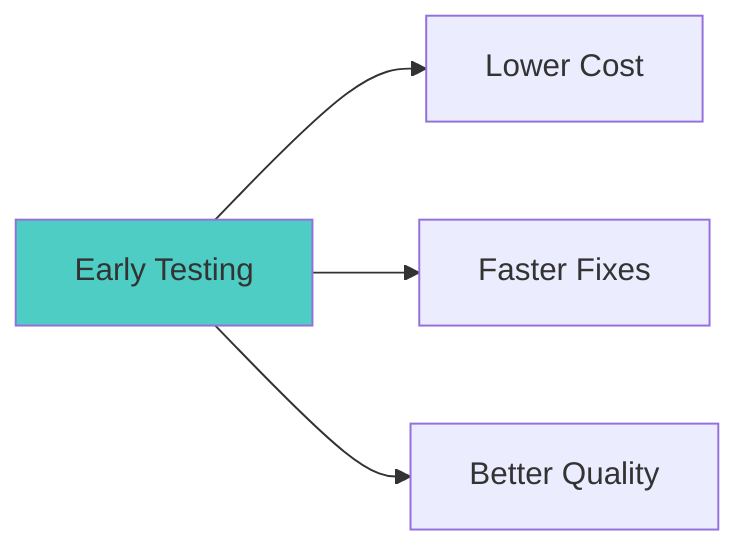

**Benefits:**
- Find defects when they're cheapest to fix
- Requirements testing catches issues before design
- Design testing catches issues before coding

**Shift-Left Testing:** Move testing earlier in the development process.

### Principle 4: Defect Clustering

**Statement:** A small number of modules contain most of the defects.

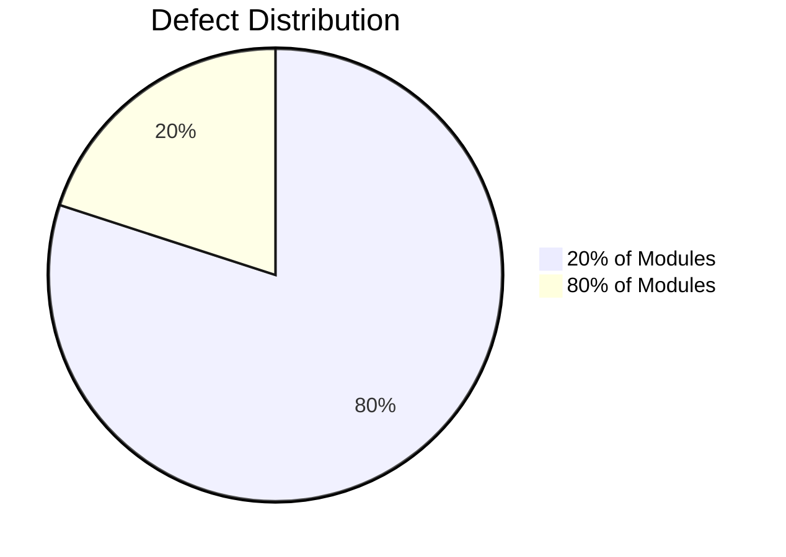

**Pareto Principle (80/20 Rule):**
- 80% of defects in 20% of modules
- Focus testing on high-risk modules
- Complex modules have more bugs

**Application:**
- Identify and prioritize high-risk areas
- Allocate more testing resources to complex modules

### Principle 5: Pesticide Paradox

**Statement:** Repeating the same tests will not find new bugs.

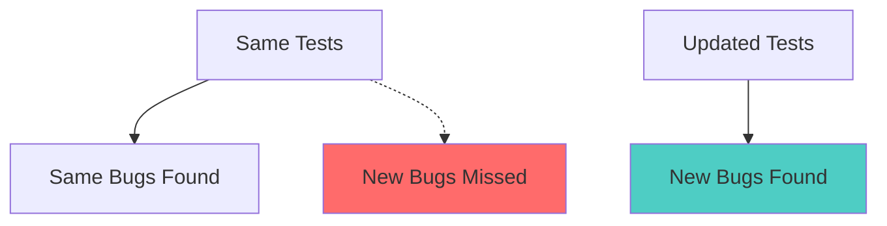

**Explanation:**
- Tests become "immune" to defects after running multiple times
- Need to regularly review and update test cases
- Add new test cases for new scenarios

**Solution:**
- Regular test case review
- Exploratory testing
- Test case rotation

### Principle 6: Testing is Context Dependent

**Statement:** Testing approach depends on the type of software.

| Software Type | Testing Focus |
|---------------|---------------|
| **Medical Device** | Safety, reliability, compliance |
| **Banking App** | Security, transaction accuracy |
| **Gaming App** | Performance, user experience |
| **E-commerce** | Functionality, security, performance |
| **Mobile App** | Usability, device compatibility |

**Different contexts require:**
- Different testing techniques
- Different test priorities
- Different tools

### Principle 7: Absence-of-Errors Fallacy

**Statement:** Finding and fixing defects doesn't guarantee success.

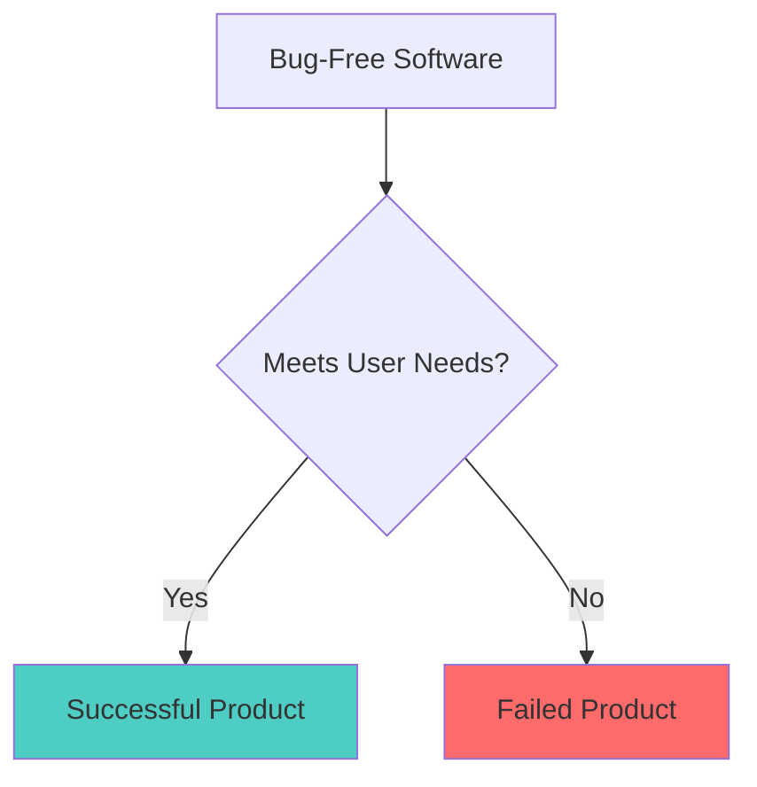

**Explanation:**
- Software can be bug-free but still unusable
- Software can be bug-free but not meet requirements
- User satisfaction is the ultimate measure

**Example:** A perfectly functioning calculator that users wanted as a spreadsheet.

---

## Summary Table: Seven Principles

| # | Principle | Key Point |
|---|-----------|-----------|
| 1 | Testing shows presence of defects | Can't prove absence of bugs |
| 2 | Exhaustive testing impossible | Test smart, not everything |
| 3 | Early testing | Find bugs early = cheaper fixes |
| 4 | Defect clustering | 80/20 rule applies |
| 5 | Pesticide paradox | Update tests regularly |
| 6 | Context dependent | Different apps = different approaches |
| 7 | Absence-of-errors fallacy | Bug-free ≠ successful |

---

## Testing Mindset

### Tester vs Developer Mindset

| Developer Mindset | Tester Mindset |
|-------------------|----------------|
| "This should work" | "Let me break this" |
| Constructive thinking | Destructive thinking |
| Build features | Find defects |
| Optimistic | Skeptical |
| "Happy path" focus | Edge cases focus |

### Good Tester Qualities

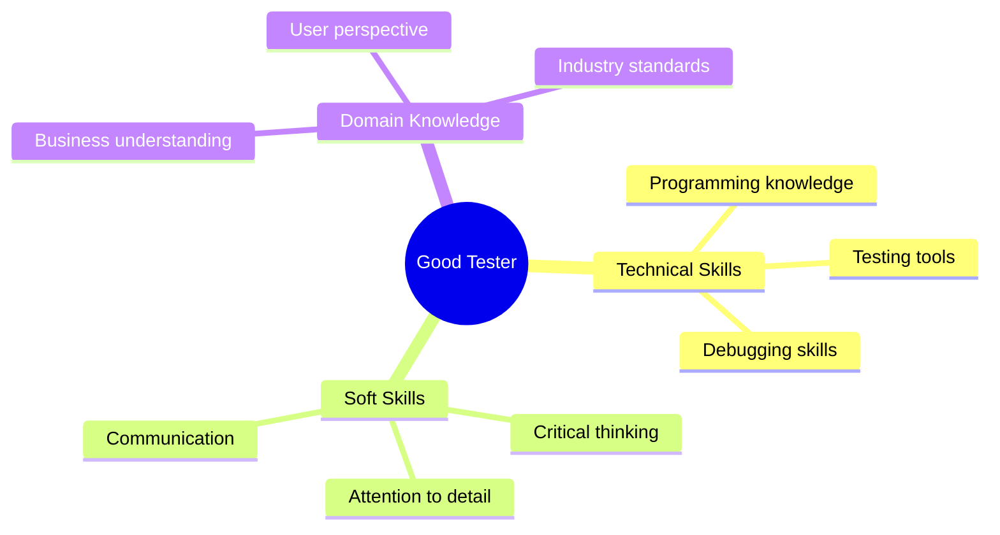

---

## CCEE Exam Focus Points

> [!IMPORTANT]
> **Key Concepts for MCQs:**
> - **Verification** = "Building product RIGHT" (Process)
> - **Validation** = "Building RIGHT product" (Product)
> - **QA** = Prevention, Process-focused
> - **QC** = Detection, Product-focused
> - **Testing** = Subset of QC
> - **7 Principles**: Memorize all seven!
> - **Defect Clustering** = 80/20 rule

> [!TIP]
> **Common Exam Questions:**
> - What is verification vs validation?
> - Difference between QA and QC?
> - Why early testing is important?
> - What is pesticide paradox?
> - Can testing prove absence of bugs? (No - Principle 1)

---

## Quick Reference

### V&V Quick Comparison

| Verification | Validation |
|--------------|------------|
| Process | Product |
| Static | Dynamic |
| Reviews | Testing |
| Right way | Right product |

### QA/QC/Testing

| QA | QC | Testing |
|----|----|----|
| Prevent | Detect | Execute |
| Process | Product | Product |
| Proactive | Reactive | Reactive |

---
## Assignment

### Read More Testing Concepts
As per the syllabus, students are encouraged to research the following advanced testing concepts used in the industry:

1.  **Agile Testing**: How testing fits into Scrum sprints.
2.  **DevSecOps**: Integrating security testing into DevOps pipelines.
3.  **Chaos Engineering**: Intentional failure injection (e.g., Netflix Chaos Monkey).
4.  **AI in Testing**: Using AI/ML for test generation and self-healing tests.
5.  **Shift-Left vs Shift-Right**: Testing early vs testing in production.
6.  **TDD (Test Driven Development)**: Writing tests before code.
7.  **BDD (Behavior Driven Development)**: Using Gherkin syntax (Given/When/Then).

---

*End of Session 12: Software Testing Fundamentals*
