# Session 13: STLC, V-Model, and Testing Types (2 hours)

## Learning Objectives
- Understand Software Testing Life Cycle (STLC)
- Learn V-Model in detail
- Distinguish between manual and automation testing
- Master testing methods: white-box, black-box, grey-box
- Understand functional and non-functional testing types

---

## Software Testing Life Cycle (STLC)

### What is STLC?

**STLC** is a systematic approach to testing that defines the activities carried out during the testing process.

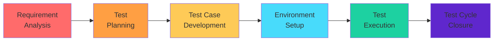

### STLC Phases in Detail

| Phase | Activities | Deliverables |
|-------|------------|--------------|
| **Requirement Analysis** | - Identify testable requirements<br/>- Determine testing scope<br/>- Prepare RTM | Requirement Traceability Matrix (RTM) |
| **Test Planning** | - Define test strategy<br/>- Estimate effort/cost<br/>- Identify resources | Test Plan document |
| **Test Case Development** | - Create test cases<br/>- Create test data<br/>- Review test cases | Test Cases, Test Data |
| **Environment Setup** | - Setup test environment<br/>- Configure test tools<br/>- Smoke test environment | Test Environment, Smoke Test Results |
| **Test Execution** | - Execute test cases<br/>- Log defects<br/>- Retest fixed defects | Test Results, Defect Reports |
| **Test Cycle Closure** | - Evaluate exit criteria<br/>- Test metrics<br/>- Closure report | Test Summary Report |

### Phase 1: Requirement Analysis

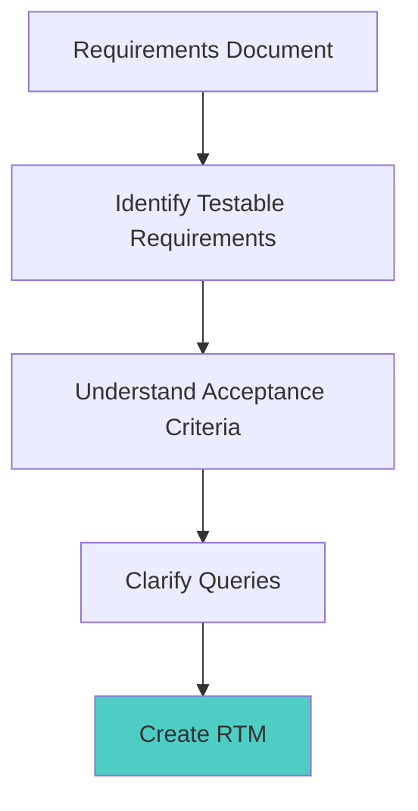

**Key Activities:**
- Review SRS (Software Requirements Specification)
- Identify testable requirements
- Prioritize testing efforts
- Prepare Requirement Traceability Matrix

### Phase 2: Test Planning

**Test Plan Contents:**

| Section | Description |
|---------|-------------|
| **Objectives** | What to achieve |
| **Scope** | What to test / not test |
| **Test Strategy** | Testing approach |
| **Resources** | Team, tools, environment |
| **Schedule** | Timeline, milestones |
| **Deliverables** | Test cases, reports |
| **Entry/Exit Criteria** | When to start/stop |
| **Risks** | Potential issues |

### Phase 3: Test Case Development

**Test Case Template:**

| Field | Description |
|-------|-------------|
| Test Case ID | Unique identifier |
| Test Case Title | Brief description |
| Preconditions | Required setup |
| Test Steps | Actions to perform |
| Test Data | Input values |
| Expected Result | What should happen |
| Actual Result | What actually happened |
| Status | Pass/Fail/Blocked |

**Example Test Case:**

| Field | Value |
|-------|-------|
| **Test Case ID** | TC_LOGIN_001 |
| **Title** | Verify login with valid credentials |
| **Preconditions** | User exists in database |
| **Steps** | 1. Navigate to login page<br/>2. Enter valid username<br/>3. Enter valid password<br/>4. Click Login button |
| **Test Data** | Username: testuser, Password: pass123 |
| **Expected Result** | User is redirected to dashboard |

### Phase 4: Environment Setup

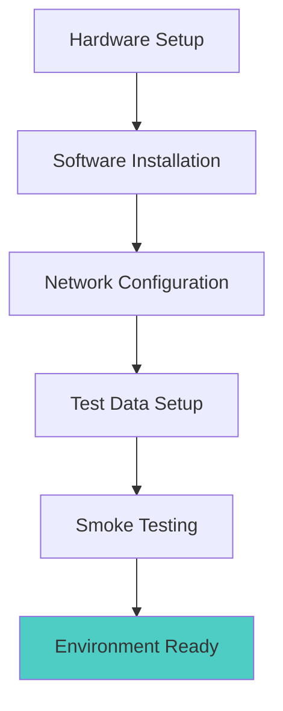

### Phase 5: Test Execution

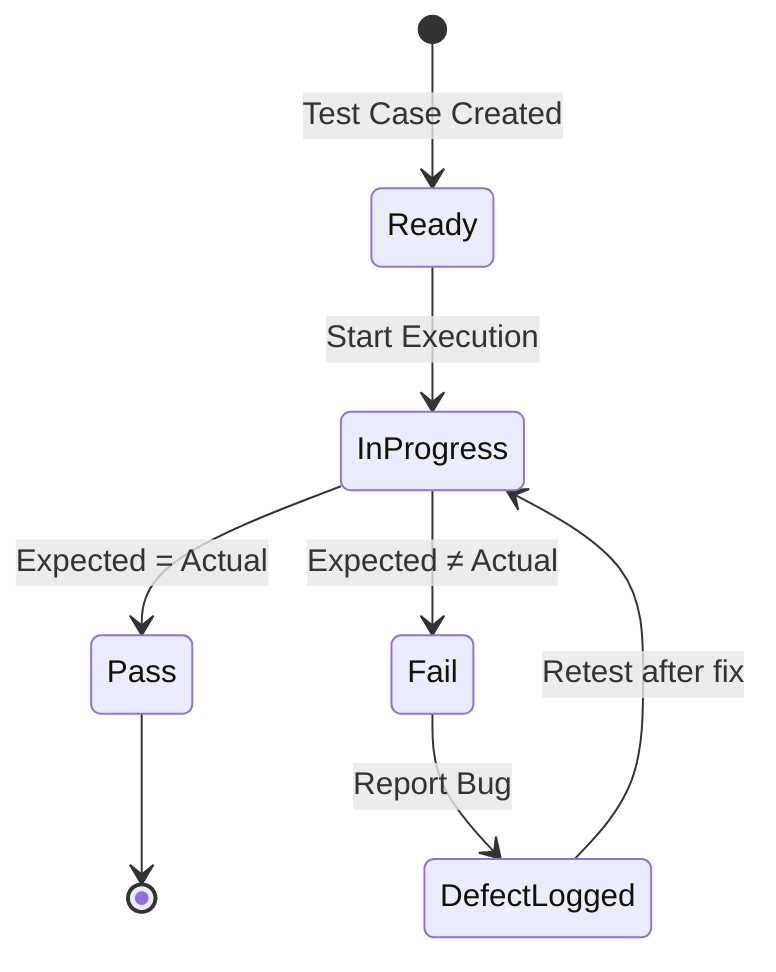

### Phase 6: Test Cycle Closure

**Activities:**
- Verify all tests executed
- Analyze test metrics
- Document lessons learned
- Archive test artifacts

**Test Metrics:**

| Metric | Formula |
|--------|---------|
| **Pass %** | (Passed / Total) × 100 |
| **Fail %** | (Failed / Total) × 100 |
| **Defect Density** | Total Defects / Size |
| **Test Coverage** | (Executed / Total) × 100 |

---

## V-Model (Verification and Validation Model)

### V-Model Overview

Extension of the Waterfall model where testing phases correspond to development phases.

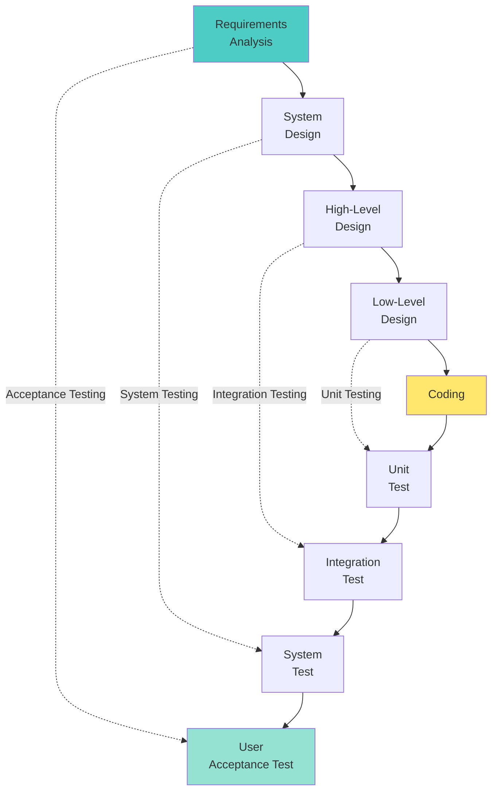

### V-Model Phases Mapping

| Development Phase | Testing Phase | Description |
|-------------------|---------------|-------------|
| **Requirements Analysis** | **Acceptance Testing** | Validates system meets user requirements |
| **System Design** | **System Testing** | Tests complete integrated system |
| **High-Level Design** | **Integration Testing** | Tests interaction between modules |
| **Low-Level Design** | **Unit Testing** | Tests individual components |

### V-Model Advantages & Disadvantages

| Advantages | Disadvantages |
|------------|---------------|
| Simple and easy to understand | Inflexible, rigid |
| Testing planned early | No early prototypes |
| Higher success rate for small projects | Changes are expensive |
| Clear deliverables at each phase | High risk for complex projects |
| Works well with clear requirements | Not suitable for changing requirements |

---

## Types of Testing: Manual vs Automation

### Manual Testing

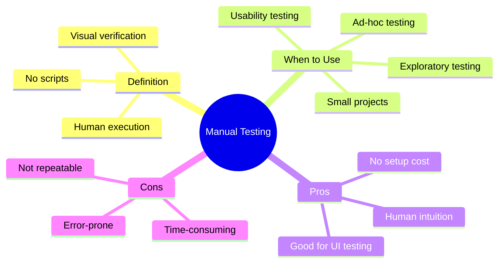

### Automation Testing

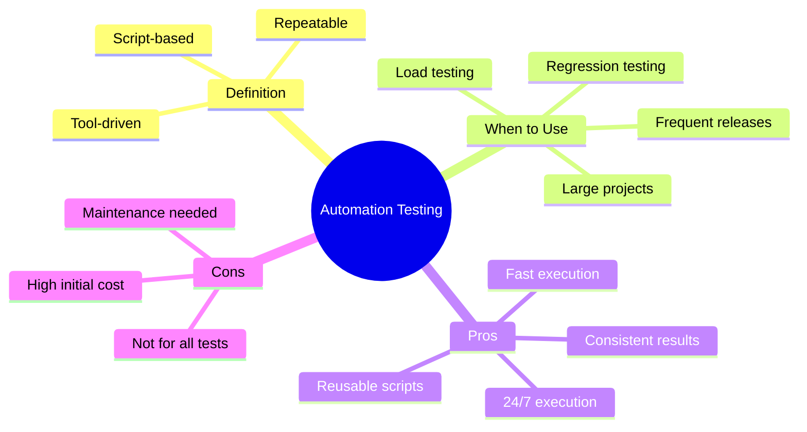

### Comparison Table

| Aspect | Manual Testing | Automation Testing |
|--------|----------------|-------------------|
| **Speed** | Slow | Fast |
| **Cost (Initial)** | Low | High |
| **Cost (Long-term)** | High | Low |
| **Accuracy** | Prone to errors | Consistent |
| **Reusability** | Not reusable | Highly reusable |
| **Investment** | Human resources | Tools, scripts |
| **Best For** | Exploratory, UI, usability | Regression, load, API |
| **Skill Required** | Domain knowledge | Programming + tools |

### Automation Testing Tools

| Tool | Type | Language |
|------|------|----------|
| **Selenium** | Web UI | Java, Python, C# |
| **Cypress** | Web UI | JavaScript |
| **Appium** | Mobile | Java, Python |
| **JUnit/TestNG** | Unit Testing | Java |
| **Jest** | Unit Testing | JavaScript |
| **Postman** | API Testing | JavaScript |
| **JMeter** | Performance | Java |
| **Robot Framework** | Generic | Python |

---

## Testing Methods

### Overview

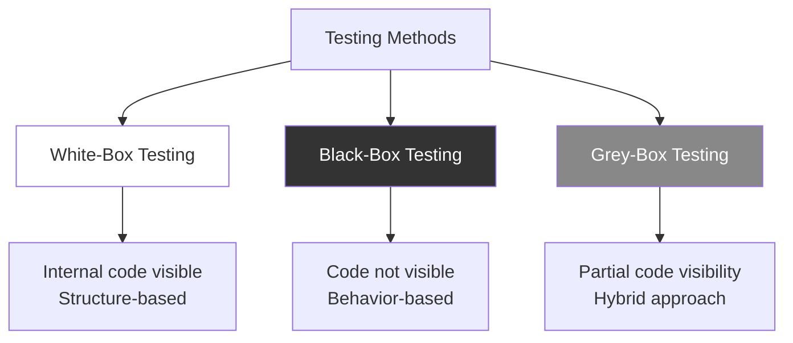

### White-Box Testing (Glass-Box Testing)

**Definition:** Testing with knowledge of internal code structure.

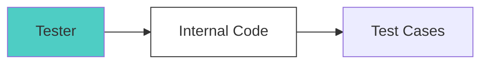

**Characteristics:**
- Requires programming knowledge
- Tests internal logic
- Done by developers
- Also called: Glass-box, Clear-box, Structural testing

**Techniques:**

| Technique | Description |
|-----------|-------------|
| **Statement Coverage** | Every statement executed at least once |
| **Branch Coverage** | Every branch (if/else) executed |
| **Path Coverage** | Every possible path executed |
| **Condition Coverage** | Every boolean condition tested |

**Example:**

```python
def calculate_discount(age, member):
    if age > 60:               # Branch 1
        return 20              # Statement 1
    elif member:               # Branch 2
        return 10              # Statement 2
    else:                      # Branch 3
        return 0               # Statement 3

# Test cases for 100% branch coverage:
# Test 1: age=65, member=False → Branch 1
# Test 2: age=30, member=True → Branch 2
# Test 3: age=30, member=False → Branch 3
```

### Black-Box Testing (Behavioral Testing)

**Definition:** Testing without knowledge of internal code.

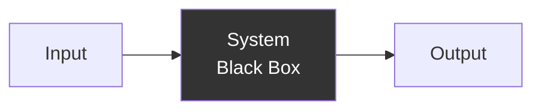

**Characteristics:**
- No knowledge of code required
- Tests functionality
- Done by testers
- Also called: Functional testing, Behavioral testing

**Techniques:**

| Technique | Description | Example |
|-----------|-------------|---------|
| **Equivalence Partitioning** | Divide inputs into equivalent classes | Age: 0-17, 18-60, 60+ |
| **Boundary Value Analysis** | Test at boundaries | Age: 17, 18, 59, 60, 61 |
| **Decision Table Testing** | Test all conditions combinations | Login: valid/invalid user/pass |
| **State Transition Testing** | Test state changes | ATM states: idle, auth, transaction |
| **Use Case Testing** | Test based on use cases | Login, checkout, payment |

**Equivalence Partitioning Example:**

```
Input: Age (0-120)
Valid Partitions:
- Partition 1: 0-17 (Minor)
- Partition 2: 18-60 (Adult)
- Partition 3: 61-120 (Senior)

Invalid Partitions:
- Partition 4: < 0
- Partition 5: > 120

Test Cases (one from each partition):
- TC1: Age = 10 (Minor)
- TC2: Age = 35 (Adult)
- TC3: Age = 75 (Senior)
- TC4: Age = -5 (Invalid)
- TC5: Age = 150 (Invalid)
```

**Boundary Value Analysis Example:**

```
Input: Age (1-100)
Boundaries: 0, 1, 100, 101

Test Cases:
- TC1: Age = 0 (Below min - invalid)
- TC2: Age = 1 (Min boundary - valid)
- TC3: Age = 100 (Max boundary - valid)
- TC4: Age = 101 (Above max - invalid)
```

### Grey-Box Testing

**Definition:** Testing with partial knowledge of internal structure.

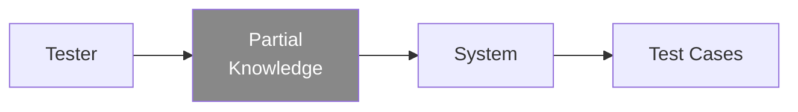

**Characteristics:**
- Limited access to internal code
- Combination of white-box and black-box
- Tests integration and interfaces
- Common in API testing

**Examples:**
- Integration testing
- Penetration testing
- API testing

### Comparison Table

| Aspect | White-Box | Black-Box | Grey-Box |
|--------|-----------|-----------|----------|
| **Code Knowledge** | Full | None | Partial |
| **Focus** | Internal logic | External behavior | Integration |
| **Performed By** | Developers | Testers | Developers/Testers |
| **Techniques** | Statement, branch coverage | EP, BVA | API testing |
| **Level** | Unit testing | System testing | Integration testing |
| **Skill** | Programming | Domain/Business | Both |

---

## Functional Testing

### Definition

**Functional Testing** verifies that the software functions correctly according to requirements.

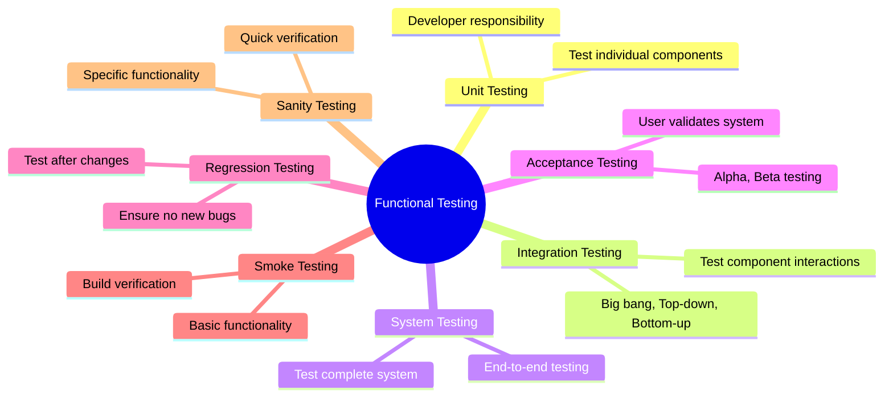

### Types of Functional Testing

| Type | Description | When |
|------|-------------|------|
| **Unit Testing** | Test individual modules | During development |
| **Integration Testing** | Test module interactions | After unit testing |
| **System Testing** | Test complete system | After integration |
| **Acceptance Testing** | User validates requirements | Before release |
| **Regression Testing** | Retest after changes | After bug fixes |
| **Smoke Testing** | Basic sanity check | New build received |
| **Sanity Testing** | Quick functionality check | After bug fixes |

### Smoke vs Sanity Testing

| Smoke Testing | Sanity Testing |
|---------------|----------------|
| Broad coverage | Narrow, focused |
| Build verification | Component verification |
| Done first | Done after smoke |
| "Can we proceed?" | "Is this part working?" |
| All major features | Specific features |

### Integration Testing Approaches

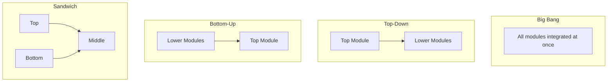

| Approach | Description | Pros | Cons |
|----------|-------------|------|------|
| **Big Bang** | All modules at once | Simple | Hard to debug |
| **Top-Down** | Start from top module | Early architecture testing | Stubs needed |
| **Bottom-Up** | Start from bottom module | No stubs needed | Drivers needed |
| **Sandwich** | Combine top-down and bottom-up | Parallel testing | Complex |

### Acceptance Testing Types

| Type | Description | Who |
|------|-------------|-----|
| **Alpha Testing** | Internal testing at dev site | Internal testers |
| **Beta Testing** | External testing at user site | End users |
| **UAT** | User Acceptance Testing | Business users |

---

## Non-Functional Testing

### Definition

**Non-Functional Testing** verifies quality attributes like performance, security, and usability.

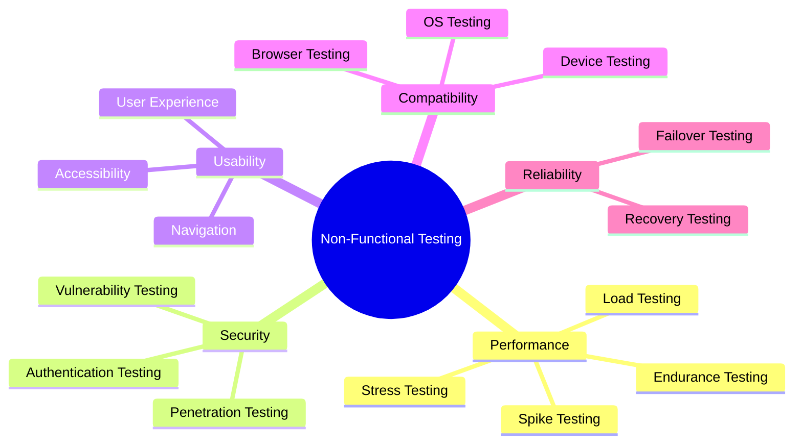

### Performance Testing Types

| Type | Description | Goal |
|------|-------------|------|
| **Load Testing** | Test under expected load | Measure response time |
| **Stress Testing** | Test beyond normal limits | Find breaking point |
| **Spike Testing** | Sudden load increase | Handle sudden surges |
| **Endurance Testing** | Extended period testing | Find memory leaks |
| **Volume Testing** | Large data testing | Handle big data |

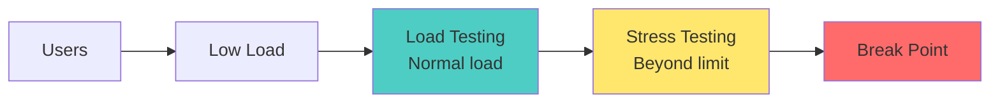

### Security Testing

| Type | Description |
|------|-------------|
| **Vulnerability Scanning** | Automated tool scanning |
| **Penetration Testing** | Ethical hacking |
| **Security Audit** | Code and policy review |
| **Authentication Testing** | Login security |
| **Authorization Testing** | Access control |

### Usability Testing

- User experience testing
- Navigation testing
- Accessibility testing (WCAG compliance)
- UI consistency testing

### Compatibility Testing

| Type | Examples |
|------|----------|
| **Browser** | Chrome, Firefox, Safari, Edge |
| **Device** | Desktop, Mobile, Tablet |
| **OS** | Windows, macOS, Linux, iOS, Android |
| **Network** | 3G, 4G, 5G, WiFi |

---

## CCEE Exam Focus Points

> [!IMPORTANT]
> **Key Concepts for MCQs:**
> - **STLC Phases**: 6 phases in order
> - **V-Model**: Development phase ↔ Testing phase mapping
> - **White-box**: Internal code visible, structure testing
> - **Black-box**: Code not visible, behavior testing
> - **Grey-box**: Partial visibility, combination
> - **BVA**: Test at boundaries (min-1, min, max, max+1)
> - **EP**: Divide inputs into equivalent classes
> - **Smoke**: Broad, build verification
> - **Sanity**: Narrow, component verification

> [!TIP]
> **Common Exam Questions:**
> - First phase of STLC? (Requirement Analysis)
> - Who does white-box testing? (Developers)
> - Technique to test boundaries? (BVA)
> - Difference between smoke and sanity?
> - V-Model: Requirements ↔ ? (Acceptance Testing)
> - Testing beyond normal load? (Stress Testing)

---

## Quick Reference Tables

### Testing Method Comparison

| Method | Code Visibility | Done By | Focus |
|--------|-----------------|---------|-------|
| White-Box | Full | Developers | Structure |
| Black-Box | None | Testers | Behavior |
| Grey-Box | Partial | Both | Integration |

### STLC Phases

| # | Phase | Key Deliverable |
|---|-------|-----------------|
| 1 | Requirement Analysis | RTM |
| 2 | Test Planning | Test Plan |
| 3 | Test Case Development | Test Cases |
| 4 | Environment Setup | Test Environment |
| 5 | Test Execution | Defect Reports |
| 6 | Test Closure | Summary Report |

---

## Assignment

### 1. Create a Test Plan
Create a comprehensive Test Plan for the web application project developed in the Software Engineering sessions. Your test plan should include:
- **Scope**: Features to be tested and not tested.
- **Strategy**: Tools (Selenium, JUnit), types of testing (Functional, UI).
- **Resources**: Team roles and responsibilities.
- **Schedule**: Timeline aligned with Sprints.
- **Risks**: Potential risks and mitigation plans.

### 2. Document Use Cases
Document at least 5 key use cases for your project. Example format:
- **Use Case Name**: Login
- **Actor**: Registered User
- **Pre-condition**: User is on login page
- **Flow**: Enter credentials -> Click Login -> Verify Dashboard
- **Post-condition**: User session started

### 3. Create Test Case Document
Create a detailed Test Case document for the Sprints designed in SE sessions. Provide at least 10 test cases covering valid and invalid scenarios.

| TC ID | Scenario | Pre-condition | Test Steps | Test Data | Expected Result |
|-------|----------|---------------|------------|-----------|-----------------|
| TC01 | Verify Login | Reg User | Enter user/pass | user: admin | Success |
| TC02 | Invalid Login | Reg User | Enter wrong pass | pass: wrong | Error Msg |

---

*End of Session 13: STLC, V-Model, and Testing Types*
