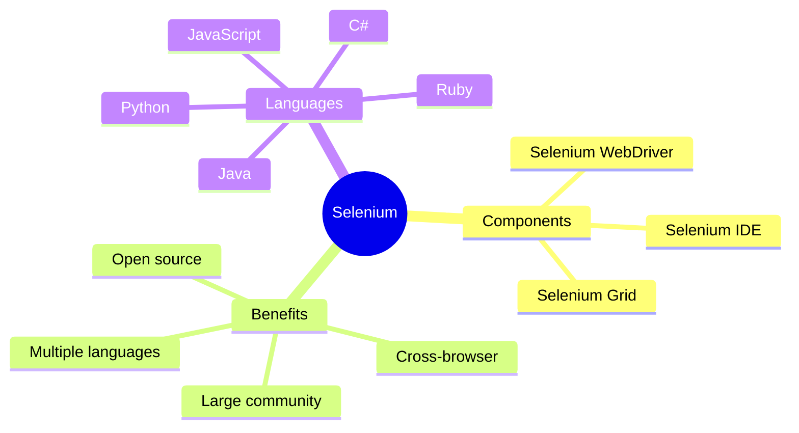
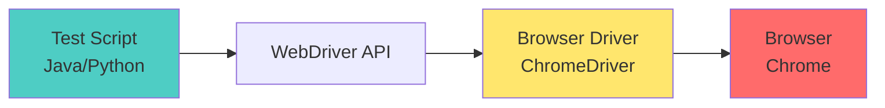
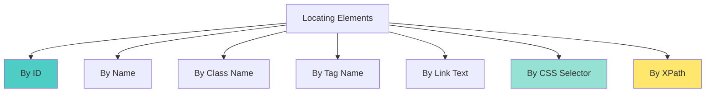

# Sessions 14-15: Selenium WebDriver (4 hours)

## Learning Objectives
- Understand Selenium WebDriver architecture
- Master element locators (ID, Name, XPath, CSS)
- Learn web element interactions
- Implement test automation with Selenium

---

## Introduction to Selenium

### What is Selenium?

**Selenium** is an open-source framework for automating web browser interactions used for testing web applications.



### Selenium Components

| Component | Description | Use Case |
|-----------|-------------|----------|
| **Selenium WebDriver** | Browser automation API | Writing test scripts |
| **Selenium IDE** | Record/playback browser extension | Quick prototyping |
| **Selenium Grid** | Distributed testing | Parallel test execution |

### Selenium WebDriver Architecture



### Browser Drivers

| Browser | Driver |
|---------|--------|
| Chrome | ChromeDriver |
| Firefox | GeckoDriver |
| Edge | EdgeDriver |
| Safari | SafariDriver |

---

## Setting Up Selenium (Java with Eclipse)

### Maven Dependencies

```xml
<!-- pom.xml -->
<dependencies>
    <!-- Selenium WebDriver -->
    <dependency>
        <groupId>org.seleniumhq.selenium</groupId>
        <artifactId>selenium-java</artifactId>
        <version>4.15.0</version>
    </dependency>
    
    <!-- WebDriver Manager (auto-manages drivers) -->
    <dependency>
        <groupId>io.github.bonigarcia</groupId>
        <artifactId>webdrivermanager</artifactId>
        <version>5.6.2</version>
    </dependency>
    
    <!-- TestNG for testing framework -->
    <dependency>
        <groupId>org.testng</groupId>
        <artifactId>testng</artifactId>
        <version>7.8.0</version>
    </dependency>
</dependencies>
```

### Basic Test Setup

```java
import org.openqa.selenium.WebDriver;
import org.openqa.selenium.chrome.ChromeDriver;
import io.github.bonigarcia.wdm.WebDriverManager;

public class FirstTest {
    public static void main(String[] args) {
        // Setup WebDriver using WebDriverManager
        WebDriverManager.chromedriver().setup();
        
        // Create WebDriver instance
        WebDriver driver = new ChromeDriver();
        
        // Maximize window
        driver.manage().window().maximize();
        
        // Navigate to URL
        driver.get("https://www.google.com");
        
        // Get title
        String title = driver.getTitle();
        System.out.println("Page Title: " + title);
        
        // Get current URL
        String currentUrl = driver.getCurrentUrl();
        System.out.println("Current URL: " + currentUrl);
        
        // Close browser
        driver.quit();
    }
}
```


---

## Browser Navigation Commands

Selenium provides a `Navigation` interface to handle browser history and navigation.

### `get()` vs `navigate().to()`

| Method | Description | Behavior |
|--------|-------------|----------|
| `driver.get("url")` | Load a new web page | Waits for page to load completely (DOM ready) |
| `driver.navigate().to("url")` | Load a new web page | Same as `get()`, but part of Navigation interface |

### Navigation Methods

```java
// Navigate to a URL
driver.navigate().to("https://www.google.com");

// Go back in history
driver.navigate().back();

// Go forward in history
driver.navigate().forward();

// Refresh current page
driver.navigate().refresh();
```

### Browser Window Commands

```java
// Get title of current page
String title = driver.getTitle();

// Get current URL
String url = driver.getCurrentUrl();

// Get page source (HTML)
String source = driver.getPageSource();

// Close current window
driver.close();

// Close all windows and end session
driver.quit();
```


## Locators: Finding Elements

### Locator Types Overview



### Locator Priority (Most to Least Reliable)

| Priority | Locator | Reliability | Speed |
|----------|---------|-------------|-------|
| 1 | **ID** | Most Reliable | Fastest |
| 2 | **Name** | Very Reliable | Fast |
| 3 | **CSS Selector** | Reliable | Fast |
| 4 | **XPath** | Flexible | Slower |
| 5 | **Link Text** | Specific to links | Fast |
| 6 | **Class Name** | May match multiple | Fast |
| 7 | **Tag Name** | Usually matches multiple | Fast |

### By ID

Most reliable locator as ID should be unique.

```html
<input type="text" id="username" name="user">
```

```java
// Find by ID
WebElement element = driver.findElement(By.id("username"));
```

### By Name

Good when ID is not available.

```html
<input type="text" name="email" id="emailField">
```

```java
// Find by Name
WebElement element = driver.findElement(By.name("email"));
```

### By Class Name

May return multiple elements if class is not unique.

```html
<button class="btn-primary submit-btn">Submit</button>
```

```java
// Find by Class Name
WebElement element = driver.findElement(By.className("btn-primary"));

// Find multiple elements
List<WebElement> elements = driver.findElements(By.className("btn-primary"));
```

### By Tag Name

Returns all elements of specified tag.

```html
<input type="text">
<input type="password">
<input type="submit">
```

```java
// Find all input elements
List<WebElement> inputs = driver.findElements(By.tagName("input"));
```

### By Link Text

For anchor (`<a>`) elements only.

```html
<a href="/login">Click Here to Login</a>
<a href="/register">Sign Up</a>
```

```java
// Find by exact link text
WebElement link = driver.findElement(By.linkText("Click Here to Login"));

// Find by partial link text
WebElement partialLink = driver.findElement(By.partialLinkText("Click Here"));
```

### By CSS Selector

Powerful and fast locator strategy.

```html
<input type="text" id="username" class="form-control" name="user">
<button id="submit-btn" class="btn primary">Submit</button>
```

```java
// By ID
driver.findElement(By.cssSelector("#username"));

// By Class
driver.findElement(By.cssSelector(".form-control"));

// By Attribute
driver.findElement(By.cssSelector("input[name='user']"));
driver.findElement(By.cssSelector("input[type='text']"));

// By ID and Class
driver.findElement(By.cssSelector("#submit-btn.btn"));

// Child element
driver.findElement(By.cssSelector("form > input"));

// Multiple classes
driver.findElement(By.cssSelector(".btn.primary"));
```

### CSS Selector Syntax

| Selector | Syntax | Example |
|----------|--------|---------|
| ID | `#id` | `#username` |
| Class | `.class` | `.btn-primary` |
| Attribute | `[attr='value']` | `[type='text']` |
| Tag | `tag` | `input` |
| Child | `parent > child` | `form > input` |
| Descendant | `ancestor descendant` | `div input` |
| Contains | `[attr*='value']` | `[id*='user']` |
| Starts with | `[attr^='value']` | `[id^='btn']` |
| Ends with | `[attr$='value']` | `[id$='submit']` |

### By XPath

Most flexible locator, can traverse DOM in any direction.

```html
<div class="container">
    <form id="loginForm">
        <input type="text" id="username" placeholder="Enter username">
        <input type="password" id="password">
        <button type="submit">Login</button>
    </form>
</div>
```

```java
// Absolute XPath (fragile - avoid)
driver.findElement(By.xpath("/html/body/div/form/input[1]"));

// Relative XPath (recommended)
driver.findElement(By.xpath("//input[@id='username']"));

// By attribute
driver.findElement(By.xpath("//input[@type='text']"));

// By text content
driver.findElement(By.xpath("//button[text()='Login']"));

// Contains text
driver.findElement(By.xpath("//button[contains(text(),'Log')]"));

// Contains attribute
driver.findElement(By.xpath("//input[contains(@id,'user')]"));

// Parent to child
driver.findElement(By.xpath("//form[@id='loginForm']/input[@type='text']"));

// Child to parent
driver.findElement(By.xpath("//input[@id='username']/.."));

// Following sibling
driver.findElement(By.xpath("//input[@id='username']/following-sibling::input"));

// AND condition
driver.findElement(By.xpath("//input[@type='text' and @id='username']"));

// OR condition
driver.findElement(By.xpath("//input[@type='text' or @type='password']"));
```

### XPath Syntax Reference

| Expression | Description |
|------------|-------------|
| `//` | Select from anywhere |
| `/` | Select from root/child |
| `@` | Select attribute |
| `[]` | Condition |
| `text()` | Text content |
| `contains()` | Contains function |
| `starts-with()` | Starts with function |
| `..` | Parent |
| `following-sibling` | Following sibling |
| `preceding-sibling` | Preceding sibling |

### XPath vs CSS Selector

| Feature | CSS Selector | XPath |
|---------|--------------|-------|
| **Speed** | Faster | Slower |
| **Readability** | More readable | More verbose |
| **Traverse up** | Cannot | Can (parent, ancestor) |
| **Text search** | Cannot | Can (text()) |
| **Browser support** | Excellent | Good |

---

## Web Element Interactions

### Text Box Interactions

```java
WebElement textBox = driver.findElement(By.id("username"));

// Type text
textBox.sendKeys("testuser");

// Clear text
textBox.clear();

// Get text value
String value = textBox.getAttribute("value");

// Get placeholder
String placeholder = textBox.getAttribute("placeholder");
```

### Button Interactions

```java
WebElement button = driver.findElement(By.id("submit"));

// Click button
button.click();

// Check if enabled
boolean isEnabled = button.isEnabled();

// Check if displayed
boolean isDisplayed = button.isDisplayed();
```

### Radio Button Selection

```html
<input type="radio" name="gender" value="male" id="male"> Male
<input type="radio" name="gender" value="female" id="female"> Female
```

```java
// Select radio button
WebElement maleRadio = driver.findElement(By.id("male"));
maleRadio.click();

// Check if selected
boolean isSelected = maleRadio.isSelected();

// Select by value
List<WebElement> radioButtons = driver.findElements(By.name("gender"));
for (WebElement radio : radioButtons) {
    if (radio.getAttribute("value").equals("female")) {
        radio.click();
        break;
    }
}
```

### Checkbox Selection

```html
<input type="checkbox" id="agree" name="agreement"> I agree
<input type="checkbox" id="subscribe" name="newsletter"> Subscribe
```

```java
WebElement checkbox = driver.findElement(By.id("agree"));

// Select checkbox
if (!checkbox.isSelected()) {
    checkbox.click();
}

// Unselect checkbox
if (checkbox.isSelected()) {
    checkbox.click();
}

// Check if selected
boolean isChecked = checkbox.isSelected();
```

### Dropdown Selection

```html
<select id="country" name="country">
    <option value="">Select Country</option>
    <option value="us">United States</option>
    <option value="uk">United Kingdom</option>
    <option value="in">India</option>
</select>
```

```java
import org.openqa.selenium.support.ui.Select;

WebElement dropdown = driver.findElement(By.id("country"));
Select select = new Select(dropdown);

// Select by visible text
select.selectByVisibleText("United States");

// Select by value attribute
select.selectByValue("uk");

// Select by index (0-based)
select.selectByIndex(3);  // Selects India

// Get all options
List<WebElement> options = select.getOptions();
for (WebElement option : options) {
    System.out.println(option.getText());
}

// Get selected option
WebElement selectedOption = select.getFirstSelectedOption();
String selectedText = selectedOption.getText();

// Check if multiple selection allowed
boolean isMultiple = select.isMultiple();
```

### Multi-Select Dropdown

```java
Select multiSelect = new Select(driver.findElement(By.id("skills")));

// Select multiple options
multiSelect.selectByVisibleText("Java");
multiSelect.selectByVisibleText("Python");
multiSelect.selectByVisibleText("JavaScript");

// Deselect options
multiSelect.deselectByVisibleText("Python");
multiSelect.deselectAll();

// Get all selected options
List<WebElement> selectedOptions = multiSelect.getAllSelectedOptions();
```

---

## Keyboard Actions

```java
import org.openqa.selenium.Keys;

WebElement element = driver.findElement(By.id("search"));

// Send text with Enter
element.sendKeys("Selenium WebDriver" + Keys.ENTER);

// Keyboard shortcuts
element.sendKeys(Keys.CONTROL + "a");  // Select all
element.sendKeys(Keys.CONTROL + "c");  // Copy
element.sendKeys(Keys.CONTROL + "v");  // Paste

// Tab key
element.sendKeys(Keys.TAB);

// Clear field
element.sendKeys(Keys.CONTROL + "a");
element.sendKeys(Keys.DELETE);

// Arrow keys
element.sendKeys(Keys.ARROW_DOWN);
element.sendKeys(Keys.ARROW_UP);

// Escape key
element.sendKeys(Keys.ESCAPE);
```

---

## Mouse Actions

```java
import org.openqa.selenium.interactions.Actions;

Actions actions = new Actions(driver);

WebElement element = driver.findElement(By.id("button"));
WebElement target = driver.findElement(By.id("target"));

// Mouse hover
actions.moveToElement(element).perform();

// Click
actions.click(element).perform();

// Double click
actions.doubleClick(element).perform();

// Right click (context click)
actions.contextClick(element).perform();

// Click and hold
actions.clickAndHold(element).perform();

// Release
actions.release().perform();

// Drag and drop
actions.dragAndDrop(element, target).perform();

// Drag and drop by offset
actions.dragAndDropBy(element, 100, 50).perform();

// Chained actions
actions.moveToElement(element)
       .click()
       .sendKeys("text")
       .perform();
```

---

## Handling Waits

### Implicit Wait

Global wait for all elements.

```java
import java.time.Duration;

// Set implicit wait (applies to all findElement calls)
driver.manage().timeouts().implicitlyWait(Duration.ofSeconds(10));
```

### Explicit Wait

Wait for specific condition.

```java
import org.openqa.selenium.support.ui.WebDriverWait;
import org.openqa.selenium.support.ui.ExpectedConditions;

WebDriverWait wait = new WebDriverWait(driver, Duration.ofSeconds(10));

// Wait for element to be visible
WebElement element = wait.until(
    ExpectedConditions.visibilityOfElementLocated(By.id("result"))
);

// Wait for element to be clickable
WebElement button = wait.until(
    ExpectedConditions.elementToBeClickable(By.id("submit"))
);

// Wait for text to be present
wait.until(
    ExpectedConditions.textToBePresentInElementLocated(
        By.id("message"), "Success"
    )
);

// Wait for URL to contain
wait.until(ExpectedConditions.urlContains("/dashboard"));

// Wait for title to contain
wait.until(ExpectedConditions.titleContains("Welcome"));

// Wait for element to be invisible
wait.until(
    ExpectedConditions.invisibilityOfElementLocated(By.id("loader"))
);

// Wait for alert
wait.until(ExpectedConditions.alertIsPresent());
```

### Fluent Wait

Customizable wait with polling interval.

```java
import org.openqa.selenium.support.ui.FluentWait;
import org.openqa.selenium.NoSuchElementException;

Wait<WebDriver> fluentWait = new FluentWait<>(driver)
    .withTimeout(Duration.ofSeconds(30))
    .pollingEvery(Duration.ofSeconds(2))
    .ignoring(NoSuchElementException.class);

WebElement element = fluentWait.until(driver -> 
    driver.findElement(By.id("dynamic-element"))
);
```

### Wait Types Comparison

| Wait Type | Scope | Flexibility | Use Case |
|-----------|-------|-------------|----------|
| **Implicit** | Global | Low | Simple scenarios |
| **Explicit** | Specific element | High | Specific conditions |
| **Fluent** | Specific element | Highest | Custom polling |

---

## Handling Alerts and Pop-ups

```java
import org.openqa.selenium.Alert;

// Switch to alert
Alert alert = driver.switchTo().alert();

// Get alert text
String alertText = alert.getText();

// Accept alert (OK)
alert.accept();

// Dismiss alert (Cancel)
alert.dismiss();

// Type in prompt
alert.sendKeys("Some text");
alert.accept();
```

---

## Handling Frames and Windows

### Frames

```java
// Switch to frame by index
driver.switchTo().frame(0);

// Switch to frame by name or ID
driver.switchTo().frame("frameName");

// Switch to frame by WebElement
WebElement frame = driver.findElement(By.id("myFrame"));
driver.switchTo().frame(frame);

// Switch back to main content
driver.switchTo().defaultContent();

// Switch to parent frame
driver.switchTo().parentFrame();
```

### Multiple Windows

```java
// Get current window handle
String mainWindow = driver.getWindowHandle();

// Get all window handles
Set<String> allWindows = driver.getWindowHandles();

// Switch to new window
for (String window : allWindows) {
    if (!window.equals(mainWindow)) {
        driver.switchTo().window(window);
        break;
    }
}

// Switch back to main window
driver.switchTo().window(mainWindow);

// Close current window
driver.close();

// Quit all windows
driver.quit();
```

---

## Complete Test Example

```java
import org.openqa.selenium.By;
import org.openqa.selenium.WebDriver;
import org.openqa.selenium.WebElement;
import org.openqa.selenium.chrome.ChromeDriver;
import org.openqa.selenium.support.ui.Select;
import org.openqa.selenium.support.ui.WebDriverWait;
import org.openqa.selenium.support.ui.ExpectedConditions;
import io.github.bonigarcia.wdm.WebDriverManager;
import java.time.Duration;

public class LoginTest {
    public static void main(String[] args) {
        // Setup
        WebDriverManager.chromedriver().setup();
        WebDriver driver = new ChromeDriver();
        WebDriverWait wait = new WebDriverWait(driver, Duration.ofSeconds(10));
        
        try {
            // Navigate
            driver.get("https://example.com/login");
            driver.manage().window().maximize();
            
            // Wait for page load
            wait.until(ExpectedConditions.visibilityOfElementLocated(
                By.id("loginForm")
            ));
            
            // Enter username
            WebElement username = driver.findElement(By.id("username"));
            username.clear();
            username.sendKeys("testuser");
            
            // Enter password
            WebElement password = driver.findElement(By.id("password"));
            password.clear();
            password.sendKeys("password123");
            
            // Select "Remember me" checkbox
            WebElement rememberMe = driver.findElement(By.id("remember"));
            if (!rememberMe.isSelected()) {
                rememberMe.click();
            }
            
            // Select country from dropdown
            Select country = new Select(driver.findElement(By.id("country")));
            country.selectByVisibleText("United States");
            
            // Click login button
            WebElement loginBtn = driver.findElement(By.id("loginBtn"));
            loginBtn.click();
            
            // Wait for redirect
            wait.until(ExpectedConditions.urlContains("/dashboard"));
            
            // Verify login success
            String currentUrl = driver.getCurrentUrl();
            if (currentUrl.contains("/dashboard")) {
                System.out.println("✓ Login successful!");
            } else {
                System.out.println("✗ Login failed!");
            }
            
        } catch (Exception e) {
            System.out.println("Error: " + e.getMessage());
        } finally {
            // Cleanup
            driver.quit();
        }
    }
}
```

---

## Lab Exercises

### Exercise 1: Setup Selenium

1. Create Maven project in Eclipse
2. Add Selenium dependencies
3. Create basic test to open Google

### Exercise 2: Create Test Suite

```java
import org.testng.annotations.Test;
import org.testng.annotations.BeforeMethod;
import org.testng.annotations.AfterMethod;

public class TestSuite {
    WebDriver driver;
    
    @BeforeMethod
    public void setup() {
        WebDriverManager.chromedriver().setup();
        driver = new ChromeDriver();
        driver.manage().window().maximize();
    }
    
    @Test
    public void testLogin() {
        // Login test
    }
    
    @Test
    public void testRegistration() {
        // Registration test
    }
    
    @AfterMethod
    public void tearDown() {
        driver.quit();
    }
}
```

### Exercise 3: Add Interactions

Create tests for:
- Text box input
- Radio button selection
- Checkbox selection
- Dropdown selection
- Mouse hover
- Keyboard actions

---

## Locator Quick Reference

| Locator | Java Syntax | Example |
|---------|-------------|---------|
| ID | `By.id("value")` | `By.id("username")` |
| Name | `By.name("value")` | `By.name("email")` |
| Class | `By.className("value")` | `By.className("btn")` |
| Tag | `By.tagName("value")` | `By.tagName("input")` |
| Link Text | `By.linkText("value")` | `By.linkText("Click")` |
| Partial Link | `By.partialLinkText("value")` | `By.partialLinkText("Cli")` |
| CSS | `By.cssSelector("value")` | `By.cssSelector("#id")` |
| XPath | `By.xpath("value")` | `By.xpath("//input[@id='x']")` |

---

## CCEE Exam Focus Points

> [!IMPORTANT]
> **Key Concepts for MCQs:**
> - **ID** is the most reliable locator
> - **XPath** can traverse parent elements
> - **CSS Selector** is faster than XPath
> - `findElement` returns single element
> - `findElements` returns list of elements
> - **Implicit Wait** applies globally
> - **Explicit Wait** applies to specific element
> - `driver.quit()` closes all windows
> - `driver.close()` closes current window

> [!TIP]
> **Common Exam Questions:**
> - Most reliable locator? (ID)
> - XPath syntax for element with ID? (`//tag[@id='value']`)
> - How to select dropdown option? (Select class)
> - Difference between quit() and close()?
> - How to handle alerts? (switchTo().alert())
> - Purpose of explicit wait? (Wait for specific condition)

---

*End of Sessions 14-15: Selenium WebDriver*
