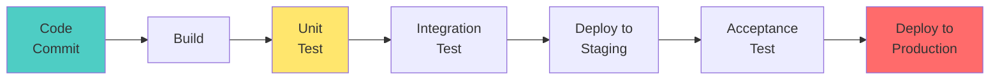
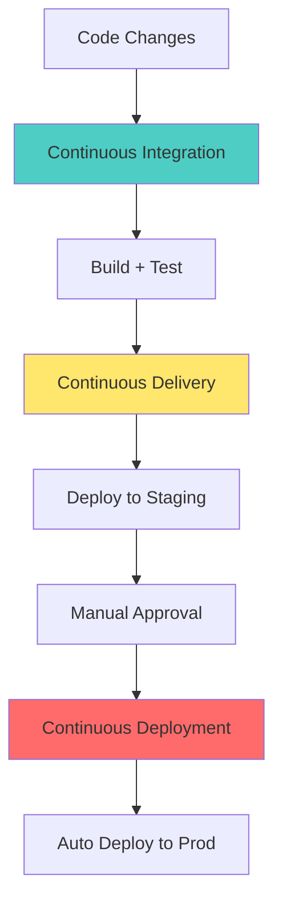
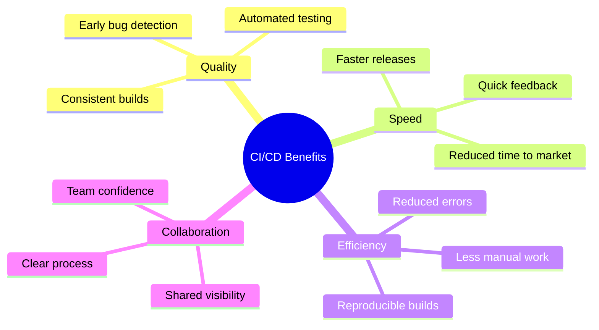
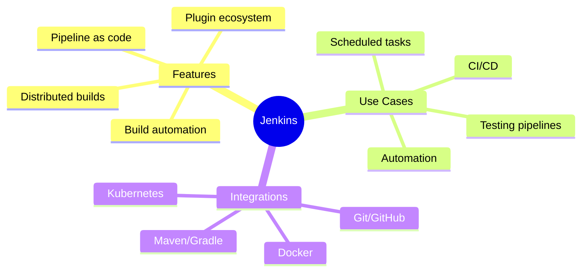
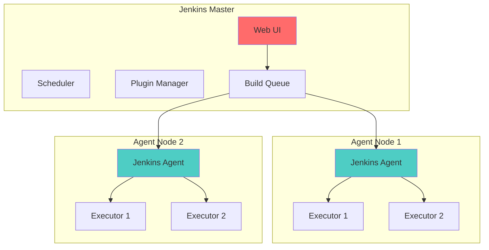
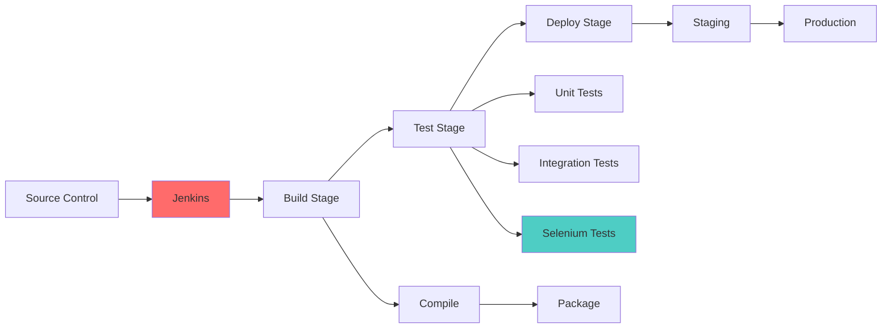

# Session 16: Jenkins & CI/CD Pipelines (2 hours)

## Learning Objectives
- Understand CI/CD concepts and benefits
- Learn Jenkins architecture and components
- Build delivery pipelines
- Integrate Selenium tests with Jenkins

---

## Introduction to Delivery Pipeline

### What is a Delivery Pipeline?

A **Delivery Pipeline** is an automated workflow that takes code from version control through build, test, and deployment stages.



### CI vs CD



| Term | Definition | Automation Level |
|------|------------|------------------|
| **Continuous Integration (CI)** | Automatically build and test on code commit | Build + Test |
| **Continuous Delivery (CD)** | Always deployable, manual approval for production | + Deploy to Staging |
| **Continuous Deployment** | Automatically deploy to production | Full automation |

### Benefits of CI/CD



| Benefit | Description |
|---------|-------------|
| **Early Bug Detection** | Find issues quickly through automated tests |
| **Faster Releases** | Deliver features to users faster |
| **Reduced Risk** | Small, frequent changes have lower risk |
| **Better Quality** | Consistent testing improves quality |
| **Team Confidence** | Automated checks provide confidence |
| **Documentation** | Pipeline serves as deployment documentation |


---

## Build Automation Tools

### Why Build Automation?

Build automation involves scripting or automating the process of compiling computer source code into binary code, packaging binary code, and running automated tests.

**Key Benefits:**
- **Productivity**: Eliminates manual tasks
- **Quality**: Consistent build process
- **History**: Keeps track of builds and versions
- **Speed**: Faster feedback on changes

### Popular Build Tools

| Tool | Type | Language | Configuration |
|------|------|----------|---------------|
| **Ant** | Imperative | Java | XML (`build.xml`) |
| **Maven** | Declarative | Java | XML (`pom.xml`) |
| **Gradle** | Declarative/Imperative | Java/Groovy/Kotlin | DSL (`build.gradle`) |

### Ant vs Maven vs Gradle

| Feature | Apache Ant | Apache Maven | Gradle |
|---------|------------|--------------|--------|
| **Release Year** | 2000 | 2004 | 2012 |
| **Philosophy** | Toolbox (Flexible) | Framework (Convention over Configuration) | Flexible + Convention |
| **Configuration** | XML | XML | Groovy/Kotlin DSL |
| **Dependency Management** | Manual (via Ivy) | Built-in (Central Repository) | Built-in (Maven/Ivy Repos) |
| **Performance** | Fast for small projects | Slower (Linear execution) | Very Fast (Incremental builds, Daemon) |
| **Lifecycle** | No standard lifecycle | Strict Lifecycle (validate, compile, test, package, install, deploy) | Flexible Lifecycle of tasks |
| **Learning Curve** | Low (if you know XML) | Medium (Need to learn Lifecycle) | High (Need to learn DSL) |
| **Usage** | Legacy projects | Enterprise standard | Modern projects (Android, Spring Boot) |


## Introduction to Jenkins

### What is Jenkins?

**Jenkins** is an open-source automation server used to automate building, testing, and deploying software.



### Jenkins History

- Created by Kohsuke Kawaguchi in 2004 as "Hudson"
- Forked to Jenkins in 2011
- Most popular CI/CD tool
- 1500+ plugins available

---

## Jenkins Architecture

### Master-Agent Architecture



### Jenkins Components

| Component | Description |
|-----------|-------------|
| **Master** | Main server, manages agents, schedules builds |
| **Agent/Slave** | Executes builds on behalf of master |
| **Executor** | Thread that runs a build |
| **Job/Project** | Configuration for a task |
| **Build** | Single execution of a job |
| **Pipeline** | Series of stages/steps |
| **Workspace** | Directory for build files |
| **Plugin** | Extension for additional functionality |

### Jenkins Terminology

| Term | Description |
|------|-------------|
| **Job** | A task to be executed |
| **Build** | One run of a job |
| **Step** | Single task in a pipeline |
| **Stage** | Collection of steps |
| **Node** | Machine that runs builds |
| **Executor** | Thread that runs builds |
| **Workspace** | Working directory |
| **Artifact** | Build output files |

---

## Jenkins Management

### Installing Jenkins

```bash
# Using Docker
docker run -d -p 8080:8080 -p 50000:50000 \
    -v jenkins_home:/var/jenkins_home \
    --name jenkins \
    jenkins/jenkins:lts

# Access at http://localhost:8080
# Initial password: docker exec jenkins cat /var/jenkins_home/secrets/initialAdminPassword
```

### Jenkins Configuration

| Setting | Description |
|---------|-------------|
| **System Configuration** | Global settings, environment variables |
| **Global Tool Configuration** | JDK, Maven, Git, Node.js paths |
| **Security** | Users, permissions, authentication |
| **Nodes** | Configure agent nodes |
| **Plugins** | Install/manage plugins |
| **Credentials** | Store secrets, API keys |

### Essential Plugins

| Plugin | Purpose |
|--------|---------|
| **Git** | Git SCM integration |
| **Pipeline** | Pipeline as code |
| **Blue Ocean** | Modern UI |
| **Maven Integration** | Maven builds |
| **Docker** | Docker integration |
| **Selenium** | Selenium test integration |
| **JUnit** | Test result reporting |
| **Email Extension** | Email notifications |

---

## Adding Agent/Slave Node to Jenkins

### Agent Setup Methods

| Method | Description |
|--------|-------------|
| **SSH** | Connect via SSH (Linux/macOS) |
| **JNLP** | Java Web Start (Java-based) |
| **Kubernetes** | Dynamic agents in K8s |
| **Docker** | Docker-based agents |

### Adding SSH Agent

1. **Create Node**: Manage Jenkins → Manage Nodes → New Node
2. **Configure**:
   - Name: `agent-1`
   - Number of executors: 2
   - Remote root directory: `/home/jenkins`
   - Labels: `linux docker`
   - Launch method: SSH
3. **Add Credentials**: SSH private key
4. **Save and Connect**

### Agent Labels

Use labels to run jobs on specific agents:

```groovy
pipeline {
    agent { label 'linux' }
    // or
    agent { label 'docker && linux' }
}
```

---

## Building a Delivery Pipeline

### Pipeline Types

| Type | Description | File |
|------|-------------|------|
| **Declarative** | Structured, simpler syntax | Jenkinsfile |
| **Scripted** | Groovy-based, more flexible | Jenkinsfile |
| **Freestyle** | UI-based configuration | No file |

### Declarative Pipeline Syntax

```groovy
pipeline {
    agent any
    
    environment {
        APP_NAME = 'myapp'
        VERSION = '1.0.0'
    }
    
    tools {
        maven 'Maven 3.8'
        jdk 'JDK 11'
    }
    
    stages {
        stage('Checkout') {
            steps {
                git branch: 'main',
                    url: 'https://github.com/user/repo.git'
            }
        }
        
        stage('Build') {
            steps {
                sh 'mvn clean compile'
            }
        }
        
        stage('Test') {
            steps {
                sh 'mvn test'
            }
            post {
                always {
                    junit '**/target/surefire-reports/*.xml'
                }
            }
        }
        
        stage('Package') {
            steps {
                sh 'mvn package -DskipTests'
            }
        }
        
        stage('Deploy to Staging') {
            steps {
                sh './deploy.sh staging'
            }
        }
        
        stage('Deploy to Production') {
            when {
                branch 'main'
            }
            input {
                message "Deploy to production?"
                ok "Yes, deploy it!"
            }
            steps {
                sh './deploy.sh production'
            }
        }
    }
    
    post {
        success {
            echo 'Pipeline succeeded!'
            // mail to: 'team@example.com', subject: 'Build Success'
        }
        failure {
            echo 'Pipeline failed!'
            // mail to: 'team@example.com', subject: 'Build Failed'
        }
        always {
            cleanWs()
        }
    }
}
```

### Pipeline Directives

| Directive | Description |
|-----------|-------------|
| `pipeline` | Root block |
| `agent` | Where to execute |
| `stages` | Contains stage blocks |
| `stage` | Named phase |
| `steps` | Actions to perform |
| `post` | Post-build actions |
| `environment` | Environment variables |
| `tools` | Build tools to use |
| `when` | Conditional execution |
| `input` | Manual approval |
| `parallel` | Parallel execution |

### Scripted Pipeline

```groovy
node {
    stage('Checkout') {
        checkout scm
    }
    
    stage('Build') {
        sh 'mvn clean compile'
    }
    
    stage('Test') {
        try {
            sh 'mvn test'
        } finally {
            junit '**/target/surefire-reports/*.xml'
        }
    }
    
    stage('Deploy') {
        if (env.BRANCH_NAME == 'main') {
            sh './deploy.sh production'
        } else {
            sh './deploy.sh staging'
        }
    }
}
```

### Parallel Stages

```groovy
pipeline {
    agent any
    
    stages {
        stage('Build') {
            steps {
                sh 'mvn compile'
            }
        }
        
        stage('Test') {
            parallel {
                stage('Unit Tests') {
                    steps {
                        sh 'mvn test -Dtest=*UnitTest'
                    }
                }
                stage('Integration Tests') {
                    steps {
                        sh 'mvn test -Dtest=*IntegrationTest'
                    }
                }
                stage('E2E Tests') {
                    steps {
                        sh 'mvn test -Dtest=*E2ETest'
                    }
                }
            }
        }
    }
}
```

---

## Selenium Integration with Jenkins

### Project Structure

```
selenium-project/
├── src/
│   └── test/
│       └── java/
│           ├── LoginTest.java
│           └── RegistrationTest.java
├── pom.xml
├── testng.xml
└── Jenkinsfile
```

### pom.xml for Selenium Project

```xml
<?xml version="1.0" encoding="UTF-8"?>
<project xmlns="http://maven.apache.org/POM/4.0.0"
         xmlns:xsi="http://www.w3.org/2001/XMLSchema-instance"
         xsi:schemaLocation="http://maven.apache.org/POM/4.0.0 
         http://maven.apache.org/xsd/maven-4.0.0.xsd">
    <modelVersion>4.0.0</modelVersion>
    
    <groupId>com.example</groupId>
    <artifactId>selenium-tests</artifactId>
    <version>1.0-SNAPSHOT</version>
    <packaging>jar</packaging>
    
    <properties>
        <maven.compiler.source>11</maven.compiler.source>
        <maven.compiler.target>11</maven.compiler.target>
        <selenium.version>4.15.0</selenium.version>
        <testng.version>7.8.0</testng.version>
    </properties>
    
    <dependencies>
        <!-- Selenium -->
        <dependency>
            <groupId>org.seleniumhq.selenium</groupId>
            <artifactId>selenium-java</artifactId>
            <version>${selenium.version}</version>
        </dependency>
        
        <!-- WebDriver Manager -->
        <dependency>
            <groupId>io.github.bonigarcia</groupId>
            <artifactId>webdrivermanager</artifactId>
            <version>5.6.2</version>
        </dependency>
        
        <!-- TestNG -->
        <dependency>
            <groupId>org.testng</groupId>
            <artifactId>testng</artifactId>
            <version>${testng.version}</version>
        </dependency>
    </dependencies>
    
    <build>
        <plugins>
            <!-- Surefire Plugin for running tests -->
            <plugin>
                <groupId>org.apache.maven.plugins</groupId>
                <artifactId>maven-surefire-plugin</artifactId>
                <version>3.2.2</version>
                <configuration>
                    <suiteXmlFiles>
                        <suiteXmlFile>testng.xml</suiteXmlFile>
                    </suiteXmlFiles>
                </configuration>
            </plugin>
        </plugins>
    </build>
</project>
```

### testng.xml

```xml
<?xml version="1.0" encoding="UTF-8"?>
<!DOCTYPE suite SYSTEM "https://testng.org/testng-1.0.dtd">
<suite name="Selenium Test Suite" parallel="tests" thread-count="2">
    
    <test name="Login Tests">
        <classes>
            <class name="com.example.tests.LoginTest"/>
        </classes>
    </test>
    
    <test name="Registration Tests">
        <classes>
            <class name="com.example.tests.RegistrationTest"/>
        </classes>
    </test>
    
</suite>
```

### Sample Test Class

```java
package com.example.tests;

import org.openqa.selenium.By;
import org.openqa.selenium.WebDriver;
import org.openqa.selenium.WebElement;
import org.openqa.selenium.chrome.ChromeDriver;
import org.openqa.selenium.chrome.ChromeOptions;
import org.openqa.selenium.support.ui.WebDriverWait;
import org.openqa.selenium.support.ui.ExpectedConditions;
import org.testng.Assert;
import org.testng.annotations.*;
import io.github.bonigarcia.wdm.WebDriverManager;
import java.time.Duration;

public class LoginTest {
    private WebDriver driver;
    private WebDriverWait wait;
    
    @BeforeClass
    public void setup() {
        WebDriverManager.chromedriver().setup();
        ChromeOptions options = new ChromeOptions();
        options.addArguments("--headless");  // Run headless for CI
        options.addArguments("--no-sandbox");
        options.addArguments("--disable-dev-shm-usage");
        
        driver = new ChromeDriver(options);
        driver.manage().window().maximize();
        wait = new WebDriverWait(driver, Duration.ofSeconds(10));
    }
    
    @Test
    public void testValidLogin() {
        driver.get("https://example.com/login");
        
        WebElement username = wait.until(
            ExpectedConditions.visibilityOfElementLocated(By.id("username"))
        );
        username.sendKeys("testuser");
        
        driver.findElement(By.id("password")).sendKeys("password123");
        driver.findElement(By.id("loginBtn")).click();
        
        wait.until(ExpectedConditions.urlContains("/dashboard"));
        Assert.assertTrue(driver.getCurrentUrl().contains("/dashboard"));
    }
    
    @Test
    public void testInvalidLogin() {
        driver.get("https://example.com/login");
        
        driver.findElement(By.id("username")).sendKeys("invalid");
        driver.findElement(By.id("password")).sendKeys("wrong");
        driver.findElement(By.id("loginBtn")).click();
        
        WebElement error = wait.until(
            ExpectedConditions.visibilityOfElementLocated(By.id("error"))
        );
        Assert.assertTrue(error.getText().contains("Invalid credentials"));
    }
    
    @AfterClass
    public void tearDown() {
        if (driver != null) {
            driver.quit();
        }
    }
}
```

### Jenkinsfile for Selenium

```groovy
pipeline {
    agent any
    
    tools {
        maven 'Maven 3.8'
        jdk 'JDK 11'
    }
    
    environment {
        SELENIUM_BROWSER = 'chrome'
    }
    
    stages {
        stage('Checkout') {
            steps {
                git branch: 'main',
                    url: 'https://github.com/user/selenium-tests.git'
            }
        }
        
        stage('Build') {
            steps {
                sh 'mvn clean compile'
            }
        }
        
        stage('Run Selenium Tests') {
            steps {
                sh 'mvn test'
            }
            post {
                always {
                    // Publish TestNG results
                    junit '**/target/surefire-reports/*.xml'
                    
                    // Publish HTML report (if using ExtentReports)
                    publishHTML([
                        allowMissing: false,
                        alwaysLinkToLastBuild: true,
                        keepAll: true,
                        reportDir: 'target/test-reports',
                        reportFiles: 'ExtentReport.html',
                        reportName: 'Selenium Test Report'
                    ])
                }
            }
        }
        
        stage('Archive Artifacts') {
            steps {
                archiveArtifacts artifacts: '**/target/*.jar', 
                    allowEmptyArchive: true
            }
        }
    }
    
    post {
        success {
            echo '✓ All Selenium tests passed!'
        }
        failure {
            echo '✗ Some Selenium tests failed!'
            // Send email notification
            // mail to: 'team@example.com', subject: 'Test Failed'
        }
        always {
            cleanWs()
        }
    }
}
```

---

## Lab Exercises

### Exercise 1: Install and Configure Jenkins

```bash
# Run Jenkins in Docker
docker run -d -p 8080:8080 -p 50000:50000 \
    --name jenkins \
    -v jenkins_home:/var/jenkins_home \
    jenkins/jenkins:lts

# Get initial admin password
docker exec jenkins cat /var/jenkins_home/secrets/initialAdminPassword

# Access Jenkins at http://localhost:8080
```

### Exercise 2: Create Pipeline Job

1. New Item → Pipeline
2. Configure Git repository
3. Add Jenkinsfile path
4. Save and Build

### Exercise 3: Integrate Selenium

1. Create Maven project with Selenium tests
2. Add Jenkinsfile with test execution
3. Configure test reporting
4. Run pipeline and view results

---

## Pipeline Visualization



---

## Quick Reference

### Common Jenkins Pipeline Steps

| Step | Description |
|------|-------------|
| `git` | Checkout from Git |
| `sh` | Run shell command |
| `bat` | Run Windows command |
| `echo` | Print message |
| `mail` | Send email |
| `junit` | Publish test results |
| `archiveArtifacts` | Archive files |
| `cleanWs` | Clean workspace |
| `input` | Wait for manual approval |

### Jenkins CLI Commands

```bash
# List jobs
java -jar jenkins-cli.jar -s http://localhost:8080 list-jobs

# Build job
java -jar jenkins-cli.jar -s http://localhost:8080 build job-name

# Get console output
java -jar jenkins-cli.jar -s http://localhost:8080 console job-name
```

---

## CCEE Exam Focus Points

> [!IMPORTANT]
> **Key Concepts for MCQs:**
> - **CI** = Build + Test automatically on commit
> - **CD** = Always deployable (manual approval to prod)
> - **Continuous Deployment** = Auto deploy to prod
> - **Jenkins Master** schedules jobs
> - **Jenkins Agent** executes jobs
> - **Jenkinsfile** defines pipeline as code
> - **Declarative Pipeline** uses `pipeline { }` syntax
> - `post` block for post-build actions

> [!TIP]
> **Common Exam Questions:**
> - What is CI/CD?
> - Difference between Master and Agent?
> - What is a Jenkinsfile?
> - How to run tests in Jenkins?
> - What plugin is needed for Git integration?
> - How to view test results? (junit step)

---

*End of Session 16: Jenkins & CI/CD Pipelines*
