# Sessions 2-5: Software Engineering & DevOps (8 hours)

## Learning Objectives
- Understand software engineering fundamentals
- Learn SDLC phases and models
- Master requirements engineering
- Understand design principles and UML
- Learn coding conventions and OOP principles

---

## Introduction to Software Engineering

### What is Software Engineering?

**Software Engineering** is the systematic application of engineering approaches to the development of software. It involves a disciplined approach to software development, maintenance, and retirement.

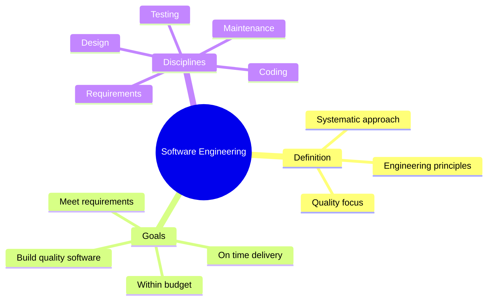

### Software Characteristics

| Characteristic | Description |
|----------------|-------------|
| **Functionality** | Features that satisfy stated needs |
| **Reliability** | Ability to maintain performance under specified conditions |
| **Usability** | Ease of use and learning |
| **Efficiency** | Optimal use of resources |
| **Maintainability** | Ease of modification |
| **Portability** | Ability to transfer between environments |

---

## Software Process, Model, and Product

### Key Definitions

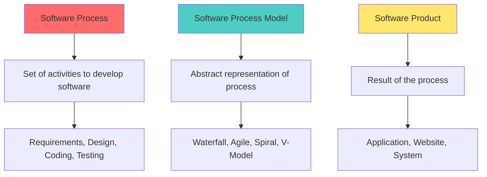

| Concept | Definition | Example |
|---------|------------|---------|
| **Software Process** | Set of activities and associated results that produce a software product | Requirements → Design → Code → Test |
| **Software Process Model** | Simplified representation of a software process | Waterfall, Agile, Spiral |
| **Software Product** | The deliverable software system | Web app, Mobile app, Desktop software |

### Process vs Product

| Software Process | Software Product |
|-----------------|------------------|
| HOW software is built | WHAT is built |
| Activities and tasks | Deliverable output |
| Development methodology | Working software |
| Defines phases and steps | Satisfies user requirements |
| Quality of process affects product | Measured by features and quality |

---

## Importance of Software Engineering

### Why Software Engineering Matters

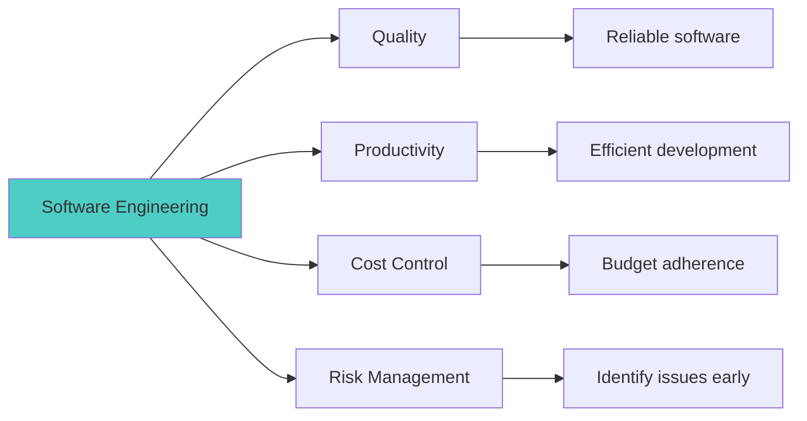

| Benefit | Description |
|---------|-------------|
| **Reduced Complexity** | Divide large problems into smaller manageable parts |
| **Cost Effectiveness** | Proper planning reduces development cost |
| **Time Efficiency** | Structured approach saves time |
| **Reliable Software** | Testing and quality assurance |
| **Maintainability** | Well-documented, modular code |
| **Team Coordination** | Defined processes for team collaboration |

---

## Software Development Life Cycle (SDLC)

### SDLC Phases

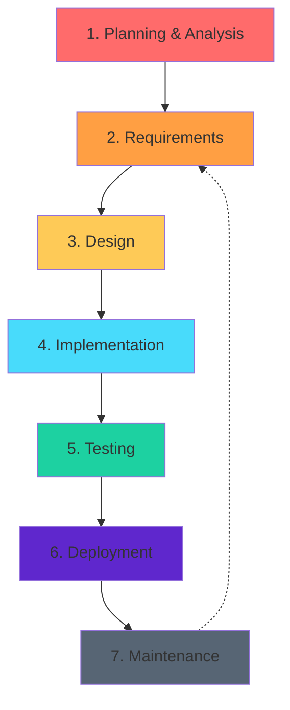

### Detailed SDLC Phases

| Phase | Activities | Deliverables |
|-------|------------|--------------|
| **Planning** | Feasibility study, project plan, resource allocation | Project plan, feasibility report |
| **Requirements** | Gather and document requirements | SRS (Software Requirements Specification) |
| **Design** | System architecture, detailed design | HLD, LLD, database design |
| **Implementation** | Coding, unit testing | Source code, unit test results |
| **Testing** | Integration, system, acceptance testing | Test reports, bug fixes |
| **Deployment** | Installation, user training | Deployed system, user manual |
| **Maintenance** | Bug fixes, enhancements, updates | Updated software versions |

---

## SDLC Models

### 1. Waterfall Model

Sequential phases, each completed before next begins.

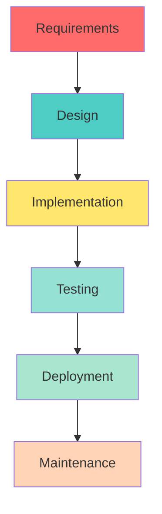

| Advantages | Disadvantages |
|------------|---------------|
| Simple and easy to understand | Inflexible to changes |
| Well-documented | Late testing |
| Clear milestones | No working software until late |
| Works for small projects | High risk for complex projects |

**When to Use:**
- Requirements are clear and fixed
- Technology is well-understood
- Short duration projects

### 2. Iterative Model

Develop system through repeated cycles (iterations).

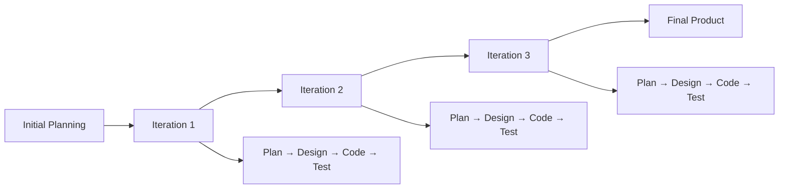

| Advantages | Disadvantages |
|------------|---------------|
| Early working software | Requires good planning |
| Easier to test and debug | More resources needed |
| Flexible to changes | System architecture must be defined early |

### 3. Spiral Model

Combines iterative development with systematic risk analysis.

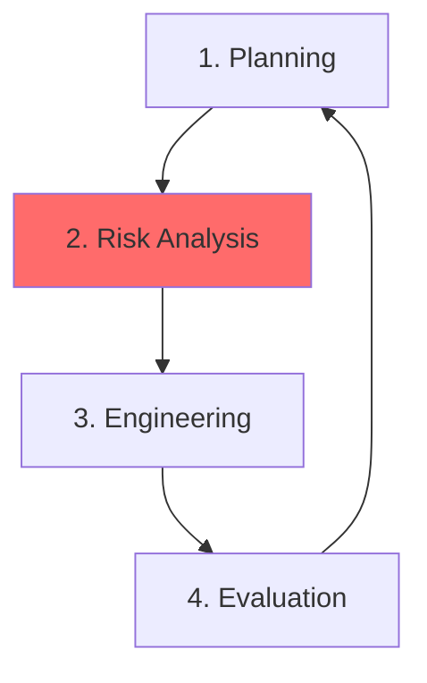

**Four Quadrants:**

| Quadrant | Activities |
|----------|------------|
| **Planning** | Determine objectives, alternatives, constraints |
| **Risk Analysis** | Identify and resolve risks |
| **Engineering** | Develop and test |
| **Evaluation** | Customer evaluation, plan next iteration |

| Advantages | Disadvantages |
|------------|---------------|
| Risk management focus | Complex and expensive |
| Good for large projects | Requires risk expertise |
| Customer involvement | Not for small projects |

### 4. V-Model (Verification & Validation)

Extension of waterfall with corresponding testing phase for each development phase.

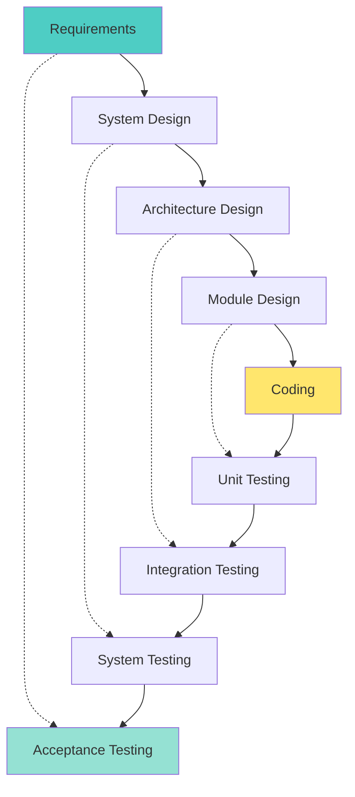

| Development Phase | Testing Phase |
|-------------------|---------------|
| Requirements Analysis | Acceptance Testing |
| System Design | System Testing |
| High-Level Design | Integration Testing |
| Low-Level Design | Unit Testing |

| Advantages | Disadvantages |
|------------|---------------|
| Testing planned early | Inflexible like waterfall |
| Works well for small projects | No early prototypes |
| Simple and easy to manage | High risk |

### 5. Agile Model

Iterative approach emphasizing flexibility and continuous feedback.

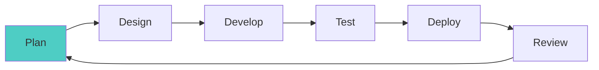

| Advantages | Disadvantages |
|------------|---------------|
| Highly flexible | Less documentation |
| Customer satisfaction | Requires experienced team |
| Early and continuous delivery | Difficult to estimate |
| Welcomes change | Can lack direction |

### Model Comparison Table

| Criteria | Waterfall | Iterative | Spiral | V-Model | Agile |
|----------|-----------|-----------|--------|---------|-------|
| **Flexibility** | Low | Medium | High | Low | High |
| **Risk Management** | Poor | Good | Excellent | Poor | Good |
| **Customer Involvement** | Low | Medium | High | Low | High |
| **Documentation** | Heavy | Medium | Medium | Heavy | Light |
| **Project Size** | Small | Medium | Large | Small | Any |
| **Testing** | Late | Iterative | Iterative | Early planning | Continuous |

---

## Requirements Engineering

### Types of Requirements

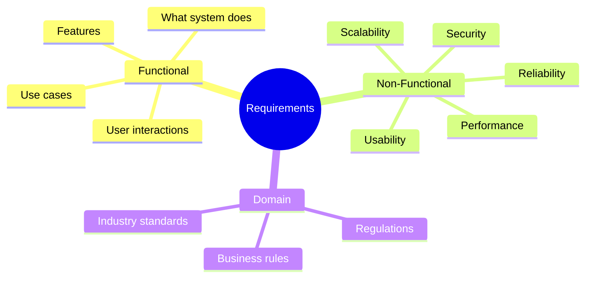

### Functional vs Non-Functional Requirements

| Functional Requirements | Non-Functional Requirements |
|------------------------|----------------------------|
| WHAT the system should do | HOW the system should behave |
| Features and functions | Quality attributes |
| "User can login" | "Login should complete in < 2 seconds" |
| "System generates report" | "Report should support 1000 concurrent users" |
| Testable by functionality | Measured by metrics |

### Categories of Non-Functional Requirements

| Category | Description | Metrics |
|----------|-------------|---------|
| **Performance** | Speed and responsiveness | Response time, throughput |
| **Security** | Protection from threats | Authentication, encryption |
| **Usability** | Ease of use | Learning curve, error rate |
| **Reliability** | Consistent performance | MTBF, availability % |
| **Scalability** | Handling growth | Users, transactions |
| **Maintainability** | Ease of modification | MTTR, code complexity |

### Requirements Engineering Process

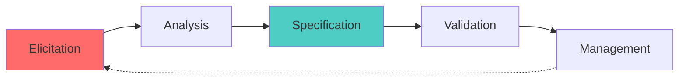

| Phase | Description | Techniques |
|-------|-------------|------------|
| **Elicitation** | Gathering requirements from stakeholders | Interviews, surveys, observation, workshops |
| **Analysis** | Understanding and modeling requirements | Use cases, data modeling, prototypes |
| **Specification** | Documenting requirements formally | SRS document, user stories |
| **Validation** | Ensuring requirements are correct | Reviews, walkthroughs, prototypes |
| **Management** | Handling requirement changes | Version control, traceability matrix |

### Requirement Analysis Modelling

Analysis modeling provides the first technical representation of a system. It uses a combination of text and diagrams to represent requirements (data, function, and behavior) in a way that is relatively easy to understand, and more importantly, straightforward to review for correctness, completeness, and consistency.

**Types of Analysis Models:**

| Model Type | Description | Diagrams |
|------------|-------------|----------|
| **Scenario-based** | Depicts how user interacts with system | Use Case Diagrams, User Stories |
| **Class-based** | Defines objects, attributes, and relationships | Class Diagrams, CRC Cards |
| **Flow-oriented** | Shows how data is transformed | Data Flow Diagrams (DFD) |
| **Behavioral** | Shows how system changes state | State Diagrams, Sequence Diagrams |

#### Use Case Diagram (Scenario-based)

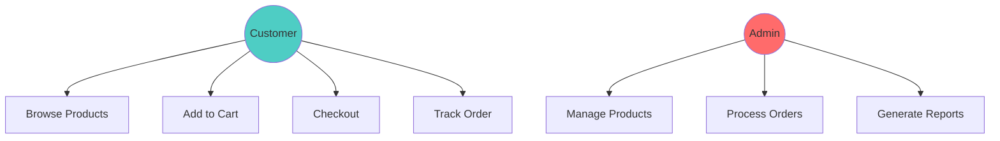

#### Data Flow Diagram (DFD) (Flow-oriented)

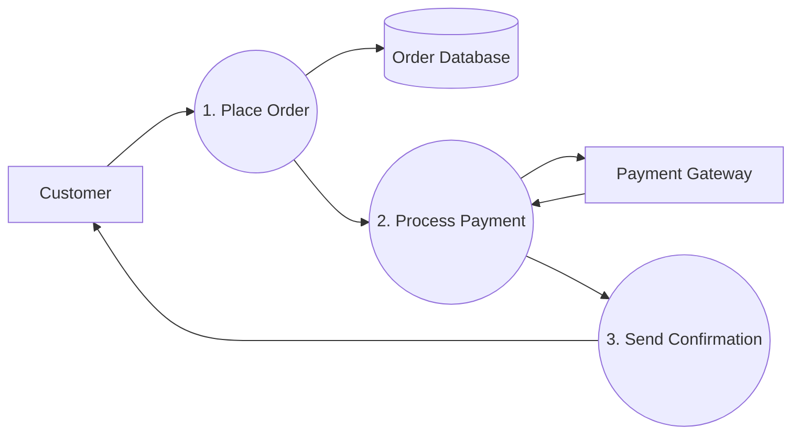

---

## Design and Architectural Engineering

### Characteristics of Good Design

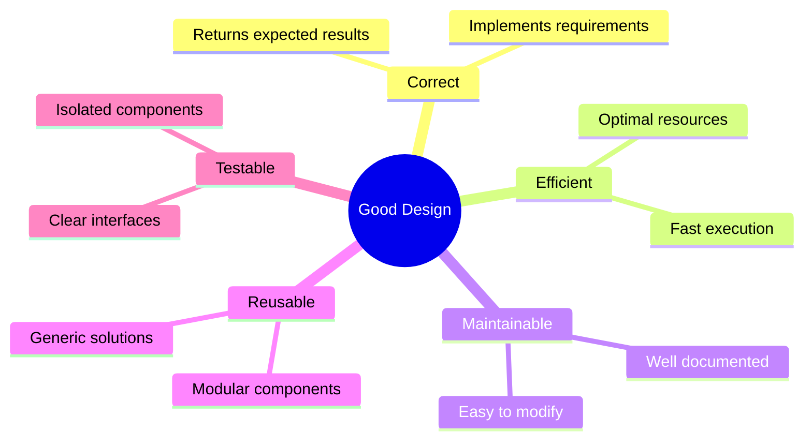

| Characteristic | Description |
|----------------|-------------|
| **Correctness** | Design implements all requirements and adheres to specifications |
| **Robustness** | Ability to handle errors and unexpected inputs gracefully |
| **Efficiency** | Optimal use of resources (CPU, Memory, Network) |
| **Understandability** | Easy to comprehend by other developers |
| **Maintainability** | Easy to modify, fix bugs, and extend features |
| **Modularity** | Well-defined, independent modules with clear interfaces |
| **Flexibility** | Adapts to changes in requirements or environment |

### Function Oriented vs Object Oriented System

| Aspect | Function Oriented | Object Oriented |
|--------|-------------------|-----------------|
| **Focus** | Functions/Procedures/Logic | Objects/Data/Classes |
| **Decomposition** | Top-down (Main → Sub-functions) | Bottom-up (Objects → System) |
| **Data & Functions** | Separate (Global data often used) | Encapsulated together |
| **Unit** | Function | Class/Object |
| **Reusability** | Limited | High (Inheritance, Polymorphism) |
| **Maintenance** | Difficult for large systems | Easier due to modularity |
| **Modeling Tools** | DFD, Structure charts | UML (Class, Sequence, etc.) |
| **Examples** | C, Pascal, Fortran | Java, C++, C#, Python |

### Design Principles: Modularity, Cohesion, Coupling, Layering

#### 1. Modularity

Dividing system into discrete modules that can be developed, tested, and maintained independently. "Divide and Conquer" strategy.

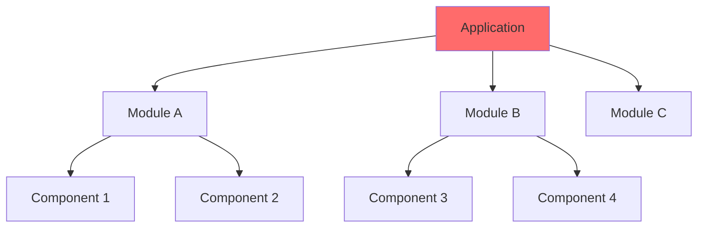

#### 2. Cohesion (Internal Strength)

Measure of how closely related the elements within a module are. **Goal: High Cohesion.**

| Cohesion Type | Description | Quality |
|---------------|-------------|---------|
| **Functional** | All elements contribute to a single, well-defined task | Best ✅ |
| **Sequential** | Output of one element is input to the next | Good |
| **Communicational** | Elements operate on the same data | Good |
| **Procedural** | Elements are executed in a specific sequence | Medium |
| **Temporal** | Elements are executed at same time (e.g., startup) | Poor |
| **Logical** | Elements of same category (e.g., all inputs) | Poor |
| **Coincidental** | Random grouping, no meaningful relationship | Worst ❌ |

#### 3. Coupling (External Dependency)

Measure of interdependence between modules. **Goal: Low Coupling.**

| Coupling Type | Description | Quality |
|---------------|-------------|---------|
| **Data** | Modules pass data only (parameters) | Best ✅ |
| **Stamp** | Modules pass data structures (objects) | Good |
| **Control** | One module controls logic of another (flags) | Medium |
| **External** | Modules depend on external environment/files | Poor |
| **Common** | Modules share global data | Poor |
| **Content** | One module modifies internal data of another | Worst ❌ |

**Design Goal:** High Cohesion + Low Coupling = Maintainable System

#### 4. Layering

Organizing system into hierarchical layers where each layer provides services to the layer above it.

```mermaid
graph TD
    A[Presentation Layer<br/>(UI, Views)] --> B[Business Logic Layer<br/>(Services, Rules)]
    B --> C[Data Access Layer<br/>(Repositories, SQL)]
    C --> D[Database<br/>(MySQL, MongoDB)]
    
    style A fill:#4ecdc4
    style B fill:#ffe66d
    style C fill:#95e1d3
    style D fill:#ff6b6b
```

### Design Models

Design engineering encompasses several distinct models that describe different aspects of the system:

1.  **Data Design**:
    *   Creates data structures and database schemas.
    *   Translates data objects defined in analysis phase into implementation structures.
    *   Example: ER Diagrams, Database Schema.

2.  **Architectural Design**:
    *   Defines relationship between major structural elements (modules).
    *   Selects architectural styles/patterns (MVC, Microservices, Layered).
    *   Example: Deployment Diagram, Device graphs.

3.  **Interface Design**:
    *   Describes how software communicates with users (UI), other systems (API), and itself (Internal Interfaces).
    *   Example: Wireframes, API Specifications (Swagger).

4.  **Component-Level Design**:
    *   Transforms structural elements into procedural descriptions of software components.
    *   Example: Pseudo-code, Flowcharts for algorithms.

### UML (Unified Modeling Language)

**UML** is a standardized modeling language consisting of an integrated set of diagrams, developed to help system and software developers for specifying, visualizing, constructing, and documenting the artifacts of software systems.

### UML Diagram Types

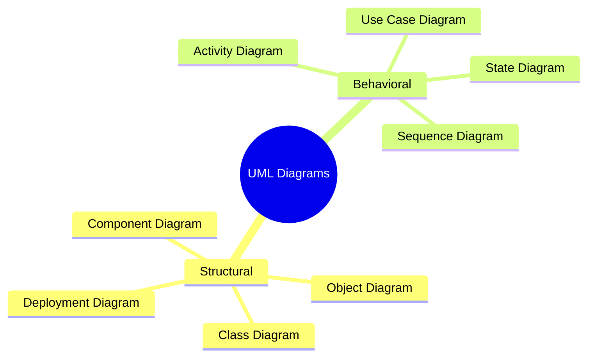

### Class Diagram

Shows classes, attributes, methods, and relationships.

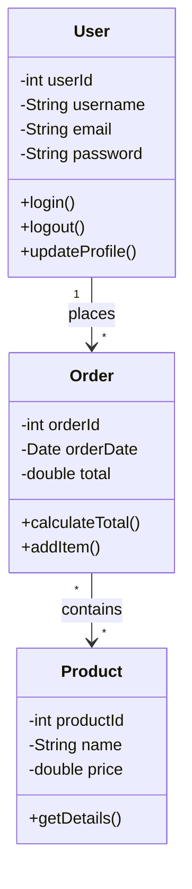

### Sequence Diagram

Shows object interactions over time.

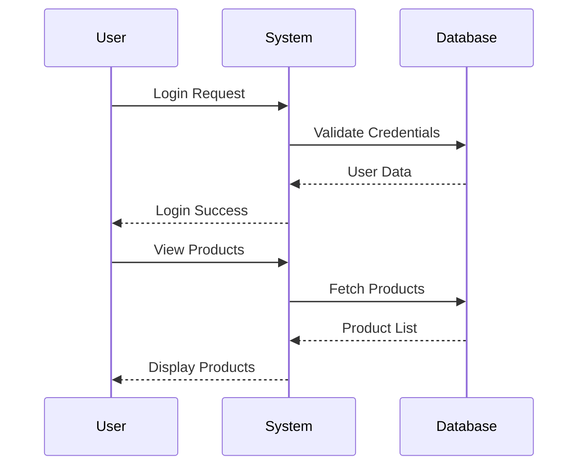

### Activity Diagram

Shows workflow or process flow.

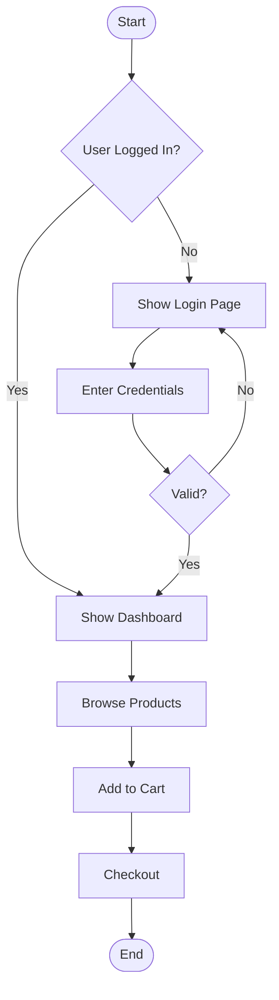

### Use Case Diagram

```mermaid
graph TD
    subgraph "E-Commerce System"
        UC1[Browse Products]
        UC2[Add to Cart]
        UC3[Place Order]
        UC4[Manage Products]
        UC5[Process Orders]
    end
    
    A((Customer)) --> UC1
    A --> UC2
    A --> UC3
    
    B((Admin)) --> UC4
    B --> UC5
    
    style A fill:#4ecdc4
    style B fill:#ff6b6b
```

---

## Coding Principles and Conventions

### Programming Principles

#### SOLID Principles

| Principle | Full Name | Description |
|-----------|-----------|-------------|
| **S** | Single Responsibility | Class should have one reason to change |
| **O** | Open/Closed | Open for extension, closed for modification |
| **L** | Liskov Substitution | Subtypes must be substitutable |
| **I** | Interface Segregation | Many specific interfaces > one general |
| **D** | Dependency Inversion | Depend on abstractions, not concrete classes |

#### DRY (Don't Repeat Yourself)

```java
// Bad - Repetition
void processStudent() { connectDB(); fetch(); close(); }
void processTeacher() { connectDB(); fetch(); close(); }

// Good - DRY
void processEntity(String type) { 
    connectDB(); 
    fetch(type); 
    close(); 
}
```

#### KISS (Keep It Simple, Stupid)

Write simple, straightforward code that's easy to understand.

#### YAGNI (You Aren't Gonna Need It)

Don't add functionality until it's actually needed.

### Coding Conventions

| Convention | Example |
|------------|---------|
| **camelCase** (variables, methods) | `userName`, `calculateTotal()` |
| **PascalCase** (classes) | `UserAccount`, `OrderService` |
| **UPPER_CASE** (constants) | `MAX_SIZE`, `DEFAULT_VALUE` |
| **snake_case** (some languages) | `user_name`, `total_count` |

### Clean Code Guidelines

```java
// Bad - Unclear naming
int d; // elapsed time in days
void p(int x, int y);

// Good - Meaningful names
int elapsedTimeInDays;
void calculateArea(int length, int width);

// Bad - Magic numbers
if (status == 3) { }

// Good - Named constants
final int STATUS_APPROVED = 3;
if (status == STATUS_APPROVED) { }
```

---

## Object-Oriented Analysis and Design

### OOP Principles

#### 1. Encapsulation

Bundle data and methods together, hide internal details.

```java
public class BankAccount {
    private double balance;  // Hidden
    
    public void deposit(double amount) {
        if (amount > 0) {
            balance += amount;
        }
    }
    
    public double getBalance() {
        return balance;
    }
}
```

#### 2. Inheritance

Create new classes from existing ones.

```mermaid
classDiagram
    Animal <|-- Dog
    Animal <|-- Cat
    Animal : +eat()
    Animal : +sleep()
    Dog : +bark()
    Cat : +meow()
```

```java
class Animal {
    void eat() { System.out.println("Eating"); }
}

class Dog extends Animal {
    void bark() { System.out.println("Barking"); }
}
```

#### 3. Polymorphism

Same interface, different implementations.

```java
class Shape {
    void draw() { }
}

class Circle extends Shape {
    void draw() { System.out.println("Drawing Circle"); }
}

class Square extends Shape {
    void draw() { System.out.println("Drawing Square"); }
}

// Usage
Shape s = new Circle();
s.draw();  // "Drawing Circle"
```

#### 4. Abstraction

Hide complex implementation, show only essential features.

```java
abstract class Vehicle {
    abstract void start();
    abstract void stop();
}

class Car extends Vehicle {
    void start() { /* Engine start sequence */ }
    void stop() { /* Brake and stop */ }
}
```

### OOP Comparison Table

| Principle | Purpose | Implementation |
|-----------|---------|----------------|
| **Encapsulation** | Data hiding | private/public access modifiers |
| **Inheritance** | Code reuse | extends/implements keywords |
| **Polymorphism** | Flexibility | Method overriding/overloading |
| **Abstraction** | Simplification | Abstract classes/interfaces |

---

## CCEE Exam Focus Points

> [!IMPORTANT]
> **Key Concepts for MCQs:**
> - Difference between Software Process and Software Product
> - SDLC phases and their order
> - Compare Waterfall, Spiral, V-Model, Agile
> - Functional vs Non-Functional requirements
> - High Cohesion + Low Coupling = Good Design
> - UML diagram types and purposes
> - SOLID, DRY, KISS principles
> - Four pillars of OOP

> [!TIP]
> **Study Strategy:**
> - Create comparison tables for SDLC models
> - Practice drawing UML diagrams
> - Memorize cohesion and coupling types
> - Understand when to use which SDLC model

---

*End of Sessions 2-5: Software Engineering & DevOps*
